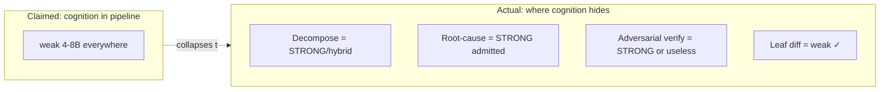

# 02d — Hostile Critique: Problem-Solution Proposal 4

> Adversarial review of [[02-problem-solution-proposal]]. Job = break thesis, not bless it. Stance: assume every claim wrong until forced otherwise. Critiques carry IDs `X*`; mapped to the `P*/L*/C*/R*` they hit. Severity: **FATAL** (thesis dies if true) · **MAJOR** (core mechanism unsound) · **MINOR** (fixable).

## Verdict (one line)

Document is well-structured and borrows good memory/compression hygiene — but the **novel** load-bearing parts (decomposition to context-closed leaves, per-task oracle, self-evolving canon) are asserted, not argued, and three of them quietly require the strong cognition the thesis claims to eliminate. **As written: not buildable proof, it's an architecture poster.** The proven parts are inherited; the inherited parts aren't the thesis.

## Severity map

| ID | Critique | Hits | Severity |
|---|---|---|---|
| X1 | Strong cognition smuggled into decomposer + RCA + verifier | thesis, P1/P2, L2/L5 | **FATAL** |
| X2 | Per-task oracle unspecified, likely as costly as the task itself | P6, C5, L5 gate | **FATAL** |
| X3 | "Context-closed atomic leaf" assumed to exist; unproven for cross-cutting work | P2, C4 | **FATAL** |
| X4 | Zero empirics; 4–8B premise never justified vs bigger-model+RAG baseline | whole doc | **MAJOR** |
| X5 | Static 1-hop CODE-SLICE insufficient; Python is worst case for static dep | C2, R3 | **MAJOR** |
| X6 | Wrong-but-locally-consistent edge contract → late integration fail; verify blind | C4, R4 | **MAJOR** |
| X7 | Trigger authoring = perpetual human-labor mountain; no meta-gate on triggers | C6, P3 | **MAJOR** |
| X8 | Adversarial verifier also weak → correlated blind spots | P6, C5 | **MAJOR** |
| X9 | Self-evolution attribution confounded (own Q8); loop-closure guard is theatre | L5, P9, R9 | **MAJOR** |
| X10 | Budget partition unvalidated; overflow common → decomposition-overhead spiral | C3, R1 | **MAJOR** |
| X11 | "Every failure = context bug" is dogma → drives canon bloat | TL;DR, P8 | MINOR |
| X12 | "Deterministic" purity aspirational; semantic triggers reintroduce fuzz (own Q3) | P1, C2, C6 | MINOR |
| X13 | Single-language assumption; polyglot codebase unaddressed | C2, L1 INDEX | MINOR |
| X14 | INDEX freshness cost under-estimated for high-diff-rate system | R6 | MINOR |
| X15 | Throughput overclaimed; DAG critical path serial, verify multiplies calls | R1, R5 | MINOR |

---

## FATAL

### X1 — Strong cognition smuggled in. Thesis framing false.

Thesis: "move ALL cognition into pipeline, model is cheap interchangeable executor." But three planes need exactly the cognition being banished, and doc **admits it in the open questions**:

- **Decomposer (L2)** — Q1 concedes "likely hybrid: tool-driven split + small-model labeling" → real decomposition needs stronger model or it doesn't work.
- **Root-cause classifier (L5)** — §9.1 explicitly says "use a stronger model here — NOT the weak executor."
- **Adversarial reviewer (L4/C5)** — needs reasoning to find over-reach; if weak, see X8.

So actual claim collapses to: **strong models plan + verify + learn; weak model fills a template + emits a diff.** That's not "weak models deliver big scope" — that's "strong models orchestrate, weak models do leaf labor." Fine architecture, but:

1. The headline is dishonest. Re-state thesis to name the strong-model dependency.
2. The strong-model budget is **completely unaccounted**. Decompose + classify + verify across thousands of leaves may be the dominant cost. The 4–8B inference savings could be a rounding error against it. No number given.

**Demand:** account strong-model calls per delivered feature. If they dominate, thesis economics evaporate.

### X2 — Per-task oracle is the load-bearing fantasy.

P6/C5 entire reliability rests on: "Oracle — known-good PASS + planted-defect FAIL." Borrowed straight from this repo's own dev loop, where humans hand-author `_fixtures/`. **Question never answered: who writes the oracle for each of thousands of auto-decomposed leaves in an arbitrary client project?**

- Human authors per leaf → doesn't scale, kills the automation premise.
- Weak model authors → oracle untrusted (same weak cognition that can't be trusted to write the code).
- Strong model authors → cost + recursion (who verifies the oracle?) + see X1.

Writing a correct, both-directions oracle for a task is **frequently as hard as doing the task** — often harder (you must characterize all wrong outputs). The doc treats the oracle as free input. It is the hardest unsolved piece and gets one bullet. **This single gap can sink the whole verify plane AND the L5 gate** (which depends on "regression suite still passes" — same phantom oracle).

**Demand:** specify oracle provenance per leaf class. If it's "human," put the human cost in the economics. If "generated," show why generated oracle is trustworthier than generated code.

### X3 — "Context-closed atomic leaf" assumed to exist. Unproven, likely false.

P2/C4 is THE reliability move: recurse decomposition until each leaf fits budget AND is context-closed. Asserted as always reachable. Counter:

- **Cross-cutting changes resist closure.** Change a core data model / shared type / API contract → ripples across N files. There is no context-closed leaf; the context IS the ripple. Doc's own **Q4 admits** "cross-task global invariants that don't fit any single packet" — that admission contradicts P2's universality.
- **Closure assumes clean interfaces exist a priori.** Large/legacy codebases have leaky, implicit, undocumented interfaces. You cannot put a contract on an edge that nobody ever defined. Decomposition presupposes the modularity that real big codebases lack — which is *why* they're hard.
- **Decomposition quality bounds everything.** A leaf that *looks* closed but isn't → weak agent produces locally-valid wrong code (→ X6). No proof the decomposer can tell closed from pseudo-closed; that judgment needs deep codebase understanding = strong cognition = X1.

**The reliability of the whole system = the reliability of decomposition, and decomposition is left as a 4-box mermaid + Q1.** That inverts the effort: the hardest problem gets the least design.

**Demand:** prove (or bound) the class of tasks decomposable to context-closed leaves. Name the class that *isn't*, and route it explicitly (escalate to big model), don't pretend recursion always terminates in-budget.

---

## MAJOR

### X4 — No empirics. 4–8B premise never justified.

Zero numbers. No experiment, no baseline, no falsification criterion. Specifically missing: **why 4–8B/32k at all?** Stated as given. Is it cost? on-prem/privacy? Unstated. The unexamined alternative — **one strong model (70B+ or frontier API) + good RAG** — might deliver the same big-scope work at lower TOTAL cost once you price in: the multi-plane engineering, perpetual canon+trigger curation (X7), strong-model decompose/verify/classify (X1), and oracle authoring (X2). The doc never argues the apparatus is cheaper than the thing it replaces. **A solution to a self-imposed constraint that's more expensive than ignoring the constraint is not a solution.**

**Demand:** state why the weak-model constraint is hard (external) vs chosen. If chosen, show the cost model that beats strong-model+RAG. Until then this is optimizing a premise nobody validated.

### X5 — Static 1-hop slice is wishful. Python is the worst case.

C1 `CODE-SLICE: edit spans + immediate deps only`; C2 "symbol/dep graph walk." Problems:

- **1-hop is arbitrary.** Correctness-relevant dependency depth is unbounded: transitive type defs, base classes, runtime polymorphism, decorators, DI containers, config-driven behavior. 1-hop routinely misses the fact that breaks the task.
- **All examples are Python — the language where static dep extraction is *weakest*.** Dynamic typing, duck typing, monkeypatching, `getattr`, runtime imports, `**kwargs` plumbing → the static symbol graph is incomplete by construction. The doc picks the corpus (company Python) that most defeats its own retrieval mechanism.
- Consequence: **R-SLICE is not an occasional failure class — it's likely the dominant one**, and it manifests as silent wrong output (missing a dep doesn't error; it produces plausible-wrong code). The retry loop "add missing CODE-SLICE" needs the verifier to catch it first — see X2/X8.

**Demand:** stop saying "1-hop." Make slice depth a property of the dependency kind, and admit dynamic-language slices need runtime/trace data, not just AST.

### X6 — Wrong-but-consistent edge contract → late integration failure.

R4 mitigation = edge contracts + per-node verify. But contracts are authored by the decomposition layer (weak or hybrid). **A wrong contract is the worst failure the design has no guard for:**

- Every downstream leaf correctly satisfies the wrong interface → each node's per-node verify **passes**.
- Failure surfaces only at integration, *after* thousands of leaves built against the bad contract → maximal rework.
- Per-node verify is structurally blind: it checks "does this node meet its contract," never "is the contract right."

This is the classic decompose-and-conquer failure mode, and the doc's headline isolation mechanism (edge contracts) is precisely the thing that can be silently wrong. Q4 ("global invariants — likely L4 integration tests") waves at it but integration tests are also oracles nobody authored (X2).

**Demand:** a contract-validation gate distinct from node-satisfies-contract. Who proves the contract correct before N leaves commit to it?

### X7 — Trigger authoring is a perpetual human-labor mountain.

C6 (the centerpiece of P3) needs every canon rule hand-tagged `{libs, APIs, constructs, task-class, glob}` against a "whole-company Python + per-library + arch" corpus = thousands of rules. Then:

- Triggers must stay in sync as **both** canon AND codebase evolve → unbounded ongoing curation cost.
- **Triggers are themselves canon that can be stale/wrong/poisoned — with no meta-gate.** C-MISS (trigger didn't fire) is admitted as a failure class but the fix ("tighten trigger") is more hand-authoring. There's no trigger oracle. Who verifies a trigger fires on exactly the right set?
- Q2 lists this as "open" — but the *entire* P3/C6 selection mechanism is non-functional until it's solved. It's not an open question, it's a prerequisite.

**Demand:** estimate trigger-curation FTE cost at corpus scale. Show how much can be AST-auto-derived vs hand-tag. If mostly hand-tag, this dominates X4's cost model.

### X8 — Adversarial verifier is also a weak model → correlated blind spots.

C5 "adversarial reviewer agent, hostile, separate model." If it's another 4–8B with the same weak reasoning + bad priors:

- Two weak models with **correlated** failure modes don't make a strong check. The author's blind spot is likely the reviewer's blind spot (same training regime, same capability ceiling).
- "Separate model" ≠ "uncorrelated model." Doc never argues decorrelation. Diversity of *prompt* (hostile stance) does not buy diversity of *capability*.
- If the reviewer must be strong to be trustworthy → X1 again, and price it.

**Demand:** evidence (or design) that the verifier's error is uncorrelated with the author's. Otherwise verify-pass means "two weak models agreed," which is weak.

### X9 — Self-evolution: attribution confounded, guard is theatre. L5 over-scoped.

L5 is ~half the doc and the least grounded. Core defect: the anti-ossification + loop-closure guards **cannot actually fire reliably**.

- **Q8 admits it:** attributing a later failure-rate drop to a specific canon change vs confounders (model swap, codebase drift) is "open." It's not just open — online causal attribution here is essentially impossible without controlled replay. So "loop-closure check reverts non-helping rules" (R9 mitigation) has no reliable signal → it's decorative.
- **Poison amplification:** a self-evolving loop that authors canon from its own failures can manufacture its own corroboration. Early bad rule fires → causes failures → loop sees "recurring" → "corroborated" → promotes harder. The N-occurrence gate (Q6) doesn't protect against the loop generating the N.
- **Gate depends on the phantom oracle (X2):** "regression suite still passes both directions" + "adversarial survive" both need the per-task oracle that doesn't exist at scale.

**Demand:** cut L5 to a "future work" stub. Don't ship a self-modifying canon loop whose safety guards can't get a signal. Prove L1–L4 first. A self-improving system you can't measure improving is a self-degrading system you can't measure degrading.

### X10 — Budget partition unvalidated → overflow common → overhead spiral.

C3 table is "example baseline, tune per class" — i.e., a guess with an escape hatch. Stress points:

- **8k CODE-SLICE** for "code to edit + deps" — real tasks blow this routinely (X5: deps are deeper than 1-hop). 
- **8k output/reasoning headroom** for "diff + scratch" — weak models need MORE scratch to compensate for weak reasoning, not less. 8k is thin for non-trivial diff + chain-of-thought.
- **If overflow is common, the system lives in decomposition recursion** (P2 kicks back to L2 on every overflow). R1 "amortize/parallelize" is hand-wave; it doesn't address that the *split itself* costs strong-model calls (X1) and that over-splitting multiplies integration risk (X6).

**Demand:** load study on real tasks: what fraction fit 32k as decomposed? If <majority, the partition + the decomposition loop need redesign before anything else.

---

## MINOR (fix, don't kill)

- **X11 — "Failed task = missing context, not dumb model" is dogma.** Catchy, false as absolute. M-LIMIT admits capability ceilings exist; ambiguous spec + genuinely-hard reasoning also exist. Framing *every* failure as a context bug biases the loop toward **adding canon** → bloat → budget pressure (X10) → more splitting. The dogma has a built-in growth ratchet. Fix: make "context bug vs capability/spec bug" a first-class classifier output, not a default assumption.

- **X12 — "Deterministic" purity is aspirational.** P1/C2 banish agent-driven retrieval, vector = "secondary verified." But Q3 itself raises "fuzzy/semantic canon triggers." Conceptual relevance (which rule *applies*, which example is *analogous*) is inherently fuzzy → you'll reintroduce embedding/semantic match → the non-determinism returns through the back door. Stop selling determinism as a property; sell it as a *preference with fuzzy fallback*, and gate the fuzzy part.

- **X13 — Single-language assumption.** Every example Python. Big real codebases are polyglot (Py + SQL + JS/TS + config + IaC + shell). INDEX, dep-graph, and triggers all multiply and degrade per language. SQL/config/IaC have no clean symbol graph. Unaddressed. State the language scope explicitly; don't imply generality you haven't designed.

- **X14 — INDEX freshness under-costed.** R6 "incremental rebuild on diff." For a system *emitting thousands of diffs*, the index is in constant churn, and incremental transitive-dep invalidation (one signature change invalidates all transitive callers) is itself a hard, costly problem. No estimate. At big-codebase scale this may be a continuous background cost rivaling inference.

- **X15 — Throughput overclaimed.** Big scope → thousands of leaves, each: decompose + compile + execute + multi-model verify (±retry/re-split). DAG **critical path is serial** (dependent leaves can't parallelize), and verify multiplies model calls per leaf (R5). "Parallelize leaves" only helps the embarrassingly-parallel fraction. No latency/throughput model. Plausible the monolithic strong-model approach finishes sooner *and* cheaper (ties to X4).

---

## What would change my mind (falsification tests)

Hostile review owes the path to acceptance. Run these, report numbers:

1. **Decomposition reachability (kills/saves X3):** take 20 real big-scope tasks from a large Python repo. Measure: what fraction decompose to context-closed ≤32k leaves *without* a human fixing the split? Report the non-decomposable class.
2. **Oracle cost (X2):** for one decomposed feature, measure human+model cost to author both-direction oracles per leaf vs cost to just implement the feature with a strong model. If oracle ≥ implementation, verify plane is uneconomic.
3. **Slice sufficiency (X5):** sample 50 leaves; measure how often 1-hop static slice omits a correctness-relevant dep (ground-truth = does adding deeper context change the verified output). If high, retrieval needs runtime data.
4. **Verifier decorrelation (X8):** run weak-author + weak-reviewer on a planted-defect set. Measure reviewer catch rate. If it tracks author's own self-catch rate, "separate model" buys nothing.
5. **Total cost vs baseline (X1/X4):** end-to-end token+wall+human cost of full pipeline on one feature vs strong-model+RAG delivering the same feature, both gated to the same acceptance. This is THE number. Everything else is detail.
6. **L5 attribution (X9):** can you, on a controlled replay harness, attribute a failure-rate change to a single canon edit with the other variables frozen? If only offline-replay can do it, L5 cannot run online — say so.

---

## Bottom line

Inherited hygiene (typed memory split, budget-as-contract, no-silent-truncation, provenance/immutability, verify-both-directions) = **sound, keep**. These come from [[00-memory-101]] and [[01-research-problem]] and are the doc's safe parts.

The **novel** claims — recurse to context-closed leaves (X3), trust a per-task oracle (X2), self-evolve canon safely (X9), all while weights stay weak (X1) — are **unproven and partially self-contradicting** (the open questions concede the contradictions). The document is an excellent map of a system; it is **not yet evidence the system works, nor that it beats the obvious baseline**.

Priority fixes before this earns "build it": **X1 (cost-account the strong models), X2 (oracle provenance), X3 (prove decomposition terminates in-budget), X4 (baseline comparison).** Cut L5 to future-work until L1–L4 shows a number.
