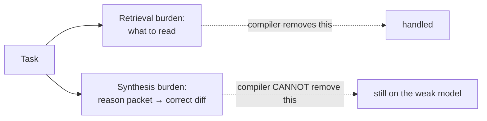
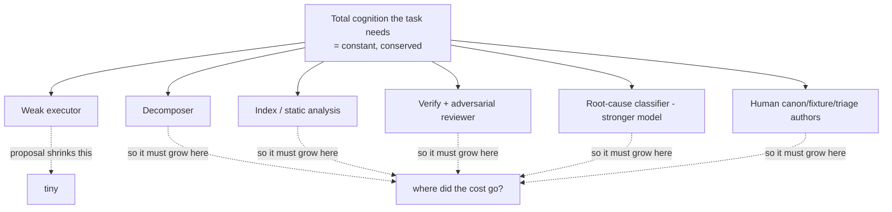

# 02e — Hostile Critique: Context-Engineering Proposal 5

> Reviewer stance: adversarial CTO, 10+ yr shipping AI/ML. Job = find what kills this in production, not applaud the diagram. Critiques carry IDs (`K*` kill-shot, `F*` major flaw, `H*` hygiene). Reference proposal IDs (`P*/L*/C*/R*/Q*`).

## Verdict TL;DR

Proposal internally coherent, well-typed, good hygiene instincts. But it is an **architecture sketch wearing a solution's confidence**. Three load-bearing claims are asserted, not shown — and each, if false, collapses the thesis:

1. **Cost.** Zero numbers. No baseline vs one capable model. "Weak = cheap" is the entire premise and it is unquantified. (K1)
2. **Decomposer.** The whole system stands on recursive fit-to-budget decomposition, which (a) needs the cognition the weak model lacks → strong planner → cost premise dies, and (b) requires deciding "context-closed," which is undecidable in general. Single point of failure, hand-waved. (K2)
3. **Context ≠ reasoning.** Proposal assumes the bottleneck is *what the model can see*. Synthesizing a correct diff from a perfect packet is still *reasoning*. Spoon-feeding cuts retrieval load, NOT synthesis load. Thesis silently narrows from "big-scope work" to "mechanical-given-context work." Scope overreach. (K3)

The good ideas (trigger-indexed canon, typed memory, untrusted-output gate) survive. The headline claim — *weak small models deliver big-scope work* — does not, on this evidence.

## Severity ranking

| ID | Critique | Severity | Kills thesis if true? |
|---|---|---|---|
| K1 | No cost model, no baseline — premise unquantified | CRITICAL | yes |
| K2 | Decomposer SPOF + chicken-egg + undecidable "context-closed" | CRITICAL | yes |
| K3 | Context-engineering ≠ reasoning; scope silently overreaches | CRITICAL | yes (narrows it) |
| K4 | "Failure = missing context" unfalsifiable; retry-vs-split (Q5) punted | HIGH | corrodes evolution loop |
| F1 | INDEX assumed, not designed — hardest artifact, one box | HIGH | no, but gates feasibility |
| F2 | Verify cheapness + reliability both doubtful (oracle, weak reviewer) | HIGH | no, but inflates trust |
| F3 | Evolution loop: monotonic canon growth + attribution impossible (Q8) | HIGH | degrades over time |
| F4 | Local-correct diffs ≠ global-correct system (composition fallacy) | HIGH | no, but caps autonomy |
| F5 | "Deterministic" overclaimed — heuristics + magic constants everywhere | MED | no |
| F6 | 32k may be wrong constraint (2026); effective ctx ≪ nominal for small models | MED | no, but mis-targets effort |
| F7 | Human/curation cost moved off-balance-sheet, never counted | MED | dents cost premise |
| H1 | No system-level success metric / eval harness | MED | loop optimizes undefined objective |

---

## KILL-SHOTS

### K1 — No cost model. Premise unquantified.

Entire thesis = "model is cheap interchangeable executor." That is a **cost claim**. Doc has zero cost arithmetic.

Count the real per-leaf bill:
- decompose (may need strong model — see K2)
- compile packet (static analysis + index query + rank)
- execute (weak)
- schema check + oracle + **adversarial reviewer** (separate model) + tests
- N retries, each re-engineering context = re-run executor + re-verify
- on fail: **root-cause classifier — explicitly a STRONGER model** (§9.1)
- periodic fleet analytics over whole telemetry corpus

Big-scope = thousands of leaves. Verify + evolution may be where the tokens actually go. "Cheap weak models run parallel" confuses **latency** with **cost** — parallel cuts wall-clock, not total spend.

**The question the doc must answer and doesn't:** $ (and wall-clock) per delivered feature vs one capable model doing it directly. If decompose+compile+verify+evolve overhead ≥ executor savings, premise is dead on arrival. **Demand a back-of-envelope before any build.**

### K2 — The decomposer is an unaddressed single point of failure.

Everything (P2, C4, L2, budget feedback C3) rests on: recursively split until each leaf is *context-closed* AND *fits budget*. Two fatal gaps:

**(a) Chicken-egg / cost leak.** Who decomposes? Open Q1 admits a 4–8B maybe can't. Decomposition requires understanding the codebase — *the exact cognition you declared the weak model lacks*. So either:
- weak model decomposes → unreliable DAG → every downstream leaf inherits a bad cut, or
- strong model / heavy tool decomposes → you reintroduced expensive cognition → "cheap interchangeable executor" thesis collapses (feeds K1).

You cannot have it both ways. The doc wants weak-everywhere savings AND reliable decomposition. Pick one.

**(b) "Context-closed" is undecidable in general.** Computing the transitive dependency closure of a change statically *is the hard problem*. Real changes have non-local deps: shared mutable state, config, runtime DI, reflection, dynamic dispatch, codegen, implicit ordering contracts. Static analysis **under-approximates** these — it will declare a task "closed" that isn't, and the leaf fails for a dep that was never in the slice. R-SLICE's "improve static-analysis retrieval" hand-waves a soundness problem, not a bug.

If the leaf boundary is wrong, no packet quality saves it. **This box deserves its own design doc; right now it's a wish.**

### K3 — Context-engineering is not reasoning. Scope overreaches.

Core assumption: *failure = missing context* (TL;DR, P8, P9). This conflates two distinct burdens:

The compiler removes **retrieval** burden. It does **nothing** for **synthesis** burden. Writing a correct diff from a perfect packet *is* reasoning — algorithmic choice, edge cases, invariant preservation, subtle control flow. A 4–8B with a flawless packet still cannot reason through genuinely hard logic.

⇒ Thesis holds **only** for tasks that are *mechanical-given-context*: boilerplate, well-patterned CRUD, mechanical refactors, format conversions. That is a real and useful class — but it is **not** "big-scope work over large codebases," which is what the title promises. The hard reasoning leaves either don't decompose into mechanical units (K2) or hit M-LIMIT (K4).

**Fix the claim:** "weak models deliver the *mechanical fraction* of big-scope work; reasoning-heavy leaves escalate." Honest, narrower, defensible. As written, overreach.

---

## MAJOR FLAWS

### K4 — "Failure = missing context" is unfalsifiable. The crux (Q5) is punted.

Stated as axiom. Makes the system unfalsifiable: every miss → add context → retry, forever. M-LIMIT is the escape hatch, but there is **no operational test** to separate "missing context" from "model can't reason this." Open Q5 (retry-vs-split boundary) and Q6 (classifier reliability) ARE this problem — and both are deferred to "downstream."

Consequence for the evolution loop: a misclassified M-LIMIT failure → spurious canon enrichment for a failure canon could never fix → **canon poisoning + wasted budget**, the exact R8 risk, triggered from inside the loop's own blind spot. The cheapest, most load-bearing decision in the system is the one left unspecified.

### F1 — The INDEX is the hardest artifact in the system, drawn as one box.

L1's "prebuilt symbol+dep graph, file map, contracts" for a large **polyglot** codebase = a sound cross-language static analyzer with call-graph + type resolution. That is a multi-quarter eng effort and a research frontier for dynamic languages (dispatch, macros, DI, reflection, codegen defeat static graphs). The system's "deterministic retrieval" (P1, C2) is only as sound as this index — and it may be neither complete nor sound. R6 (staleness) compounds it: correct **incremental** rebuild under concurrent commits is itself hard. Treat the index as a primary deliverable with its own feasibility gate, not L1 furniture.

### F2 — Verification is asserted cheap AND reliable. Both doubtful.

- **Oracle.** "Known-good PASS, planted-defect FAIL" is a *regression* oracle. For **net-new** code there is no known-good. Most implementation leaves need an *authored* acceptance test. Authored by whom? Weak model → tests as unreliable as code. Human → doesn't scale. Strong model → cost (K1). Doc conflates "tests exist" with "oracle exists."
- **Adversarial reviewer.** If weak (4–8B), weak review — misses subtle bugs, emits false positives (noise). If strong, cost. No precision/recall data either way. A weak hostile reviewer manufactures **false confidence**.
- **"Cheap parallel weak models make verify affordable"** — parallel = latency, not spend. Same K1 error.

### F3 — Evolution loop degrades the system it claims to improve.

- **Monotonic canon growth vs fixed slot.** Canon only grows (enrichment). CANON budget slot fixed (~6k, C3). As canon grows, more rules fire (over-tag, R2b) and compete for the same slot → ranking spills low-rank-but-correct rules to POINTERS → quiet coverage loss. **Learning can degrade packets over time.** TTL + dead-rule pruning fight this but also fight the accumulation thesis. Net behavior unproven.
- **Attribution is impossible as specified.** Loop-closure (Q8) = attributing a later failure-rate drop to one canon change amid model swaps + codebase drift = causal inference over confounded observational data. The doc *admits* this — yet anti-ossification's "revert non-helping rules" **depends** on it. The self-correction guard rests on a metric the authors concede they can't cleanly compute.
- **Autonomy is aspirational.** Q6 admits human triage likely mandatory at first; Q7 admits auto-merge graduation undefined. So "self-evolving" = "human-in-the-loop forever, maybe." Fine — but say so; don't sell autonomy.

### F4 — Locally-correct diffs ≠ globally-correct system. Composition fallacy.

Per-node verify (C5) + edge contracts (C4) gate each leaf in isolation. But two leaves editing related code can each pass alone and **break together** (semantic merge conflict, shared-state interaction, ordering). Edge contracts cannot capture emergent integration behavior. Q4 gestures at global invariants then shrugs "likely integration tests." This is the classic decomposition/microservices fallacy: composition of locally-verified parts is not a verified whole. For big-scope this is where systems actually break — and it's an open question, not a plane.

### F5 — "Deterministic" is overclaimed.

Trigger *predicate match* is deterministic — granted, and genuinely good (better than vector-dump). But the system is shot through with non-deterministic / hand-tuned judgment dressed as determinism:
- task-class assignment
- rank weights `severity × specificity × proximity` (where do the coefficients come from?)
- decomposition (K2)
- example selection
- the whole C3 budget table (~3k/4k/6k/8k/3k/8k) = **magic constants**, "tune per task class" = *we don't know yet*.

"Deterministic" is the marketing word. Reality = a pile of tunable heuristics + some genuinely deterministic predicates. Name the tunables; they're where the system will actually be debugged.

### F6 — 32k may be the wrong constraint; effective context ≪ nominal.

It is 2026. Cheap small models with 128k+ windows exist. Building a heavy compiler to fit **32k** may be solving yesterday's constraint — re-justify the number. Worse: small models **degrade with context length** well before the nominal window (lost-in-the-middle hits weak models hardest). Stuffing 8k code-slice + 6k canon into a 4–8B may tank its *effective* reasoning. The budget table treats tokens as free-until-full; they are not. **Effective usable context < nominal window** — measure it before partitioning it.

### F7 — Human/curation cost is moved off-balance-sheet.

Q2: canon owners hand-author triggers across a whole-company Python + per-library corpus. Plus fixture authors (F2) plus failure triagers (F3). The system **offloads cognition from the model onto an army of humans**. That labor is real cost — it just doesn't show in the token bill. Total human + token cost may exceed the "expensive smart model" being replaced. Count it (feeds K1).

---

## HYGIENE / MINOR

- **H1 — No system success metric.** What completion rate, on what benchmark, vs what baseline, is "working"? Without an eval harness the evolution loop optimizes an **undefined** objective. Define the yardstick before claiming self-improvement.
- Telemetry redaction (R10) "redact at write" — redaction is itself unreliable on freeform diffs/logs; don't assume it's solved.
- Vector "verified secondary augment" (C2, R3) — Q3 admits no verification method for a vector hit before it enters a packet. Then it's not "verified," it's "hoped." Either specify the verifier or drop vector from v1.

## What's actually right (conceded — so the kills land)

- **Typed memory split** (P4, §9) — correct; flat-blob is the common failure, well-avoided.
- **Trigger-indexed canon** (C6) — genuinely good. Relevance-filter on triggers > prose-dump > vector-dump. Best idea in the doc.
- **Untrusted output + both-direction oracle** (P6) — right instinct.
- **No silent truncation / DROPPED log** (P5) — good discipline.
- **Provenance + TTL + immutability + versioned canon-as-frozen-artifact** (P9 gate) — sound governance hygiene.
- **Inline-canon-not-cite-weights** (P3) — correct given weak priors.

These are real. They make the *substrate* good. They do not rescue the *headline claim*.

## The cognition-conservation law (the thing the doc fights)

You cannot delete cognition by making the executor weak — you **relocate** it (decomposer, index, verifier, classifier, humans). The proposal shrinks the visible box (executor) and is silent on the boxes that must grow to compensate. **Until the relocated cost is counted (K1, F7), the savings claim is unproven.**

## Gate — answer before any build

Do not start building until these are quantified, not assumed:

1. **Cost arithmetic.** Total $ + wall-clock per delivered leaf, all roles counted (K1, F7), vs single-capable-model baseline. One spreadsheet.
2. **Decomposer design + cut-quality eval.** Who/what splits, and how is a bad cut detected before downstream inherits it (K2)? Define the M-LIMIT test (K4).
3. **Index feasibility spike.** Build the symbol+dep graph for one real large repo. Measure soundness/completeness on dynamic constructs (F1).
4. **Scope honesty.** Restate thesis to the mechanical-given-context fraction; name the escalation path for reasoning-heavy leaves (K3).
5. **Eval harness.** System-level success metric + benchmark + baseline (H1). The evolution loop is meaningless without it.

Pass these → the good substrate (typed memory, trigger canon, untrusted gate) is worth building on. Skip them → it's a beautiful diagram that bills like a strong model and ships like a weak one.
