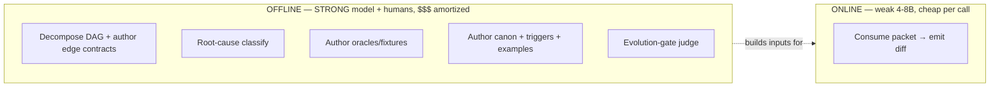
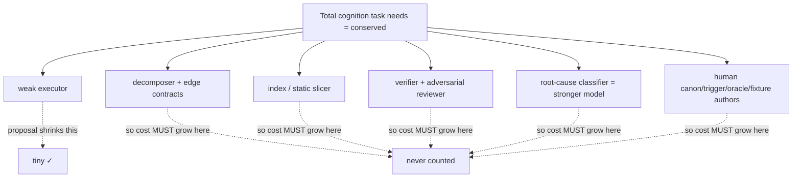
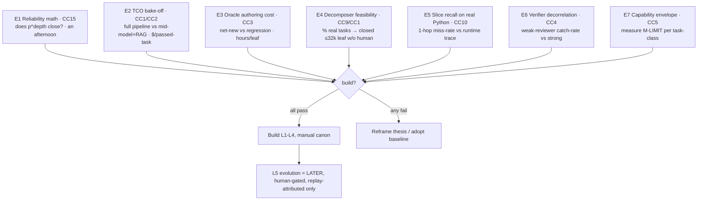

# 02f — Critique Consensus: Context-Engineering Proposal

> Merge of 5 independent hostile reviews ([[02a-problem-solution-critiques-1]] … [[02e-problem-solution-critiques-5]]) of [[02-problem-solution-proposal]]. Each concern carries flag-count (how many of 5 reviewers raised it) + max severity any reviewer assigned. Consensus concerns IDed `CC*`. Cross-refs proposal `P*/L*/C*/R*/Q*`. Higher flag-count = stronger signal it's real, not one reviewer's hobbyhorse.

## TL;DR — what all 5 agree

**Substrate good, headline thesis unproven.** Unanimous verdict: proposal = *architecture poster, not buildable evidence*. The inherited memory/compression hygiene is sound; the **novel** load-bearing parts (decompose-to-closed-leaf, per-task oracle, self-evolving canon) are **asserted, not shown**, and several quietly require the strong cognition the thesis claims to banish.

Three things every reviewer says, in their own words:
1. **Cognition relocated, not removed** — decomposer + root-cause classifier + verifier all need strong models. "Weak everywhere" is false advertising. (5/5)
2. **No cost model, no baseline** — "weak = cheap" never costed against the obvious alternative (one mid/strong model + RAG). Premise unfalsifiable until priced. (5/5)
3. **Verify plane rests on a phantom oracle** — per-leaf "known-good PASS / planted-defect FAIL" has no author at scale and doesn't exist for greenfield. (5/5)

Honest reframe all 5 converge toward: **offline-strong / online-weak hybrid, manually-bootstrapped canon, L5 evolution shipped last (human-gated)** — and prove it with falsification experiments BEFORE building.

## Consensus heat map (sorted: flag-count desc, then severity)

| ID | Concern | Flags | Max sev | Proposal hit |
|---|---|---|---|---|
| CC1 | Strong models smuggled into decomposer/RCA/verifier — cognition relocated not removed | **5/5** | CRITICAL/FATAL | TL;DR, P1, L2, §9.1, Q1 |
| CC2 | No cost model, no baseline vs mid/strong-model+RAG | **5/5** | CRITICAL/FATAL | whole thesis, R5 |
| CC3 | Per-task oracle: who authors it; greenfield has no known-good | **5/5** | CRITICAL/FATAL | P6, C5, §8, L5 gate |
| CC4 | Verifier also weak → correlated blind spots, can't certify what author can't produce | **5/5** | CRITICAL/S1 | P6, C5, §8 |
| CC5 | "Failure = missing context" unfalsifiable; M-LIMIT indistinguishable → retry thrash | **5/5** | FATAL→MINOR | TL;DR, P8, §8, Q5/Q6 |
| CC6 | Self-evolution L5 = research; attribution (Q8) unsolved → loop-closure guard decorative | **5/5** | MAJOR/SERIOUS | L5, §9.1, P9, R9, Q6-8 |
| CC7 | Integration/composition: local-correct leaves ≠ global-correct system; wrong edge contract silent | **5/5** | CRITICAL/MAJOR | C4, R4, Q4 |
| CC8 | Human curation tax: trigger/oracle/canon authoring perpetual + cold-start canon storm | **5/5** | HIGH/MAJOR | C6, P3, L5, Q2 |
| CC9 | Decomposition: context-closed leaf may not exist (cross-cutting), termination unproven | 4/5 | FATAL | P2, C4 |
| CC10 | Static analysis unsound on Python (target stack); 1-hop slice arbitrary | 4/5 | CRITICAL/S1 | C2, P1, R3, R-SLICE |
| CC11 | Budget partition unvalidated; effective ctx ≪ 32k on 4-8B; reasoning headroom starved | 4/5 | MAJOR | C3, R1 |
| CC12 | Concurrency: parallel leaves mutate index → stale slices; packet caching hollow | 4/5 | S2/MAJOR | R1, R6 |
| CC13 | No success metric / kill-criterion → all 5 demand falsification experiments first | 5/5* | — | whole doc |
| CC14 | "Deterministic" overclaimed — fuzzy ranking + semantic triggers reintroduce non-determinism | 3/5 | MED | P1, C2, C6, Q3 |
| CC15 | Reliability math absent — DAG compounding p^depth may not close for big-scope | 2/5 | CRITICAL | P7, C4, R4 |
| CC16 | Polyglot reality unaddressed; single-language (Python) assumed | 2/5 | MINOR | C2, L1 |
| CC17 | Prompt-injection: inlined canon + code-slice untrusted; secrets in immutable telemetry | 2/5 | SERIOUS | C6, R10 |
| CC18 | Memory taxonomy = metaphor overfit; typed-store complexity unjustified vs 1 store + metadata | 1/5 | MED | L1, §9 |

\*CC13: not a defect per se — all 5 independently demand experiments/kill-criteria; counted as unanimous structural ask.

---

## UNANIMOUS (5/5) — the consensus kill-shots

### CC1 — Strong cognition smuggled in. Thesis framing false.
All 5 trace the same fraud: "model is cheap interchangeable executor" but **decomposer** (Q1 admits hybrid/stronger), **root-cause classifier** (§9.1 explicitly "stronger model"), and **adversarial verifier** (strong-or-useless, CC4) all need the banished cognition. Reviewers converge on one honest reframe (02c states it cleanest):

**Consensus fix:** restate thesis as *offline-strong / online-weak hybrid*. Drop "ALL cognition in pipeline." Account strong-model calls per delivered feature (feeds CC2).

### CC2 — No cost model, no baseline.
5/5 flag zero cost arithmetic. The killer question every reviewer asks: **why not one mid/strong model + good RAG + tests, skip the edifice?** Real per-leaf bill nobody counts: decompose + compile + execute + schema + oracle + adversarial + tests + N retries + stronger-model RCA per fail + fleet analytics + perpetual human curation (CC8). Shared correction: "cheap parallel weak models" confuses **latency** with **total spend** (02a, 02e, 02d). **Consensus fix:** mandatory TCO model = $/passed-task incl build amortization + curation labor + verify fan-out + retry tax, head-to-head vs mid-model+RAG baseline. If it loses, premise is dead.

### CC3 — Per-task oracle is the load-bearing fantasy.
5/5: oracle cheap to RUN, brutal to AUTHOR. For thousands of auto-decomposed leaves, who writes known-good + planted-defect each? Human→doesn't scale (the real hidden cost center). Weak model→untrusted (same cognition that can't be trusted to code). Strong model→cost + who-verifies-the-oracle recursion. **For net-new code there is no known-good** — oracle is a *regression* tool, circular for greenfield (the actual hard part). Note (02d): writing a correct both-directions oracle is often *harder than the task*. **Consensus fix:** split task classes by oracle-availability (regression/refactor/migration = golden exists, gate strong; net-new = no oracle, admit weaker gate + size residual risk). Cost oracle-authoring labor explicitly. Stop calling oracle "free."

### CC4 — Weak verifier can't bootstrap strong correctness.
5/5: adversarial reviewer is "separate model" but premise = all weak. Key shared insight (02a, 02d sharpest): **LLM errors are correlated, not independent** — same training regime, same blind spots. N cheap weak judges catch *independent* errors, never the *correlated hard ones*. "Separate instance ≠ smarter ≠ decorrelated." Contracts check **shape, not behavior** (CC7) so right-shape-wrong-logic sails through. **Consensus fix:** rank gates by trust — lean on deterministic gates (schema/contract/compile/existing-tests). Demote LLM-adversarial gate to *advisory / raises human-review priority*, NOT accept-reject authority, until its precision/recall is measured. If it must gate, it's a strong-model job (→CC1).

### CC5 — "Failure = missing context" unfalsifiable.
5/5 (severity ranges FATAL→MINOR): circular — you only *know* it was missing-context after adding context fixes it. Before that, C-ABSENT and M-LIMIT are **indistinguishable**, so retry loop has no principled stop → adds context forever on tasks a 4-8B can't do at any packet quality. Misclassified M-LIMIT → spurious canon enrichment → poisoning (R8) from inside the loop's blind spot. **Consensus fix (02b/02c):** make M-LIMIT *measurable not residual* — capability-envelope probe per task-class (run 4-8B on curated known-difficulty tasks). Failing task beyond envelope = M-LIMIT by measurement. Bound retries hard (≤2); SPLIT-or-escalate must cite envelope data. Solve Q5 before relying on the loop.

### CC6 — Self-evolution L5 = research dressed as a shipped plane.
5/5: presented with same confidence as L1-L4, but its core is unsolved per the doc's own Q6/Q7/Q8. **Attribution (Q8) is the load-bearer:** crediting a failure-rate drop to one canon change amid model-swap + code-drift = causal inference over confounded data → "revert non-helping rules" (R9 guard) has no signal → **decorative**. Poison-amplification (02d): loop authors canon from own failures → can manufacture its own N-occurrence corroboration. Gate depends on the phantom oracle (CC3). **Consensus fix:** cut L5 to future-work. Ship L1-L4 + manual canon first. Run evolution as offline analytics + human-approved enrichment ONLY. Gate any auto-merge on a working loop-closure metric via **controlled replay** (frozen model + frozen code between before/after runs — the only way to attribute, 02b/02d).

### CC7 — Composition fallacy: green leaves, red system.
5/5: per-node verify + edge contracts gate each leaf *in isolation*. Two failure modes converge across reviewers:
- **Wrong-but-consistent contract** (02c K8, 02d X6): contract authored by weak/hybrid decomposer; if wrong, every downstream leaf correctly satisfies a wrong interface, each passes local verify, explodes only at integration after N leaves committed. Per-node verify is *structurally blind* — checks "meets contract," never "contract right."
- **Emergent interaction** (02a, 02e): two leaves each pass alone, break together (shared state, ordering, semantic merge). Edge contracts capture only what someone foresaw.
Q4 ("global invariants — likely integration tests") shrugs at the single hardest part of decomposed software. **Consensus fix:** add explicit **integration plane (L6)** owning merge-order + cross-leaf invariant tests + global re-verify after assembly. Add a **contract-validation gate** distinct from node-satisfies-contract. Make global invariants first-class canon artifacts.

### CC8 — Hidden human-labor tax + cold-start.
5/5: "canon authored once by owners" is false. Triggers rot as libs upgrade / APIs deprecate / code moves → **perpetual curation** scaling with corpus × churn. Triggers are themselves canon — stale/wrong/poisonable — with no meta-gate (C-MISS fix = more hand-authoring, no trigger oracle). **Cold-start** (02b/02c): day-1 canon thin → every task C-ABSENT → humans author everything for possibly months before loop pays off. "Self-improving" at launch = "humans bootstrap, loop only maintains." **Consensus fix:** separate **bootstrap canon** (manual, big up-front, declare the human-quarter cost; seed from existing linters/style-guides/typed contracts) from **evolution** (maintenance). Estimate trigger-curation FTE at corpus scale; show how much is AST-auto-derivable vs hand-tag. Folds into CC2's TCO.

---

## STRONG MAJORITY (4/5)

### CC9 — Context-closed leaf may not exist (4/5, FATAL).
Cross-cutting changes (rename widely-used symbol, change shared type/API, perf needing whole-system view, race/deadlock) have **no closed leaf — context IS the ripple**. Doc's own Q4 (global invariants don't fit a packet) contradicts P2's universality. Closure presupposes the clean modularity large/legacy codebases lack — *why they're hard*. "Decompose until it fits" may not terminate or emits individually-coherent jointly-wrong leaves. **Fix:** prove/bound the decomposable class; name the non-decomposable class and route it explicitly (escalate to big model), don't pretend recursion always terminates.

### CC10 — Static analysis unsound on Python; 1-hop arbitrary (4/5).
Doc makes static analysis PRIMARY "deterministic, exact" retrieval — but names **whole-company Python** as the corpus, the language where static dep graphs are *weakest* (duck typing, `getattr`, monkeypatch, dynamic import, decorators, metaclasses, DI, `**kwargs`). R-SLICE won't be a tail case, it's the **dominant failure class**, manifesting as silent plausible-wrong output. "1-hop deps" is an arbitrary cutoff — real closure is transitive/unbounded. **Fix:** state language scope; for Python augment static with runtime traces/type-stubs; make slice depth dependency-kind-driven not fixed-hop; treat slice as best-effort+verified not exact; budget R-SLICE as common.

### CC11 — Budget partition fantasy math (4/5).
Effective context ≪ 32k on a 4-8B (lost-in-the-middle hits small models hardest) — packet filling 24k is likely past the reliable zone. Partition **starves the weakest faculty**: 8k reasoning headroom as *leftover*, while weak models need MORE scratch not less. C3 numbers = "tune per class" = unmeasured guess; overflow → decomposition-recursion spiral (each split costs strong-model calls). **Fix:** measure usable-vs-nominal context on the actual 4-8B; load-study real-task fit rate + diff-size distribution; rebalance toward reasoning headroom.

### CC12 — Concurrency / moving-tree (4/5).
Parallel leaves edit the codebase the INDEX describes → stale slices, contract violations surfacing at integration. R1 "cache packets per task-class" contradicts R6 (code drifts) — packets stale the instant a sibling commits; packets are task-specific so cross-task reuse ≈ zero. Incremental reindex per micro-commit on a large repo is itself heavy + serializes claimed parallelism. **Fix:** define write-serialization/locking for overlapping leaves (reuse repo's file-lock discipline); state reindex cost model; cache reusable *inputs* (activated-rule sets, examples, index queries), not packets.

---

## SPLIT / MINORITY

- **CC14 (3/5, MED) — "Deterministic" overclaimed.** Trigger predicate-match is deterministic (good), but task-class assignment, rank weights (`severity×specificity×proximity` — coefficients from where?), example selection, semantic triggers (Q3), vector augment all reintroduce fuzz. Deterministic-wrong is *reliably* wrong — reproducibility ≠ correctness. **Fix:** sell determinism as *preference with fuzzy fallback*, gate the fuzzy part; name the tunables.
- **CC15 (2/5, CRITICAL — 02c) — Reliability math absent.** Atomizing increases node count → MORE joints → MORE compounding. p=0.95 × 50 nodes ≈ 8% clean; p=0.99 × 200 ≈ 13%. The reliability move fights itself. **Fix:** explicit reliability budget — target end-to-end success → back out required per-node p + max depth; if math won't close, answer is *fewer bigger nodes* (attacks CC1/CC2). Cheapest decisive experiment.
- **CC16 (2/5, MINOR) — Polyglot unaddressed.** Real big codebases = Py + SQL + JS/TS + config + IaC. SQL/config/IaC have no clean symbol graph; INDEX + triggers multiply per language. **Fix:** state language scope explicitly; don't imply generality.
- **CC17 (2/5, SERIOUS — 02b) — Injection surface.** Inlined CANON = trusted instruction in every triggering packet; CODE-SLICE = untrusted repo content inlined as prompt → injection vector, unaddressed (R8 covers auto-rules only). "Immutable" telemetry + redaction-at-write = secrets leak into a log you can't delete (also GDPR-erasure conflict). **Fix:** provenance-gate ALL inlined content (untrusted primes, never authorizes); sandbox code-slice as data; vault secrets, reconcile immutability with erasure law.
- **CC18 (1/5, MED — 02c) — Memory taxonomy metaphor overfit.** L1 derived from a human-mnemonics blog; 5 typed stores add real complexity (CC8 curation cost) with no measurement they beat 1 store + metadata/scope tags. **Fix:** start one store + rich metadata + scoped retrieval; physically split only where a measured failure demands it (mirrors proposal's own R7).

---

## What SURVIVES — unanimous credit (so the teardown is credible)

All 5 reviewers independently conceded these. They are the **inherited** hygiene from [[00-memory-101]] + [[01-research-problem]] — sound, keep:
- **Trigger-indexed canon, not prose/vector dump (C6)** — every reviewer calls this the *best/most novel idea*. Keep (cost CC8 + overflow Q2b still unaddressed).
- **Typed memory split, not one blob (P4)** — correct (CC18 dissents only on whether it needs *physical* separation day 1).
- **Budget-as-contract + no silent truncation / DROPPED log (P5)** — genuinely good discipline.
- **Inline load-bearing canon vs cite-and-trust weak priors (P3)** — right given weak priors.
- **Provenance + immutable episodic + governed/versioned canon writes** — sound governance.
- **Inversion "shrink task to model" + verify-untrusted-output (P1/P6) direction** — correct instinct.

Consensus caveat: **the doc's strength is borrowed from the parts that don't depend on its central bet.** The weak-model-delivers-big-scope leap is the unproven part.

## Shared mental model — cognition conservation

Make the executor weak → cognition **relocates** (planner, slicer, verifier, classifier, humans), doesn't vanish. Until the relocated cost is counted, "weak = cheap" is unproven. *(02a, 02c, 02d, 02e all draw a version of this.)*

---

## CONSENSUS GATE — prove before building (merged falsification suite)

All 5 demand experiments + kill-criteria. Deduped + prioritized by decisiveness/cheapness:

**Kill-criteria (state up front, be honest):**
- E1 fail → architecture wrong for big-scope; need fewer/bigger nodes.
- E2 baseline matches reliability at lower TCO → build the baseline, shelve this.
- E4 needs strong model → drop "weak-model" framing, own the hybrid, recost.
- E3 oracle ≥ implementation cost → verify plane is uneconomic.
- E6 weak catch-rate ≈ author self-catch → "separate model" buys nothing.

## Bottom line (consensus)

Keep the inherited hygiene. **Reframe the thesis honestly** (offline-strong/online-weak hybrid; narrow to the *mechanical-given-context* fraction of big-scope, escalate reasoning-heavy leaves). **Run E1-E2 first** — they gate everything and cost little. **Cut L5 to future-work**, human-gated, attributed only via controlled replay. The recurring CTO verdict across all 5: *the proposal mistakes naming a hard problem ("deterministic," "decompose," "oracle," "self-evolve") for solving it, and never prices the cheap-weak-model premise against the obvious baseline. Beautiful map; not yet evidence the territory exists.*
