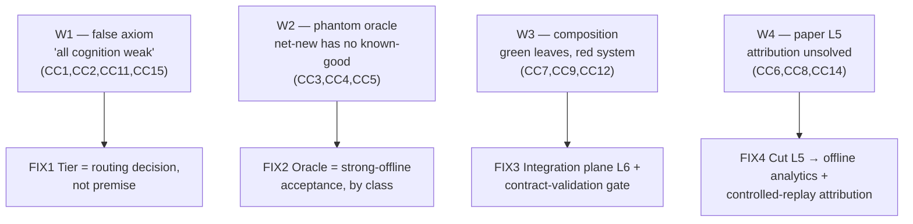
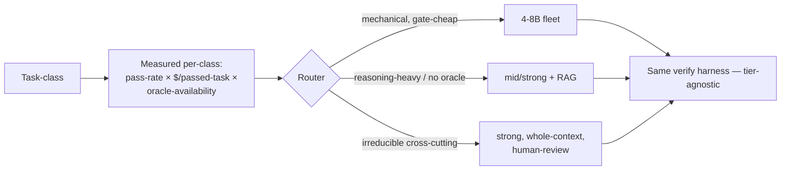
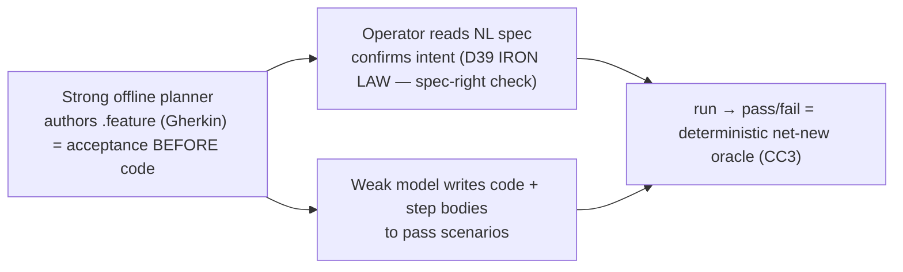
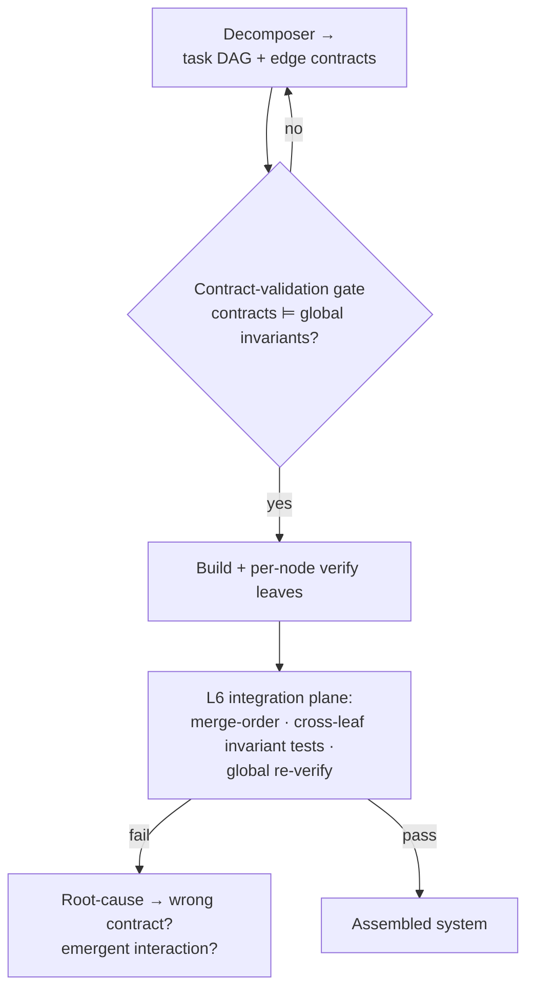
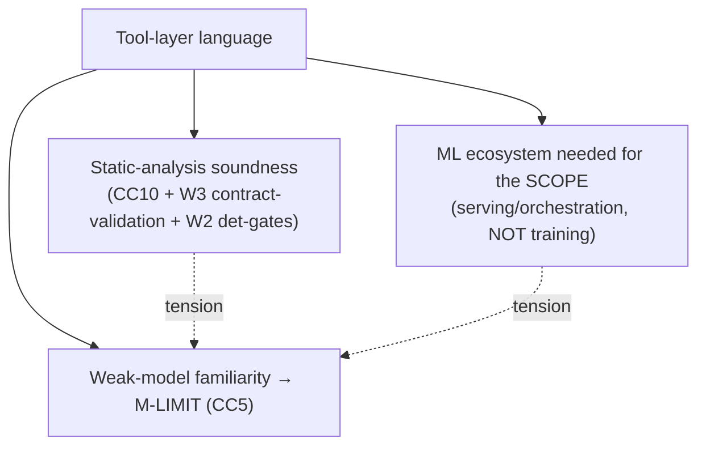
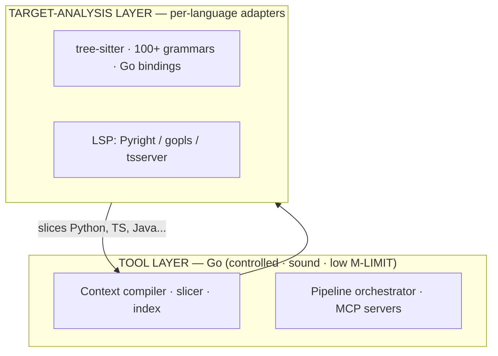
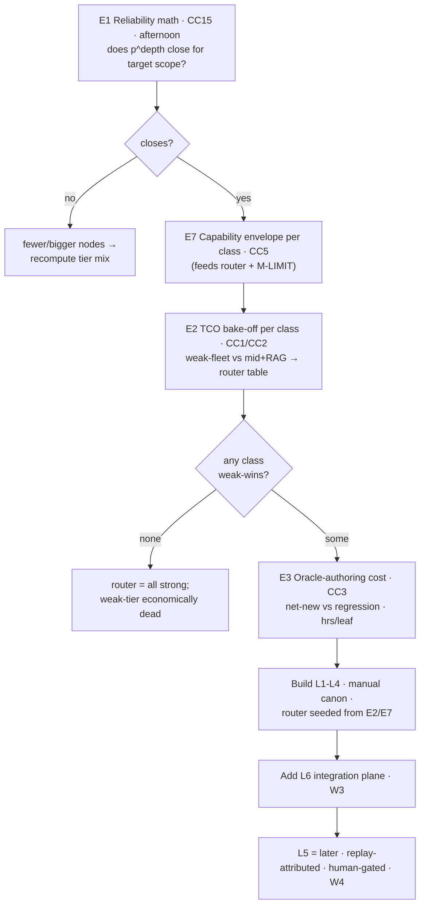

# 02g — Critique Disarm Plan: Context-Engineering Proposal

> Disarm of [[02f-problem-solution-critiques-concensus]] against [[02-problem-solution-proposal]]. 18 consensus concerns (`CC*`) collapse to 4 root wounds (`W*`); each wound gets a primary fix (`FIX*`) + the concessions it costs. Disarm ≠ patch-18 — kill roots, satellites die. Closes with experiment ordering (gates the build) + honest residual debts.

## TL;DR — thesis of the disarm

Critiques are correct *against the proposal as written* — but ~all evaporate under one move: **demote "weak model" from axiom to measured routing decision.** Then oracle demotes from "free per-leaf" to **strong-offline-authored acceptance, split by class**, and L5 demotes from shipped-plane to **offline analytics + controlled-replay attribution**. Product stops being "weak models deliver big scope" (unfalsifiable, shredded) and becomes **the compiler + gate + router that pushes the largest *measured* fraction down-tier safely** (true, falsifiable, survives every cost critique). Three genuine engineering debts remain real, not hand-waved: net-new oracle, contract-validation, integration plane.

## 0. Root-wound map — 18 CC → 4 W

Park as hardening (not fatal): CC10 (Python static-analysis soundness), CC16 (polyglot), CC17 (injection/secrets), CC18 (one-store-first). Folded in §6.

---

## W1 — false axiom: "all cognition weak"

**Hit:** CC1 (5/5 FATAL), CC2 (5/5 FATAL), CC11 (4/5), CC15 (2/5 CRIT).
**Fault:** proposal makes "weak model" a *premise*. Reviewers correctly shred — cognition relocated (decomposer/RCA/verifier all need strong), never priced. "Weak = cheap" unfalsifiable until costed.

### FIX1 — model tier = cheapest tier that clears the gate, per task-class

Delete the premise. Replace:

> Per task-class, route to **cheapest tier that clears the gate at target pass-rate.** Tier = measured output, not input assumption.

How each satellite dies:
- **CC1 dissolves.** "Strong smuggled in" stops being fraud → it IS the design. Offline (decompose / RCA / oracle-author / canon) = strong, amortized across fleet. Online execution = cheapest-that-passes. Admit hybrid, don't hide it. (Restate thesis per 02f consensus reframe.)
- **CC2 becomes measurement, not claim.** TCO per class decides routing. mid-model+RAG wins a class → router selects it for that class. **Baseline is not a competitor — it's one tier in the router.** Can't lose the bake-off; loser-tier just isn't selected. Still owes the TCO arithmetic (→ E2) — that's now mandatory homework, not optional.
- **CC15 becomes the granularity knob.** Target end-to-end p → back out required per-node p + max depth → dictates node size AND tier per class. Math won't close at weak+small? Router picks bigger nodes / stronger tier for that class. Architecture stops fighting itself.
- **CC11 budget reality** folds into E7 envelope measurement — usable-vs-nominal ctx on the real 4-8B is a per-tier input to the router, not a guess.

**Concession (cost of disarm):** drop "ALL cognition in pipeline." Own the offline-strong/online-weak hybrid out loud. Account strong-model calls per delivered feature.

**Repo note:** this checkout already IS the offline-strong layer (frozen artifacts, `prompts/`, ADP authoring). The implementation-agent fleet = online-cheap. Already dogfooding the hybrid — name it, don't apologize for it.

---

## W2 — phantom oracle (the genuinely hard one)

**Hit:** CC3 (5/5 FATAL), CC4 (5/5 S1), CC5 (5/5 FATAL→MINOR).
**Fault:** per-leaf "known-good PASS / planted-defect FAIL" cheap to RUN, brutal to AUTHOR at scale; net-new code has NO known-good → oracle circular for greenfield (the actual hard part).

### FIX2 — split task-classes on oracle-availability; each gets a real gate

| Class | Known-good? | Oracle mechanism | Gate strength |
|---|---|---|---|
| Refactor / migration | yes (current behavior) | differential + metamorphic (behavior-invariant) | strong, deterministic |
| Bug-fix / regression | yes (failing test) | the repro test | strong |
| Extend typed-API | partial | contract → property-based tests | medium |
| Net-new greenfield | **no** | **test-first: strong offline authors acceptance test BEFORE weak codes** | medium + sized residual |

**Key unlock (net-new):** oracle = the acceptance test, **authored by the strong offline planner as part of leaf definition.** TDD pushed into the pipeline. Answers CC3 "who authors it" → same strong model that decomposes; cost folds into decomposition (counted in TCO, not hidden). Weak model writes code to pass a test it didn't write. "Who verifies the oracle?" → L6 integration + contract-validation gate (W3), NOT per-leaf recursion.

### CC4 — decorrelate by gate TYPE, not model instance
LLM errors correlated (same training regime, same blind spots) → N weak clones catch independent errors only, never the correlated hard ones. So:
- **Deterministic gates carry accept/reject authority:** type-checker ⊥ test-runner ⊥ compile ⊥ contract-check = genuinely independent failure modes.
- **LLM-adversarial demoted to advisory** → raises human-review priority, never sole gatekeeper, until its precision/recall measured (→ E6). If it must gate → strong-model job (= a router branch, FIX1).

### CC5 — capability envelope makes M-LIMIT measurable, not residual
Pre-measure each tier on curated known-difficulty tasks per class (once, offline). Failure beyond envelope = **M-LIMIT by measurement**, not retry-thrash. Hard retry bound (≤2); SPLIT/escalate must cite envelope data. M-LIMIT becomes a router input, killing the unfalsifiable "missing context forever" loop.

### FIX2-impl — BDD/Gherkin as the net-new acceptance-oracle mechanism (Go)

The FIX2 net-new oracle ("strong planner authors acceptance test test-first") needs a concrete artifact. **Gherkin `.feature` files** = it: one artifact that is BOTH human-readable NL spec AND machine-executable acceptance test.

Why it fits: solves CC3 "who authors the oracle" (the NL spec IS the oracle, authored by the same strong planner that decomposes — cost folds into decomposition); satisfies the **operator gate (D39)** — human reviews NL `.feature` *before* code, reviewable by non-coders; threads IDs (`R→AC→S` ⇒ feature/scenario tags).

**Two-layer oracle separation (do NOT conflate):**
- **Acceptance layer (behavior):** Gherkin/BDD — "code does what the task wanted." This layer.
- **Canon-rule layer (compliance):** go/analysis + analysistest ([[02i-go-canon-roadmap]] W0) — "code obeys the rules."
- Unit tests stay plain table-driven `testing`. Three distinct oracles; BDD scoped to acceptance ONLY (mixing BDD into unit tests = the Go-community anti-pattern).

**Tooling decision — Gherkin syntax as the stable spec contract:**
- **Now:** **cucumber/godog** (full runner) — maintained (v0.15.1, Jul 2025; lib fine, only standalone *CLI* deprecated → run via `go test`). Don't build a runner to dodge a non-problem.
- **When the loop needs agent-emittable step-binding:** migrate execution to **cucumber/gherkin/go** (parser only — `.feature`→AST, no runner) **+ thin in-house step-executor.** Depend on the *frozen* part (Gherkin syntax rarely churns), own the *moving* part (NL→step glue) → make step-registration a typed schema the pipeline generates + checks structurally. Fits P-TOOL (deterministic core, you own the glue). Note: gherkin/go is NOT a Godog alternative — it's the parser Godog is built on; it cannot execute scenarios alone.

**Caveats:** step-def glue is where NL ambiguity re-enters (wrong-but-passing = CC7 in NL clothing) → strong planner authors feature + step skeleton, weak fills bodies. Per-profile fit: strong for P-SVC/P-TOOL (observable behavior); marginal for P-LIB (API → property tests) and P-CLI (golden-output often simpler).

**Concession:** net-new gate weaker than refactor gate. Size + disclose residual risk per class. Stop calling oracle "free."

---

## W3 — composition: green leaves, red system

**Hit:** CC7 (5/5 CRIT), CC9 (4/5 FATAL), CC12 (4/5).
**Fault:** per-node verify checks "meets contract," never "contract right." Wrong-but-consistent contract → every downstream leaf correctly satisfies a wrong interface, explodes only at integration after N commits. Emergent interaction (shared state/ordering/merge) invisible to edge contracts.

### FIX3 — two new gates + a named-irreducible escape hatch

1. **Contract-validation gate** (distinct from node-satisfies-contract): validate edge contracts against global invariants BEFORE leaves build against them. Wrong contract caught at design, not integration-after-N.
2. **Integration plane L6** (first-class, not Q4 shrug): owns merge-order + cross-leaf invariant tests + global re-verify post-assembly. Global invariants = first-class canon artifacts.

### CC9 — name the irreducible class, route it
Stop claiming universal decomposition. Explicit taxonomy:
- **Decomposable-mechanical** → fleet (FIX1 weak/mid branch).
- **Irreducible cross-cutting** (wide rename, shared-type/API change, race/deadlock, perf-needing-whole-view) → **route to strong-model whole-context + human review** (FIX1 escalate branch). Context IS the ripple; don't pretend recursion terminates.

Couples to CC15: reliability budget drives node granularity — pick node size so `p^depth` clears target; fewer joints where math demands it.

### CC12 — moving tree
- File-lock discipline on overlapping leaves (repo already has lock convention — reuse it).
- Cache reusable **inputs** (activated rule-sets, index queries, examples), NOT packets. Packets stale on sibling commit; inputs don't. (Fixes R1/R6 contradiction.)
- State reindex cost model; incremental reindex per micro-commit is itself heavy — bound it.

---

## W4 — L5 self-evolution = research dressed as shipped plane

**Hit:** CC6 (5/5 MAJOR), CC8 (5/5 HIGH), CC14 (3/5 MED).
**Fault:** L5 presented with L1–L4 confidence, but core (attribution Q8) unsolved → loop-closure guard decorative; loop authors canon from own failures → manufactures own corroboration (poison-amplification); depends on phantom oracle (W2).

### FIX4 — cut L5 to future-work; offline + human-gated only
- Ship **L1–L4 + manually-bootstrapped canon** first.
- Run evolution as **offline analytics + human-approved enrichment ONLY** at launch.
- One hard prerequisite before any auto-merge: **controlled replay** for attribution — freeze model + freeze code between before/after runs. Only way to credit a failure-drop to a canon change vs confounders (model-swap, code-drift). Without it, "revert non-helping rules" has no signal — reviewers right.

### CC8 — defuse curation tax by honesty + separation
- **Bootstrap canon** (manual, big up-front — declare the human-quarter cost; seed from existing linters / style-guides / type-stubs, which are AST-auto-derivable) vs **evolution** (maintenance). "Self-improving at launch" = "humans bootstrap, loop only maintains." Say so.
- Estimate trigger-curation FTE at corpus × churn. Show AST-auto-derivable fraction vs hand-tag. Folds into E2 TCO.
- **Canon-production SOP → [[02h-canon-production]]** (phases A–H, laws CP1–CP4): the bootstrap pipeline that turns multi-model recall into typed/grounded/fixture-verified rules. Key moves: *ground beats consensus* (CC4), *every rule ships a fixture* (P6), *seed thin grow-from-failure* (kills the cold-start storm).

### CC14 — sell determinism honestly
Trigger predicate-match deterministic (keep). But task-class assignment, rank weights (`severity×specificity×proximity` — name the coefficients + their source), example selection, semantic triggers, vector augment = fuzzy. Sell as **"deterministic preference with gated fuzzy fallback,"** name the tunables. Deterministic-wrong is reliably wrong — reproducibility ≠ correctness.

---

## 5. SURVIVES — keep, don't touch (unanimous credit)

Inherited hygiene from [[00-memory-101]] + [[01-research-problem]], sound:
- Trigger-indexed canon (C6) — best/most-novel idea per all 5.
- Typed memory split (P4) — correct (CC18 dissents only on *physical* split day-1 → start one store + metadata, split on measured failure; mirrors R7).
- Budget-as-contract + DROPPED log (P5).
- Inline load-bearing canon vs cite-and-trust weak priors (P3).
- Provenance + immutable episodic + governed/versioned canon writes.
- Inversion "shrink task to model" + verify-untrusted-output (P1/P6) direction.

---

## 6. Parked hardening (real, not fatal)

- **CC10 (Python static-analysis unsound):** state language scope; augment static with runtime traces / type-stubs; slice depth dependency-kind-driven not fixed-1-hop; treat slice as best-effort+verified, budget R-SLICE as common (→ E5).
- **CC16 (polyglot):** state language scope explicitly; INDEX + triggers multiply per language; don't imply generality.
- **CC17 (injection/secrets):** provenance-gate ALL inlined content (untrusted primes, never authorizes); sandbox CODE-SLICE as data not instruction; vault secrets; reconcile "immutable telemetry" with erasure law (GDPR) — redaction-at-write insufficient.
- **CC18 (taxonomy overfit):** one store + rich metadata + scoped retrieval first; physically split only on measured failure.

---

## 6a. Stack choice as a soundness lever (upgrades CC10/CC16 from patch → lever)

CC10/CC16 aren't only "harden later." Language of the **tool layer** is a force-multiplier across W2/W3: a static-strong language shrinks CODE-SLICE budget (CC11), makes contract-validation (W3) type-checkable not LLM-judged, and strengthens deterministic gates (W2/CC4 — compiler+type-checker catch more → lean less on correlated LLM verify).

### Three-axis tension (don't optimize soundness alone)

Trap: weak 4-8B saw vastly more Python than Go/Rust/C#. Most-analyzable ≠ best — a less-common language buys a better dep graph but worse weak-model output (M-LIMIT spike, CC5).

### Scope = author tools + agentic pipelines (not ML training) → A2 axis collapses → **Go preferred for tool layer**

| Lang | Soundness | "ML" for THIS scope | Weak-model M-LIMIT | Verdict |
|---|---|---|---|---|
| Python | weak (CC10 wound) | dominant (but training, not needed here) | lowest | training home, worst slicer |
| Java/Kotlin | strong (WALA/Soot sound call-graph) | infra-credible | low | best if enterprise/JVM |
| C#/.NET | strongest substrate (Roslyn) | ML.NET/ONNX | medium-high | nicest to BUILD compiler on |
| **Go** | **strong, trivially analyzable** | **sufficient — Bedrock/MCP/embeddings/concurrency, no training libs needed** | **lowest non-Python (small surface, gofmt-canonical, explicit errors)** | **preferred for tool/orchestration layer** |
| Rust | soundest by construction | growing | low (fights CC5) | only if soundness paramount |

Go's small language surface = **low M-LIMIT**: weak model writes *correct* Go more reliably than correct Python for glue/server/tool code despite smaller corpus — simplicity beats volume for this code-type.

### Decisive move: tool-language ⊥ target-analysis-language

Language tools are WRITTEN in ≠ languages they ANALYZE. A Go-written compiler slices Python/TS/Java via per-language adapters.

Polyglot complexity isolates in adapters; orchestration stays one sound language → **disarms CC16** (add an adapter, don't multiply the tool stack). **Honest caveat:** this does NOT make *Python targets* sound — CC10 relocates to the Python adapter (bounded by Pyright/type-stub/runtime-trace). Go fixes the tooling you ship + hosts polyglot cleanly; it doesn't fix Python's analyzability when slicing Python.

### AWS AgentCore reinforces Go, doesn't force Python

- **Runtime = container + HTTP/protocol, language-agnostic.** Go binary → tiny image, fast cold-start, low memory = ideal serverless-agent; goroutines = natural fan-out for parallel leaf/verify orchestration.
- **Gateway speaks MCP; AWS SDK for Go (v2) first-class** (Bedrock Converse/InvokeModel); official Go MCP SDK serves + consumes tools.
- **One real tax:** AWS high-level agent *frameworks* (Strands) are Python/TS-first. Authoring tools yourself → you want SDK + MCP + Runtime contract (all Go-native), not Strands sugar. Forgo sugar, not capability.

Keep Python only where it earns it: numpy-grade compute or Strands-specific glue → shell out / sidecar. Compiler, index, slicer, MCP servers, verify harness, router = Go.

---

## 7. Experiment ordering — gates the build (merged + reprioritized)

Reordered by decisiveness × cheapness. E7+E2 are one measurement campaign (they build the router table).

E5 (slice recall on real Python · CC10) + E6 (verifier decorrelation · CC4) fold into E2's per-class runs.
**E8 (stack pick · §6a):** weak-tier pass-rate on real tool-writing tasks, **Go vs Python**, on the actual 4-8B. Sub-probe of E7 (same envelope campaign). Bet: Go wins for glue/server/tool code (low M-LIMIT). Decides tool-layer language before BUILD.

**Kill-criteria (state up front):**
- E1 fail → architecture wrong for big-scope; fewer/bigger nodes.
- E2 no class weak-wins at lower TCO → weak-tier dead; router = all strong (still a valid product — the compiler/gate/router).
- E3 oracle ≥ implementation cost → that class's gate uneconomic; route stronger or admit weaker gate + sized risk.
- E6 weak catch-rate ≈ author self-catch → LLM-adversarial gate buys nothing; deterministic-only.
- E8 Go pass-rate ≤ Python on tool tasks → simplicity didn't beat corpus; reconsider tool-layer language (Python+Pyright or JVM/C#).

---

## 8. Honest residual debts (NOT disarmed — buildable, owed)

1. **Net-new oracle** (W2): test-first-by-strong-planner is the answer, but it's real engineering + real cost. Size residual risk per class; no free lunch for greenfield correctness.
2. **Contract-validation** (W3): a new gate that must check "contract ⊨ global invariants" — non-trivial; global invariants must be authored as canon.
3. **Integration plane L6** (W3): owns the single hardest part of decomposed software. Real build, not a shrug.

## Bottom line

Reframe isn't retreat — it's the proposal **made falsifiable**. Demote weak-model from axiom → measured routing decision; demote oracle → strong-offline acceptance by class; demote L5 → offline + replay-attributed. ~All 18 CC evaporate or become parameters. Run E1 first (afternoon's algebra kills or clears the shape), E7+E2 build the router table, E3 prices the gate. Three engineering debts stay real and owed.
