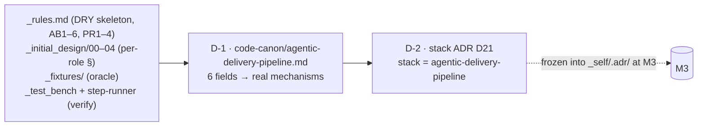

# M1 — The deliverable adapter (profile + stack ADR) — tasks

> Migration phase M1 (migration-spec §6). Goal: the deliverable adapter — D-1 (`code-canon/agentic-delivery-pipeline.md`, six fields) + D-2 (stack ADR pinning `stack = agentic-delivery-pipeline`). This is what tells the Build phase how to scaffold, write, and **verify** a prompt `.md` — the slot a future Terraform/TypeScript profile fills. Reversible, additive-only (migration-spec §9). Builds on M0 (rollback target `4515f1d`, proof-twin green; current HEAD `20b95c4` = M0-tasks committed).

## Scope



## Tasks

| # | Task | Acceptance | Status |
|---|---|---|---|
| T0 | Confirm M0 baseline clean; M1 adds files only (no spine edit, no shipped-prompt overwrite) | only new/edited: `code-canon/agentic-delivery-pipeline.md` (new), `_decisions.md` (+D21), `_tracker.md` (+index), this file | ☑ |
| T1 | Author `code-canon/agentic-delivery-pipeline.md` — six fields (verbatim shape, usage §A1 Step 2) | all 6 fields present; verify mechanism *names* the existing clean-room sim, invents none | ☑ |
| T2 | Resolve each of the 6 fields to a real, existing on-disk mechanism (no dangling TBD) | each field cites a real path/anchor; verified to exist | ☑ (table below) |
| T3 | Add stack ADR `D21` to `_decisions.md` (next free id) pinning `stack = agentic-delivery-pipeline` | body covers: "code"-unit rationale, verify = clean-room sim, build idiom; reads as sibling of python/terraform stack ADRs | ☑ |
| T4 | Add `D21` index line where the decision index lives (`_tracker.md`) | index line present; "D1–D21 resolved" footer updated | ☑ |

## T2 — six fields resolve to real mechanisms (no TBD)

| Field | Resolves to | On-disk evidence (verified present) |
|---|---|---|
| scaffold | DRY prompt skeleton (frontmatter + caveman + Role/Rules/Task/Schema/Stop) | `_rules.md` *Standard prompt skeleton* (line ~62) + *Canonical caveman block* (~50) |
| coding canon | AB1–AB6 + PR1–PR4 + caveman block | `_rules.md` AB1–AB6 (~89–95), PR1–PR4 (~45–48) |
| "code" unit | one prompt `.md` at `prompts/<NN-phase>/<ROLE>.md` | `prompts/03-hld/DERIVE-TESTS.md` et al. (30 shipped) |
| oracle materialization | golden fixtures + declared per-role output schema | `_fixtures/greenfield-clean/**`, `_fixtures/greenfield-build-reds/**`; per-role `outputs:` + inline schema |
| build idiom | synthesize from HLD-increment contract + per-role spec § | `_initial_design/00–04`; increment contract = D14 pattern + D15–D19 calls |
| verify mechanism | clean-room runner sim (Sonnet runner, `_test_bench` root, both directions) | `.claude/agents/step-runner.md` (Sonnet/High), `_test_bench/`, `_prompt-run.md`, `_pipeline-run.md` — proven in M0 T2 |

**No "TBD".** Every field points at an artifact that exists today; the profile *registers* them (esp. the verify harness — invent nothing, per spec §5 invariant #3 + B4).

## T3/T4 — stack ADR D21

- **Decision:** `stack = agentic-delivery-pipeline` for the self-host project; Build binds `code-canon/agentic-delivery-pipeline.md`.
- **Sibling test (acceptance):** D21 mirrors the existing `ADR-0002` (Python tech-stack) frozen in `_fixtures/greenfield-clean/.adr/log/0002-*.md` — same role (pins the stack the Build phase reads), same shape (decision + rationale + consequences). It is **not** a special case: the only thing that differs from a hypothetical `stack = python`/`stack = terraform` ADR is the field *values* (unit = prompt `.md` vs `.py`/`.tf`; verify = clean-room sim vs pytest/terraform-validate). Spine reads the profile either way (invariant #1).
- **Next free id:** `D21` (D1–D20 resolved; `_decisions.md` body added above D20, index appended in `_tracker.md`). Will freeze into `_self/.adr/` as `ADR-0021` at M3 (monotonic after `adr.lock` max = ADR-0006 in the greenfield fixture; the self-host `.adr/` numbering continues from the live `_decisions.md` D-set).

## Spec deviation (logged)

- migration-spec §6 M1 step 2 says *"add its index line where the decision index lives."* The decision index currently rides in `_tracker.md` (§ "Decision index", lines ~89–110) — index line added there. Note: M6 step 2 relocates this index alongside `_decisions.md` when `_tracker.md` is retired; M1 honors the **current** home (don't pre-empt M6).
- **NO COMMIT** (task rule). Deliverables sit uncommitted in the working tree on HEAD `20b95c4`.

## M1 acceptance (spec §6) — MET

- [x] the profile's six fields each resolve to a real, existing mechanism (no dangling "TBD") — T2 table
- [x] the stack ADR reads as a sibling of the (hypothetical) Python/Terraform stack ADRs, not a special case — T3 sibling test

## Done-checklist lines (spec §11)

```
M1 [x] code-canon/agentic-delivery-pipeline.md (6 fields, verify = existing clean-room sim)
   [x] stack ADR added to _decisions.md (+ index line)
```

> Owed to later phases (not M1): freeze D21 into `_self/.adr/` as ADR-0021 (M3); point the orchestrator at `code-canon/agentic-delivery-pipeline.md` as deliverable target (M4); first self-build verifies *through* the registered clean-room mechanism (M5).
