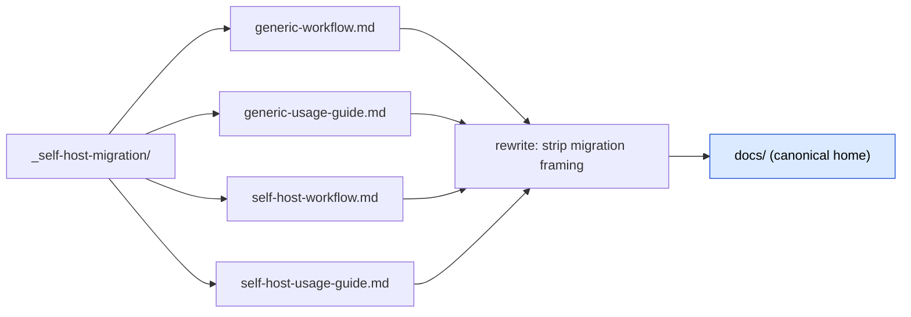

# M10 — Relocate surviving docs → `docs/` — tasks (SELF-CONTAINED)

> **Self-contained:** everything to execute M10 is in THIS file. Do NOT read `migration-spec.md` or other M-task files. **Precondition: M9 cleared** — engine reads repo root, `_self/` cache + `freeze*.mjs` gone, strays gone, no kept file mentions the migration. **NO COMMIT** (deletions/moves recoverable from `pre-self-host` tag + git history).

## Goal

The 4 operating-manual docs survive the migration. Move them out of the throwaway `_self-host-migration/` workdir into the canonical `docs/` home and rewrite them free of migration framing. After M10 the repo's only non-canonical bits left are the register (caveman, M11) + the `_self-host-migration/` workdir itself (deleted in M11's closing act).

## Scope — the 4 files (move + rewrite)



| Move from | Move to | Note |
|---|---|---|
| `_self-host-migration/generic-workflow.md` | `docs/generic-workflow.md` | conceptual operating model |
| `_self-host-migration/generic-usage-guide.md` | `docs/generic-usage-guide.md` | **D20 cites this path** — land here exactly |
| `_self-host-migration/self-host-workflow.md` | `docs/self-host-workflow.md` | **D20 cites this path** — land here exactly |
| `_self-host-migration/self-host-usage-guide.md` | `docs/self-host-usage-guide.md` | operational self-host guide |

> `.adr/log/0020` (D20) + its draft + a resilience cite already point at `docs/self-host-workflow.md` and `docs/generic-usage-guide.md` (repointed in M9). M10 MUST land those two files at exactly those paths, or the live ADR cite dangles.

## Rewrite rules — strip ALL migration framing

The docs were authored as a North-Star describing a *future* state reached via bootstrap scaffolding. That scaffolding is gone. Rewrite so the docs describe **the repo as it is now: a canonical Agentic Delivery Pipeline project**.

**Purge (these no longer exist):**
- `_self/` (the dead cache), the freeze tool / `freeze.mjs` / "re-freeze" / "seed-from-frozen" / "do NOT re-run phases 0–3", "stale-freeze guard", "hand-edit `_self/`".
- "bootstrap", "migration", "migration-spec", any `_self-host-migration/` path, cross-refs to this spec/M-tasks.
- "self-host as a special mode" framing → "run the pipeline on this repo". The repo is just a canonical project; the self-host guides largely fold into the generic ones.

**Keep (genuinely reflexive, still true):**
- Level-A / Level-B distinction (the pipeline operating on its own project vs a foreign one).
- The prompt-as-deliverable target: `prompts/` plays the `src/` role; oracle = `_fixtures/`; active stack profile = `code-canon/agentic-delivery-pipeline.md`.
- Legit engine vocabulary: "frozen artifact", "freeze the requirements", "skeleton", RE-RANK, the canonical trees `.aprd/ .adr/ .hld/ .roadmap/`, `CLAUDE.md`, launchers (`/self-host` skill, `selfhost` agent).

**Where the canonical trees live now** (use these in rewrites — the engine reads them directly at the repo root, no cache):
- `.aprd/` frozen requirements · `.adr/` decisions (`log/<NNNN>.md` + `adr-index.json` index + `adr.lock`) · `.hld/` skeleton (`skeleton.frozen.md` + `skeleton/*`) · `.roadmap/` (`roadmap.md` + `08-rerank.json`).

## Migration token-set (verify the rewritten docs are clean)

`grep -rE` over `docs/` must return ZERO for:
```
_self/  _self-host-migration  migration-spec  _tracker\.md  _changelog\.md  _prompt-run\.md
freeze\.mjs  parity gate  bootstrap  seed-from-frozen  D-[1-6]  cutover  \bM(0|1|2|3|4|5|6|7|8|9|10|11|12)\b
```
**Carve-outs (legit, keep):** NFR `id: M1`; domain words `migration`/`parity`/`migration-guide` (a project *class* + its test type + a doc type the pipeline supports — unrelated to THIS migration); engine `frozen`/`freeze the requirements`/`skeleton`/`self-host` (the concept, not the dead workdir).

> Note: the rewritten docs SHOULD still describe running the pipeline reflexively ("self-host"); only the dead scaffolding + the migration *process* vocabulary is purged.

## Tasks

| # | Task | Acceptance | Status |
|---|---|---|---|
| T0 | Confirm M9 cleared (engine reads root; no migration mention in kept tree) | M9 done | ☑ verified: no `_self/`, no `freeze*.mjs`, trees `.aprd .adr .hld .roadmap` at root, D20 cites `docs/` |
| T1 | `mkdir docs/`; move the 4 files in (preserve the 2 D20-cited filenames exactly) | 4 files at `docs/<name>.md`; gone from `_self-host-migration/` | ☑ `git mv` all 4 → `docs/`; gone from workdir (renames staged, uncommitted) |
| T2 | Rewrite each free of migration framing (purge list above; keep reflexive content) | no dead-scaffold refs; self-host special-casing collapsed into "run pipeline on this repo"; canonical-tree paths correct | ☑ generics token-clean (moved as-is); self-host pair rewritten — `_self/` cache + seed-from-frozen + bootstrap + parity-gate purged; upstream phases = frozen trees at repo root; Level-A/B + oracle + RE-RANK + launchers kept |
| T3 | Verify token-set grep over `docs/` = ZERO (carve-outs logged) | grep clean; D20-cited paths resolve | ☑ token-set grep = 0 (+ extra purge terms = 0); `docs/self-host-workflow.md` §10 + `docs/generic-usage-guide.md` §3 resolve |
| T4 | Confirm no kept file references the old `_self-host-migration/<doc>.md` paths | grep `_self-host-migration/.*\.md` over kept tree (excl. the still-living `_self-host-migration/` spec+M-tasks) = 0 doc-path hits | ☑ grep over kept tree = 0 doc-path hits |

## M10 acceptance — MET when

- [x] 4 surviving docs live in `docs/` (the 2 D20-cited at exact paths) and read clean (no migration trace — T3 grep)
- [x] no kept file references the old `_self-host-migration/<doc>.md` paths (T4)
- [x] `_self-host-migration/` still EXISTS — it holds `migration-spec.md` + `M0–M12` task files until M11's closing act (`M11.14`) deletes it

## Done-checklist line

```
M10 [x] surviving docs relocated to canonical home (docs/) + rewritten clean
```

## Notes

- **NO COMMIT** (recoverable from `pre-self-host` tag + git history).
- M10 rewrites docs to clean prose but does NOT yet caveman-normalize them — that is M11.5 (the caveman pass over `docs/`). M10 = relocate + de-migration-frame; M11.5 = caveman register.
- Caveman register governs this task file too (terse; substance kept).
