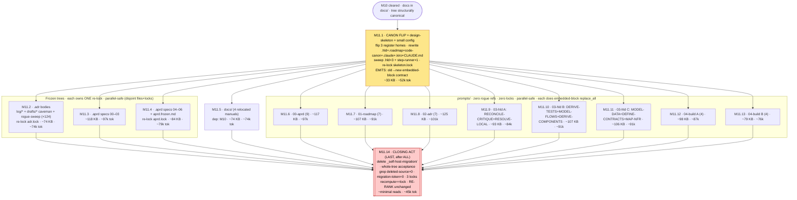

# M11 — Caveman-normalize whole tree; drop `_self-host-migration/` — INDEX (SPLIT into 14 self-contained files)

> **This file is the INDEX/overview only.** Each sub-part is its OWN self-contained task file — `M11.1-tasks.md` … `M11.14-tasks.md`. An executor runs ONE part file; it contains all context (caveman register, embedded-block flip, lock algorithm, sweep rules, behavior check) and needs no other file (not this index, not `migration-spec.md`, not `M11.1`).
>
> Phase M11 (invariant #6: caveman everywhere — prose + code comments). **Precondition: M10 cleared** (docs relocated to `docs/`; tree structurally canonical — only register + migration workdir left non-canonical). SPLIT into **14 context-bounded sub-sessions** (M11.1 … M11.14). Reason: M11 rewrites every survivor file to caveman — read + rewrite ≈ 2× file bytes in context. Whole survivor tree ≈ 1.2 MB prose ≈ ~600k tokens for one pass — ~4× over the 150k cap. One session impossible. Each sub-session stays **≤150k tokens** (target ≤110k, hard ceiling 218 KB source). **M11 acceptance is MET only after M11.14** — the parts are a delivery mechanism, not 14 milestones.

## Why split (the budget model)

Caveman rewrite = open file (input tokens) → emit rewritten prose (output tokens). Both consume the window. Model:

```
session_tokens ≈ (source_bytes / 3.8) × 2  +  OVERHEAD
OVERHEAD ≈ 35k  (system prompt + tools + CLAUDE.md + spec §6-M11 ref + reasoning/iteration)
cap = 150k  →  source ceiling = (150k − 35k) × 3.8 / 2 ≈ 218 KB
target ≤ 150 KB source/part  (margin for re-read, edit churn, lock recompute)
```

Char/token ≈ 3.8 (markdown w/ structure). `×2` because rewrite echoes near-full file. Structural data (JSON/YAML keys+values, schemas, locks, `adr-index.json`) is **untouched** (invariant #6) → not counted as rewrite output; lock recompute runs in Bash (sha over disk), not in-context.

## Split map



## Ordering & dependency rules

- **M11.1 runs FIRST.** It flips the register canon in 3 homes (`.hld/skeleton/coding-canon.md`, `CLAUDE.md` Register §, the embedded block) and **emits the verbatim old→new embedded-block contract** every prompt part reuses. No prompt/frozen part may start until M11.1's block contract exists (see §"Embedded-block flip contract").
- **M11.2–M11.13 are parallel-safe.** Disjoint file sets, disjoint locks, prompts carry zero rogue refs. Run any order / concurrent after M11.1. Each frozen-tree part owns its re-lock and finalizes that lock's full hash-input set within itself (no cross-part lock hazard).
- **M11.5 (docs) also deps M10** (docs must already live in `docs/`).
- **M11.14 runs LAST, after ALL** — deleting `_self-host-migration/` is the closing act, and the acceptance grep/RE-RANK check must cover the fully-rewritten tree.

## Per-part table

| Part | Scope | Owns re-lock | Sweep | Bytes | ~tok | Dep |
|---|---|---|---|---|---|---|
| M11.1 | CANON FLIP (3 homes) + `.hld/skeleton/*` + `skeleton.frozen.md` + `.roadmap/roadmap.md` + `code-canon/*` + `.claude/agents/step-runner.md` + `.kiro/steering/*` + `CLAUDE.md` | **skeleton.lock** | `.hld`×3, step-runner×1 | ~33 KB | ~52k | M10 |
| M11.2 | `.adr/log/*` + `.adr/drafts/*` (21+21 bodies) | **adr.lock** | `.adr` `_decisions`×92 + `_rules`×32 | ~74 KB | ~74k | M11.1 |
| M11.3 | `.aprd/specs/00–03` | — | none | ~118 KB | ~97k | M11.1 |
| M11.4 | `.aprd/specs/04–06` + `aprd.frozen.md` | **aprd.lock** | none | ~84 KB | ~79k | M11.1 |
| M11.5 | `docs/` (generic-workflow, generic-usage-guide, self-host-workflow, self-host-usage-guide) | — | none | ~74 KB | ~74k | M11.1 + M10 |
| M11.6 | `prompts/00-aprd/*` (9) | — | none | ~117 KB | ~97k | M11.1 |
| M11.7 | `prompts/01-roadmap/*` (7) | — | none | ~107 KB | ~91k | M11.1 |
| M11.8 | `prompts/02-adr/*` (7) | — | none | ~125 KB | ~101k | M11.1 |
| M11.9 | `prompts/03-hld/{RECONCILE-CRITIQUE,RESOLVE-LOCAL}` | — | none | ~93 KB | ~84k | M11.1 |
| M11.10 | `prompts/03-hld/{DERIVE-TESTS,MODEL-FLOWS,DERIVE-COMPONENTS}` | — | none | ~107 KB | ~91k | M11.1 |
| M11.11 | `prompts/03-hld/{MODEL-DATA,DEFINE-CONTRACTS,MAP-NFR}` | — | none | ~106 KB | ~91k | M11.1 |
| M11.12 | `prompts/04-build/{INTEGRATE,CRITIQUE,MATERIALIZE-ORACLE,DEMO-GEN}` | — | none | ~98 KB | ~87k | M11.1 |
| M11.13 | `prompts/04-build/{VERIFY-OUTPUT,IMPLEMENT, +2 remaining roles}` | — | none | ~79 KB | ~76k | M11.1 |
| M11.14 | delete `_self-host-migration/` + whole-tree acceptance | verify all 3 | grep-verify=0 | minimal | ~45k | ALL |

All parts ≤101k est < 150k cap. Largest single artifact `RECONCILE-CRITIQUE.md` (50 KB) fits any part. 03-hld split 3-way (densest phase); 04-build + .aprd split 2-way (>150 KB whole).

> **Each row = one self-contained file** `M11.N-tasks.md`. Run that file alone — it embeds the caveman register, embedded-block old→new flip, the lock algorithm (if it owns a lock), the sweep rules (if it owns hits), and the RE-RANK behavior check. This index is a map, not an execution input.

## Embedded-block flip contract (M11.1 emits, M11.2–M11.13 consume)

Step-1 flip kills the old artifact carve-out. The block is verbatim-identical across 41 prompt files + `coding-canon.md` + `CLAUDE.md`. M11.1 records the exact strings so every later part does an identical mechanical `replace_all`:

- **OLD (delete):** `Exception: artifact content (specs, JSON/YAML, ADR bodies) stays clean and complete. Caveman governs narration, not the deliverable.`
- **OLD inline notes (delete per-file in rewrite):** `(clean prose)`, `All prose fields are clean (caveman governs narration, not the artifact — PR4)`, and kin.
- **NEW (PR4, no carve-out):** caveman governs ALL prose — narration + artifact bodies + code comments. Only structural data (JSON/YAML keys+values, schemas), ids (`R*`/`AC*`/`C*`/`ADR-*`), code syntax stay literal.

M11.1 writes the final NEW block string into this file (T-contract below) so prompt parts paste byte-identical. Carve-out for literal data is KEPT — caveman is a prose register, never corrupts data/ids/code.

## Tasks

| # | Task | Acceptance | Status |
|---|---|---|---|
| T0 | Confirm M10 cleared; recover lock-hash algorithm (M9 T0: `aprd=sha256(frozen)`, `adr=sha256(sorted(log/*) joined)`, `skel=sha256(sorted(skeleton/*) joined + frozen)`) | M10 done; algo recovered; no commit | ☐ |
| M11.1 | CANON FLIP + design-skeleton + small config + skeleton re-lock; **emit embedded-block contract** | 3 register homes state no-carve-out mandate; `.hld`/`.roadmap`/`code-canon`/`.claude`/`.kiro`/`CLAUDE.md` caveman; `.hld`×3 + step-runner×1 rogue refs swept; `skeleton.lock` recompute==lock (v→bump); old→new block strings recorded here | ☐ |
| M11.2 | `.adr` bodies caveman + rogue-sweep + adr re-lock | `log/*`+`drafts/*` caveman; `_decisions.md`→`.adr/` (index=`adr-index.json`), `_rules.md`→`.hld/`/`CLAUDE.md`, `_initial_design/`→`.aprd/specs/` swept (grep `.adr`=0); `adr.lock` recompute==lock; `adr-index.json` structural untouched | ☐ |
| M11.3 | `.aprd/specs/00–03` caveman | 4 specs caveman; substance invariant; structural untouched | ☐ |
| M11.4 | `.aprd/specs/04–06` + `aprd.frozen.md` caveman + aprd re-lock | 3 specs + frozen caveman; `aprd.lock` recompute==lock | ☐ |
| M11.5 | `docs/` 4 manuals caveman | clean caveman prose; no migration trace residue | ☐ |
| M11.6–M11.13 | `prompts/` caveman + embedded-block `replace_all` (per phase split) | each file's prose+comments caveman; old block→new block; zero rogue refs (already 0); no lock touched | ☐ |
| M11.14 | **CLOSING ACT** — delete `_self-host-migration/` + whole-tree acceptance | dir gone; grep deleted-source paths=0; grep migration-token=0; all 3 locks recompute==lock; RE-RANK names same next-unshipped; spot-check no fluff-prose | ☐ |

## M11 acceptance (spec §6 M11) — MET only after M11.14

- [ ] register canon (coding-canon + every embedded block + CLAUDE.md) = no-carve-out mandate (M11.1 + prompt parts)
- [ ] every survivor file (excl. gitignored `_test_bench/`) caveman — prose AND code comments; structural data untouched
- [ ] deleted-source rogue refs (`_decisions.md`/`_rules.md`/`_initial_design`) swept; grep over kept tree = 0 (M11.1+M11.2 own the sweep; verified M11.14)
- [ ] every re-locked artifact recompute==lock (skeleton M11.1, adr M11.2, aprd M11.4; re-verified M11.14)
- [ ] RE-RANK still names correct next-unshipped (prose/comment edits behavior-preserving)
- [ ] `_self-host-migration/` does not exist (M11.14 closing act)

## Done-checklist line (spec §11)

```
M11 [ ] register canon flipped (coding-canon + every embedded caveman block + CLAUDE.md): caveman everywhere, no artifact carve-out   ← M11.1 + M11.6–M11.13
    [ ] every survivor file (excl. _test_bench/) rewritten to caveman — prose AND code comments; structural data untouched           ← M11.1–M11.13
    [ ] deleted-source rogue refs swept; frozen artifacts touched re-locked (recompute==lock); RE-RANK still names next               ← M11.1/M11.2/M11.4 + M11.14
    [ ] _self-host-migration/ deleted (closing act) — spec + all M-task files gone                                                    ← M11.14
```

## Notes / deviations (logged)

- **Split is delivery-mechanism, not new milestones.** Spec §6 numbers M0–M12; M11 stays one phase. M11.1–M11.14 are sub-sessions under the 150k cap. M12 follows M11.14 unchanged.
- **NO COMMIT** (task rule). Each sub-session edits its scope only; M11.14 deletes `_self-host-migration/` last (recoverable from `pre-self-host` tag + git history — spec §10).
- **Re-lock isolation.** Each lock's full hash-input set is finalized inside its owning part (skeleton→M11.1, adr→M11.2, aprd→M11.4). No part edits another's hash inputs → no stale-lock hazard. M11.14 re-verifies all three (recompute==lock) as a guard against any cross-part drift.
- **Prompts carry zero rogue refs** (verified) → prompt parts do caveman + embedded-block flip only, no sweep, no re-lock — cheapest parts per byte.
- **Reversibility (spec §9).** Bad rewrite/re-lock in any part → restore that path from `pre-self-host` tag, re-run the part. Parts are independent (disjoint files) so a redo never cascades, except: re-running a frozen-tree part re-runs its re-lock (idempotent — same inputs → same sha).
- **If a part still over-runs 150k** (denser prose than the 3.8 ratio assumes): split it further on the same rule — frozen parts split by file, prompt parts by role; the re-lock stays with whichever sub-part finalizes the last hash input.
