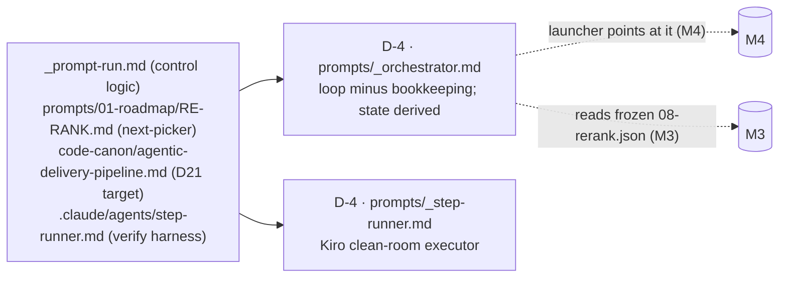

# M2 — The orchestrator & controller — tasks

> Migration phase M2 (migration-spec §6). Goal: D-4 — the self-host control loop. `prompts/_orchestrator.md` (the `_prompt-run.md` loop **minus bookkeeping**) + `prompts/_step-runner.md` (Kiro's `step.json` path; Claude reuses `.claude/agents/step-runner.md`). RE-RANK wired as next-picker over `_self/.roadmap/08-rerank.json`; status **derived from disk**, never read from a tracker. Reversible, additive-only (migration-spec §9). Builds on M1 (D21 + `code-canon/agentic-delivery-pipeline.md`; HEAD `0ad0ce7`).

## Scope



**Strip the bookkeeping (the point of the migration).** The hand loop's `_prompt-run.md` steps 6–7 (changelog append + tracker pointer move + anti-bloat ceremony) are **deleted, not ported** — re-introducing them re-introduces the drift they caused (migration-spec §8). What survives is the control logic: RE-RANK pick → design contract → IMPLEMENT author → clean-room verify → gate → promote.

## Tasks

| # | Task | Acceptance | Status |
|---|---|---|---|
| T0 | Confirm M1 baseline; M2 adds files only (no spine edit, no shipped-prompt overwrite) | only new: `prompts/_orchestrator.md`, `prompts/_step-runner.md`, this file; mock under gitignored `_m2-acceptance-mock/` (+ its `.gitignore` line) | ☑ |
| T1 | Author `prompts/_orchestrator.md` — control loop sourced from `_prompt-run.md`, bookkeeping stripped | RE-RANK→design→IMPLEMENT→verify→gate→promote present; NO tracker/changelog/anti-bloat write; state derived (STEP 0) | ☑ |
| T2 | Author `prompts/_step-runner.md` (Kiro `step.json` path); Claude reuses `.claude/agents/step-runner.md` unchanged | clean-room executor, same hard-rules contract; `_self/` added to the no-touch list | ☑ |
| T3 | Wire RE-RANK as next-picker over `_self/.roadmap/08-rerank.json`; status computed by scanning disk (sentinels), never a tracker | STEP 0 derives done-state by `done_sentinel` scan; STEP 1 names first-not-done; no tracker read | ☑ |
| T4 | Acceptance — clean-room: given a (mocked) frozen `_self/`, orchestrator names the correct next-unshipped prompt AND writes no bookkeeping | RECONCILE/CRITIQUE increment named; zero writes; discrimination proven (frontier advances when a sentinel appears) | ☑ PASS |

## T1/T3 — the loop, bookkeeping stripped (source = `_prompt-run.md`)

| `_prompt-run.md` step (hand loop) | `_orchestrator.md` fate |
|---|---|
| 1–2 read `_tracker.md`, pick next from YOU ARE HERE | **STEP 0 + 1** — derive done-state from disk (`done_sentinel` scan), RE-RANK names the frontier. **Tracker never read.** |
| 3 author the prompt (load `_rules.md` + cite `D*`) | **STEP 2 (design contract) + STEP 3 (IMPLEMENT authors into SCRATCH)** — build idiom = HLD-increment contract + per-role spec § (D21 field 5). |
| 4 isolated clean-room test vs `_fixtures/` | **STEP 4** — step-runner verify, both directions (D21 field 6); separate verifier, no self-grade. |
| 5 windowed e2e | folded into STEP 4 (verify mechanism the profile registers; full chain = `_pipeline-run.md` when needed). |
| 6 record: changelog append + tracker pointer move | **DELETED.** STEP 6 promotes scratch→`prompts/` + golden→`_fixtures/`; "shipped" = freeze on disk + git. No changelog, no pointer. |
| 7 anti-bloat ceremony | **DELETED** — existed only to re-sync the hand duplicate (migration-spec §8). |

**Derived state (STEP 0, D20).** Done-ness is computed, never stored: each `08-rerank.json` entry carries a `done_sentinel` (the disk path whose presence+validity = that build shipped — the self-host analog of D14 auto-select "first slice with no `components.json`"). Frontier = first `remaining_sequence` entry whose sentinel is absent/invalid. Mirrors RE-RANK's own resumable next-pick and D20 guarantee 5 (re-derive frontier from disk).

**Model gate (usage §A1 Step 6, workflow §7).** Orchestrator stays **Opus through the parity gate** (external judge — system does not yet grade its own grading), drops to Sonnet after. Encoded in the Role/Model block + STEP 5.

## T2 — step-runner (Kiro path)

`prompts/_step-runner.md` = the harness-neutral twin of `.claude/agents/step-runner.md`, located where Kiro's `step.json` points (`prompt: file://./prompts/_step-runner.md`, B-deploy §B5). Same clean-room contract: task message = the pasted prompt verbatim, read/write under the given `_test_bench` root only, atomic writes (D20), report-paths-not-deliverable. Added `_self/` to the no-touch-outside-root list (self-host adds that tree). Claude's `.claude/agents/step-runner.md` is **reused unchanged** (invariant: reuse the proven harness, invent nothing — invariant #3).

## T4 — acceptance run (clean-room next-picker)

- **Setup.** Mocked a minimal frozen `_self/` under a **dedicated gitignored folder `_m2-acceptance-mock/`** (NOT `_test_bench/` — that is cleared on every clean-room run; the mock must persist): `_self/.roadmap/08-rerank.json` (self-host repurposing of the RE-RANK `08` schema — each "slice" = one remaining prompt-build, `completed[]` = DERIVE-TESTS increment, `remaining_sequence[]` = RECONCILE/CRITIQUE increment first + the 8 Phase-4 slice-build modes; each entry carries a `done_sentinel`). Created the DERIVE-TESTS sentinel (`_fixtures/.../S4/test-specs.json`) = present/done; left RECONCILE/CRITIQUE's (`reconcile.json`) absent. Added `_m2-acceptance-mock/` to `.gitignore`.
- **Run.** `step-runner` (Sonnet/High), clean room — given the orchestrator's STEP 0/STEP 1 (status mode) verbatim + project root `_m2-acceptance-mock`, no orchestrator context.
- **Result — named correctly.** Reported next = **`P-RECONCILE-CRITIQUE-INC` (RECONCILE/CRITIQUE increment mode)**, unit `prompts/03-hld/RECONCILE-CRITIQUE.md (increment)`, skipping the done DERIVE-TESTS increment. Tally 1 shipped / 9 remaining — derived purely from the sentinel scan.
- **Result — no bookkeeping.** Pre/post md5sums of the mock tree identical; `find -newer` = no new files; no `_tracker.md`/`_changelog.md`/status file written anywhere.
- **Result — discrimination (not hardcoded).** Added the RECONCILE/CRITIQUE sentinel (`reconcile.json`) and re-ran: frontier correctly **advanced to `P-BUILD-PLAN-SLICE`** (next absent sentinel). Proves the next-pick is derived from disk, not a baked-in answer. Sentinel then removed to restore the canonical frontier.
- **Verdict: PASS.** Orchestrator names the correct next-unshipped prompt from a frozen `_self/`, writes no bookkeeping file, and the pick tracks disk state both directions.

## Scope notes (NOT deviations — spec-sanctioned)

- **Mock `_self/`, not real.** `_self/.roadmap/08-rerank.json` does not exist yet — it is M3's freeze output. M2 **wires** the contract (orchestrator reads `remaining_sequence` + derives done-state by sentinel); acceptance used a mock `_self/`. Not a deviation: spec §6 M2 Acceptance explicitly permits *"given a frozen `_self/` (**mocked or real**)"*. Real freeze + idempotent render = M3.
- **`08-rerank.json` schema is a self-host repurposing** of RE-RANK's product-slice schema (each entry = a prompt-build, + a `done_sentinel` field). Adaptation documented inline in the mock `_note` and in the orchestrator GIVEN. M3 freeze produces the canonical one from `_tracker.md` inventory.

## Spec deviation (logged)

- **NO COMMIT** (task rule). Deliverables sit uncommitted on HEAD `0ad0ce7`; mock lives under the gitignored `_m2-acceptance-mock/` (persists across `_test_bench` clears, no repo footprint). `.gitignore` gained one line (`_m2-acceptance-mock/`) — a tracked edit, uncommitted.

## M2 acceptance (spec §6) — MET

- [x] the orchestrator prompt, given a frozen `_self/` (mocked), names the correct next-unshipped prompt (RECONCILE/CRITIQUE increment) — T4
- [x] never writes a bookkeeping file — T4 (md5 + `find -newer` clean)
- [x] `prompts/_orchestrator.md` / `prompts/_step-runner.md` created (did not exist on disk before — migration-spec §10 risk closed)

## Done-checklist lines (spec §11)

```
M2 [x] prompts/_orchestrator.md (control loop, no bookkeeping)
   [x] prompts/_step-runner.md (Kiro); step-runner reused (Claude)
   [x] RE-RANK wired as next-picker; status derived from disk
```

> Owed to later phases (not M2): freeze the real `_self/.roadmap/08-rerank.json` from `_tracker.md` inventory, idempotent (M3); point the launcher at `prompts/_orchestrator.md` with workspace root `_self/` + target `code-canon/agentic-delivery-pipeline.md` (M4); first net-new self-build (RECONCILE/CRITIQUE increment) authored + verified through this loop (M5).
