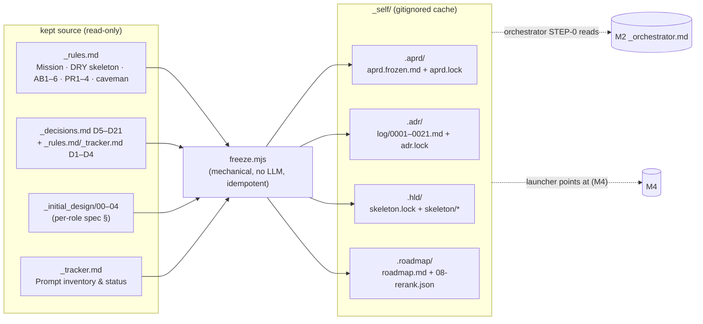

# M3 — Freeze the workspace (`_self/`) — tasks

> Migration phase M3 (migration-spec §6). Goal: D-3 — the **freeze tool** + the frozen `_self/` tree. A mechanical (NO-LLM) render of phases 0–3 from the kept source files into the on-disk shape the prompts expect (`_self/{.aprd,.adr,.hld,.roadmap}`), gitignored + rebuildable cache. This is the frozen input the orchestrator (M2) reads at STEP 0 and the launcher (M4) points at. Reversible, additive-only (migration-spec §9). Builds on M2 (`prompts/_orchestrator.md` reads `_self/.roadmap/08-rerank.json`; HEAD `06ccd67`).

## Scope



**`_self/` is a cache, never a source (invariant #5).** It is rendered *from* the kept files. Never hand-edit it; on any source change, re-freeze. The freeze is byte-stable given unchanged sources (idempotent — D20 / spec §9).

## Source → `_self/` mapping (migration-spec §6 M3 step 1; usage §A1 Step 3)

| Source (kept) | `_self/` target | Render |
|---|---|---|
| `_rules.md` Mission + source-specs tables + `_initial_design/00–04` | `.aprd/aprd.frozen.md` + `.aprd/aprd.lock` | the WHAT of the self-host deliverable: build the agentic delivery prompt set |
| `_decisions.md` D5–D21 + D1–D4 (conventions, `_rules.md`/`_tracker.md`) **incl. stack ADR D21** | `.adr/log/<NNNN>.md` (0001–0021) + `.adr/adr.lock` | one ADR log per decision; D21 → `ADR-0021` (next free id, monotonic) |
| `_rules.md` DRY skeleton + caveman + PR1–4 + AB1–6 + source-specs/build-order | `.hld/skeleton.lock` + `.hld/skeleton/*` + `.hld/skeleton.frozen.md` | the deliverable's design skeleton: prompt scaffold + coding canon + role components + phase build-DAG + producer/consumer contracts |
| `_tracker.md` Prompt inventory & status | `.roadmap/roadmap.md` + `.roadmap/08-rerank.json` | `remaining_sequence` = the unshipped prompts (RECONCILE/CRITIQUE increment first), each with a `done_sentinel` |

## Tasks

| # | Task | Acceptance | Status |
|---|---|---|---|
| T0 | Confirm M2 baseline; M3 adds files only (no spine edit, no shipped-prompt overwrite); `_self/` gitignored | only new: `_self-host-migration/{freeze.mjs,freeze-check.mjs,M3-tasks.md}`, `.gitignore` (+`_self/`); `_self/` itself untracked-ignored | ☑ |
| T1 | Build the freeze tool `freeze.mjs` — mechanical, **no LLM**, deterministic | runs to completion; emits `_self/{.aprd,.adr,.hld,.roadmap}` (33 files); reads only kept sources | ☑ |
| T2 | Render `.aprd/` (aprd.frozen.md + aprd.lock) from Mission + specs | frozen + lock present; lock schema == fixture `aprd.lock`; sha256 matches frozen.md | ☑ |
| T3 | Render `.adr/` (log/0001–0021 + adr.lock) from D1–D21 incl. ADR-0021 stack ADR | 21 log files; adr.lock `adrs[]` count 21; ADR-0021 = D21 stack pin (`stack: agentic-delivery-pipeline`); every log_ref resolves | ☑ |
| T4 | Render `.hld/` (skeleton.lock + skeleton/*) from DRY skeleton + AB/PR + canon | skeleton.lock + skeleton/{prompt-skeleton.md,coding-canon.md,components.json,build-dag.json,contracts.json} + skeleton.frozen.md; 39 roles; every artifact ref resolves | ☑ |
| T5 | Render `.roadmap/` (roadmap.md + 08-rerank.json) from tracker inventory | 08-rerank.json: 1 completed (DERIVE-TESTS inc) + 9 remaining (RECONCILE/CRITIQUE inc first); each entry has `done_sentinel`+`unit`+`id` | ☑ |
| T6 | Gitignore `_self/` (like `_test_bench`) | `.gitignore` has `_self/`; `git check-ignore _self/` → ignored (`!!`) | ☑ |
| T7 | **Acceptance 1** — every `_self/` file validates against the schema its consuming prompt reads | validator green: all JSON parses; locks carry required keys; sentinels resolve; 08-rerank carries orchestrator STEP-0 fields | ☑ |
| T8 | **Acceptance 2** — re-running the freeze is idempotent (byte-stable) | freeze twice → 33-file set identical, all bytes equal (fixed FREEZE_DATE; sha over content) | ☑ |
| T9 | **Acceptance 3** — `prompts/*` + `_fixtures/*` recognized as built-skeleton + oracle baseline | completed sentinel resolves to real `_fixtures/` golden; all 10 `unit`s + 39 components resolve to real `prompts/` files; frontier sentinel absent | ☑ |
| T10 | **Acceptance 4 (bonus, proves consumable)** — orchestrator STEP-0/1 clean-room on the REAL frozen `_self/` names RECONCILE/CRITIQUE increment, writes nothing | step-runner dry-run → named `P-RECONCILE-CRITIQUE-INC` (1/10 shipped); pre/post md5 of `_self/` identical | ☑ PASS |

## M3 acceptance (spec §6) — MET

- [x] every file under `_self/` validates against the schema its consuming prompt reads — T7 (`freeze-check.mjs` [1], 24/24 green)
- [x] re-running the freeze is idempotent (byte-stable given unchanged sources) — T8 (`freeze-check.mjs` [2], 33 files byte-identical)
- [x] `prompts/*` and `_fixtures/*` are recognized as the built-skeleton + oracle baseline — T9 (`freeze-check.mjs` [3])

## Done-checklist lines (spec §11)

```
M3 [x] freeze tool renders _self/{.aprd,.adr,.hld,.roadmap}; validates; idempotent; gitignored
```

## Results

### Tooling

- **`freeze.mjs`** — the freeze tool. Mechanical, **no LLM**, deterministic. Reads kept sources (`_rules.md`, `_decisions.md`, `_tracker.md`, `_initial_design/00–04`, `prompts/`), renders `_self/{.aprd,.adr,.hld,.roadmap}`. `_self/` fully re-rendered each run (it is a cache, invariant #5 — full re-render is what makes the run byte-stable). Byte-stability: fixed `FREEZE_DATE`, sorted iteration, `content_sha256` computed over rendered content. Re-run freely (`node _self-host-migration/freeze.mjs`).
- **`freeze-check.mjs`** — the M3 acceptance validator (`node _self-host-migration/freeze-check.mjs`). 24 checks across the 3 spec gates. **ALL GREEN — 24 pass / 0 fail.**

### The frozen tree (33 files)

- **`.aprd/`** — `aprd.frozen.md` (the WHAT: build the agentic-delivery prompt set; Mission + source specs verbatim from `_rules.md`) + `aprd.lock` (sha256 over frozen.md).
- **`.adr/`** — `log/0001–0021.md` (one ADR per decision: D1–D4 = foundational conventions from `_rules.md`/`_tracker.md` index; D5–D21 bodies from `_decisions.md`) + `adr.lock` (`adr_count: 21`, `stack_adr: ADR-0021`). **ADR-0021** carries `stack: agentic-delivery-pipeline` (the D21 stack pin frozen, per spec §6 + M1).
- **`.hld/`** — `skeleton.lock` + `skeleton.frozen.md` + `skeleton/{prompt-skeleton.md (DRY scaffold, D10), coding-canon.md (caveman + PR1–4 + AB1–6), components.json (39 roles / 5 phases, scanned from prompts/), build-dag.json (phase order 0→4), contracts.json (PR2 chain)}`.
- **`.roadmap/`** — `roadmap.md` + `08-rerank.json` (self-host repurposing of the RE-RANK 08 schema, D21; rendered from `_tracker.md` inventory: 1 completed `P-DERIVE-TESTS-INC` + 9 remaining, `P-RECONCILE-CRITIQUE-INC` first; each entry carries a `done_sentinel`).

### T10 — clean-room consumability run (the freeze is real, not mocked)

- M2 wired the orchestrator against a **mock** `_self/`. M3 ran the same STEP-0/STEP-1 status logic clean-room (step-runner, no orchestrator context) against the **REAL frozen `_self/`**, project root `/workspace`.
- **Result:** named next = **`P-RECONCILE-CRITIQUE-INC`** (RECONCILE/CRITIQUE increment, unit `prompts/03-hld/RECONCILE-CRITIQUE.md`), tally **1/10 shipped** — derived purely from the sentinel scan (completed `test-specs.json` PRESENT; frontier `reconcile.json` ABSENT). Wrote nothing: pre/post md5 of `_self/` byte-identical.
- This closes the M2 "mocked, not real" scope note: the freeze output is consumed correctly by the M2 orchestrator and names the same frontier. M4 (launcher) now has a real `_self/` to point at.

## Spec deviation (logged)

- **NO COMMIT** (task rule). Deliverables sit uncommitted on HEAD `06ccd67`: `.gitignore` (+`_self/`, modified-tracked) + new `_self-host-migration/{freeze.mjs,freeze-check.mjs,M3-tasks.md}`. `_self/` itself is gitignored (rebuildable cache, spec §6 + §9) — never committed by design; recreate with `node _self-host-migration/freeze.mjs`.
- migration-spec §6 M3 step 1 lists the source→target mapping; `freeze.mjs` follows it. Two faithful adaptations, not deviations: (a) the freeze re-renders the whole `_self/` per run rather than diffing — correct for a cache and required for byte-stability; (b) `_self/.adr/` numbering continues from the live `_decisions.md` D-set (D→ADR-000D), so `ADR-0021` = D21 — matches M1's note that the self-host `.adr/` numbering continues from `_decisions.md`, not from the greenfield fixture's `adr.lock` max (ADR-0006).

> Owed to later phases (not M3): point the launcher (`/self-host` skill · `selfhost` agent) at this real `_self/` + target `code-canon/agentic-delivery-pipeline.md`, confirm RE-RANK names the RECONCILE/CRITIQUE increment without re-running phases 0–3 (M4); first net-new self-build authored + verified through the loop (M5).
