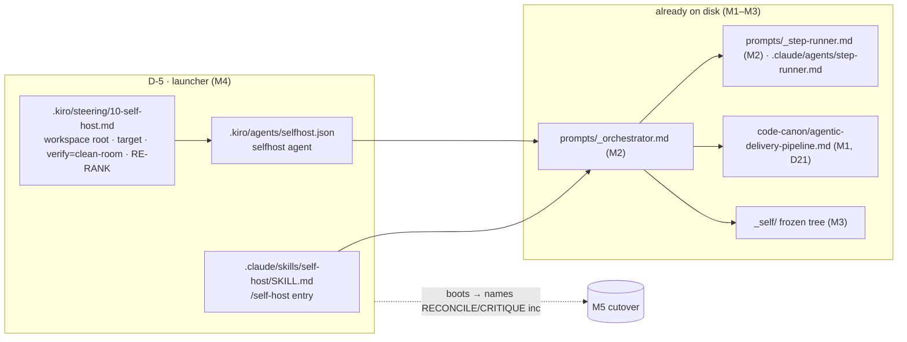

# M4 — Wire the launcher — tasks

> Migration phase M4 (migration-spec §6). Goal: D-5 — the **launcher**, scoped to `_self/` + the agentic-delivery-pipeline target, that boots the M2 orchestrator over the M3 frozen tree and names the next unshipped prompt without re-running phases 0–3. Claude: `.claude/skills/self-host/SKILL.md`. Kiro: `.kiro/agents/selfhost.json` + `.kiro/steering/10-self-host.md`. Reversible, additive-only (migration-spec §9). Builds on M3 (real frozen `_self/`; HEAD `c4dbe81`). Last reversible setup phase before the M5 one-way cutover.

## Scope



**The launcher is thin (the point).** It adds no logic — it *binds scope* (workspace root `_self/`, deliverable target `code-canon/agentic-delivery-pipeline.md`) and *hands off* to the M2 orchestrator. All control logic already lives in `prompts/_orchestrator.md`; M4 just makes it bootable from `/self-host` (Claude) and `--agent selfhost` (Kiro). Set the orchestrator **Opus through the parity gate** (external judge), Sonnet after.

## Tasks

| # | Task | Acceptance | Status |
|---|---|---|---|
| T0 | Confirm M3 baseline; M4 adds files only (no spine edit, no shipped-prompt overwrite, no `_self/` hand-edit) | only new: `.claude/skills/self-host/SKILL.md`, `.kiro/agents/selfhost.json`, `.kiro/steering/{00-exclusive,10-self-host}.md`, `.kiro/agents/step.json`, this file | ☑ |
| T1 | Claude launcher `.claude/skills/self-host/SKILL.md` (verbatim shape, usage §A1 Step 5) | frontmatter (name/description/argument-hint) + body: run orchestrator, root `_self/`, target the profile, RE-RANK picks, verify clean-room, pause at gate | ☑ |
| T2 | Kiro orchestrator agent `.kiro/agents/selfhost.json` (usage §B4) | lean context (steering only, role prompts lazy-loaded); `prompt`→`_orchestrator.md`; Opus-through-gate note | ☑ |
| T3 | Kiro steering `.kiro/steering/10-self-host.md` (usage §B5) | declares workspace root `_self/`, target, verify=clean-room NOT pytest, RE-RANK + derived state, no tracker | ☑ |
| T4 | Set orchestrator model = **Opus through the parity gate**, Sonnet after (usage §A1 Step 6) | encoded in SKILL note + selfhost.json `_model_note` + orchestrator Role/Model block (M2) | ☑ |
| T5 | **Acceptance** — launching in `agentic-systems/` boots the orchestrator, it reads the frozen `_self/`, RE-RANK names the **RECONCILE/CRITIQUE increment** — without re-running phases 0–3 | clean-room boot of `/self-host status` → named `P-RECONCILE-CRITIQUE-INC`; zero writes; no phase 0–3 re-run | ☑ PASS |

## T1–T3 — launcher binds scope, hands to the orchestrator

| Surface | File | Binds | Hands to |
|---|---|---|---|
| Claude Code | `.claude/skills/self-host/SKILL.md` | root `_self/`, target `code-canon/agentic-delivery-pipeline.md`, `$ARGUMENTS`→mode (empty/`status`/`<ROLE>`) | `prompts/_orchestrator.md` |
| Kiro | `.kiro/agents/selfhost.json` + `.kiro/steering/10-self-host.md` | same root + target via steering; lean context (steering-only resources) | `prompts/_orchestrator.md`; executor = generic `step.json` (reused) |

Both surfaces point at the **same** orchestrator + `_self/` + target + parity gate — only the entry surface differs (usage §C "Claude Code or Kiro — does the self-build differ? No"). Mode arg threads straight to the orchestrator MODES block (M2): empty → full build STEP 0→6; `status` → STEP 0+1 dry-run; `<ROLE>` → STEP 1 override.

## T4 — model gate

Orchestrator = **Opus through the parity gate** (the external judge — the system does not yet grade its own grading; usage §A1 Step 6, workflow §7), **Sonnet after** parity clears. Encoded three places, no contradiction: SKILL.md closing line, `selfhost.json._model_note` (Sonnet default + "run Opus through M5"), and the orchestrator Role/Model block (M2). The generic `step.json` clean-room executor stays Sonnet/High (the runner is judged by the verifier, not self-grading — invariant #3).

## T5 — acceptance run (launcher boots, names next)

- **Setup.** Pre-snapshot md5 of `_self/` + `prompts/` (74 files). Confirmed launcher targets all present: `prompts/_orchestrator.md` (M2), `code-canon/agentic-delivery-pipeline.md` (M1), `_self/.roadmap/08-rerank.json` (M3).
- **Run.** `step-runner` (clean room, Sonnet/High), repo root `/workspace`, given the **`/self-host status` invocation** as a fresh operator would trigger it: the SKILL.md launcher body verbatim + `$ARGUMENTS=status`. The runner followed the launcher → loaded `prompts/_orchestrator.md`, bound root `_self/` + target, ran orchestrator STEP 0 (derive state) + STEP 1 (RE-RANK) in status mode.
- **Result — booted from frozen `_self/`.** Read `_self/.roadmap/08-rerank.json` (+ oriented over the `_self/` tree); did NOT regenerate `.aprd/.adr/.hld` — phases 0–3 untouched.
- **Result — named correctly.** Sentinel scan: completed `P-DERIVE-TESTS-INC` (`test-specs.json` present); frontier sentinel `_fixtures/greenfield-clean/.hld/slices/S4/reconcile.json` **absent** → next = **`P-RECONCILE-CRITIQUE-INC`** (unit `prompts/03-hld/RECONCILE-CRITIQUE.md (increment)`). Tally **1 shipped / 9 remaining** — purely derived from disk.
- **Result — zero writes / no phase re-run.** Post-snapshot md5 of `_self/` + `prompts/` **byte-identical** to pre (74 files unchanged). No bookkeeping file written (`_tracker.md`/`_changelog.md` are pre-existing hand-loop files retired at M6 — not touched by the launcher).
- **Verdict: PASS.** The launcher boots the orchestrator over the real frozen `_self/` and names the RECONCILE/CRITIQUE increment as the next prompt, without re-running phases 0–3 and without writing anything.

## Generic-deploy prereqs materialized (NOT a deviation — additive, logged)

- D-5 names only the two self-host Kiro files (`selfhost.json` + `10-self-host.md`); `00-exclusive.md` and `step.json` are **generic Kiro deploy** prerequisites (usage §B1, generic guide §B4–B5). No generic Kiro deploy was materialized in this repo (only the Claude side exists: `.claude/agents/step-runner.md`, `prompts/`). So `selfhost.json`'s steering glob + the reused executor would reference missing files.
- **Resolution:** materialized the two generic Kiro prereqs (`.kiro/steering/00-exclusive.md`, `.kiro/agents/step.json`) so the Kiro launcher boots against real files, not dangling refs. Additive-only, reversible (delete `.kiro/` → back at M3 baseline). Their content is the generic-guide verbatim shape; `00-exclusive.md` gains one self-host line pointing at `10-self-host.md`. The **load-bearing** M4 acceptance (T5) runs the **Claude** path, which the spec names as the M4 launcher gate (`/self-host`); the Kiro files are wired + JSON-valid but their full boot needs the generic Kiro runtime the operator supplies.

## Spec deviation (logged)

- **NO COMMIT** (task rule). Deliverables sit uncommitted on HEAD `c4dbe81`: new untracked `.claude/skills/` + `.kiro/`. No tracked file edited (`.gitignore` unchanged — launcher files are committed surfaces, not cache, so NOT gitignored, unlike `_self/`).
- migration-spec §6 M4 step 3 *"Set the orchestrator to Opus through the parity gate, Sonnet after"* — encoded as launcher config notes, not a model switch executed now (the orchestrator only runs live at M5). T4.

## M4 acceptance (spec §6) — MET

- [x] launching in `agentic-systems/` boots the orchestrator — T5 (launcher → `prompts/_orchestrator.md`)
- [x] it reads the frozen `_self/` — T5 (read `_self/.roadmap/08-rerank.json`, no phase 0–3 re-run)
- [x] RE-RANK names **the RECONCILE/CRITIQUE increment** as the next prompt — T5 (`P-RECONCILE-CRITIQUE-INC`)
- [x] without re-running phases 0–3 — T5 (`_self/` byte-identical pre/post; zero writes)

## Done-checklist lines (spec §11)

```
M4 [x] launcher boots (/self-host · selfhost); RE-RANK names RECONCILE/CRITIQUE increment
```

> Owed to later phases (not M4): **M5** — the one-way cutover. Boot the launcher for real (`/self-host`, Opus): M5a parity A/B on a twin-bearing prompt (value + parity + both-directions discrimination), then M5b first net-new self-build (RECONCILE/CRITIQUE increment) authored → clean-room verified → promoted to `prompts/`. M5 is irreversible — M0–M4 only added files; M5 retires the hand loop. Do NOT enter M5 until the operator gates it.
