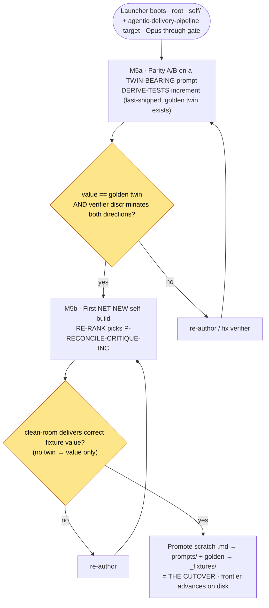

# M5 — The cutover proof (parity gate) — tasks

> Migration phase M5 (migration-spec §6 + §7). **The one-way gate** — where the hand loop is actually replaced. Two beats: **M5a** parity A/B dry-run on a twin-bearing shipped prompt (value + parity + both-directions discrimination), then **M5b** the first net-new self-build (RE-RANK picks the RECONCILE/CRITIQUE increment, authored → clean-room verified → promoted). The promotion IS the cutover: the first prompt shipped by the pipeline, not the hand. Builds on M4 (launcher boots, names `P-RECONCILE-CRITIQUE-INC`; HEAD `fcca7c3`). **Irreversible** — M0–M4 only added files; M5 promotes a self-build into the shipped library. Gated, not committed-blind: nothing ships until the value/parity gate accepts (migration-spec §9).

## Scope



**Why split (migration-spec §7 reconciliation).** The North Star names the RECONCILE/CRITIQUE increment as BOTH the first self-build and the parity proof — but that increment is the next-unshipped, so it has **no hand-built twin** to compare against. M5 resolves this honestly: parity A/B runs on a prompt that DOES have a golden twin (DERIVE-TESTS increment, last-shipped, M0 proof-twin); the net-new RECONCILE/CRITIQUE increment is judged on **value only** (the bar the North Star already states — parity is a convenience cross-check, not the gate).

## Tasks

| # | Task | Acceptance | Status |
|---|---|---|---|
| T0 | Confirm M4 baseline; gitignored scratch dir for self-authored prompts (never overwrite shipped in place — invariant #2) | `_self-host-scratch/` created + gitignored; M5 adds only scratch (ignored) + 1 prompt edit + 1 golden on promote | ☑ |
| T1 | **M5a known-good** — clean-room run the twin-bearing DERIVE-TESTS increment into the bench, verify value-parity vs golden twin | step-runner (Sonnet/High) → `S4/test-specs.json`; all value-bearing fields == golden (`_fixtures/greenfield-clean/.hld/slices/S4/test-specs.json`); prose-only variance benign | ☑ PASS |
| T2 | **M5a both-directions** — confirm the verifier discriminates (known-good PASS + planted-defect FAIL) | known-good artifact → verifier PASS; two planted-defect copies (wrong AC; dropped inherited test) → verifier FAIL | ☑ PASS |
| T3 | **M5b author** — IMPLEMENT authors the RECONCILE/CRITIQUE **increment pass** (the net-new self-build) into scratch | dual-mode `RECONCILE-CRITIQUE.md`: MODE DISPATCH + PART A (skeleton, preserved) + PART B (increment → `reconcile.json`, §5.10 7 checks + the H14 skeleton-fidelity 8th); build idiom = HLD-increment contract + per-role spec § (D21 field 5) | ☑ |
| T4 | **M5b verify (value)** — clean-room run the scratch prompt; auto-selects S4, emits `reconcile.json`, judged on value (no twin) | step-runner → `S4/reconcile.json` verdict `clean`, 0 issues, skeleton-fidelity `extends-not-redraws`; 20/20 schema+value checks (separate verifier) | ☑ PASS |
| T5 | **M5b both-directions** — prove the authored gate re-derives (not a rubber stamp): clean slice PASS + planted-defect slice BLOCKED | D1 coverage-gap (hidden, self-report clean) → `blocked`/R10; D2 skeleton-fidelity (hidden frozen-C1 redraw) → `blocked`/C1 — both re-derived from primary fields, ignoring the clean self-report | ☑ PASS |
| T6 | **Promote (the cutover)** — atomically move scratch `.md` → `prompts/03-hld/RECONCILE-CRITIQUE.md` + golden → `_fixtures/` | prompt now dual-mode (125→264 lines); `reconcile.json` golden present; no bookkeeping written (no tracker/changelog) | ☑ |
| T7 | **Acceptance** — re-derive launcher status; frontier advanced on disk (cutover landed) | `/self-host status` → **2 shipped / 8 remaining**, next = `P-BUILD-PLAN-SLICE` (was 1/9, `P-RECONCILE-CRITIQUE-INC`); advance is purely disk-derived | ☑ PASS |

## T1/T2 — M5a parity A/B (twin-bearing DERIVE-TESTS increment)

- **Setup.** Seeded `_test_bench` = full `greenfield-clean` MINUS the target output `S4/test-specs.json` (disk as it stood right before the DERIVE-TESTS increment ran — frozen skeleton + rerank present → increment dispatch).
- **Known-good run.** `step-runner` (clean room, Sonnet/High), given `prompts/03-hld/DERIVE-TESTS.md` verbatim + root `_test_bench`. Dispatched INCREMENT, auto-selected S4, wrote `S4/test-specs.json` (flow test T-F4 asserting AC6 + 3 inherited frozen contract tests T-CT2/T-CT3/T-CT9 by reference; no re-authoring).
- **Verify vs golden twin** (separate deterministic value-judge). **All value-bearing fields MATCH** (mode/slice_id/class, flow_tests id/target/path/via/asserts_ac/exercises/traces, inherited targets, new_contract_tests `[]`, skeleton_fidelity, coverage, test_counts, all defect blocks `[]`). One prose field (`happy_path.assertion`) differs in wording only; `failure_path.expected_terminal_state` byte-identical. **Value primary, behavior over byte-equality (§7) → PASS.**
- **Both-directions discrimination.** Known-good artifact → verifier **PASS**. Two planted-defect copies (`asserts_ac` AC6→AC4; a dropped inherited T-CT9) → verifier **FAIL** both. The verifier discriminates — it is not a rubber stamp (the §7 load-bearing check: "if it can't tell them apart, the verifier is broken").
- **Notable finding (robustness, logged).** Two attempts to inject the defect into the PROMPT (over-inclusion of contract tests; hardcoded wrong AC) were **healed by the clean-room runner** — Sonnet grounded in the slice flow's real `traces` and the frozen contracts on disk and emitted the correct artifact anyway. The harness's runner is robust against prompt-level corruption that contradicts disk truth. The discrimination claim is therefore proven at the **verifier/oracle** layer (a planted-defect artifact copy reliably FAILs), which is exactly the layer §7 names ("the verifier discriminates"). The known-good prompt's clean-room output matching the golden twin is the parity evidence; the verifier-discrimination is the both-directions evidence.

## T3 — M5b author (the net-new increment pass)

RECONCILE-CRITIQUE shipped as **skeleton-pass only** (its frontmatter said the increment pass "needs a frozen skeleton to extend — not authored"; the frozen-skeleton case HALTed as "the increment-mode trigger"). M5b authored that increment pass — the genuine next-unshipped, named by RE-RANK as `P-RECONCILE-CRITIQUE-INC`.

- **Build idiom (D21 field 5).** Synthesized from the HLD-increment contract + the per-role spec §: §5.10 (the seven adversarial checks) + H14 (the slice extends, never redraws, the frozen skeleton) + the D14 dual-mode pattern (one role, two modes, dispatched on `skeleton.lock`) modeled on the sibling DERIVE-TESTS Part A/B.
- **Shape.** `MODE DISPATCH` (read `skeleton.lock`) → **PART A** (skeleton pass — the existing content, preserved verbatim) + **PART B** (increment pass — per-slice adversarial gate, output `.hld/slices/<id>/reconcile.json`). PART B keeps the seven categories re-scoped to the slice and adds the **eighth, increment-only category `skeleton-fidelity`** (H14): a frozen C*/CT*/E*/NFR/T-CT* the slice redrew/reshaped/re-owned/re-disposed/re-authored, or a re-emitted build DAG. Same load-bearing **re-derive-from-primary-fields** discipline (never trust a producer's `verdict`/`coverage` self-report) carried into the slice + the fidelity baseline.
- Authored into `_self-host-scratch/RECONCILE-CRITIQUE.md` (scratch — never written over the shipped file; invariant #2 / profile "outputs are promoted, never written in place").

## T4/T5 — M5b verify (value-only, both directions)

- **Known-good (value).** Seeded `_test_bench` = full `greenfield-clean` (frozen skeleton + all six S4 increment artifacts; `reconcile.json` absent → auto-select S4). `step-runner` ran the scratch prompt verbatim → dispatched INCREMENT, auto-selected S4, emitted `S4/reconcile.json`: **verdict `clean`, 0 issues, skeleton-fidelity `extends-not-redraws`**. The correct outcome — every S4 increment artifact is clean. Separate verifier: **20/20** (valid JSON; mode/slice/class; verdict deterministic-from-issues; 8 category keys all 0 + sum to issue_count; skeleton-fidelity arrays empty + DAG false; 7 artifacts_reviewed; all slice/oracle refs resolve). **Value correct → ACCEPT** (no twin → value only, migration-spec §7 M5b).
- **Both directions (the gate is real, not a rubber stamp).** Two HIDDEN defects planted in `_test_bench` slice artifacts (self-report left clean — the dirty-primary/clean-summary trap the prompt's load-bearing discipline targets):
  - **D1 `coverage-gap`** — dropped R10 from `C3.realizes_slice_requirements` while `slice_coverage.requirement_orphans` stayed `[]`. Self-build re-derived the UNION from the primary array → R10 orphan → **`blocked` / coverage-gap / R10**.
  - **D2 `skeleton-fidelity`** — marked frozen C1 (built in S1) `role:"introduced" fleshed_this_slice:true` while `skeleton_fidelity.redrawn_components` stayed `[]`. Self-build cross-checked the slice's frozen-id carries against the frozen skeleton baseline (+ rerank introduction map) → frozen-component redraw → **`blocked` / skeleton-fidelity / C1**.
  - Both blocked correctly, recomputed from primary fields, ignoring the clean self-report → the authored increment-pass discriminates a sound slice from a defective one **and** the genuinely-new H14 category works.

## T6/T7 — Promote = the cutover; frontier advances on disk

- **Promote (atomic, temp+rename — D20 guarantee 2).** Scratch dual-mode `RECONCILE-CRITIQUE.md` → `prompts/03-hld/RECONCILE-CRITIQUE.md` (125→264 lines; PART A preserved, PART B + MODE DISPATCH added). Canonical clean `reconcile.json` (re-generated on a clean seed, 9/9 re-validated) → `_fixtures/greenfield-clean/.hld/slices/S4/reconcile.json`. **This promotion IS the cutover** — the first prompt shipped by the pipeline instead of the hand. **No bookkeeping written** (no `_tracker.md` pointer, no `_changelog.md` append — "shipped" = the freeze on disk + git; migration-spec §8).
- **Acceptance — derived state advanced.** Re-ran `/self-host status` clean-room over the real repo (orchestrator STEP 0/1, read-only). Before cutover (M4): **1 shipped / 9 remaining**, frontier `P-RECONCILE-CRITIQUE-INC`. After: **2 shipped / 8 remaining**, frontier **`P-BUILD-PLAN-SLICE`** — decided purely by disk (`reconcile.json` sentinel now PRESENT + the dual-mode section present in the prompt; the next sentinel `build-plan.json` ABSENT). The pipeline shipped its own next prompt and the loop advanced, with zero writes from the status scan.

## M5 acceptance (spec §6 + §7 + §11) — MET

- [x] **M5a** parity A/B on a twin-bearing prompt clears — value (== golden twin) + parity (behavior over byte-equality) + both directions (verifier discriminates) — T1, T2
- [x] **M5b** first net-new self-build (RECONCILE/CRITIQUE increment) authored → clean-room verified (value only) → promoted to `prompts/` — T3, T4, T6
- [x] the cutover landed: the self-build's golden is on disk and the launcher's derived state advances past it without any bookkeeping — T7

## Done-checklist lines (spec §11)

```
M5 [x] parity A/B on a twin-bearing prompt clears (value + parity + both directions)
   [x] first net-new self-build (RECONCILE/CRITIQUE increment) promoted to prompts/
```

## Spec deviation (logged)

- **NO COMMIT** (task rule). M5 working-tree delta on HEAD `fcca7c3`: `.gitignore` (+`_self-host-scratch/`, modified-tracked), `prompts/03-hld/RECONCILE-CRITIQUE.md` (modified — the cutover ship), new `_fixtures/greenfield-clean/.hld/slices/S4/reconcile.json` (the self-build golden), new `_self-host-migration/M5-tasks.md`. `_self-host-scratch/` + `_test_bench/` gitignored (scratch/bench, recreate freely). `_self/` untouched (33-file cache).
- **Model gate.** Orchestrator-in-judge-seat ran as **Opus through this gate** (external judge; usage §A1 Step 6); the clean-room runners + verifier ran the Sonnet/High `step-runner` (the runtime target — the system is tested on Sonnet; invariant #3). Drop orchestrator Opus→Sonnet is M6's step (post-parity), not M5's.
- **§7 reconciliation realized.** The split (parity A/B on a twin-bearing prompt; net-new judged on value) played out exactly as the spec anticipated. Folding this nuance back into usage §C1 / workflow §7 so the North Star matches what happened is owed to a later doc pass (migration-spec §7 note), not M5.

## M5 is the one-way gate — what it unlocks

> Owed to later phases (not M5): **M6** — decommission the hand loop, now that the cutover cleared and the loop is observed to advance. Retire `_prompt-run.md` / `_tracker.md` / `_changelog.md` (state is derived — T7 proved it); relocate the decision index alongside `_decisions.md`; drop the orchestrator Opus→Sonnet. **Precondition met:** M5 cleared. Then the **canonicalization & cleanup band** (M7 canonicalize trees → M8 retire freeze/cache → M9 purge strays+vocab → M10 relocate docs → M11 caveman-normalize + drop the migration dir), and finally **M12** — structural-conformance + a second canon profile through the unchanged spine (deliverable-agnosticism). The loop can meanwhile drain the remaining 8 Phase-4 slice-build modes (`P-BUILD-PLAN-SLICE` first) with the operator spot-checking at the gate.
