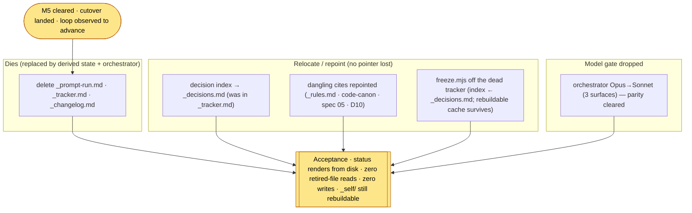

# M6 — Decommission the hand loop — tasks

> Migration phase M6 (migration-spec §6 + §8). **Precondition: M5 cleared** (the cutover landed — the pipeline shipped its own `RECONCILE/CRITIQUE` increment; HEAD `ba6dece`). M6 retires the hand-authoring control surfaces now that derived-from-disk state is proven to advance: delete `_prompt-run.md` / `_tracker.md` / `_changelog.md` (**delete, do not port** — porting re-introduces the drift they caused), relocate the decision index alongside `_decisions.md` so no decision pointer is lost, and drop the orchestrator Opus→Sonnet now that the loop is trusted. **The point of no return** (migration-spec §9): the retired files are recoverable from HEAD/the `pre-self-host` tag, but the intent is they are gone for good. **No new hand-maintained state file may be introduced** (invariant #4).

## Scope



**What changed vs the bare spec steps.** Spec §6 M6 lists three steps (retire the files, relocate the index, drop the model). Executing them surfaced two dependencies the spec's invariants demand but the step list under-specifies: (a) several **kept** assets cite the dying files (would dangle), and (b) the **freeze tool** read `_tracker.md` — so deleting the tracker would break re-freeze, violating invariant #5 (`_self/` is a rebuildable cache). M6 repoints both. The decision index's new home (`_decisions.md`) is also the freeze tool's new source for D1–D4 provenance.

## Tasks

| # | Task | Acceptance | Status |
|---|---|---|---|
| T0 | Confirm M5 precondition; the three hand-loop files are tracked at HEAD (recoverable after delete) | M5 cleared (`M5-tasks.md`); `_prompt-run.md`/`_tracker.md`/`_changelog.md` all `git ls-files`-tracked at `ba6dece` → recoverable; no commit | ☑ |
| T1 | **Relocate the decision index** into `_decisions.md` **before** the tracker dies (no decision pointer lost — migration-spec §6 M6 step 2, risk-table "decision index orphaned") | D1–D21 index section added to `_decisions.md` (D1–D4 → `_rules.md` Conventions; D5–D21 → bodies below); stale title `(D5–D17)` → `(D1–D21)`; header "new fork → add index line in `_tracker.md`" repointed to this file | ☑ |
| T2 | **Drop orchestrator Opus→Sonnet** (loop trusted post-parity — migration-spec §6 M6 step 3) | `prompts/_orchestrator.md` Model block, `.claude/skills/self-host/SKILL.md` closing line, `.kiro/agents/selfhost.json` `_model_note` all say Sonnet (bootstrap retired); `selfhost.json.model` already `claude-sonnet-4` | ☑ |
| T3 | **Repoint dangling cites** in kept assets (a dead reference in a live file is a defect) | `_rules.md` ("pointer in `_tracker.md`"), `code-canon/agentic-delivery-pipeline.md` (verify-harness lists `_prompt-run.md`), `_initial_design/05` ("per `_tracker.md` build order"), `_decisions.md` D10 body (re-test "via `_prompt-run.md`") all repointed; D20 cite already clean (→ `self-host-workflow.md §10`) | ☑ |
| T4 | **Delete the hand loop** (delete, not port — migration-spec §6 M6 step 1 / §8) | `rm _prompt-run.md _tracker.md _changelog.md`; `git status` shows 3 `D`; files gone from working tree, recoverable from `ba6dece` | ☑ |
| T5 | **Keep `_self/` rebuildable** — repoint `freeze.mjs` off the dead `_tracker.md` (invariant #5; §9 freeze idempotent) | `freeze.mjs` no longer reads `_tracker.md` (the var was read-but-unused; only the `read()` would throw); D1–D4 provenance + roadmap `_note` repointed to `_decisions.md` / derived-frontier; `freeze-check.mjs` stale "frontier absent" assertion updated to the post-cutover derived-frontier invariant | ☑ |
| T6 | **Acceptance** — re-freeze + validate, then clean-room `/self-host status` renders from disk with zero retired-file reads + zero writes | `freeze.mjs` re-runs clean (no tracker) → `freeze-check.mjs` **ALL GREEN 25/0** (idempotent, validates, live frontier derived = `P-BUILD-PLAN-SLICE`); clean-room orchestrator status → **2 shipped / 8 remaining**, next `P-BUILD-PLAN-SLICE`, retired files absent + unread, `_self/`+`prompts/` byte-identical pre/post | ☑ PASS |

## T1 — decision index relocation (the orphan risk)

The index (`D1–D21` lines + the D1–D4→`_rules.md` pointer) rode in `_tracker.md` "Decision index". Deleting the tracker without relocating it orphans every decision pointer (migration-spec §10 risk row). Moved verbatim into a new **`## Decision index`** section at the top of `_decisions.md` (the file that already holds the D5–D21 bodies) — the index and the bodies now share one home. Header note updated: a new fork now appends a body **and** an index line **here** (no tracker to update). The stale file title `Open Decisions log (D5–D17)` (the bodies run to D21) corrected to `Decisions log (D1–D21) — index + bodies`.

## T2 — model gate dropped (Opus→Sonnet)

M4/M5 ran the orchestrator as **Opus through the parity gate** — the external judge guarding against the system grading its own grading (workflow §7). M5 parity cleared and T7 observed the loop advance on disk-derived state, so the bootstrap is over. Dropped in the same three places M4 encoded it (no contradiction left behind):
- `prompts/_orchestrator.md` **Model** block → Sonnet (runtime target, invariant #3); the Opus bootstrap noted as retired.
- `.claude/skills/self-host/SKILL.md` closing line → Sonnet.
- `.kiro/agents/selfhost.json` `_model_note` → Sonnet is now the orchestrator model too; `model` field was already `claude-sonnet-4` (no value change — the note was the only Opus carrier on the Kiro side).

The clean-room runners/verifier were always Sonnet/High (the system is tested on its runtime target) — unchanged.

## T3 — dangling cites repointed (no dead reference in a live file)

A grep of the **kept** assets for the dying filenames found four live cites that would dangle, plus the orchestrator's intentional "retired — do not read" block (kept — it documents the death, load-bearing post-M6):

| File (kept) | Was | Now |
|---|---|---|
| `_rules.md` header | "Pointer lives in `_tracker.md`. Loaded at step 3" | the canon the freeze renders into `_self/.hld`+`.aprd`; re-freeze on edit (invariant #5) |
| `code-canon/agentic-delivery-pipeline.md` (verify mechanism) | harness list incl. `_prompt-run.md` (per-step) | `prompts/_orchestrator.md` STEP 4 (per-step clean-room — replaced the retired hand loop) |
| `_initial_design/05-…spec.md` status | "per `_tracker.md` build order" | "per the roadmap build order (`_self/.roadmap/`; status derived from disk, not a tracker)" |
| `_decisions.md` D10 body | owed re-test "via `_pipeline-run.md` or per-step `_prompt-run.md`" | "or per-step clean-room (orchestrator STEP 4 / `step-runner`; `_prompt-run.md` retired at M6)" |

The `D20` cite was already repointed to `self-host-workflow.md §10` (migration-spec §10, "done") — verified still clean (not pointing at the deleted `_self-host-migration/_self-host-migration.md`).

## T5 — keep `_self/` rebuildable (the freeze-tool dependency the spec under-specifies)

`freeze.mjs` declared `const tracker = read("_tracker.md")` — but the variable was **read-but-never-used** (D1–D4 are a hardcoded `conv[]`; the roadmap `remaining_sequence` is a hardcoded literal). So the tracker contributed **no data** to the freeze; only the `read()` call itself would throw `ENOENT` after T4, breaking re-freeze and violating invariant #5 (`_self/` is a rebuildable cache, re-run freely — §9). Fix:
- removed the dead `read("_tracker.md")`;
- repointed the D1–D4 ADR provenance strings (`source` / body "Indexed in …") from `_tracker.md` → `_decisions.md` Decision index (T1's new home);
- updated the roadmap `_note` + section comments: the frontier order is the declared `remaining_sequence` (base_ref `07-sequence-reviewed`), position is derived from disk sentinels, **never from a tracker**;
- `freeze-check.mjs`: the old assertion *"frontier sentinel (reconcile.json) correctly ABSENT"* was a **stale pre-M5 expectation** — M5's cutover promoted `reconcile.json`. Replaced with the honest post-cutover invariant: `remaining_sequence[0]` (RECONCILE) sentinel is **present** (shipped at M5), and the **live frontier is derived** = first remaining entry whose sentinel is absent = `P-BUILD-PLAN-SLICE`.

Re-running `freeze.mjs` with `_tracker.md` gone produced a clean 33-file `_self/` (the on-disk `_self/` had drifted to a stale 32-file render — missing `prompt-skeleton.md`; the fresh M6 render is the new byte-stable baseline). `_self/` stays gitignored (cache — recreate freely).

## T6 — acceptance run

- **Freeze rebuildable + idempotent (invariant #5, §9).** `node freeze.mjs` (no tracker present) → froze `_self/` (33 files); `node freeze-check.mjs` → **ALL GREEN 25/0**: every `_self/` file schema-valid; `adr.lock` 21 ADRs incl. `ADR-0021`; two back-to-back freezes byte-identical (same 33-file set); **live frontier derived from disk = `P-BUILD-PLAN-SLICE`** (RECONCILE sentinel now present → shipped; build-plan sentinel absent → next).
- **Status renders from disk (the spec's M6 acceptance).** Clean-room `step-runner` (Sonnet/High), repo root `/workspace`, given the `/self-host status` launcher invocation verbatim. It loaded `prompts/_orchestrator.md`, ran STEP 0 (derive) + STEP 1 (RE-RANK) in status mode: **2 shipped / 8 remaining**, next = **`P-BUILD-PLAN-SLICE`** (`prompts/04-build/BUILD-PLAN.md` slice-build). Derivation: scanned `08-rerank.json` + the `done_sentinel` paths on disk; reported `_tracker.md`/`_changelog.md`/`_prompt-run.md` **do not exist and were not read**. **Zero files written** — `_self/`+`prompts/` md5 byte-identical pre/post (`742772d7…`).

## M6 acceptance (spec §6 + §8) — MET

- [x] **no hand-maintained tracker/changelog/run-loop remains** — `_prompt-run.md`/`_tracker.md`/`_changelog.md` deleted; the orchestrator's "do not read/write" block + the repointed freeze tool guarantee none is re-introduced (invariant #4) — T4, T5
- [x] **asking the orchestrator for status renders it from disk** — clean-room status = 2/8, next `P-BUILD-PLAN-SLICE`, derived from sentinels, zero retired-file reads, zero writes — T6
- [x] **decision index relocated** alongside `_decisions.md`; no decision pointer lost — T1
- [x] **orchestrator dropped Opus→Sonnet** (3 surfaces); **D20 cite repointed** — already done, verified — T2, T3
- [x] **`_self/` stays a rebuildable cache** post-tracker — `freeze.mjs` repointed; re-freeze GREEN + idempotent — T5, T6

## Done-checklist lines (spec §11)

```
M6 [x] _prompt-run.md, _tracker.md, _changelog.md retired; decision index relocated
   [x] orchestrator dropped Opus→Sonnet  (D20 cite repointed — done)
```

## Spec deviation (logged)

- **NO COMMIT** (task rule). M6 working-tree delta on HEAD `ba6dece`: deletions `_prompt-run.md` / `_tracker.md` / `_changelog.md` (recoverable from `ba6dece` / the `pre-self-host` tag); edits `_decisions.md` (index relocated + D10 cite), `_rules.md`, `_initial_design/05-…spec.md`, `code-canon/agentic-delivery-pipeline.md`, `prompts/_orchestrator.md` (model), `.claude/skills/self-host/SKILL.md`, `.kiro/agents/selfhost.json`, `_self-host-migration/freeze.mjs` + `freeze-check.mjs`; new `_self-host-migration/M6-tasks.md`. `_self/` re-frozen (gitignored cache, untracked).
- **Beyond the bare three steps (not a deviation — invariant-driven, logged).** Spec §6 M6 lists retire-files / relocate-index / drop-model. T3 (repoint dangling cites in kept files) and T5 (repoint the freeze tool so `_self/` stays rebuildable) are demanded by invariants #4/#5 + §9 but not enumerated as steps; without them the tracker's death would leave dead references in live files and a freeze tool that throws. Additive correctness, no engine edit (invariant #1).
- **Stale `_self/` render found + corrected.** The on-disk `_self/` had drifted to 32 files (missing `prompt-skeleton.md`) — a stale cache, not a source. Re-frozen to the canonical 33-file render. `_self/` is a cache (invariant #5), so this is expected maintenance, not a content change to a source.

## M6 unlocks M7 (owed to the next phase, not M6)

> **M7 — canonicalize the artifact trees** (migration-spec §6 M7). With the hand loop retired and the loop draining on disk-derived state, promote the four phase artifact trees from the rebuildable `_self/` cache to **committed source at the repo root** — `.aprd/ .adr/ .hld/ .roadmap/` — then delete the now-redundant stray markdown (`_decisions.md`, `_rules.md`, `_initial_design/`); add `CLAUDE.md`; move the decision index to `.adr/adr-index.json`. This opens the rest of the canonicalization & cleanup band (M8 retire freeze/cache + engine→root → M9 purge strays/vocab → M10 relocate docs → M11 caveman-normalize the whole tree + drop the migration dir), capped by **M12 — full validation**: structural conformance + a **second canon profile** (`code-canon/terraform.md` or `code-canon/typescript.md`) + its stack ADR run through the **unchanged** spine. If it passes its own verify with zero engine edits, deliverable-agnosticism is proven (the agentic-delivery-pipeline target was not a special case); any forced spine edit = a leak → fix the spine once (P3). The loop can meanwhile drain its remaining 8 Phase-4 slice-build modes (`P-BUILD-PLAN-SLICE` first), the operator only spot-checking at the gate.
