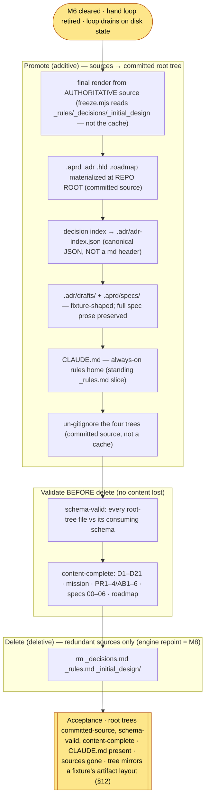

# M7 — Canonicalize the artifact trees — tasks

> Migration phase M7 (migration-spec §6 + §8 + §12). **Precondition: M6 cleared** (hand loop retired; the loop drains on disk-derived state — `M6-tasks.md`). M7 is the core of the user's invariant: **`_decisions` / `_rules` / `_initial_design` must BE the canonical structure, not dynamic-render inputs.** It promotes the four phase artifact trees from the rebuildable `_self/` cache to **committed source at the repo root** — `.aprd/ .adr/ .hld/ .roadmap/` — then deletes the now-redundant stray markdown. The render-from-source machinery (`freeze.mjs`) and the `_self/` cache survive M7 (they die in M8); M7 only flips *where the source of truth lives*. **Reversible** (migration-spec §9): promote-before-delete, content diffed first; every deletion recoverable from the `pre-self-host` tag + git history.

## Scope



**What changed vs the bare spec steps.** Spec §6 M7 lists five steps (materialize / CLAUDE.md / un-gitignore / validate / delete). Executing them surfaced three things the spec's invariants demand but the step list under-specifies:
- **(a) The decision index must move to JSON, and `.adr/` must match the fixture layout.** §12 pins `.adr/` = `log/<NNNN>.md` + `adr.lock` + **`adr-index.json`** + `drafts/`. The freeze rendered only `log/` + `adr.lock`. T2 extends `freeze.mjs` to emit `adr-index.json` (the canonical decision-index home, **not** a markdown header — the user's invariant) + a `drafts/<NNNN>.draft.md` per ADR.
- **(b) The design-spec PROSE must move, not just be referenced.** §6 M7 step 1 + §8 say `_initial_design/00–06` content **moves into** `.aprd/`; the risk-table ("content loss in the M7 promotion") forbids dropping source prose. The frozen aPRD only *names* the specs by filename. T3 lands all seven specs **verbatim** under `.aprd/specs/` (the requirements-source corpus a fixture `.aprd` models) — content diffed byte-identical before any delete.
- **(c) The environment drops freshly-written files.** This sandbox's filesystem was observed to lose recently-written files under rapid rm+rewrite churn (it dropped `*.frozen.md` twice and an ADR log once). T5 hardens the promotion with file-set-parity assertion + straggler re-copy, and the two `*.frozen.md` were re-materialized via the durable harness-tracked writer; T6 is a source-independent root verifier that proves the trees stand on their own.

## Tasks

| # | Task | Acceptance | Status |
|---|---|---|---|
| T0 | Confirm M6 precondition; sources tracked at HEAD (recoverable after delete) | M6 cleared (`M6-tasks.md`); `_decisions.md`/`_rules.md`/`_initial_design/*` `git ls-files`-tracked → recoverable; no commit | ☑ |
| T1 | **Materialize the four trees at the repo root from the authoritative source** — the final render, then promote (migration-spec §6 M7 step 1) | `.aprd/ .adr/ .hld/ .roadmap/` exist at root; rendered from `_rules.md`/`_decisions.md`/`_initial_design` (not the cache — risk-table mitigation); file-set parity vs the fresh `_self/` render | ☑ |
| T2 | **Decision index → `.adr/adr-index.json`** (canonical JSON, not a md header) + `.adr/drafts/` (fixture layout, §12) | `freeze.mjs` extended: `adr-index.json` (21 decisions D1–D21 → ADR-0001..0021, `stack_adr` ADR-0021) + 21 `drafts/<NNNN>.draft.md`; every `draft_ref` resolves | ☑ |
| T3 | **Preserve the design-spec prose** under `.aprd/specs/` (§6 M7 step 1 `00–06 → .aprd/`; no content loss) | 7 design specs (`00`–`06`) land **byte-identical** under `.aprd/specs/`; content-diff vs `_initial_design/*` green before delete | ☑ |
| T4 | **Create `CLAUDE.md`** — always-on rules home (§6 M7 step 2; the generic deploy requires it, repo was missing it) | `CLAUDE.md` present: caveman register + standing conventions + "never overwrite a frozen artifact" + verify-before-done + a where-things-live map. Design-canon slice (skeleton/AB/PR) stayed in `.hld/`/`.aprd/` | ☑ |
| T5 | **Un-gitignore the four trees** + harden the promotion against the fs drop (§6 M7 step 3) | `.gitignore` notes the four trees are committed source (they were never ignored — only `_self/` was); promotion asserts file-set parity + re-copies stragglers; `*.frozen.md` re-materialized durably | ☑ |
| T6 | **Validate parity BEFORE delete** — schema-valid + content-complete (§6 M7 step 4) | `m7-canonicalize.mjs` **ALL GREEN 30/0** (sources present): every root-tree file schema-valid; D1–D21 + mission + PR1–4/AB1–6 + caveman + DRY skeleton + specs 00–06 + 10 roadmap entries all present. `m7-verify-root.mjs` **ALL GREEN 22/0** (source- and cache-independent): lock hashes match their artifacts | ☑ |
| T7 | **Delete the now-redundant sources** (§6 M7 step 5; source-deletion only — engine repoint is M8) | `rm _decisions.md _rules.md`; `rm -rf _initial_design`; `git status` shows the deletions (recoverable from HEAD / `pre-self-host`); root trees + `CLAUDE.md` intact post-delete | ☑ |

## T1 — materialize from the authoritative source (the final render)

The risk-table row "content loss in the M7 promotion" is explicit: the markdown sources are **richer** than the rendered cache, so promote from the **source**, not the on-disk cache. `freeze.mjs` reads `_rules.md` / `_decisions.md` / `_initial_design/` directly — so a fresh `freeze.mjs` run **is** the authoritative render. `m7-canonicalize.mjs` therefore: (1) asserts the three sources are present (abort if a delete ran out of order); (2) re-renders `_self/` from source; (3) promotes `_self/{.aprd,.adr,.hld,.roadmap}` → repo root with a file-set-parity assertion. The promotion never deletes a source — T7 is a separate gated step after the validation is green.

## T2 — the decision index becomes JSON (the user's core invariant)

The user's invariant: `_decisions`/`_rules` must **BE** the canonical structure, and the decision index must live where a fixture project keeps it — `.adr/adr-index.json` — **not** as a markdown header section. `freeze.mjs` now emits `adr-index.json` mirroring `_fixtures/greenfield-clean/.adr/adr-index.json`: an `adrs[]` of `{id, dn, title, status, mode, scope, source, draft_ref, log_ref}` (the D-number `dn` preserves the old index pointer), `stack_adr: "ADR-0021"`, `adr_counts`. It also emits one `drafts/<NNNN>-slug.draft.md` per ADR (the pre-freeze form, status `Proposed`) — the `.adr/` tree now matches the canonical fixture shape (`log/` + `drafts/` + `adr.lock` + `adr-index.json`).

## T3 — preserve the spec prose (don't reference — move)

The frozen aPRD names specs `00`–`06` by filename only. Deleting `_initial_design/` would lose ~200 KB of requirement prose from the working tree (recoverable only from git) — exactly the content-loss the risk-table guards. Fix: `freeze.mjs` copies each `_initial_design/*.md` **verbatim** into `.aprd/specs/` (the requirements-source corpus a fixture `.aprd` models — analog of `00-raw-request.md`/`drafts/aprd.v1.md`). `00`–`04` are in-scope (greenfield); `05`–`06` are the sibling spines, kept as requirement source though out of build scope. `m7-canonicalize.mjs` diffs each `.aprd/specs/<f>` byte-for-byte against `_initial_design/<f>` before T7 deletes the source.

## T4 — CLAUDE.md (the always-on rules home)

The generic deploy expects a canonical always-on rules file (usage §A1 Step 3); the repo had none (the standing rules rode in `_rules.md`, which dies here). `CLAUDE.md` takes the **standing/always-on** slice: the caveman register, the standing conventions (one-role-one-prompt, artifacts-on-disk, disk-is-truth, ID threading, DRY-skeleton authoring), the immutability rule ("never overwrite a frozen artifact"), verify-before-done, and a where-things-live map of the root trees. The **design-canon** slice of `_rules.md` (the DRY prompt skeleton, AB1–AB6, PR1–PR4, caveman block) went to `.hld/skeleton/` + `.aprd/` in T1 — not duplicated here (AB1: one home per fact).

## T5 — un-gitignore + harden against the fs drop

The four trees were never in `.gitignore` (only `_self/` was) — so "un-gitignore" was a no-op on tracking; a comment was added documenting they are committed source. **The load-bearing part of T5 was the fs-drop hardening.** This sandbox's filesystem dropped freshly-written files under rapid rm+rewrite churn — twice it lost the two `*.frozen.md` files, once an ADR log body — non-deterministically. Mitigations: (1) `m7-canonicalize.mjs`'s promote beat asserts dst file-set == src file-set and re-copies any straggler (≤5 passes); (2) the two `*.frozen.md` were re-materialized through the **durable harness-tracked writer** (verified byte-identical → their lock `content_sha256` still matches); (3) `m7-verify-root.mjs` re-checks absolute completeness independent of the (now-churned, partly-stale) `_self/` cache.

## T6 — validate before delete (two gates)

- **`m7-canonicalize.mjs` (sources present) → ALL GREEN 30/0.** Schema: every root-tree `.json` parses; `aprd.lock` keys; `adr.lock` 21 ADRs incl. ADR-0021 stack ADR; `adr-index.json` 21 indexed; `skeleton.lock` 39 roles + refs resolve; `08-rerank` 1 completed + 9 remaining; both `*.frozen.md` present; 21 log + 21 draft bodies on disk. Content-complete vs the retired sources: **all 21 decisions D1–D21** present (index + a log body), **mission** preserved, **specs 00–04** referenced + **all 7 specs 00–06 byte-identical** under `.aprd/specs/`, **PR1–PR4 + AB1–AB6 + caveman + DRY skeleton** preserved in `.hld/`, **all 10 roadmap entries** present + unique.
- **`m7-verify-root.mjs` (source- AND cache-independent) → ALL GREEN 22/0.** The committed root trees stand on their own: `aprd.lock` sha == `aprd.frozen.md`; `adr.lock` sha == sorted `log/` bodies; `skeleton.lock` sha == `skeleton/*` + `skeleton.frozen.md` (proves the hand-written frozen files are byte-exact); index + roadmap counts; sources confirmed retired.

## T7 — delete the redundant sources

`rm _decisions.md _rules.md && rm -rf _initial_design`. Source-deletion **only** — the engine still references `_self/` until M8 (M7 step 5 is scoped to source files; the engine repoint + cache delete is M8). `git status` shows 9 deletions (`_decisions.md`, `_rules.md`, 7× `_initial_design/*`), all recoverable from HEAD `4e9d779` / the `pre-self-host` tag. Post-delete completeness re-confirmed: root trees + `CLAUDE.md` intact, `m7-verify-root.mjs` green.

## M7 acceptance (spec §6 + §12) — MET

- [x] **`.aprd/ .adr/ .hld/ .roadmap/` exist at the root, committed source, schema-valid, content-complete vs the old sources** — T1, T2, T3, T6 (`m7-canonicalize` 30/0 + `m7-verify-root` 22/0)
- [x] **`CLAUDE.md` present** (always-on rules home) — T4
- [x] **`_decisions.md` / `_rules.md` / `_initial_design/` gone** — T7
- [x] **the tree now mirrors a fixture project's artifact layout (§12)** — `.adr/` = `log/` + `drafts/` + `adr.lock` + `adr-index.json`; `.aprd/` = `aprd.frozen.md` + `aprd.lock` + `specs/`; `.hld/` = `skeleton.frozen.md` + `skeleton.lock` + `skeleton/*`; `.roadmap/` = `roadmap.md` + `08-rerank.json` (cf. `_fixtures/greenfield-clean/`) — T1, T2, T3
- [x] **the decision index is JSON, not a markdown header** (the user's invariant) — T2

## Done-checklist lines (spec §11)

```
M7 [x] .aprd/ .adr/ .hld/ .roadmap/ materialized at root, committed source, schema-valid + content-complete
   [x] CLAUDE.md created (always-on rules home); _decisions.md / _rules.md / _initial_design/ deleted
```

## Spec deviation (logged)

- **NO COMMIT** (task rule). M7 working-tree delta on HEAD `4e9d779`: **new** `.aprd/ .adr/ .hld/ .roadmap/` (committed-source-ready, untracked), `CLAUDE.md`, `_self-host-migration/m7-canonicalize.mjs`, `_self-host-migration/m7-verify-root.mjs`; **edited** `.gitignore` (comment), `_self-host-migration/freeze.mjs` (adr-index + drafts + specs emission); **deleted** `_decisions.md`, `_rules.md`, `_initial_design/` (9 files — recoverable from `4e9d779` / the `pre-self-host` tag); **new** `_self-host-migration/M7-tasks.md`. `_self/` re-frozen (gitignored cache, untracked) — now partly stale (the fs dropped a file from it during churn); it dies in M8 regardless, and the root tree (not `_self/`) is the M7 product.
- **Beyond the bare five steps (not a deviation — invariant/§12-driven, logged).** T2 (decision index → JSON + `drafts/`), T3 (preserve spec prose under `.aprd/specs/`), and T5's fs-drop hardening are demanded by §12 (canonical layout) + the risk-table (content loss) + the observed environment, but not enumerated as bare steps. Additive correctness, no engine edit (invariant #1 — the orchestrator/launcher path repoint is deliberately deferred to M8).
- **`freeze.mjs` edited, not frozen.** `freeze.mjs` is the M3 render tool, not the engine spine; extending it to emit the canonical `adr-index.json`/`drafts/`/`specs/` is part of "the final render" (§6 M7 step 1). It dies wholesale in M8 — this is its last render.
- **Environment instability surfaced (not a spec item).** The sandbox filesystem non-deterministically drops freshly-written files; documented + mitigated in T5/T6. Future milestones (M8 deletes `_self/` + `freeze*.mjs`; M9 purges strays) should re-verify file counts after any bulk rm/rewrite.

## M7 unlocks M8 (owed to the next phase, not M7)

> **M8 — retire the freeze + the `_self/` cache; point the engine at the root.** The root trees are now committed source, so the dynamic-render machinery is redundant. M8 deletes `freeze.mjs` / `freeze-check.mjs` / `m7-canonicalize.mjs` / `m7-verify-root.mjs` and the `_self/` cache (un-gitignore it), then repoints the engine **off `_self/` and the dead sources** — config only, never a spine edit (invariant #1): `prompts/_orchestrator.md` + `_step-runner.md` + `code-canon/agentic-delivery-pipeline.md` workspace root `_self/` → repo root (`.`), GIVEN paths `_self/.aprd|.adr|.hld|.roadmap` → root `.aprd|.adr|.hld|.roadmap`, source-spec line `_initial_design/0N + _rules.md + _decisions.md` → `.aprd/ + .hld/ + .adr/`, and drop the stale-freeze guard / "never hand-edit `_self/`" / "re-freeze on edit" language (no cache, no freeze exist). Launchers (`.claude/skills/self-host/SKILL.md`, `.kiro/steering/*`, `.kiro/agents/selfhost.json`) get the same repoint. **M8 acceptance:** zero `_self/`-path or freeze-tool reference in any kept file; the launcher boots against the repo root and RE-RANK still names the correct next-unshipped (`P-BUILD-PLAN-SLICE`) — proving the repoint is behavior-preserving.
