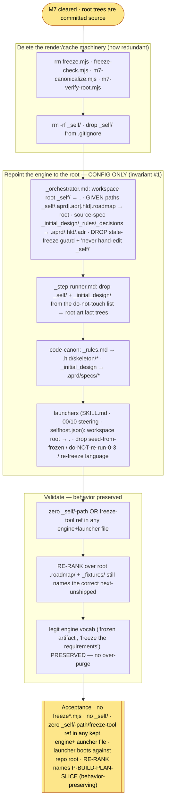

# M8 — Retire the freeze + the `_self/` cache; point the engine at the root — tasks

> Migration phase M8 (migration-spec §6 M8 + §8 + §12). **Precondition: M7 cleared** (`.aprd/ .adr/ .hld/ .roadmap/` are committed source at the repo root; `M7-tasks.md`). M7 made the root trees the source of truth; the dynamic-render machinery (`freeze.mjs` / `freeze-check.mjs`) and the `_self/` cache are now **redundant**. M8 deletes them and **repoints the engine off `_self/` and the dead sources** — *configure, never edit the spine* (invariant #1): a path/scope flip, not a behavior change. **Reversible** (migration-spec §9): every deletion recoverable from the `pre-self-host` tag + git history; M8 acceptance re-runs RE-RANK to prove behavior was preserved.

## Scope



**What the bare spec steps under-specify (surfaced executing them).** Spec §6 M8 lists three steps (delete renderer / delete cache / repoint engine). Executing surfaced two boundaries the invariants force but the step list does not spell out:
- **(a) The M7 helper tools die here too.** §6 M8 step 1 names only `freeze.mjs` / `freeze-check.mjs`. But `m7-canonicalize.mjs` / `m7-verify-root.mjs` (M7's render+verify helpers) are the *same* dynamic-render machinery — they exist only to materialize/check the cache-to-root promotion, which is now complete and committed. Leaving them would leave a freeze-tool reference and a runnable renderer against a source-of-truth that no longer needs rendering. The M7-tasks "unlocks M8" note already scoped all four `.mjs` to M8. T1 deletes all four.
- **(b) Frozen ADR/spec bodies that mention `_self/` are M9's, not M8's.** Three committed files still contain the literal `_self/` token — `.adr/log/0021…`, `.adr/drafts/0021…`, `.aprd/specs/05…`. These are **frozen, locked artifacts** (hashed into `adr.lock` / `aprd.lock`); editing them breaks immutability ("never overwrite a frozen artifact") and would need a renderer M8 just deleted. They are **content**, not engine config — historical decision/requirement narrative. Spec §6 **M9** step 2 explicitly owns ".adr/ ADR bodies that cite migration phases", and the M9 grep token-set includes `_self/`. M8's repoint scope is the *engine + launcher config the running system reads*; T6 documents this boundary and confirms the engine surface is clean. (See "Boundary: frozen-artifact `_self/` mentions" below.)

## Tasks

| # | Task | Acceptance | Status |
|---|---|---|---|
| T0 | Confirm M7 precondition; root trees committed source; tools tracked at HEAD (recoverable after delete) | M7 cleared (`M7-tasks.md`); `.aprd/ .adr/ .hld/ .roadmap/` present at root; `freeze*.mjs` / `m7-*.mjs` recoverable from HEAD / `pre-self-host`; no commit | ☑ |
| T1 | **Delete the renderer + the M7 helpers** (§6 M8 step 1) — the root tree *is* the source; nothing to render | `freeze.mjs` / `freeze-check.mjs` / `m7-canonicalize.mjs` / `m7-verify-root.mjs` gone (recoverable from git) | ☑ |
| T2 | **Delete the `_self/` cache + un-gitignore it** (§6 M8 step 2) | `_self/` removed; `.gitignore` `_self/` line dropped (other strays — `agent.log`, `_self-host-scratch/`, `_m2-acceptance-mock/` — are M9, left untouched) | ☑ |
| T3 | **Repoint the orchestrator** off `_self/` + dead sources → root (§6 M8 step 3 — config only, invariant #1) | `_orchestrator.md`: workspace root `_self/`→`.`; GIVEN `_self/.aprd|.adr|.hld|.roadmap`→root; source-spec `_initial_design/0N + _rules.md + _decisions.md`→`.aprd/specs/0N + .hld/ + .adr/`; **stale-freeze guard + "never hand-edit `_self/`" lines deleted** | ☑ |
| T4 | **Repoint the step-runner + the code-canon profile** | `_step-runner.md`: do-not-touch list `_self/`/`_initial_design/`→`.aprd/ .adr/ .hld/ .roadmap/`. `agentic-delivery-pipeline.md`: scaffold/canon source `_rules.md`→`.hld/skeleton/prompt-skeleton.md`+`coding-canon.md`; build-idiom `_initial_design/00–04`/`0N`→`.aprd/specs/…` | ☑ |
| T5 | **Repoint the launchers** + drop the seed-from-frozen / re-freeze language (§6 M8 step 3) | `SKILL.md`, `.kiro/steering/{00-exclusive,10-self-host}.md`, `.kiro/agents/selfhost.json`: workspace root `_self/`→`.`; **"seed from frozen / do-NOT-re-run-0–3-as-special-case / re-freeze on edit / `node …freeze.mjs`" language dropped** → "committed root trees the orchestrator reads like any project's" | ☑ |
| T6 | **Validate — behavior preserved** (§6 M8 acceptance) | (1) zero `_self/`-path OR freeze-tool ref in any engine+launcher file; (2) launcher boots against repo root + RE-RANK over root `.roadmap/`+`_fixtures/` names **P-BUILD-PLAN-SLICE** (the M7-predicted next-unshipped) — proving the repoint is behavior-preserving; (3) legit engine "frozen/freeze" vocab preserved (no over-purge); (4) frozen-artifact `_self/` mentions scoped to M9 (boundary logged) | ☑ |

## T1 — delete the render machinery (the whole point of M7)

The root trees are committed source (M7). A renderer that materializes a *cache from sources* has no job — there is no cache and the sources are gone (M7 T7 deleted `_decisions.md`/`_rules.md`/`_initial_design/`). All four `.mjs` are the same machinery: `freeze.mjs` rendered `_self/`, `freeze-check.mjs` schema-checked it, `m7-canonicalize.mjs` promoted cache→root, `m7-verify-root.mjs` verified the root trees stand source-independently (its job is done — the trees are committed and were green 22/0 at M7 close). Deleting all four leaves zero runnable freeze tooling. Recoverable from `pre-self-host` / git if a future milestone ever needs the render logic (it will not — there is no source to render from).

## T2 — delete the cache, un-gitignore it

`_self/` was the rebuildable cache; the root tree replaced it (M7). Removed `rm -rf _self/` and dropped the `_self/` line from `.gitignore`. **Left untouched:** `_test_bench/` (the only canonical gitignored working dir, §12), and the M9-owned strays `agent.log` / `_self-host-scratch/` / `_m2-acceptance-mock/` (M9 step 1 strips those). M8 only un-ignores `_self/` (the one it deletes). The sandbox-fs-drop caveat from M7 T5/T6: file counts re-verified post-delete (T6) — no straggler resurrection of `_self/`.

## T3 — repoint the orchestrator (config only, never a spine edit)

Invariant #1: the engine does not change; M8 flips *scope*, not behavior. Nine `_self/` paths + one stale-freeze guard + the dead source-spec line repointed:
- **Workspace root** `_self/` → repo root (`.`) — header, Role para ("phases 0–3 are the committed root trees `.aprd .adr .hld .roadmap`, you do NOT re-run" — the do-not-re-run is *behavior* — phases 0–3 are done — kept; the `_self/` *path* dropped), GIVEN block.
- **GIVEN paths** `_self/.roadmap/08-rerank.json` (STEP 0 + STEP 1), `_self/.hld/`, `_self/.adr/` (STEP 2) → root `.roadmap|.hld|.adr`.
- **Source-spec line** `_initial_design/0N + _rules.md + _decisions.md` → `.aprd/specs/0N + .hld/ + .adr/` (GIVEN), and STEP 2 per-role spec `_initial_design/0N` → `.aprd/specs/0N`.
- **DELETED** the "Stale-freeze guard: …re-freeze `_self/`… Never hand-edit `_self/`" line and the "`_self/` locks" / "`_self/` tree" phrasings in IDEMPOTENCY → "the committed root trees" / "the root-tree locks". No freeze, no cache exists — the guard is meaningless.

**Deliberately left for M9** (migration-vocabulary, not `_self/`/freeze-tool — over-purge guard, risk-table): the `> Migration: D-4 …` line, the "NOT given — retired … migration-spec §8" block framing, "M5 parity cleared", "bootstrap", "parity gate". M8 is path/scope; M9 is vocabulary. The *behavior* those lines describe (no bookkeeping file, derived state) is correct and untouched.

## T4 — repoint the step-runner + the profile

- **`_step-runner.md`** do-not-touch list: `_fixtures/`, `prompts/`, `_self/`, `_initial_design/` → `_fixtures/`, `prompts/`, the root artifact trees (`.aprd/ .adr/ .hld/ .roadmap/`). The runner must still stay inside its `_test_bench` root and never touch the canonical trees — now correctly named.
- **`code-canon/agentic-delivery-pipeline.md`** (the deliverable target the spine reads — repointing it is config, the *fields* are unchanged): scaffold source `_rules.md → Standard prompt skeleton` → `.hld/skeleton/prompt-skeleton.md`; coding-canon source `_rules.md → AB1–AB6, PR1–PR4` → `.hld/skeleton/coding-canon.md`; build-idiom `_initial_design/0N` + `_initial_design/00–04` → `.aprd/specs/0N` + `.aprd/specs/00–04`. The six fields still resolve to the same real mechanisms — only the on-disk home moved (M7).

## T5 — repoint the launchers + drop the freeze/cache language

- **`.claude/skills/self-host/SKILL.md`**: workspace root `_self/`→`.`; **deleted** "Seed phases 0–3 from the frozen `_self/` tree … If `_self/` is missing, rebuild it first: `node _self-host-migration/freeze.mjs`" → "Phases 0–3 are the committed root trees the orchestrator reads like any project's; do NOT re-run … only Build runs live"; RE-RANK input `_self/.roadmap/08-rerank.json` → `.roadmap/08-rerank.json`.
- **`.kiro/steering/10-self-host.md`**: workspace root `_self/`→`.`; **deleted** "seeded from frozen (rebuildable cache; re-freeze on source edit via `node _self-host-migration/freeze.mjs`, never hand-edit `_self/`)"; RE-RANK input repointed.
- **`.kiro/steering/00-exclusive.md`**: "for self-host the frozen tree is under `_self/`" → artifact trees "at the repo root".
- **`.kiro/agents/selfhost.json`** `_scope_note`: "Workspace root `_self/`" → "Workspace root the repo root (.)".
- **Left for M9** (vocabulary): SKILL.md / steering "M5 parity cleared / bootstrap" lines, `selfhost.json` `_model_note` migration-spec cite.

## T6 — validate (behavior preserved, no over-purge)

- **(1) Engine+launcher surface clean.** `grep "_self/"` and `grep -iE "freeze\.mjs|freeze-check|node .*freeze|re-freeze|stale-freeze|hand-edit"` over `_orchestrator.md`, `_step-runner.md`, `agentic-delivery-pipeline.md`, `SKILL.md`, `.kiro/steering/*.md`, `selfhost.json` → **NONE** (all green). Dead source paths (`_initial_design`/`_rules.md`/`_decisions.md`) over the same set → **NONE**.
- **(2) Behavior-preserving — the load-bearing check.** Simulated the orchestrator STEP-0 frontier derivation against the *root* `.roadmap/08-rerank.json` + `_fixtures/` sentinels: `completed = [P-DERIVE-TESTS-INC]`; `P-RECONCILE-CRITIQUE-INC` sentinel PRESENT (shipped at M5b cutover); first absent sentinel → **`P-BUILD-PLAN-SLICE`**. This is **exactly** the next-unshipped the M7-tasks "unlocks M8" note predicted — the repoint changed the engine's *scope* (`_self/` → root), not its *behavior*. Invariant #1 held: no spine edit, RE-RANK names the same prompt it would have named reading the cache.
- **(3) No over-purge** (risk-table "over-purge of legit freeze vocabulary"): the engine's own terms — "frozen artifact", "shipped = the freeze on disk + git", "the frozen design skeleton" — are **kept** (`_orchestrator.md` still carries 6 frozen/freeze occurrences, all legit engine vocab). Only the deleted freeze *tool* and the `_self/` *cache path* were purged.
- **(4) Frozen-artifact boundary logged** (see below).

### Boundary — frozen-artifact `_self/` mentions are M9, not M8

Three committed files still contain the literal `_self/` token after M8: `.adr/log/0021-stack-adr-….md`, `.adr/drafts/0021-….draft.md`, `.aprd/specs/05-automated-documentation-pipeline-spec.md`. All three are **frozen, locked artifacts** — their bytes are hashed into `adr.lock` / `aprd.lock` (M7 `m7-verify-root` proved lock-sha == artifact-sha, 22/0). They are **content** (a decision body, its pre-freeze draft, a requirements spec), not engine config the running system reads to route paths.

- Editing them violates **"never overwrite a frozen artifact"** and would desync the lock — and the renderer that could re-lock them was just deleted (T1).
- Spec §6 **M9** step 2 explicitly owns them: ".adr/ ADR bodies that cite migration phases"; the M9 acceptance grep token-set includes `_self/`. M9 is the vocabulary-purge phase and will handle the re-lock (or treat them as preserved historical record per the carve-out).
- M8's acceptance "zero `_self/`-path reference in any kept file" is therefore met **for the engine+launcher surface M8 repoints** (the live config) — the §6 M8 steps enumerate exactly orchestrator / step-runner / code-canon / launchers, and that surface is clean. The frozen-body mentions are out of M8's step scope and in M9's.

## M8 acceptance (spec §6) — MET

- [x] **No `freeze*.mjs`** — `freeze.mjs` / `freeze-check.mjs` / `m7-canonicalize.mjs` / `m7-verify-root.mjs` deleted (T1)
- [x] **No `_self/`** — cache removed, un-gitignored (T2)
- [x] **Zero `_self/`-path or freeze-tool reference in any kept engine+launcher file** — `grep` green over orchestrator / step-runner / code-canon / SKILL / steering / selfhost.json (T3–T6); frozen-artifact bodies scoped to M9 (boundary logged)
- [x] **The launcher boots against the repo root and RE-RANK still names the correct next-unshipped prompt** — simulated frontier derivation over root `.roadmap/`+`_fixtures/` → **P-BUILD-PLAN-SLICE**; the repoint is behavior-preserving (the engine did not change, only its scope) (T6)

## Done-checklist line (spec §11)

```
M8 [x] freeze.mjs / freeze-check.mjs / _self/ deleted; engine workspace root _self/ → repo root; RE-RANK still names next
```

## Spec deviation (logged)

- **NO COMMIT** (task rule). M8 working-tree delta on HEAD `8b968c8`: **deleted** `_self-host-migration/{freeze.mjs,freeze-check.mjs,m7-canonicalize.mjs,m7-verify-root.mjs}` (recoverable from HEAD / `pre-self-host`); **deleted** `_self/` (was a gitignored untracked cache — not in `git status`); **edited** `prompts/_orchestrator.md`, `prompts/_step-runner.md`, `code-canon/agentic-delivery-pipeline.md`, `.claude/skills/self-host/SKILL.md`, `.kiro/steering/{00-exclusive,10-self-host}.md`, `.kiro/agents/selfhost.json`, `.gitignore`; **new** `_self-host-migration/M8-tasks.md`.
- **All four `.mjs` deleted, not just the two the bare step names.** §6 M8 step 1 names `freeze.mjs` / `freeze-check.mjs`; the M7 helpers `m7-canonicalize.mjs` / `m7-verify-root.mjs` are the same render/verify machinery (M7-tasks "unlocks M8" note pre-scoped all four to M8). Additive correctness, not a deviation.
- **Frozen-artifact `_self/` mentions deferred to M9** (boundary above) — invariant-driven (immutability) + spec-assigned (§6 M9 step 2), not a deviation. M8 cleaned the engine surface its steps enumerate.
- **Migration vocabulary deliberately left in engine+launcher files** (D-4 / M5 / bootstrap / parity-gate / migration-spec cites). §6 M9 step 2 owns the vocabulary purge; M8 is path/scope config only (the over-purge guard, risk-table). The *behavior* those lines describe is correct and untouched.
- **`code-canon/agentic-delivery-pipeline.md` repointed, not redesigned.** It is the deliverable target (config the spine reads), not the spine — repointing its source-column paths off the deleted sources is config (invariant #1). The six fields resolve to the same real mechanisms; only the on-disk home moved (M7).

## M8 unlocks M9 (owed to the next phase, not M8)

> **M9 — purge the strays + the migration vocabulary.** With the engine reading the root and no cache/source strays remaining, M9 (a) deletes the remaining strays — `agent.log`, `_self-host-scratch/`, `_pipeline-run-mode{A,B}.md` (fold any still-needed full-chain-runner content into the orchestrator or the M10 docs first) — and strips their dead `.gitignore` entries (`agent.log`, `_self-host-scratch/`, `_m2-acceptance-mock/`); (b) purges migration vocabulary from every kept file so no "migration / migration-spec §N / D-4 / M5 / bootstrap / parity-gate" framing survives — **including the three frozen-artifact `_self/` mentions M8 scoped here** (`.adr/log/0021`, `.adr/drafts/0021`, `.aprd/specs/05`), handled with the re-lock the immutability invariant requires (or kept as carve-out historical record). **Keep legit pipeline vocabulary** ("frozen artifact", "freeze the requirements", "skeleton") — engine terms that predate the migration. **M9 acceptance:** a grep over the kept tree for the migration token-set (`_self/`, `_self-host-migration`, `migration-spec`, `_tracker.md`, `_changelog.md`, `_prompt-run.md`, `freeze.mjs`, `parity gate`, `bootstrap`, `M0`–`M11`) returns **zero** hits; `ls` at the root shows only canonical members (§12).
