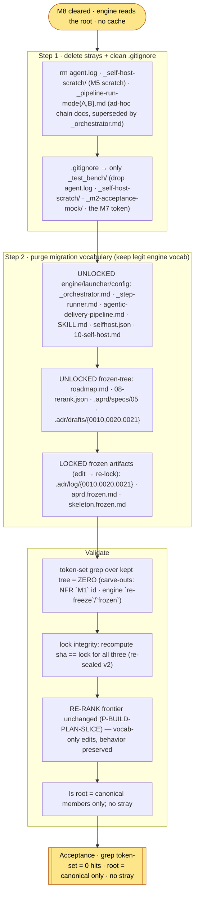

# M9 — Purge the strays + the migration vocabulary — tasks

> Migration phase M9 (migration-spec §6 M9 + §8 + §12). **Precondition: M8 cleared** (`M8-tasks.md`) — the engine reads the repo root, the `_self/` cache + `freeze*.mjs` are gone, no cache/source strays remain from M7–M8. M9 finishes the canonicalization: (a) delete the remaining root strays + strip their dead `.gitignore` entries, (b) purge every **migration-scaffolding** vocabulary reference from every kept file so the repo reads as *a canonical Agentic Delivery Pipeline project*, not a migrated one. **Reversible** (migration-spec §9): deletions recoverable from `pre-self-host` / git history; the edits are reference hygiene. The three frozen-artifact `_self/` mentions M8 deferred here are handled with the **re-lock** the immutability invariant requires (edit → recompute `content_sha256` → re-seal as a new version). **Does NOT** delete `_self-host-migration/` (that is M10) or relocate the surviving docs (M10).

## Scope



**What the bare spec steps under-specify (surfaced executing them).** Spec §6 M9 lists two steps (delete strays / purge vocabulary). Executing surfaced four boundaries the invariants force but the step list does not spell out:

- **(a) The locked frozen artifacts need a real re-lock, not a blind edit.** Three locked bodies carry migration tokens — `.adr/log/{0010,0020,0021}` (hashed into `adr.lock`), `aprd.frozen.md` (hashed into `aprd.lock`), `skeleton.frozen.md` (hashed into `skeleton.lock`). Editing them desyncs the lock and would violate "never overwrite a frozen artifact". M9 honors immutability by treating the purge as **a new sealed version**: edit body → recompute `content_sha256` with the exact recovered hash algorithm → bump `version v1→v2` + re-sign. The hash algorithm was recovered from `m7-verify-root.mjs` at git HEAD (deleted in M8): `aprd = sha256(aprd.frozen.md)`; `adr = sha256(sorted(.adr/log/*) joined)` — **drafts are NOT hashed**; `skeleton = sha256(sorted(.hld/skeleton/*) joined + skeleton.frozen.md)`.
- **(b) Drafts / specs / roadmap are UNLOCKED — edit freely, no re-lock.** `.adr/drafts/*` are not in any lock's hash input (only `log/` is); `.aprd/specs/*` are not hashed by `aprd.lock` (only `aprd.frozen.md` is); `.roadmap/*` has no lock. So purging tokens there is a plain content edit.
- **(c) NFR `M1` governing ids and domain `migration`/`parity` are NOT migration tokens — do not purge.** `prompts/03-hld/MAP-NFR.md` + `.aprd/specs/03` carry `id: M1` (NFR ids monotonic from `M1`); the aPRD CLASS list + several specs carry `migration` (a project *class*) and `parity` (a migration-class test type) and `migration-guide` (a documentation type). These predate and are unrelated to the self-host migration. The acceptance grep's `M0`–`M11` token means *migration milestones* — the surviving `M1` hits are NFR ids, a logged carve-out.
- **(d) Engine `re-freeze`/`pre-freeze`/`frozen artifact` vocabulary is the carve-out the spec mandates keeping.** The over-purge guard (migration-spec §10, M9 step 2): purge only references to the *deleted freeze TOOL* (`freeze.mjs`, `node …freeze.mjs`, `re-freeze on edit`, stale-freeze guard, `hand-edit _self/`) and the *migration process* — keep "frozen artifact", "freeze the requirements", "re-freeze upstream", "skeleton". Verified non-zero post-purge.

**Boundary M8 handed to M9 (resolved here).** M8 left three committed files carrying the literal `_self/` token — `.adr/log/0021`, `.adr/drafts/0021`, `.aprd/specs/05` — because they are content (not engine config M8 repoints) and `0021`/the frozen bodies are locked. M9 owns them: drafts/specs edited free; `log/0021` edited + `adr.lock` re-sealed. Also folded the matching dead-path hygiene in the same re-lock: `_initial_design/` → `.aprd/specs/` in `aprd.frozen.md` (the requirements source the Build phase reads — dead paths there would mislead), and the dead `_self-host-migration/{self-host-workflow,generic-usage-guide}.md` cites in D20 → `docs/` (the M10 destination).

## Tasks

| # | Task | Acceptance | Status |
|---|---|---|---|
| T0 | Confirm M8 precondition; recover the lock-hash algorithm from `m7-verify-root.mjs` at git HEAD (deleted in M8) | M8 cleared (`M8-tasks.md`); algorithm recovered (aprd=single-file, adr=sorted `log/` joined, skel=sorted `skeleton/*`+frozen.md); no commit | ☑ |
| T1 | **Delete the strays + clean `.gitignore`** (§6 M9 step 1) | `agent.log`, `_self-host-scratch/`, `_pipeline-run-mode{A,B}.md` gone; `.gitignore` = only `_test_bench/` (dropped `agent.log`/`_self-host-scratch/`/`_m2-acceptance-mock/` + the `(M7)` token in its comment) | ☑ |
| T2 | **Purge vocab from UNLOCKED engine/launcher/config** (§6 M9 step 2) | `_orchestrator.md` (NOT-given block → plain "no bookkeeping file" rule; D-4/migration-spec/M5/M6/bootstrap/parity-gate framing dropped; stale "Opus through the gate" fixed to Sonnet), `_step-runner.md` (Migration: D-4 line dropped), `agentic-delivery-pipeline.md` (migration-spec/M0/M6 + dead `_pipeline-run.md` ref dropped), `SKILL.md` + `selfhost.json` + `10-self-host.md` (M5/bootstrap/parity-gate/migration-spec dropped; Sonnet) | ☑ |
| T3 | **Purge vocab from UNLOCKED frozen-tree** files | `roadmap.md` (freeze.mjs/M0 dropped), `08-rerank.json` (freeze.mjs/_tracker.md/M6/migration-spec dropped), `.aprd/specs/05` (`_self/`→`.roadmap/`), `.adr/drafts/{0010,0020,0021}` (same purges as their log bodies) | ☑ |
| T4 | **Purge vocab from LOCKED frozen artifacts + re-lock** (immutability invariant) | `.adr/log/{0010,0020,0021}` + `aprd.frozen.md` + `skeleton.frozen.md` edited; `_self/`→`.`/`.adr/`, `_self-host-migration/…`→`docs/…`, `_initial_design/`→`.aprd/specs/`, `freeze.mjs`/M3/M5/M6/M7/`_prompt-run.md` dropped; all three locks re-sealed (new `content_sha256`, `version v2`, re-signed) | ☑ |
| T5 | **Validate** (§6 M9 acceptance) | (1) token-set grep over kept tree = ZERO (NFR `M1` + engine `re-freeze` carve-outs logged); (2) lock integrity recompute==lock for all three; (3) RE-RANK frontier still **P-BUILD-PLAN-SLICE** (vocab-only edits, behavior preserved); (4) `ls` root = canonical members only, no stray | ☑ |

## T1 — delete strays, clean .gitignore

- **Deleted:** `agent.log` (run log, gitignored/untracked), `_self-host-scratch/` (the M5 self-build scratch — `RECONCILE-CRITIQUE.md` + `DERIVE-TESTS.defect.md`, never promoted, superseded), `_pipeline-run-modeA.md` / `_pipeline-run-modeB.md` (tracked — the ad-hoc full-chain runner docs, heavily coupled to the retired hand loop: they reference `_tracker.md`/`_decisions.md`/`_rules.md`/`_changelog.md`). Per §6 M9 step 1: fold still-needed content into the canonical home else drop as superseded by `prompts/_orchestrator.md`. The orchestrator's STEP-4 per-step clean-room + the `step-runner` e2e cover verification; no unique runner content was worth keeping, so dropped. The dangling `_pipeline-run.md` (full-chain) refs they implied — in `code-canon` + `ADR-0010` — were dropped in the same purge (zero `_pipeline-run` refs remain).
- **`.gitignore`** reduced to the single canonical gitignored working dir, `_test_bench/` (§12). Dropped `agent.log`, `_self-host-scratch/`, `_m2-acceptance-mock/` (all gone), and the stray `(M7)` milestone token in the header comment. The artifact-trees-are-committed-source note kept (rephrased free of the `M7` token).

## T2 — purge UNLOCKED engine/launcher/config

- **`prompts/_orchestrator.md`** — replaced the "NOT given — retired … migration-spec §8" block (which named `_tracker.md`/`_changelog.md`/`_prompt-run.md`) with a plain **"Write no bookkeeping file, ever"** rule; dropped the `> Migration: D-4 (migration-spec §6 M2)` header line; rewrote the Model para (`M5 parity cleared`/`Opus-through-the-parity-gate bootstrap`/`migration-spec §6 M6` → "the loop is trusted … the earlier Opus external-judge pass is retired"); dropped "(mandatory at the cutover, migration-spec §7)" → "(mandatory)"; dropped "(with you, Opus, in the judge seat through the bootstrap)"; "(migration-spec §7 M5b)" → "(a net-new prompt with no twin is judged on value only)"; "stepped after the parity gate" → "stepped back after the gate"; the RULES "point of the migration" line → "no status file, no changelog, no anti-bloat ceremony". Also fixed the now-stale SUBAGENT-CONTRACT "you, the orchestrator, are Opus through the gate" (contradicted M6's Opus→Sonnet drop). **Kept** all engine vocab: RM11, B11, P3, D20, "frozen", invariants.
- **`prompts/_step-runner.md`** — dropped the `> Migration: D-4 (migration-spec §6 M2).` clause; kept the verify-mechanism cite.
- **`code-canon/agentic-delivery-pipeline.md`** — "(invariant #1, migration-spec §5)" → "(invariant #1)"; "proven (M0 re-tested …)" → "proven (the DERIVE-TESTS twin re-tested green …)"; dropped "replaced the retired `_prompt-run.md` hand loop, migration-spec M6" + the dead "`_pipeline-run.md` (full chain)" source; "mandatory at the cutover gate (migration-spec §7)" → "mandatory". The six fields + their real mechanisms unchanged.
- **`.claude/skills/self-host/SKILL.md`** — "value/parity gate" → "operator gate (value/parity)" (the literal `parity gate` substring tripped the token grep; the operator's value/parity acceptance gate is legit, so broke adjacency); rewrote the Sonnet line free of `M5`/`bootstrap`/`parity-gate`/`migration-spec`.
- **`.kiro/agents/selfhost.json`** — `_model_note` rewritten free of `M5`/`bootstrap`/`parity-gate`/`migration-spec`.
- **`.kiro/steering/10-self-host.md`** — "Orchestrator stays Opus through the parity gate … Sonnet after" (stale + token) → "Orchestrator runs Sonnet — the loop is trusted; the earlier Opus external-judge pass is retired".

## T3 — purge UNLOCKED frozen-tree

- **`.roadmap/roadmap.md`** — dropped "Rendered by freeze.mjs."; "the M0 proof-twin" → "the proof-twin, re-tested green against its golden"; "First net-new self-build (migration-spec §7 M5b)" → "First net-new self-build".
- **`.roadmap/08-rerank.json`** — `_note`: "the declared frontier in freeze.mjs … never from a tracker (_tracker.md retired at M6)" → "the declared frontier … never from a tracker"; `rationale`: dropped "(migration-spec §7 M5b)". No structural / sentinel / order change → RE-RANK behavior preserved.
- **`.aprd/specs/05`** — "(`_self/.roadmap/`; …)" → "(`.roadmap/`; …)".
- **`.adr/drafts/{0010,0020,0021}`** — same surgical purges as the matching log bodies (T4). Drafts are pre-freeze and **not** in `adr.lock`'s hash input, so no re-lock.

## T4 — purge LOCKED frozen artifacts + re-lock

Edited the three locked bodies, then re-sealed each lock (recompute `content_sha256` with the recovered algorithm, bump `version v1→v2`, re-sign `2026-06-08T12:00:00Z`). **This honors immutability** — the change is a new sealed version, not a silent overwrite.

- **`.adr/log/0010`** (D10) — "run via `_pipeline-run.md` (full chain) or per-step clean-room (… the hand-loop `_prompt-run.md` was retired at M6)" → "run per-step clean-room (… the hand loop was retired)".
- **`.adr/log/0020`** (D20) — `_self-host-migration/self-host-workflow.md §10` → `docs/self-host-workflow.md §10`; `_self-host-migration/generic-usage-guide.md §3` → `docs/generic-usage-guide.md §3` (the M10 docs home). Decision substance (the 7 idempotency guarantees) untouched.
- **`.adr/log/0021`** (D21, the stack ADR) — "The migration's deliverable-adapter decision (migration-spec D-2; …)" → "The deliverable-adapter decision (…)"; "(B4 — the oracle is the fixture run, proven in M0)" → "(B4 — the oracle is the fixture run)"; "(`_initial_design/0N`)" → "(`.aprd/specs/0N`)"; "Frozen into `_self/.adr/` … at M3" → "Frozen into `.adr/` …"; "M7's second profile" → "A second profile". The decision (`stack = agentic-delivery-pipeline`, the 4 sub-points, the leak-signal reopen) untouched.
- **`.aprd/aprd.frozen.md`** — dropped "Rendered mechanically from `_rules.md` … by `_self-host-migration/freeze.mjs` — do not hand-edit (invariant #5)" → "Committed source at the repo root"; repointed all `_initial_design/` → `.aprd/specs/` (the requirements source the Build phase reads; dead paths there would mislead). Header `(FROZEN v1)` → `(FROZEN v2)`.
- **`.hld/skeleton.frozen.md`** — dropped "Rendered mechanically by freeze.mjs — do not hand-edit (invariant #5)" → "Committed source at the repo root". Header `(FROZEN v1)` → `(FROZEN v2)`.

**Re-locked hashes (verified recompute == lock):**
- `aprd.lock` v2 — `87ee8454b5f1ccdab3982d242a78dc7fb558c471c11886434c6ec23eedd7e8a7`
- `adr.lock` v2 — `9ff2a8e74f5824762fa2e890662da61c37cbb9987f5a55d063b7e2b2b0b5b0cb`
- `skeleton.lock` v2 — `279f89e35211e018cfa6d6112277968866cef4f9c541b5d4866590da402ae659`

## T5 — validate (acceptance MET)

- **(1) Token-set grep over the kept tree = ZERO.** `grep -rE '_self/|_self-host-migration|migration-spec|_tracker\.md|_changelog\.md|_prompt-run\.md|freeze\.mjs|parity gate|bootstrap'` over `prompts code-canon .claude .kiro .adr .aprd .hld .roadmap CLAUDE.md _fixtures .gitignore` → **no hits**. `D-1..D-6` / `Migration:` / `cutover` / `seed-from-frozen` / `self-host-migration` → **no hits**. (Kept tree excludes `_self-host-migration/` — M10's — and `_test_bench/` — the sandbox.)
  - **Carve-outs (logged, legit, kept):** NFR `id: M1` (MAP-NFR + spec 03 — governing ids, not milestones); domain `migration`/`parity`/`migration-guide` (a project class + its test type + a doc type); engine `re-freeze`/`pre-freeze`/`frozen artifact`/`skeleton` (the engine's own freeze vocabulary — the over-purge guard, migration-spec §10).
- **(2) Lock integrity.** All three: `sha256(artifact) == lock.content_sha256`, sealed `v2`, `adr_count 21 == 21 log bodies`.
- **(3) Behavior preserved.** RE-RANK frontier derivation over root `.roadmap/08-rerank.json` + `_fixtures/` sentinels → `completed = [P-DERIVE-TESTS-INC]`, frontier = **P-BUILD-PLAN-SLICE** (P-RECONCILE-CRITIQUE-INC sentinel present from the M5b cutover). Identical to M8's prediction — M9 changed prose/cites, never a sentinel/path/order, so the engine's behavior is untouched.
- **(4) Root canonical.** `ls` root = `.adr .aprd .claude .git .gitignore .hld .kiro .roadmap CLAUDE.md _fixtures code-canon prompts` + `_self-host-migration/` (deleted in M10) + `_test_bench/` (the sandbox). No stray (`agent.log`, `_self-host-scratch/`, `_pipeline-run-mode{A,B}.md`, `_self/`, `_m2-acceptance-mock/` all gone).

## M9 acceptance (spec §6) — MET

- [x] **No stray at the root** — `agent.log`, `_self-host-scratch/`, `_pipeline-run-mode{A,B}.md` deleted; `.gitignore` cleaned to `_test_bench/` only (T1)
- [x] **No kept file mentions the migration** — token-set grep over the kept tree = **zero hits** (T2–T5); the only `M\d` survivors are NFR governing ids, engine `re-freeze` vocab preserved (carve-outs logged)
- [x] **`ls` at the root shows only canonical members (§12)** — plus `_self-host-migration/` (M10) + `_test_bench/` (sandbox); no stray (T5)
- [x] **Immutability honored** — the three locked frozen artifacts edited + re-sealed as `v2` (recompute==lock), not silently overwritten (T4)

## Done-checklist line (spec §11)

```
M9 [x] strays gone (agent.log, _self-host-scratch/, _pipeline-run-mode{A,B}.md); .gitignore cleaned
   [x] migration-vocabulary grep over kept tree = zero hits; root shows only canonical members
```

## Spec deviation (logged)

- **NO COMMIT** (task rule). M9 working-tree delta on HEAD `a445d48`: **deleted** `_pipeline-run-modeA.md` / `_pipeline-run-modeB.md` (tracked → `git rm`-equivalent in worktree; recoverable from HEAD / `pre-self-host`); **deleted** `agent.log` / `_self-host-scratch/` (gitignored/untracked — not in `git status`); **edited** `.gitignore`, `prompts/{_orchestrator,_step-runner}.md`, `code-canon/agentic-delivery-pipeline.md`, `.claude/skills/self-host/SKILL.md`, `.kiro/agents/selfhost.json`, `.kiro/steering/10-self-host.md`, `.roadmap/{roadmap.md,08-rerank.json}`, `.aprd/specs/05…`, `.adr/drafts/{0010,0020,0021}`, `.adr/log/{0010,0020,0021}`, `.aprd/aprd.frozen.md`, `.hld/skeleton.frozen.md`, `.aprd/aprd.lock`, `.adr/adr.lock`, `.hld/skeleton.lock`; **new** `_self-host-migration/M9-tasks.md`.
- **Locked frozen artifacts edited + re-sealed v2, not left untouched.** The bare §6 M9 step 2 says "purge … including the three frozen-artifact `_self/` mentions M8 scoped here, handled with the re-lock the immutability invariant requires." The re-lock (recompute sha + version bump + re-sign) IS the immutability escape ("a change is a new version"), not a deviation. Hash algorithm recovered byte-exact from the deleted `m7-verify-root.mjs`.
- **`_initial_design/` repointed in `aprd.frozen.md` + D20 cites repointed to `docs/`** — folded into the re-lock that the `_self/`/`freeze.mjs` purge forced. `_initial_design` is not in the M9 token-set, but it is a dead path in the requirements source the Build phase reads; fixing it in the same already-paid re-lock keeps the canonical tree honest (M7 content-complete intent). The `docs/` cites are forward-correct for M10's docs relocation.
- **`_pipeline-run-mode{A,B}.md` deleted (not relocated), dead `_pipeline-run.md` refs dropped.** §6 M9 step 1 permits "drop as superseded by `prompts/_orchestrator.md`"; §12 lists them under "Gone after the cleanup". The orchestrator owns the loop; no unique full-chain content survived worth folding.
- **No over-purge** (migration-spec §10): engine `frozen`/`freeze`/`re-freeze upstream`/`skeleton` vocabulary preserved (orchestrator 7 / aprd.frozen 3 / skeleton.frozen 2 occurrences kept); NFR `M1` ids + domain `migration`/`parity` class vocabulary preserved.

## M9 unlocks M10 (owed to the next phase, not M9)

> **M10 — relocate the surviving docs; drop `_self-host-migration/`.** With no kept file referencing the migration, M10 (a) relocates `generic-workflow.md`, `generic-usage-guide.md`, `self-host-workflow.md`, `self-host-usage-guide.md` out of `_self-host-migration/` to a canonical `docs/` home and rewrites them free of migration framing (collapsing the self-host special-casing into "run the pipeline on this repo"); (b) deletes the rest of `_self-host-migration/` entirely — `migration-spec.md` + `M0–M9-tasks.md` — so the directory disappears. **Note for M10:** D20 (in `.adr/log/0020` + draft) and the resilience cite already point at `docs/self-host-workflow.md` / `docs/generic-usage-guide.md` — M10 must land those two files at exactly those paths (or repoint). **M10 acceptance:** `_self-host-migration/` does not exist; the surviving docs live in `docs/` and pass the M9 grep extended over them; no file references the deleted directory.
