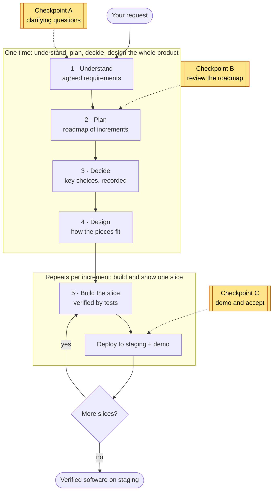
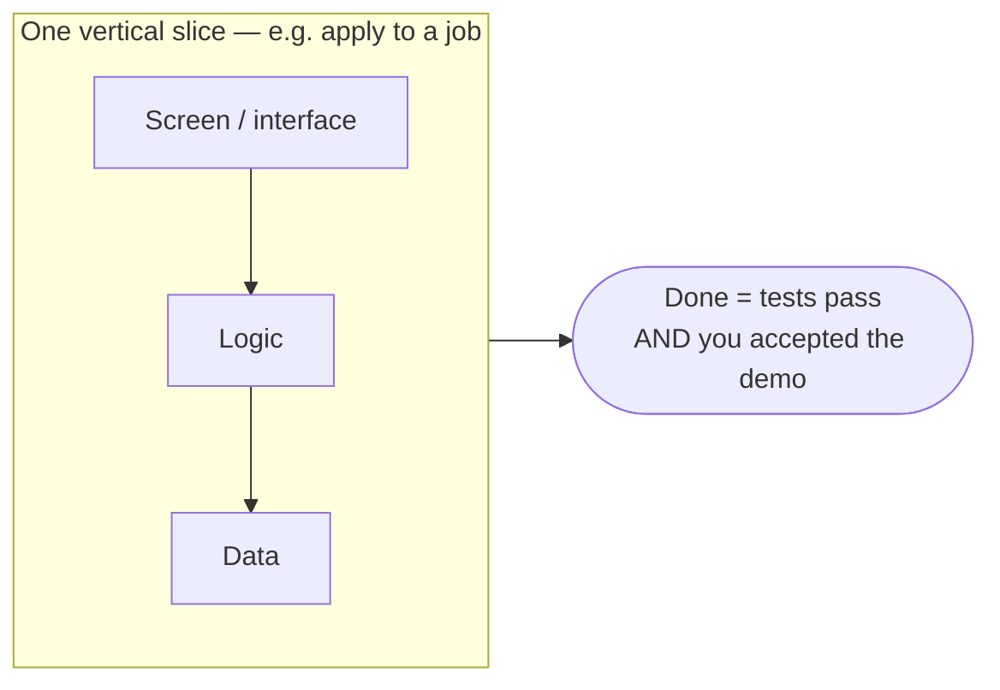

# Working With the System — End-User Guide

> How to take a software idea from a rough request to verified, working software — using the delivery system.
> Audience: the person who wants something built (the client/product owner). No engineering background assumed.

---

## 1. What this system does

You describe what you want. The system designs it, builds it, tests it, and shows you working software running on a staging environment — delivered in small, reviewable increments rather than one big drop at the end.

It is a team of AI agents organized as a pipeline. Each stage has a job, hands its result to the next, and checks the work along the way. **Nothing is declared "done" until it has been verified to actually work** — every increment ships with tests that prove it does what was asked.

**What you get:** a verified, demoable application running on staging, plus a clean paper trail — what was agreed (requirements), why each major technical choice was made (decision records), how it's structured (design), and proof it works (passing tests).

**What it builds:** any kind of software product — a web or mobile app, a backend service, infrastructure (e.g. cloud/Terraform), a data pipeline, and more. The technology is chosen for your project, not fixed in advance.

---

## 2. Before you start — what to bring

You do **not** need a polished spec. Bring whatever you have:

- **Your request, in plain language.** "A marketplace where clients post jobs and freelancers apply." Rough is fine — refining it is the system's first job.
- **Anything that constrains the solution**, if you know it: budget, deadline, required technology, regions/compliance, scale expectations, existing systems it must work with.
- **Existing materials**, if any: current code, designs, documents, or a brand/style guide. (For changes to an existing product, the system reads the code first.)

If you don't have some of these, that's expected — the system will ask.

---

## 3. The journey at a glance

The work moves through five phases. You are involved at **three checkpoints**; the rest runs on its own.

**Two rhythms.** First the system builds a thin **end-to-end skeleton** of the whole product once (so the shape is real and connected early). Then it fills in the product **one slice at a time** — each slice a small, working, demoable piece of functionality that goes all the way through (design → build → test → demo).

**You won't be pestered.** The system only stops to involve you at the three checkpoints below. Everywhere else it works autonomously and reads from what was already agreed.

---

## 4. Your three checkpoints (this is the part you do)

### Checkpoint A — Clarifying questions (early)
After reading your request (and any existing code/materials), the system identifies the **genuine gaps** — the things it cannot safely assume — and asks you a short, prioritized set of questions.

- It asks **only what matters**, highest-impact first (e.g. "Single region or global? This changes the architecture").
- It will **not** guess silently on anything that affects structure, cost, or scope.
- Answer in plain language. Where you're unsure, say so — the system records it as an explicit assumption you can revisit.

**Result:** an agreed statement of *what* will be built (requirements + what "done" means for each). This is then frozen — a stable reference everyone builds against.

### Checkpoint B — Review the roadmap
The system slices the work into a sequence of small increments and shows you the plan: what comes first, what builds on what, and where the foundational pieces sit.

- You can **confirm** the sequence or **reorder** it (within what's technically possible — some pieces must precede others).
- This is where you steer priorities: "I need the payments flow demoable before the admin tools."

**Result:** an agreed roadmap that drives the rest of delivery.

### Checkpoint C — Demo & accept (repeats, once per increment)
This is the heartbeat of delivery. For each increment, the system builds it, verifies it, deploys it to staging, and **shows you a working demo**.

- You see the real thing running, not a status report.
- You **accept** it (it's done and counts as delivered) or give feedback that feeds the next round.
- Then the next increment begins. Progress is visible and continuous.

**Result (cumulative):** a growing, working product on staging — each piece proven before the next starts.

---

## 5. What happens between checkpoints (so you can trust it)

You don't need to manage these, but here's what runs on its own:

- **Understand:** turns your rough request into precise requirements, fills gaps from the cheapest reliable source (existing code, established best practices) before asking you, and runs an adversarial review to catch ambiguity and missing acceptance criteria.
- **Decide:** makes the significant technical choices — including the **technology stack** — weighs options, and **records each as a short decision with its rationale** so nothing important is decided silently or forgotten.
- **Design:** lays out the components, how they talk to each other (contracts), the data, and the cross-cutting concerns (security, performance), then derives the tests each piece must pass.
- **Build:** writes the code against the agreed design, with a separate step authoring the tests (so the builder can't grade its own homework), runs the full test ladder, and includes an anti-cheat pass that flags fake or hollow implementations.

Throughout, a thread of identifiers links every requirement to the design, the code, and the tests that prove it — so any piece is traceable back to the reason it exists.

---

## 6. What you receive

| Deliverable | What it is | Why it's useful to you |
|---|---|---|
| **Agreed requirements** | The frozen statement of what's being built + acceptance criteria | The contract everyone works to; what "done" means |
| **Roadmap** | The increment sequence | See where the work is going and reprioritize |
| **Decision records** | Each major choice + its rationale | Understand *why* it was built this way; onboard others |
| **Design** | How the system is structured | A map for future change |
| **Verified software on staging** | The running product, increment by increment | The actual value — and proof (passing tests) that it works |

---

## 7. The slice rhythm — why increments, and what "done" means

The product is delivered as a series of **vertical slices**. A slice is a thin, complete piece of functionality that runs end-to-end (for example, "a freelancer can apply to a job" — touching the screen, the logic, and the data, all working together).

Each slice cuts top-to-bottom through the whole product, so what you accept is genuinely working — not a screen with nothing behind it, nor backend code you can't see.

For each slice, **"done" means two things at once:**
1. its acceptance criteria pass (the tests prove it behaves as agreed), **and**
2. you've seen it demoed and accepted it.

Why this way: you get working software early and often, problems surface in small pieces (not at the end), and you can change direction between slices at low cost.

---

## 8. Scope & boundaries

- **The finish line is an accepted demo on staging.** That verified staging build is the final deliverable.
- **Production release, deployment to your own environment, and post-launch operations are out of scope** — a deliberate boundary. The system delivers proven software ready for that step; it does not perform the live release itself.
- **For changes to existing products**, the system reads and conforms to your current code and conventions, and guards against breaking what already works (regression checks).

---

## 9. Works with any technology

The technology is a **decision made for your project** (at the "Decide" phase), based on your requirements and constraints — not a fixed default. The same process delivers a TypeScript web app, a Python service, cloud infrastructure, or a data pipeline. If you have a required stack, say so up front (Checkpoint A) and it becomes a constraint the design must honor.

---

## 10. Getting the best results

- **Be concrete about outcomes, flexible about implementation.** Tell the system *what success looks like*; let it choose *how*. ("Users check out in under 3 steps" beats "use library X.")
- **Surface real constraints early** (deadline, budget, must-use tech, compliance). They shape the architecture; late constraints cause rework.
- **Be decisive at checkpoints.** Clear answers and a confirmed roadmap keep delivery moving. Unsure? Say "assume X for now" — it's recorded and revisitable.
- **Review demos actively.** The demo is your steering wheel. Concrete feedback ("the filter should default to open jobs") shapes the next slice precisely.
- **Reprioritize between slices, not mid-slice.** Let a slice finish; redirect at the next roadmap touch. It's cheaper and cleaner.

---

## 11. Common situations

- **"My request is actually several things"** (e.g. "fix the upload bug, make it faster, and add PDF support"). The system detects this, splits it into atomic pieces, classifies each (bug fix / performance / feature), and confirms the breakdown with you before proceeding.
- **"I changed my mind about a requirement."** Raise it at the next checkpoint. The change updates the agreed requirements and re-plans the affected slices — the paper trail keeps everything consistent.
- **"How do I know it really works and isn't faked?"** Every slice ships with tests authored by a role separate from the builder, run against the live build, plus an anti-cheat review that flags hollow or hard-coded implementations. "Done" requires passing, not claiming.
- **"This is a change to an existing system, not a new build."** Supported. The system reads your codebase first, conforms to its conventions, and adds regression guards so existing behavior stays green.
- **"I don't know the answer to a clarifying question."** Say so. It becomes an explicit, recorded assumption you can change later — never a silent guess.

---

## 12. Glossary (light)

- **Requirements (frozen):** the agreed, stable statement of what's being built and what "done" means.
- **Slice:** a small, complete, demoable piece of functionality delivered end-to-end.
- **Skeleton (walking skeleton):** a thin version of the whole product wired together early, so the shape is real before details are filled in.
- **Decision record:** a short note capturing a significant technical choice and why it was made.
- **Design:** the structure — components, how they connect, the data, and cross-cutting concerns.
- **Staging:** a production-like environment where you see and accept working software; the delivery finish line.
- **Acceptance criteria:** the concrete, testable conditions that define "done" for a requirement or slice.

---

*In short: describe what you want, answer a few sharp questions, confirm a plan, then watch working software arrive in reviewable increments — each one proven before the next begins.*
