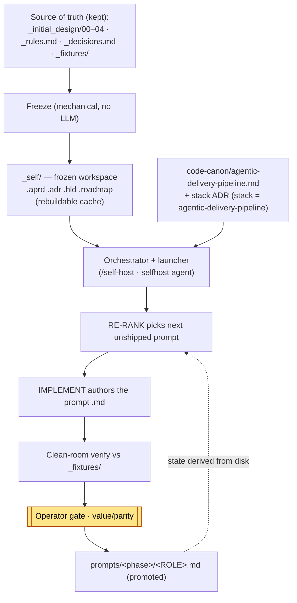
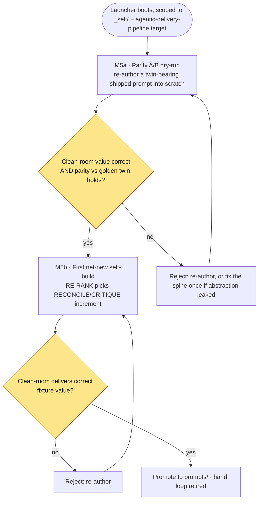

# Migration Spec — From the Hand-Authoring Loop to the Self-Hosted System

> The bridge between **how the system is built today** (a human drives `_prompt-run.md`, hand-authoring one prompt at a time, tracking progress in `_tracker.md`/`_changelog.md`) and **how it will be built after the migration** — the state described by [`self-host-usage-guide.md`](self-host-usage-guide.md) and [`self-host-workflow.md`](self-host-workflow.md).
>
> Those two documents are the **North Star**: they describe the end state, not a plan. **This document is the plan.** When this migration is done, those two documents are the *actual, literal* way the system is developed — the pipeline authors its own remaining prompts, and the hand loop is retired.
>
> Audience: the operator running the migration (the CTO / system owner). Scope: working tree `agentic-systems/` only.

---

## 1. Goal & definition of done

**Goal.** Replace the hand-authoring loop with the self-hosting loop, *without changing the engine*, so that:

1. The next prompt to build is chosen by **RE-RANK**, not by a human reading `_tracker.md`.
2. The remaining prompts are **authored by the pipeline** (IMPLEMENT under the agentic-delivery-pipeline target) and verified clean-room against `_fixtures/`, not hand-written.
3. Progress state is **derived from disk** (`prompts/` + `_fixtures/` + locks), not hand-maintained in `_tracker.md` / `_changelog.md`.
4. The operator's job collapses to **one gate** (value/parity), then stepping back.

**Done when** — the migration is complete the moment all of the following hold (this is exactly the North Star's "what done looks like", made operational):

- [ ] The deliverable adapter exists: `code-canon/agentic-delivery-pipeline.md` + a **stack ADR** pinning `stack = agentic-delivery-pipeline`.
- [ ] The frozen `_self/` tree exists and validates against the schemas the prompts read.
- [ ] An orchestrator prompt + launcher exist and boot (`/self-host` for Claude Code; `selfhost` agent for Kiro), scoped to `_self/` + the agentic-delivery-pipeline target.
- [ ] **The cutover proof has cleared once** (§7): one prompt was authored by the pipeline, verified clean-room, and promoted to `prompts/` — with parity confirmed against a twin.
- [ ] The hand loop is decommissioned: `_prompt-run.md`, `_tracker.md`, `_changelog.md` retired; state is derived.
- [ ] **The repo is canonical** (§6 M7–M10, §12): the on-disk tree is *identical to the canonical Agentic Delivery Pipeline structure* — `.aprd/ .adr/ .hld/ .roadmap/` are committed source at the repo root (the analog of a fixture project's tree), **not** stray markdown rendered into a cache. No `_self/` cache, no freeze tool, no stray files (`_decisions.md`, `_rules.md`, `_initial_design/`, `agent.log`, scratch dirs, ad-hoc run docs), and **no mention of the migration** anywhere in the kept tree.
- [ ] **The migration scaffolding is gone** (§6 M10): `_self-host-migration/` no longer exists; the surviving narrative docs were relocated to a canonical docs home and rewritten free of migration framing.

**Fully validated** one step further (§6, M11): the tree passes a **structural-conformance check** against the canonical layout AND a *second* canon profile runs the unchanged spine — proving deliverable-agnosticism, not agentic-delivery-pipeline-specialness.

---

## 2. Current state — the hand-authoring loop

What exists in `agentic-systems/` today:

| Asset | Role today | Fate after migration |
|---|---|---|
| `_prompt-run.md` | The hand loop: human Opus reads tracker, picks next, authors prompt, clean-room tests, records | **Retired** — its control logic becomes the orchestrator prompt; its bookkeeping dies |
| `_tracker.md` | HOT nav: YOU ARE HERE pointer + inventory status + decision index + changelog rules | **Retired** — status is derived; decision index moves with `_decisions.md` |
| `_changelog.md` | Append-only shipped-prompt log + anti-bloat ceremony | **Retired** — "shipped" is the freeze on disk + git |
| `_decisions.md` | `D1–D20` resolved-decision bodies | **Kept** — source the freeze renders into `_self/.adr/`; gains the stack ADR |
| `_rules.md` | PR1–4, caveman block, DRY skeleton, AB1–6, conventions, Mission, storage | **Kept** — source the freeze renders into `_self/.hld/` + `.aprd/` |
| `_initial_design/00–04` | The five-phase specs | **Kept** — source the freeze renders into `_self/.aprd/` |
| `prompts/<phase>/<ROLE>.md` | The shipped role library (30/39 fully done) | **Kept** — the "built skeleton"; the migration's product is the *remaining* prompts |
| `_fixtures/` | Golden artifacts per role | **Kept** — the oracle baseline; unchanged |
| `_test_bench`, `_pipeline-run.md` | Clean-room test harness + full-chain runner | **Kept** — the verify mechanism the adapter *names*, not reinvents |
| `.claude/agents/step-runner.md` | Sonnet/High step executor | **Kept** — reused unchanged for self-host steps |

**What does NOT exist today** (the gap the migration fills): no `_self/` tree, no `code-canon/agentic-delivery-pipeline.md`, no stack ADR, no orchestrator prompt on disk (`_prompt-run.md` is driven by a human Opus), no `/self-host` launcher.

**Where the work stands** (per `_tracker.md`, 2026-06-08): 30/39 prompts fully done. Remaining = the **RECONCILE/CRITIQUE increment** (Phase-3 role 8/8, the next-unshipped) + the **Phase-4 SLICE-BUILD modes** (8 roles, blocked on the Phase-3 increment chain finishing). This remainder is exactly what the self-host loop will author.

---

## 3. Target state — the North Star

The end state, summarized from the two North Star docs:



The engine is unchanged. Three things are *added* — a deliverable adapter, a frozen workspace, a launcher — and three things are *removed* — the hand tracker, changelog, and run-loop. The full operating model lives in the North Star docs; this spec only gets us there.

---

## 4. The gap — migration deliverables

Six concrete artifacts to build, plus the decommission. Each maps to a migration phase (§6).

| # | Deliverable | What it is | North Star ref |
|---|---|---|---|
| **D-1** | `code-canon/agentic-delivery-pipeline.md` | The coding-canon profile: 6 fields (scaffold, canon, "code" unit, oracle materialization, build idiom, verify mechanism). The verify mechanism *names* the existing clean-room sim — it does not invent one. | usage §A1 Step 2; workflow §4 |
| **D-2** | The **stack ADR** | A new decision (next free id, e.g. `D21`) pinning `stack = agentic-delivery-pipeline`, frozen into `_self/.adr/`. The analog of the ADR that pins Python in the fixture. | usage §A1 Step 3; workflow §3,§4 |
| **D-3** | The **freeze tool** + `_self/` tree | A mechanical (no-LLM) render of phases 0–3 from the kept source files into `_self/{.aprd,.adr,.hld,.roadmap}`. Gitignored, rebuildable cache. | usage §A1 Step 3, §4; workflow §4 |
| **D-4** | The **orchestrator prompt** | `prompts/_orchestrator.md` (+ `prompts/_step-runner.md` for Kiro): codifies the `_prompt-run.md` control loop **minus the bookkeeping** (no tracker/changelog writes; state derived). RE-RANK is the next-picker. | usage §A1 Step 4; workflow §5 |
| **D-5** | The **launcher** | Claude: `.claude/skills/self-host/SKILL.md`. Kiro: `.kiro/agents/selfhost.json` + `.kiro/steering/10-self-host.md`. Scoped to `_self/` + the agentic-delivery-pipeline target. | usage §A1 Step 5, §B4–B5 |
| **D-6** | **Decommission** | Retire `_prompt-run.md`, `_tracker.md`, `_changelog.md`; switch the orchestrator Opus→Sonnet after parity. | usage §7 FAQ; workflow §5,§7 |

---

## 5. Invariants the migration must preserve

Non-negotiable; every phase below is checked against these.

1. **The engine does not change.** The migration *configures* and *adds adapters*; it never edits the spine to make self-host work. If wiring the agentic-delivery-pipeline target forces a spine edit, the deliverable-agnostic abstraction leaked — fix the spine *once* (P3), do not patch the target.
2. **Shipped prompts are immutable.** The 30 done prompts in `prompts/` are the built skeleton + the source of golden twins. The migration never overwrites them; self-builds land in scratch first and are *promoted*.
3. **The oracle is unchanged.** A prompt is judged by **running it clean-room against `_fixtures/`** — the existing harness (`_test_bench`, the Sonnet runner). The adapter registers this; it invents no new judge.
4. **Disk is the source of truth (D20).** All state is derived from `_self/` + `prompts/` + locks. Atomic writes, immutable frozen artifacts, validate-frontier-on-resume, persisted gate replies. The migration must not introduce a new hand-maintained state file.
5. **`_self/` is a cache, never a source.** It is rendered *from* the kept source files. Never hand-edit it; on any source change, re-freeze.
6. **Caveman in chat, clean prose in artifacts.** Unchanged authoring register.

---

## 6. Migration phases

Sequenced so each phase unblocks the next, and the risky cutover (M5) happens only after the scaffolding is proven to boot. M0–M4 are reversible setup; M5 is the one-way proof; M6 retires the old loop; **M7–M10 are the canonicalization & cleanup band** (collapse the bootstrap scaffolding into the canonical repo structure, removing every stray and every migration trace); M11 fully validates.

```mermaid
flowchart LR
    M0[M0 Baseline<br/>+ rollback point] --> M1[M1 Adapter<br/>profile + stack ADR]
    M1 --> M2[M2 Orchestrator<br/>+ controller]
    M2 --> M3[M3 Freeze<br/>_self/ tree]
    M3 --> M4[M4 Launcher<br/>boots, names next]
    M4 --> M5[[M5 Cutover proof<br/>parity gate — one way]]
    M5 --> M6[M6 Decommission<br/>hand loop]
    M6 --> M7
    subgraph CLEAN["M7–M10 · Canonicalization & cleanup"]
      direction LR
      M7[M7 Canonicalize<br/>sources → root .aprd/.adr/.hld/.roadmap] --> M8[M8 Retire freeze<br/>+ _self/ cache; engine → root]
      M8 --> M9[M9 Purge strays<br/>+ migration vocabulary]
      M9 --> M10[M10 Relocate docs<br/>drop _self-host-migration/]
    end
    M10 --> M11[M11 Validate<br/>structure + 2nd canon profile]

    classDef cut fill:#fde68a,stroke:#b45309,color:#000;
    classDef clean fill:#dbeafe,stroke:#1d4ed8,color:#000;
    class M5 cut;
    class M7,M8,M9,M10 clean;
```



> **Why M7–M10 exist.** M0–M6 got the loop self-hosting, but they did it on *bootstrap scaffolding*: a `_self/` cache rendered by `freeze.mjs` from stray markdown (`_decisions.md`, `_rules.md`, `_initial_design/`), launchers scoped to `_self/`, and a `_self-host-migration/` workdir littering the root. That scaffolding is a **non-canonical** way to plug source into the system — it works, but the repo does not look like the very structure the pipeline emits for any other project (§12). M7–M10 retire the scaffolding: the canonical artifact trees become committed source at the root, the cache and its renderer are deleted, the strays are removed, and every migration trace is purged — so when the dust settles the repo is *just a canonical Agentic Delivery Pipeline project that happens to deliver prompts*. These four are reversible setup-style steps (additive then deletive, gated, recoverable from the `pre-self-host` tag) — **not** one-way like M5.

### M0 — Baseline & rollback point

**Deliverable:** a known-good, committed baseline to roll back to.

**Steps:**
1. Confirm the 30 shipped prompts validate against their `_fixtures/` goldens. **Risk flag:** the D10 DRY-skeleton retrofit re-test was skipped by the operator (goldens unchanged, behavior *assumed* preserved). Before trusting parity in M5, run the owed re-test on at least the twin used for the proof — a stale baseline would make the parity gate lie.
2. Commit the tree. Tag it (e.g. `pre-self-host`). This is the M-rollback target.

**Acceptance:** clean git state; the proof-twin prompt re-tested green against its golden.

### M1 — The deliverable adapter (profile + stack ADR)

**Deliverable:** D-1 + D-2.

**Steps:**
1. Author `code-canon/agentic-delivery-pipeline.md` with the six fields (verbatim shape in usage §A1 Step 2). The **verify mechanism** field names the existing clean-room runner sim — *register, do not reinvent*.
2. Add the stack-ADR decision to `_decisions.md` (next free id) pinning `stack = agentic-delivery-pipeline`; add its index line where the decision index lives. Body: why a prompt `.md` is the "code" unit, why the verify mechanism is the clean-room sim, the build idiom (synthesize from the HLD-increment contract + per-role spec §).

**Acceptance:** the profile's six fields each resolve to a real, existing mechanism (no dangling "TBD"); the stack ADR reads as a sibling of the (hypothetical) Python/Terraform stack ADRs, not a special case.

### M2 — The orchestrator & controller

**Deliverable:** D-4.

**Steps:**
1. Author `prompts/_orchestrator.md` — the self-host control loop. Source its logic from `_prompt-run.md` steps, but **strip the bookkeeping**: no `_tracker.md` pointer moves, no `_changelog.md` append, no anti-bloat ceremony. The loop is: RE-RANK picks next unshipped → design contract → IMPLEMENT authors → clean-room verify → pause at gate → on accept, promote to `prompts/`.
2. Author `prompts/_step-runner.md` (Kiro's `step.json` prompt path). Claude reuses `.claude/agents/step-runner.md` unchanged.
3. Wire **RE-RANK** as the next-picker over `_self/.roadmap/08-rerank.json`; status is computed by scanning `prompts/` + `_fixtures/` + locks — never read from a tracker file.

**Acceptance:** the orchestrator prompt, given a frozen `_self/` (mocked or real), names the correct next-unshipped prompt and never writes a bookkeeping file. (`prompts/_orchestrator.md` / `prompts/_step-runner.md` do not exist on disk today — this phase creates them; see §10.)

### M3 — Freeze the workspace (`_self/`)

**Deliverable:** D-3.

**Steps:**
1. Build the freeze tool (a small script or a by-hand mechanical render — **no LLM**). It maps the kept source files into the on-disk shape the prompts expect:
   - `_initial_design/00–04` + `_rules.md` Mission → `_self/.aprd/` (`aprd.frozen.md` + `aprd.lock`).
   - `_decisions.md` D1–D20 **+ the new stack ADR** → `_self/.adr/` (`log/<NNNN>.md` + `adr.lock`).
   - `_rules.md` DRY skeleton + AB1–6 + PR1–4 → `_self/.hld/` (`skeleton.lock` + `skeleton/*`).
   - `_tracker.md` inventory → `_self/.roadmap/` (`roadmap.md` + `08-rerank.json`), `remaining_sequence` = the unshipped prompts (RECONCILE/CRITIQUE increment first).
2. Gitignore `_self/` (like `_test_bench`).

**Acceptance:** every file under `_self/` validates against the schema its consuming prompt reads; re-running the freeze is idempotent (byte-stable given unchanged sources); `prompts/*` and `_fixtures/*` are recognized as the built-skeleton + oracle baseline.

### M4 — Wire the launcher

**Deliverable:** D-5.

**Steps:**
1. **Claude Code:** `.claude/skills/self-host/SKILL.md` (verbatim shape in usage §A1 Step 5) → runs the orchestrator with workspace root `_self/` + target `code-canon/agentic-delivery-pipeline.md`.
2. **Kiro:** `.kiro/agents/selfhost.json` (lean context — steering only, role prompts lazy-loaded) + `.kiro/steering/10-self-host.md` (workspace root, target, verify = clean-room not pytest, RE-RANK + derived state). `00-exclusive.md` still applies; `step.json` reused.
3. Set the orchestrator to **Opus through the parity gate** (external judge), Sonnet after.

**Acceptance:** launching in `agentic-systems/` boots the orchestrator, it reads the frozen `_self/`, and RE-RANK names **the RECONCILE/CRITIQUE increment** as the next prompt — without re-running phases 0–3.

### M5 — The cutover proof — see §7

The one-way gate. Detailed separately because it is the migration's load-bearing acceptance test.

### M6 — Decommission the hand loop

**Deliverable:** D-6. **Precondition: M5 cleared.**

**Steps:**
1. Retire `_prompt-run.md` (its control logic now lives in `prompts/_orchestrator.md`), `_tracker.md` (status derived), `_changelog.md` ("shipped" = freeze + git). Delete, do not port — porting them re-introduces the drift they caused.
2. Confirm the decision index has a home alongside `_decisions.md` (it rode in `_tracker.md`; relocate the index lines so no decision pointer is lost).
3. Drop the orchestrator Opus→Sonnet now that the loop is trusted.
4. ~~Fix the dangling `D20` cite~~ — **already done** (repointed to `self-host-workflow.md §10`; §10).

**Acceptance:** no hand-maintained tracker/changelog/run-loop remains; asking the orchestrator for status renders it from disk; the loop drains the next prompt with the operator only spot-checking.

### M7 — Canonicalize the artifact trees (sources → committed root tree)

**Deliverable:** the four phase artifact trees materialized at the **repo root** as committed source of truth — `.aprd/ .adr/ .hld/ .roadmap/` — replacing the stray markdown + the `_self/` cache. This is the core of the user's invariant: *`_decisions` and `_rules` must BE the canonical structure, not dynamic-render inputs.* (Target shape: §12.)

**Precondition:** M6 cleared (hand loop retired; loop drains on disk-derived state).

**Steps:**
1. **Materialize the canonical root tree from the authoritative sources — the final render.** Treat the stray markdown as authoritative (it is richer than the rendered cache) and produce the on-disk trees *by hand or one last freeze run*, then **commit them as source** (no longer a cache):
   - `_decisions.md` D1–D21 → `.adr/` (`log/<NNNN>.md`, `adr.lock`, `adr-index.json`, `drafts/` as the fixtures show). The **decision index** becomes `.adr/adr-index.json` (the canonical home a fixture project uses) — *not* a markdown header section.
   - `_initial_design/00–06` + `_rules.md` Mission → `.aprd/` (`aprd.frozen.md` + `aprd.lock`; the spec docs land as the requirements source the fixtures model).
   - `_rules.md` DRY skeleton + AB1–AB6 + PR1–PR4 → `.hld/` (`skeleton.frozen.md` + `skeleton.lock` + `skeleton/*`).
   - `_tracker.md` inventory legacy → `.roadmap/` (`roadmap.md` + `08-rerank.json`) — already exists in `_self/`; promote it.
2. **Create `CLAUDE.md`** — the canonical always-on rules home the generic deploy requires (usage §A1 Step 3) and the repo is currently missing. The standing/always-on slice of `_rules.md` (conventions, "never overwrite a frozen artifact", verify-before-done) lands here; the design-canon slice went to `.hld/`/`.aprd/` in step 1.
3. **Un-gitignore** `.aprd/ .adr/ .hld/ .roadmap/` — they are now committed source, not a cache. (`_self/` is still gitignored at this point; it dies in M8.)
4. **Validate parity:** every file under the root trees schema-validates against its consuming prompt (the check `freeze-check.mjs` ran, now made permanent), and a content diff confirms **no decision, rule, mission line, or roadmap entry was lost** vs the retired sources.
5. **Retire the now-redundant sources:** delete `_decisions.md`, `_rules.md`, `_initial_design/` — their content lives canonically at the root. (Source-file deletion only; engine repoint is M8.)

**Acceptance:** `.aprd/ .adr/ .hld/ .roadmap/` exist at the root, committed, schema-valid, content-complete vs the old sources; `CLAUDE.md` present; `_decisions.md`/`_rules.md`/`_initial_design/` gone; the tree now mirrors a fixture project's artifact layout (§12).

### M8 — Retire the freeze + the `_self/` cache; point the engine at the root

**Deliverable:** the dynamic-rendering machinery is gone; the engine reads the canonical root tree directly.

**Precondition:** M7 cleared (root trees are committed source).

**Steps:**
1. **Delete the renderer:** `freeze.mjs`, `freeze-check.mjs`. There is no cache to render anymore — the root tree *is* the source (the whole point of M7).
2. **Delete the cache:** `_self/`; remove it from `.gitignore`.
3. **Repoint the engine off `_self/` and the dead sources** (configure, never edit the spine — invariant #1):
   - `prompts/_orchestrator.md`: **workspace root `_self/` → repo root (`.`)**; the GIVEN paths `_self/.aprd|.adr|.hld|.roadmap` → root `.aprd|.adr|.hld|.roadmap`; source-spec line `_initial_design/0N + _rules.md + _decisions.md` → `.aprd/ + .hld/ + .adr/`; **delete the stale-freeze guard and the "never hand-edit `_self/`" lines** (no freeze, no cache exists).
   - `prompts/_step-runner.md`, `code-canon/agentic-delivery-pipeline.md`: same path repoints (`_rules.md`→`.hld/`, `_initial_design`→`.aprd/`, `_decisions.md`→`.adr/`, drop `_self/`).
   - Launchers — `.claude/skills/self-host/SKILL.md`, `.kiro/steering/{00-exclusive,10-self-host}.md`, `.kiro/agents/selfhost.json`: workspace root → repo root; **drop the "seed-from-frozen / do NOT re-run phases 0–3 / re-freeze on edit" language** (phases 0–3 are now just the committed root trees the orchestrator reads, like any project).

**Acceptance:** no `freeze*.mjs`, no `_self/`, zero `_self/`-path or freeze-tool reference in any kept file; the launcher boots against the repo root and RE-RANK still names the correct next-unshipped prompt — proving the repoint is behavior-preserving (the engine did not change, only its scope).

### M9 — Purge the strays + the migration vocabulary

**Deliverable:** no stray files at the root; no kept file mentions the migration.

**Precondition:** M8 cleared (engine reads the root; no cache/source strays remain from M7–M8).

**Steps:**
1. **Delete the remaining strays:** `agent.log`, `_self-host-scratch/` (M5 scratch), `_pipeline-run-modeA.md` / `_pipeline-run-modeB.md` (ad-hoc chain-runner docs — fold any still-needed full-chain runner content into the canonical home, e.g. the orchestrator or the relocated docs in M10; otherwise drop as superseded by `prompts/_orchestrator.md`). Strip dead `.gitignore` entries (`agent.log`, `_self-host-scratch/`, `_self/`, `_m2-acceptance-mock/`).
2. **Purge migration vocabulary from every kept file.** Rewrite headers/bodies so no "migration / migration-spec §N / D-4 / M5 / bootstrap / parity-gate / self-host-as-special-mode" framing survives — the orchestrator is *the orchestrator*, the repo is *a canonical project*. Targets (bounded — see §10): `prompts/_orchestrator.md` (drop the "Migration: D-4 …" line, the "NOT given — retired" block, "bootstrap"/"parity gate" framing → plain "no bookkeeping file" rule), `code-canon/agentic-delivery-pipeline.md` (drop migration-spec cites), `.kiro/steering/*`, `.claude/skills/*`, `.adr/` ADR bodies that cite migration phases.
   - **Keep legit pipeline vocabulary** — "frozen artifact", "freeze the requirements", "skeleton" — these are the engine's own terms and predate the migration. Purge only references to the *deleted freeze TOOL* and the *migration process*. Do not over-purge.

**Acceptance:** a `grep` over the kept tree for the migration token-set (`_self/`, `_self-host-migration`, `migration-spec`, `_tracker.md`, `_changelog.md`, `_prompt-run.md`, `freeze.mjs`, `parity gate`, `bootstrap`, `M0`–`M11`) returns **zero** hits; `ls` at the root shows only canonical members (§12); no stray remains.

### M10 — Relocate the surviving docs; drop `_self-host-migration/`

**Deliverable:** the migration workdir no longer exists; the operating-manual docs live in a canonical home.

**Precondition:** M9 cleared (no kept file references the migration).

**Steps:**
1. **Relocate the surviving narrative docs** out of `_self-host-migration/` — `generic-workflow.md`, `generic-usage-guide.md`, `self-host-workflow.md`, `self-host-usage-guide.md` are the operating manual and survive. Move to a canonical docs home (e.g. `docs/`, the landing zone the documentation pipeline — spec 05 — targets) and **rewrite them free of migration framing**: no `_self/`, no freeze tool, no "bootstrap"/"seed-from-frozen", no migration-spec cross-refs. Collapse the "self-host" special-casing into "run the pipeline on this repo" — the repo is now just a canonical project, so the self-host guides largely fold into the generic ones (keep only the genuinely reflexive content: Level-A/Level-B, the prompt-as-deliverable target).
2. **Delete the rest of `_self-host-migration/` entirely** — `migration-spec.md` (this file), `M0–M10-tasks.md`. (`freeze*.mjs` already died in M8.) The directory disappears.

**Acceptance:** `_self-host-migration/` does not exist; the surviving docs live in a canonical location and read clean (no migration trace, verified by the M9 grep extended over the relocated docs); no file references the deleted directory.

### M11 — Full validation (structural conformance + agnosticism)

**Deliverable:** proof the repo is canonical AND the spine is deliverable-agnostic.

**Precondition:** M10 cleared (cleanup complete).

**Steps:**
1. **Structural conformance.** Diff the repo tree against the canonical layout (generic-usage-guide §A1/§B1 + a clean fixture's tree, §12). Assert: only canonical members at the root; `.aprd/ .adr/ .hld/ .roadmap/` committed source; `prompts/` the deliverable; `_fixtures/` the oracle; `code-canon/`, `.claude/`, `.kiro/`, `CLAUDE.md` present; the only gitignored working dir is the clean-room sandbox (`_test_bench/`). Zero strays, zero migration mentions.
2. **Agnosticism.** After the agentic-delivery-pipeline loop drains, author a *second* canon profile (`code-canon/terraform.md` or `code-canon/typescript.md`) + its stack ADR, and run a tiny greenfield through the **unchanged** spine. If it passes its own verify with zero engine edits, agnosticism is proven. Any forced spine edit = a leak; fix the spine once (P3).

**Acceptance:** the tree matches the canonical structure (§12) with no stray and no migration trace, AND a second deliverable type ships through the unchanged engine.

---

## 7. The cutover gate (M5) — the parity proof

This is where the hand loop is actually replaced. It has two beats.



**M5a — Parity A/B dry-run (true ground-truth check).** The North Star names the RECONCILE/CRITIQUE *increment* as both the first self-build and the parity proof against "its hand-authored twin." But that increment is **not yet hand-built** (it is the next-unshipped) — so it has no twin to compare against. Resolve this honestly:

- Run the parity A/B on a prompt that **does** have a golden twin — an already-shipped one (e.g. the RECONCILE/CRITIQUE *skeleton* pass, or the last-shipped DERIVE-TESTS increment). Point the loop at it, author into a **scratch path** (never overwrite the shipped file), clean-room verify, and compare to the existing golden twin.
- Value is primary (correct fixture value); parity is the secondary glance — behavior wins over byte-equality. This A/B is the migration's strongest evidence the loop reproduces hand quality, *because* a ground-truth twin exists.

**M5b — First net-new self-build (the cutover).** With the loop proven, let RE-RANK pick the genuine next-unshipped — the **RECONCILE/CRITIQUE increment** — and author it for real. It has no twin, so it is judged on **value only** (clean-room against `_fixtures/`, schema-valid, ID-threaded, acceptance satisfied) — which the North Star already states is the bar (parity is "a convenience cross-check, not the gate"). Accept → promote to `prompts/`. **This promotion is the cutover:** the first prompt shipped by the pipeline instead of the hand.

> **Reconciliation note for the North Star docs:** they conflate "first self-build" and "parity gate" onto the RECONCILE/CRITIQUE increment, which has no twin. The migration splits them — parity A/B on a twin-bearing prompt (M5a), first net-new self-build judged on value (M5b). After the migration this nuance can be folded back into usage §C1 / workflow §7 so the docs match what actually happened. (Tracked in §10.)

**Both directions held.** Whichever prompt is used for the A/B, confirm the verifier discriminates: a known-good prompt PASSes and a planted-defect copy FAILs. If it can't tell them apart, the verifier is broken — stop, fix it, before trusting any self-build.

---

## 8. What dies, what lives

**Through M6 (the self-host loop):**

| Lives (kept as source / engine) | Dies (replaced by derived state + orchestrator) |
|---|---|
| `_initial_design/00–04`, `_rules.md`, `_decisions.md` (+ stack ADR) | `_prompt-run.md` (→ `prompts/_orchestrator.md`) |
| `prompts/<phase>/<ROLE>.md` (built skeleton) | `_tracker.md` (→ status derived from disk) |
| `_fixtures/` (oracle baseline) | `_changelog.md` (→ freeze + git) |
| `_test_bench`, `_pipeline-run.md` (verify harness) | the anti-bloat ceremony (existed only to re-sync the hand duplicate) |
| `.claude/agents/step-runner.md` | — |
| **New:** `code-canon/`, `_self/`, launcher, orchestrator prompt | — |

**Through M7–M10 (canonicalization — the bootstrap scaffolding itself dies):** what "lived as source" above was still *non-canonical* (stray markdown rendered into a cache). The cleanup converts it.

| Becomes canonical (committed root tree) | Dies (bootstrap scaffolding, now redundant) |
|---|---|
| `_decisions.md` → `.adr/` (`log/`, `adr.lock`, `adr-index.json`) | `_decisions.md`, `_rules.md`, `_initial_design/` (content moved to the root trees) |
| `_initial_design/00–06` + `_rules.md` Mission → `.aprd/` | `_self/` (the cache — root tree replaces it) |
| `_rules.md` skeleton + AB/PR → `.hld/`; standing rules → **`CLAUDE.md`** | `freeze.mjs`, `freeze-check.mjs` (no cache to render) |
| `_tracker.md` legacy inventory → `.roadmap/` | `agent.log`, `_self-host-scratch/`, `_pipeline-run-mode{A,B}.md` (strays) |
| `prompts/`, `_fixtures/`, `code-canon/` (already canonical) | `_self-host-migration/` (the whole workdir — incl. this spec) |
| surviving docs → canonical `docs/` home (rewritten clean) | every migration-vocabulary reference in kept files |

After M7 the kept source files are *gone* — not "inputs to a cache" but **promoted into the canonical artifact trees** the pipeline reads for any project. There is no freeze, no cache, no re-freeze: editing `.adr/` *is* editing the source, because the root tree is the source.

---

## 9. Rollback & safety

- **Reversible up to M5.** M0–M4 only *add* files (`code-canon/`, `_self/`, launcher, orchestrator). Nothing existing is deleted. If any of M1–M4 goes wrong, delete the added files and you are back at the M0 baseline.
- **M5 is gated, not committed-blind.** The cutover only promotes a self-build *after* the operator accepts at the value/parity gate. A bad prompt cannot ship — the oracle is the safety net; it stays unshipped and IMPLEMENT re-runs.
- **M6 is the point of no return** — only run it after M5 has cleared and the loop is observed to drain. The retired files are recoverable from the `pre-self-host` tag if needed, but the *intent* is they are gone for good.
- **M7–M10 are recoverable, not one-way.** The cleanup is additive-then-deletive and gated per milestone: M7 promotes *before* it deletes (content diffed first); every deletion is recoverable from the `pre-self-host` tag and git history. If a cleanup milestone goes wrong, restore the deleted paths from the tag and re-run. The order matters — never delete a source (M7) before its content is committed canonically, never delete `_self/` (M8) before the engine reads the root, never drop `_self-host-migration/` (M10) before the surviving docs are relocated.
- **Idempotent throughout (D20).** Interrupt any phase; disk is the source of truth, writes are atomic, frozen artifacts immutable, resume re-derives the frontier. The freeze (M3) is itself idempotent — re-run it freely. (After M8 there is no freeze; the root tree is the source.)

---

## 10. Risks & open items

| Risk / open item | Impact | Mitigation |
|---|---|---|
| **Stale parity baseline** — the D10 retrofit re-test was skipped; goldens unchanged but behavior only *assumed* preserved. | M5 parity gate could pass against a wrong baseline (the lie). | M0 precondition: re-test the proof-twin prompt against its golden before M5. |
| **No twin for RECONCILE/CRITIQUE increment** — the North Star's named parity target has no hand-built twin. | Parity A/B has nothing to compare against. | Split M5 (§7): A/B on a twin-bearing prompt; net-new judged on value. |
| **`prompts/_orchestrator.md` / `prompts/_step-runner.md` don't exist on disk** — the North Star + generic guide reference them as if present; today the loop is a human-driven `_prompt-run.md`. | Launcher (M4) would point at missing files. | M2 deliverable: author them before M4. |
| **Dangling `D20` cite** (resolved) — `_decisions.md` D20 cited the deleted `_self-host-migration/_self-host-migration.md §3`. | Was a dead reference in a live decision. | **Done** — repointed to `self-host-workflow.md §10` (the live disk-as-truth home). |
| **Spine leak under the agentic-delivery-pipeline target** — wiring the adapter forces a spine edit. | Breaks invariant #1 (deliverable-agnostic). | Fix the spine *once* (P3) so verify-method/build-idiom is read from the target; never patch the target to dodge it. M7 second profile is the real proof it didn't leak. |
| **`_self/` drifts from source mid-loop** — a source edit lands while `_self/` is in use. | Controller plans against stale truth. | Re-freeze before the next prompt (usage §4 stale-freeze guard). Never hand-edit `_self/`. |
| **Decision index orphaned at M6** — it currently rides in `_tracker.md`. | Decision pointers lost when the tracker dies. | M6 step 2: relocate the index alongside `_decisions.md` first. |
| **Content loss in the M7 promotion** — the markdown sources are richer than the rendered `_self/` cache; promoting the cache (not the source) would drop prose/nuance. | Decisions/rules silently lost in the canonical tree. | M7 step 1 renders from the **authoritative source**, not the cache; M7 step 4 diffs content before M7 step 5 deletes the source. |
| **Over-purge of legit "freeze" vocabulary at M9** — the engine's own term ("frozen artifact", "freeze the requirements") collides with the deleted freeze *tool*. | A blind grep-and-delete corrupts engine prose. | M9 step 2: purge only the *tool* and the *migration process* references; keep engine vocabulary (explicit carve-out). |
| **Engine repoint leaks into a spine edit at M8** — flipping the workspace root from `_self/` to `.` touches the orchestrator. | Could mask a spine change as "config". | M8 is path/scope config only (invariant #1); M8 acceptance re-runs RE-RANK to prove behavior is preserved. If a path can't be made a target/scope read, the abstraction leaked — fix the spine once (P3). |
| **Docs orphaned at M10** — the surviving guides cross-ref the migration + `_self/` heavily. | Relocated docs would carry dead references. | M10 step 1 rewrites them clean; the M9 grep is re-run over the relocated docs as the M10 acceptance. |
| **Self-referential deletion** — this spec + its M-tasks live in the dir M10 deletes. | The plan deletes its own home. | Intended (§ this file is the bridge, dropped when done); the `pre-self-host` tag + git history preserve it. Relocate any still-useful content to `docs/` before deleting. |

---

## 11. Done checklist

```
M0 [ ] baseline committed + tagged; proof-twin re-tested green
M1 [ ] code-canon/agentic-delivery-pipeline.md (6 fields, verify = existing clean-room sim)
   [ ] stack ADR added to _decisions.md (+ index line)
M2 [ ] prompts/_orchestrator.md (control loop, no bookkeeping)
   [ ] prompts/_step-runner.md (Kiro); step-runner reused (Claude)
   [ ] RE-RANK wired as next-picker; status derived from disk
M3 [ ] freeze tool renders _self/{.aprd,.adr,.hld,.roadmap}; validates; idempotent; gitignored
M4 [ ] launcher boots (/self-host · selfhost); RE-RANK names RECONCILE/CRITIQUE increment
M5 [ ] parity A/B on a twin-bearing prompt clears (value + parity + both directions)
   [ ] first net-new self-build (RECONCILE/CRITIQUE increment) promoted to prompts/
M6 [ ] _prompt-run.md, _tracker.md, _changelog.md retired; decision index relocated
   [ ] orchestrator dropped Opus→Sonnet  (D20 cite repointed — done)
M7 [ ] .aprd/ .adr/ .hld/ .roadmap/ materialized at root, committed source, schema-valid + content-complete
   [ ] CLAUDE.md created (always-on rules home); _decisions.md / _rules.md / _initial_design/ deleted
M8 [ ] freeze.mjs / freeze-check.mjs / _self/ deleted; engine workspace root _self/ → repo root; RE-RANK still names next
M9 [ ] strays gone (agent.log, _self-host-scratch/, _pipeline-run-mode{A,B}.md); .gitignore cleaned
   [ ] migration-vocabulary grep over kept tree = zero hits; root shows only canonical members
M10 [ ] surviving docs relocated to canonical home + rewritten clean; _self-host-migration/ deleted
M11 [ ] structural-conformance check passes (tree == canonical §12; zero strays, zero migration trace)
    [ ] second canon profile runs the unchanged spine and passes its own verify
```

When this checklist is complete, the surviving operating-manual docs (relocated in M10) are no longer a description of a future state — they are the manual for how the system is built, and the system is building itself **inside a repo indistinguishable from any other canonical Agentic Delivery Pipeline project.**

---

## 12. Canonical target structure (the M11 conformance target)

The shape the repo must hold after M7–M10 — *identical to what the pipeline emits for any project* (cf. `_fixtures/greenfield-clean/`, generic-usage-guide §A1/§B1). The deliverable here is a prompt library, so `prompts/` plays the role `src/` plays in a code project; everything else is the same canonical skeleton.

```
agentic-systems/                  ← a canonical pipeline project (deliverable = prompts)
├── CLAUDE.md                     ← always-on rules (NEW, M7) — was _rules.md standing rules
├── .aprd/                        ← frozen requirements (M7) — was _initial_design/ + _rules.md Mission
│   ├── aprd.frozen.md + aprd.lock
│   └── …
├── .adr/                         ← decisions (M7) — was _decisions.md D1–D21
│   ├── log/<NNNN>.md
│   ├── adr.lock + adr-index.json   (index here, NOT a markdown header)
│   └── drafts/
├── .hld/                         ← design skeleton (M7) — was _rules.md skeleton + AB/PR
│   ├── skeleton.frozen.md + skeleton.lock
│   └── skeleton/{components,contracts,build-dag,…}.json + coding-canon.md + prompt-skeleton.md
├── .roadmap/                     ← roadmap + RE-RANK input (M7) — was _tracker.md inventory
│   └── roadmap.md + 08-rerank.json
├── prompts/<NN-phase>/<ROLE>.md  ← THE DELIVERABLE (the "src/"): the role library + _orchestrator.md + _step-runner.md
├── code-canon/                   ← per-stack canon store (agentic-delivery-pipeline.md; later +terraform/+typescript)
├── _fixtures/                    ← the oracle baseline (Level-A fixture products; cross-project goldens)
├── docs/                         ← relocated operating manual (M10) — workflow + usage guides, clean
├── .claude/{settings.json,agents/step-runner.md,skills/…}
├── .kiro/{agents/,steering/}
└── .gitignore                    ← only the clean-room sandbox `_test_bench/` (gitignored working dir)
```

**Gone after the cleanup (must not appear at M11):** `_self/`, `freeze.mjs`, `freeze-check.mjs`, `_decisions.md`, `_rules.md`, `_initial_design/`, `agent.log`, `_self-host-scratch/`, `_pipeline-run-mode{A,B}.md`, `_self-host-migration/`, `_m2-acceptance-mock/` — and zero migration-vocabulary references anywhere in the kept tree.

**The two reference points M11 diffs against:** (1) a clean fixture's artifact layout (`_fixtures/greenfield-clean/{.aprd,.adr,.hld,.roadmap,.build,src}`) for the *artifact trees*; (2) the generic-usage-guide §A1 (Claude) / §B1 (Kiro) deploy layouts for the *harness wiring*. Where the self-project differs from a code fixture it is only because the deliverable is prompts not code: `prompts/` instead of `src/`, `_fixtures/` as the oracle instead of an in-tree `.build/skeleton/oracle/`, and `code-canon/agentic-delivery-pipeline.md` as the active stack profile. Every such difference is a *canonical* deliverable-target difference, not a stray.

---

## References

- End state (the North Star): [`self-host-workflow.md`](self-host-workflow.md) (conceptual), [`self-host-usage-guide.md`](self-host-usage-guide.md) (operational).
- Harness mechanics (install, agents, steering, permissions): [`generic-usage-guide.md`](generic-usage-guide.md).
- Idempotency & crash-safe resume: `_decisions.md` D20. Coding-canon store: spec 04 §10.
- Current build state being migrated from: `_tracker.md` (retired at M6).
