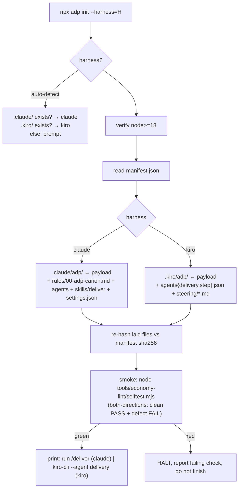
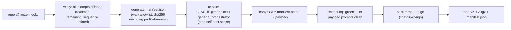

# Ship Solution — pack Agentic Delivery Pipeline (ADP) into installable harness package

> System = **Agentic Delivery Pipeline** (abbrev **ADP**; lowercase `adp` = package/CLI/dir namespace). How to pack files ADP needs at RUNTIME into one convenient install package, drop into target harness (Claude Code | Kiro), wire single-command pipeline. Build-only scaffolding stays behind.

# Register
Terse caveman. Substance stays, fluff dies. Pattern: [thing] [action] [reason].

# Operator model (from generic-workflow + generic-usage-guide)
Consumer = client/product owner, no eng background. Drives via 3 checkpoints (A questions · B roadmap · C demo). 5 phases (understand→plan→decide→design→build), two rhythms (skeleton once, then slices). Finish line = **accepted demo on staging** (workflow §8); production release out of scope. **Stack = per-project DECISION at Decide phase, NOT fixed at install** (workflow §9) — same pipeline ships TS app, Python service, Terraform, data pipeline. Greenfield + brownfield = same package (brownfield just reads existing code first). These shape the ship rules below: stack-agnostic payload, staging = user runtime config (not packed).

---

## 1. Decision (TL;DR)

Ship **npm package** `agentic-delivery-pipeline` (bin `adp`) + `npx adp init` installer. Node already required (lint tool = `lint.mjs`, zero deps), so npm = cheapest convenient channel — one tool installs system AND runs its gate. Package = role library + runtime canon + harness adapters + operator docs. Build-time scaffolding (`.aprd .adr .hld .roadmap _fixtures _test_bench*`) EXCLUDED — those are how system was BUILT, not what it RUNS.

`npx adp init --harness=claude|kiro` lays files into user project, wires launcher + permissions, runs `selftest.mjs` smoke check. Tarball artifact (`adp-vX.Y.Z.tgz`) + `manifest.json` (sha256 per file) = the shippable unit.

---

## 2. Runtime split — what ships vs what stays

Core question: which files does system READ to OPERATE on a user's project, vs which were only inputs to building the prompts. Disk-artifact pipeline → runtime footprint = prompts + canon + tool + harness glue. Everything in `.aprd .adr .hld .roadmap _fixtures` is the SELF-HOST project's own frozen trees — at end-user runtime the pipeline GENERATES those fresh in the user's repo, so they must NOT be packed (stale + confusing + leak self-host internals).

| Tree / file | Ship? | Why |
|---|---|---|
| `prompts/<phase>/<ROLE>.md` (39 roles) | **SHIP** | THE deliverable. Role library pipeline executes. |
| `prompts/_step-runner.md`, `_economy-audit.md` | **SHIP** | Runtime executor + shared Layer-2 auditor. |
| `prompts/_orchestrator.md` | **SHIP (re-skin)** | Control loop. Current copy = self-host-flavored; generic delivery needs generic orchestrator (§7 gap). |
| `code-canon/<stack>.md` (typescript.md, terraform.md, …) | **SHIP whole library** | Stack = per-project Decide-phase choice (workflow §9), NOT install-time pin → ship ALL available profiles; Decide picks one per project. `agentic-delivery-pipeline.md` = self-host stack, EXCLUDE from delivery kit. |
| `tools/economy-lint/{lint,selftest}.mjs` + README | **SHIP** | Layer-1 gate, runs every verify. Zero deps (node:fs/path only). |
| `tools/fixtures/economy-lint/reference.md` | **SHIP** | `selftest.mjs` golden — needed for install smoke check + both-directions proof. |
| `tools/economy-audit/README.md` | **SHIP** | Auditor doc (actual auditor = `prompts/_economy-audit.md`). |
| `.claude/` adapter (agents + skill + settings) | **SHIP (per harness)** | Claude Code wiring. |
| `.kiro/` adapter (agents + steering) | **SHIP (per harness)** | Kiro wiring. |
| `CLAUDE.md` (generic canon) | **SHIP (re-skin)** | Always-on rules. Current copy = self-host rules; ship GENERIC standing rules (§7). |
| `docs/generic-*.md` | **SHIP** | Operator usage + workflow. |
| `.aprd .adr .hld .roadmap` | **STAY** | Double-exclude: (a) this project's frozen self-host WHAT/WHY/HOW; (b) at delivery runtime these are pipeline OUTPUTS written into the USER's repo (workflow §6 deliverables). Pack them → collide with what pipeline generates. |
| `_fixtures/` | **STAY** | Oracle for self-verifying the prompts during BUILD. End-user never grades pipeline's own prompts. (Lint selftest golden travels separately under `tools/fixtures/`.) |
| `_test_bench*`, `_ship`, `_brownfield-feature`, `.kiro/specs` | **STAY** | Sandbox / WIP / unused-native. Already gitignored or out-of-scope. |
| `docs/self-host-*` | **STAY** | Self-host build docs, not operator-facing. |

**Rule:** include = "pipeline reads it to act on a foreign project." Exclude = "input that produced the prompts." One line drift here = shipping self-host design as if it were the user's — never.

---

## 3. Package layout (what's inside the tarball)

```
adp-vX.Y.Z.tgz
├── package.json                 # name agentic-delivery-pipeline, bin: adp→init.mjs, files=manifest, NO runtime deps
├── manifest.json                # {version, files:[{path,sha256,harness}], harness-matrix}
├── bin/init.mjs                 # installer: detect harness, lay files, wire, smoke-check
├── payload/
│   ├── prompts/                 # role library + _step-runner + _economy-audit + _orchestrator
│   ├── code-canon/              # stack profiles ONLY (exclude self-host stack agentic-delivery-pipeline.md)
│   ├── tools/economy-lint/      # lint.mjs selftest.mjs README + fixtures/economy-lint/reference.md
│   ├── docs/                    # generic-usage-guide.md generic-workflow.md
│   ├── canon/CLAUDE.generic.md  # generic always-on rules (re-skinned)
│   └── adapters/
│       ├── claude/              # agents/{orchestrator,step-runner}.md · skills/deliver/SKILL.md · settings.json
│       └── kiro/                # agents/{delivery,step}.json · steering/*.md
```

**Single profile — DELIVERY (system users) only.** Package serves users running ADP on their own projects: generic launcher, full stack-canon library, operator docs. NO self-host content — self-host wiring (`selfhost` agent, `self-host` skill, `selfhost.json`), self-host docs (`docs/self-host-*`), self-host stack canon (`agentic-delivery-pipeline.md`), and the build scaffolding (`.aprd .adr .hld .roadmap _fixtures`) are all how ADP was BUILT, never shipped. No `--profile` flag exists.

### 3.1 Installed shape — ALL machinery under ONE harness dir (zero root pollution)

`init` lays the whole system into a single namespaced dir INSIDE the harness folder, not the project root. Operator's repo gains no system files at root — only the harness dir (which they already expect) + the artifact trees the pipeline GENERATES (the wanted deliverable, §below). Verified against Claude Code + Kiro behavior:

**Claude Code** — `.claude/adp/` holds the payload; native slots hold the thin glue:
```
your-project/
├── .claude/
│   ├── adp/{prompts, code-canon, tools, docs}   # ALL machinery, namespaced
│   ├── rules/00-adp-canon.md                     # generic canon — auto-loaded as memory (NO root CLAUDE.md needed)
│   ├── agents/{adp-orchestrator,adp-step-runner}.md
│   ├── skills/deliver/SKILL.md
│   └── settings.json
└── (.aprd .adr .hld .roadmap + staging build = pipeline OUTPUT, appears at runtime)
```
- **No root `CLAUDE.md`.** Claude Code does NOT auto-load `.claude/CLAUDE.md`, BUT loads `.claude/rules/*.md` as project memory → canon ships there, root stays clean. (Fallback if rules-load unwanted: 1-line root `CLAUDE.md` that `@import`s `.claude/adp/canon.md`.)
- **Path refs use `$CLAUDE_PROJECT_DIR`** (e.g. `$CLAUDE_PROJECT_DIR/.claude/adp/prompts/_orchestrator.md`) — robust when operator launches from a subdir; bare relative paths break there.
- **`adp-` prefix** on agent/skill names → no collision with operator's own `.claude/agents`.

**Kiro** — already harness-native; nest payload under `.kiro/adp/`:
```
your-project/
└── .kiro/
    ├── adp/{prompts, code-canon, tools, docs}
    ├── agents/{delivery,step}.json               # prompt: file://.kiro/adp/prompts/...
    └── steering/*.md                              # canon (Kiro auto-loads steering)
```
Kiro needs NO root file at all — agents + steering already live under `.kiro/`.

**The one thing that stays at root = the artifact trees** (`.aprd .adr .hld .roadmap` + staging build). Not pollution — that IS the deliverable (workflow §6 paper trail) the operator wants tracked in their VCS. Clean separation: operator can `.gitignore .claude/adp/` (machinery, swap on upgrade) while committing the artifact trees (outputs).

**Why this wins:** uninstall = delete one dir · upgrade = swap one dir (no scatter to hunt) · namespaced = no clash with operator's existing harness config · path refs are config, engine unchanged (P3). Lint path-type inference survives the move (`/prompts/` + `/.adr/` substrings still match under `.claude/adp/prompts/` and root `.adr/`).

---

## 4. Manifest · integrity · versioning

- **`manifest.json`** = source of truth for pack + install. Each entry `{path, sha256, harness}`. `pack` script COPIES only manifest-listed files (allowlist, not blacklist) → build scaffolding + self-host content cannot leak by accident.
- **Integrity:** installer re-hashes each laid file vs manifest sha256 → tamper/partial-download caught before first run. Whole tarball signed (sha256 + optional cosign).
- **Version:** semver, derived = `git describe` + content-hash of `prompts/` + locks. Lock-hash in manifest pins which frozen artifact set produced this build (audit trail: which `*.lock` generation shipped).
- **Immutability honored:** package is a SNAPSHOT; never edits user's frozen artifacts. `init` refuses to overwrite an existing populated `prompts/` unless `--force` (re-install = new version, not mutate — mirrors "never overwrite frozen").

---

## 5. Install flow (per harness)



Install = idempotent: re-run re-derives from disk, skips present+valid files, only fills gaps. Matches pipeline's own resume contract.

---

## 6. Pack flow (maintainer builds the artifact)



Pack runs the system's OWN gate on its payload (lint prompts clean, selftest both-directions) before tarball — system ships only what passes its own bar (verify-before-done).

---

## 7. Open items (gaps surfaced by file study — block the delivery shipment)

1. **Generic launcher missing (hard blocker).** `docs/generic-usage-guide.md` references `.claude/agents/orchestrator.md`, `.claude/skills/deliver/SKILL.md`, `.kiro/agents/delivery.json` — NONE exist in repo. Only self-host wiring present (`selfhost` agent, `self-host` skill, `selfhost.json`), which is NOT shipped. **No shipment until the generic launcher is authored** — it is the system user's only entrypoint.
2. **Orchestrator re-skin.** `prompts/_orchestrator.md` = self-host control loop (frozen phases 0–3, deliverable target pinned). Generic delivery orchestrator = drives aPRD→roadmap→ADR→HLD→build on user request, runs all phases live. Either author generic orchestrator or parameterize the existing one (workspace-root + deliverable-target already abstracted — leans toward parameterize).
3. **`CLAUDE.md` re-skin.** Repo `CLAUDE.md` = self-host project rules. Generic canon = phase order, artifact conventions, never-overwrite-frozen, verify-before-done, caveman register — strip self-host specifics.
4. **Stack canon = ship whole library, NOT install-pin.** Stack chosen per project at Decide phase (workflow §9), so install must stay stack-agnostic: ship ALL `code-canon/*.md` profiles (minus self-host); Decide selects one per run; missing stack → six-field-contract template the pipeline fills. NO `--stack` flag at `init`.
5. **Staging not packed.** Finish line = staging (workflow §8) but staging = USER's env. Package ships pipeline + canon only; staging creds/target = runtime config user supplies, never in tarball.

Re-skins 1–3 = mechanical, no new engine — confined to the adapter/canon layer (P3: fix at edge, engine unchanged). Items 4–5 = install-policy, already satisfied by §2/§3 rules.

---

## 8. Next step

1. Author generic launcher trio (delivery orchestrator + `deliver` skill + `delivery.json`) — unblocks delivery profile.
2. Write `bin/init.mjs` + `manifest.json` generator + `pack` script.
3. Wire pack gate (lint payload + selftest) into a `make pack` target.
4. Dry-run `init` into scratch project both harnesses, confirm `/deliver` + `kiro-cli --agent delivery` launch clean.
