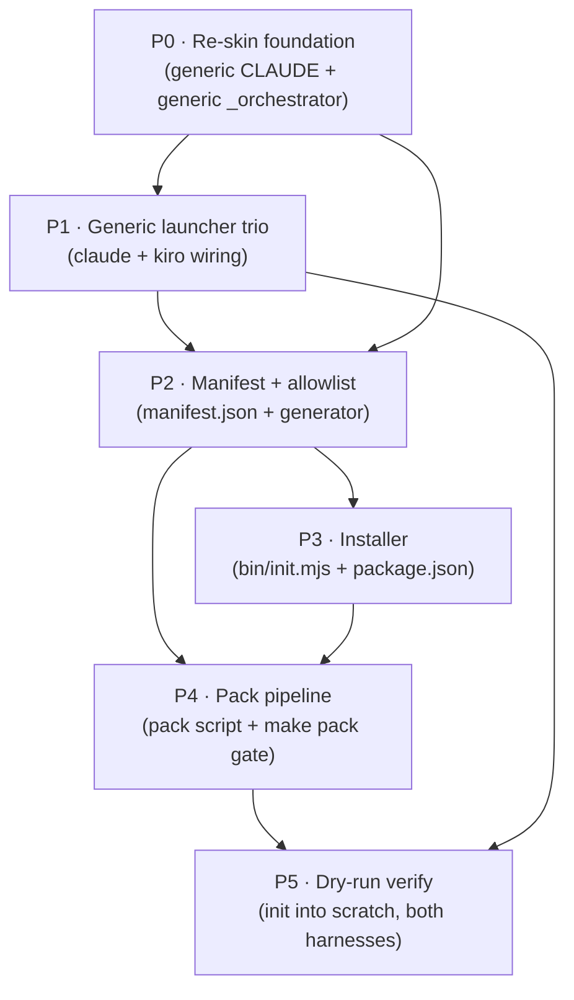
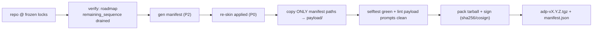

# Ship Roadmap — build + ship ADP as installable harness package

> Roadmap turns `_ship/00-solution.md` decision into ordered build. Target: `npx adp init --harness=claude|kiro` lays runtime payload into user project, wires launcher, smoke-checks. Source = `00-solution.md` §§2–8. Each milestone = on-disk deliverable + done-bar.

# Register
Terse caveman. Substance stays, fluff dies. [thing] [action] [reason].

---

## State now (from file study)

| Need | Present? | Gap |
|---|---|---|
| 39 role prompts | ✅ `prompts/0*/` | none |
| `_step-runner`, `_economy-audit` | ✅ | none |
| `_orchestrator.md` | ⚠️ self-host-flavored | re-skin → generic (§7.2) |
| stack canon library | ⚠️ only `typescript.md` (+ self-host stack) | thin lib OK to ship; self-host stack excluded |
| `tools/economy-lint` + fixtures | ✅ zero-dep | none |
| `docs/generic-*.md` | ✅ | none |
| generic CLAUDE canon | ❌ repo `CLAUDE.md` = self-host | re-skin → generic (§7.3) |
| **generic launcher (claude)** | ❌ only self-host wiring | author `adp-orchestrator` agent + `deliver` skill + `settings.json` (§7.1) |
| **generic launcher (kiro)** | ❌ only `selfhost.json`+`step.json` | author `delivery.json` + generic steering (§7.1) |
| `bin/init.mjs` | ❌ | author installer (§5) |
| `manifest.json` + generator | ❌ | author allowlist walker (§4) |
| `package.json` (name/bin) | ❌ | author |
| `pack` script + `make pack` gate | ❌ | author (§6) |

**Critical path = launcher trio.** No shipment until system user has entrypoint (§7.1 hard blocker).

---

## Invariant — self-host stays operational `[binds every phase]`

ADP devs set up by **cloning repo + starting harness with repo root = cwd**. That launch path MUST keep working unchanged after all ship work. Ship work is therefore **strictly ADDITIVE**: generic variants = NEW sibling files; pack copies them into `payload/` (allowlist). NEVER mutate or delete a self-host launch-from-root dependency.

**Protected files (touch = break clone-and-run):**

| File | Role at repo-root launch | Ship rule |
|---|---|---|
| root `CLAUDE.md` | self-host always-on rules (auto-loaded) | **keep as-is.** Generic canon = NEW `canon/CLAUDE.generic.md`. |
| `prompts/_orchestrator.md` | self-host control loop (deliverable pinned, phases 0–3 frozen) | **keep as-is.** Generic = NEW `prompts/_orchestrator.generic.md`. |
| `.claude/skills/self-host/SKILL.md` | `/self-host` entrypoint → invokes `_orchestrator.md` w/ root `.` + `agentic-delivery-pipeline` target | keep. Generic = NEW `adapters/claude/skills/deliver/`. |
| `.claude/agents/step-runner.md` | clean-room verifier (Claude) | keep. Adapter copy is additive. |
| `.kiro/agents/{selfhost,step}.json`, `.kiro/steering/*.md` | self-host Kiro launch | keep. Generic = NEW `adapters/kiro/{agents/delivery.json,steering/}`. |
| `code-canon/agentic-delivery-pipeline.md` | self-host stack (D21) | keep in repo; EXCLUDE from payload only. |
| `.aprd .adr .hld .roadmap _fixtures` | self-host frozen trees + oracle | keep in repo; EXCLUDE from payload only. |

Pack is **non-destructive**: copies ONLY manifest paths → `payload/`, never edits originals. New root files (`package.json`, `bin/`, `manifest.json`, `Makefile`) are net-new (none exist today → no clobber) and do not alter harness-from-root behavior.

**Enforced by P0 (additive authoring), P2 (manifest excludes self-host), P5.4 (self-host regression gate).**

---

## Phase DAG

P0 unblocks P1 (launcher references generic canon) AND P2 (manifest lists re-skinned files). P1 + P2 feed P3 (installer lays manifest files incl launcher). P3 + P2 feed P4 (pack runs gate, emits tarball). P4 → P5 (install the real artifact).

---

## P0 — Re-skin foundation `[blocker for all]`

Mechanical, no new engine (§7 P3: fix at edge). Strip self-host scope, keep canon. **ADDITIVE — new sibling files, NEVER edit root `CLAUDE.md` or self-host `prompts/_orchestrator.md`** (see Invariant).

- **P0.1 `canon/CLAUDE.generic.md`** `[NEW file]` — generic always-on rules. Keep: phase order, artifact conventions, never-overwrite-frozen, verify-before-done, caveman register. Drop: self-host project specifics (deliverable=prompts lib, root trees). Root `CLAUDE.md` untouched. Source = §7.3.
- **P0.2 `prompts/_orchestrator.generic.md`** `[NEW file]` — drive aPRD→roadmap→ADR→HLD→build live on user request, all 5 phases live, deliverable-target + workspace-root taken from launcher (not pinned). Authored as SIBLING — self-host `_orchestrator.md` (frozen phases 0–3, D21 target) stays byte-identical. Pack maps `_orchestrator.generic.md` → `payload/prompts/_orchestrator.md` via manifest path-mapping (P2.1). Source = §7.2.

**Done-bar:** both NEW files lint clean (caveman + economy); zero `self-host`/`.aprd.frozen`-style refs in generic copies; generic orchestrator runs all 5 phases. **Regression: `git status` shows root `CLAUDE.md` + `prompts/_orchestrator.md` UNMODIFIED.**

---

## P1 — Generic launcher trio `[hard blocker — §7.1]`

System user's ONLY entrypoint. Two harness adapters, authored under NEW `adapters/` tree. **Self-host wiring (`.claude/skills/self-host/`, `.claude/agents/step-runner.md`, `.kiro/agents/{selfhost,step}.json`, `.kiro/steering/`) left intact** — devs still launch from root via `/self-host`.

- **P1.1 Claude adapter**
  - `adapters/claude/agents/adp-orchestrator.md` — wraps P0.2 orchestrator. `adp-` prefix = no collision (§3.1).
  - `adapters/claude/agents/adp-step-runner.md` — wrap `_step-runner`.
  - `adapters/claude/skills/deliver/SKILL.md` — `/deliver` entrypoint.
  - `adapters/claude/settings.json` — permissions + launcher wiring.
  - `adapters/claude/rules/00-adp-canon.md` — = P0.1, auto-loaded as memory (no root CLAUDE.md).
  - Path refs use `$CLAUDE_PROJECT_DIR/.claude/adp/...` (§3.1, subdir-robust).
- **P1.2 Kiro adapter**
  - `adapters/kiro/agents/delivery.json` — `prompt: file://.kiro/adp/prompts/_orchestrator.md`.
  - `adapters/kiro/agents/step.json` — generic (not `selfhost`).
  - `adapters/kiro/steering/*.md` — = P0.1 canon (Kiro auto-loads steering).

**Done-bar:** `docs/generic-usage-guide.md` refs all resolve to real files. Manual launch in scratch repo: `/deliver` (claude) + `kiro-cli --agent delivery` (kiro) both boot orchestrator.

---

## P2 — Manifest + allowlist `[leak guard]`

`manifest.json` = source of truth for pack+install. Allowlist not blacklist → build scaffolding + self-host CANNOT leak (§4).

- **P2.1 `manifest.json` schema** — `{version, files:[{src, path, sha256, harness}], harness-matrix}`. `src`=repo source, `path`=payload dest → supports **path-mapping** (e.g. `_orchestrator.generic.md`→`prompts/_orchestrator.md`, `CLAUDE.generic.md`→`canon/CLAUDE.generic.md`) so generic siblings ship under canonical names WITHOUT renaming self-host originals.
- **P2.2 generator script** — walk allowlist (the §2 SHIP rows), sha256 each, tag harness. EXCLUDE (stay in repo for devs, never packed): `.aprd .adr .hld .roadmap _fixtures _test_bench* _ship _brownfield-feature`, `code-canon/agentic-delivery-pipeline.md`, `docs/self-host-*`, ALL self-host wiring (`skills/self-host`, `agents/step-runner.md`, `selfhost.json`, self-host steering), self-host `_orchestrator.md`, root `CLAUDE.md`.
- **P2.3 version derive** — semver = `git describe` + content-hash(`prompts/`) + lock-hash. Lock-hash pins frozen-set generation (§4 audit trail).

**Done-bar:** generator emits manifest listing ONLY §2 SHIP files; grep manifest for any exclude term = empty; sha256 reproducible across two runs (clean tree).

---

## P3 — Installer `bin/init.mjs` + `package.json` `[user-facing]`

Zero runtime deps (node:fs/path only — matches lint tool). Idempotent, mirrors resume contract (§5).

- **P3.1 `package.json`** — name `agentic-delivery-pipeline`, `bin: adp→bin/init.mjs`, `files`=payload+manifest, NO deps.
- **P3.2 `bin/init.mjs`** flow (§5):
  - detect harness (`--harness` | auto: `.claude/`→claude, `.kiro/`→kiro, else prompt)
  - verify node>=18
  - read `manifest.json`
  - lay payload → `.claude/adp/` (+ rules/agents/skills/settings) | `.kiro/adp/` (+ agents/steering)
  - re-hash each laid file vs manifest sha256 (integrity, §4)
  - smoke: `node tools/economy-lint/selftest.mjs` (both-directions: clean PASS + defect FAIL)
  - green → print launch cmd; red → HALT, report failing check
- **P3.3 idempotency + immutability** — skip present+valid files, fill gaps only. Refuse overwrite populated `prompts/` w/o `--force` (§4, never-overwrite-frozen).

**Done-bar:** `init` into empty scratch lays full tree under one harness dir, zero root pollution (except generated artifact trees); re-run = no-op; tamper a file → integrity catch; `--force` re-install works.

---

## P4 — Pack pipeline `[ships only what passes own bar]`

Pack runs system's OWN gate on payload before tarball (§6, verify-before-done).

- **P4.1 `pack` script** — verify→manifest→copy→gate→tarball→sign.
- **P4.2 `make pack` target** — wraps P4.1; gate = lint payload prompts + selftest both-directions.
- **P4.3 signing** — tarball sha256 (+ optional cosign).

**Done-bar:** `make pack` emits `adp-vX.Y.Z.tgz` + `manifest.json`; gate red (planted defect in payload) → pack HALTs; gate green → tarball contains exactly manifest files.

---

## P5 — Dry-run verify both harnesses `[acceptance]`

Install the REAL artifact, confirm launch (§8.4).

- **P5.1 Claude scratch** — fresh project, `npx adp init --harness=claude`, run `/deliver`, confirm orchestrator boots, drives a trivial slice.
- **P5.2 Kiro scratch** — fresh project, `init --harness=kiro`, `kiro-cli --agent delivery`, confirm boot.
- **P5.3 lint survives move** — path-type inference still matches under `.claude/adp/prompts/` + root `.adr/` (§3.1).
- **P5.4 self-host regression gate** `[Invariant proof]` — in a FRESH clone of post-ship repo, start harness at repo root, run `/self-host status` (claude) + `kiro-cli --agent selfhost` (kiro). Confirm: orchestrator boots, RE-RANK derives state from disk, names next unshipped prompt. `git diff` of ship branch shows root `CLAUDE.md` + `prompts/_orchestrator.md` + self-host wiring all UNCHANGED (additions only).

**Done-bar:** both harnesses boot DELIVERY launcher clean from installed tarball (not repo); smoke selftest green post-install; lint path inference intact; **self-host launch-from-root still operational on fresh clone (P5.4).**

---

## Sequencing

```mermaid
gantt
  title Build order (dependency-gated, not calendar)
  dateFormat X
  axisFormat %s
  section Foundation
  P0 re-skin            :p0, 0, 1
  section Launcher
  P1 trio (claude+kiro) :p1, after p0, 1
  section Packaging
  P2 manifest           :p2, after p0, 1
  P3 installer          :p3, after p2, 1
  P4 pack pipeline      :p4, after p3, 1
  section Accept
  P5 dry-run verify     :p5, after p4, 1
```

P1 + P2 parallel after P0 (independent: launcher authoring vs manifest tooling). P3 needs both. P4 needs P3. P5 last.

---

## Risks / watch

- **Self-host breakage (cross-cutting)** — biggest risk: re-skin/parameterize mutating a clone-and-run dependency (root `CLAUDE.md`, self-host `_orchestrator.md`, self-host wiring). Mitigate: additive-only authoring (Invariant) + P5.4 regression gate + manifest excludes self-host so no accidental overwrite-by-pack.
- **Re-skin drift (P0)** — one self-host line leaking into generic canon ships self-host design as user's (§2 rule). Mitigate: grep gate in pack for self-host tokens.
- **Thin stack lib** — only `typescript.md` real today. Acceptable: missing stack → six-field-contract template pipeline fills at Decide (§7.4). No `--stack` flag.
- **Orchestrator parameterize vs fork (P0.2)** — prefer parameterize (less divergence); fork only if frozen-phase coupling too deep.
- **Staging out of scope** — package ships pipeline+canon only; staging creds = user runtime config, never packed (§7.5).

---

## Definition of shippable

All hold:
1. Launcher trio authored, both harnesses boot (P1, P5).
2. Manifest = allowlist, zero self-host/scaffold leak (P2, P4 grep gate).
3. `init` idempotent + integrity-checked + immutability-honored (P3).
4. Pack runs own gate (lint payload + selftest both-directions) before tarball (P4).
5. Real-artifact dry-run green on Claude + Kiro (P5).
6. **Self-host stays operational: fresh clone + harness-at-root launches `/self-host` unchanged; ship diff = additions only (P5.4, Invariant).**
