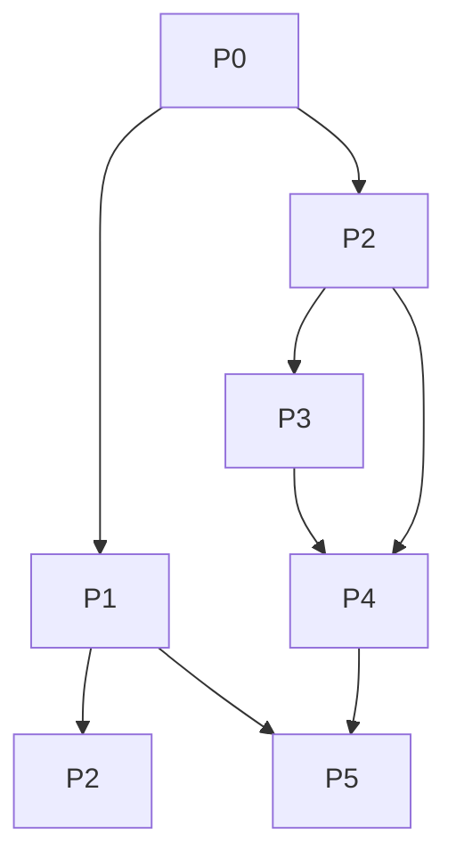

# Ship Tasks — index

> Navigation only. Each task file below = SELF-CONTAINED (full scope inline, no cross-read needed). Pick task, read it alone, execute.

## Register (applies every task + all output)
Terse caveman. Substance stays, fluff dies. Pattern: [thing] [action] [reason]. Drop articles/filler/hedging.

## What ADP is (one-liner)
**Agentic Delivery Pipeline** = library of executable AI prompts that drive a SW project rough-request→verified-software through 5 phases (understand→plan→decide→design→build), 3 consumer checkpoints (questions·roadmap·demo). Ship goal = pack ADP RUNTIME into npm package `agentic-delivery-pipeline` (bin `adp`), `npx adp init --harness=claude|kiro` lays it into user project + wires launcher + smoke-checks.

## Task list (dependency order)

| Task | Phase | Blocks | Gist |
|---|---|---|---|
| `01-P0-reskin-foundation.md` | P0 | all | NEW generic `CLAUDE.generic.md` + `_orchestrator.generic.md` (siblings, self-host originals untouched) |
| `02-P1-launcher-trio.md` | P1 | P5 | NEW `adapters/{claude,kiro}` generic launcher wiring (hard blocker — user's only entrypoint) |
| `03-P2-manifest-allowlist.md` | P2 | P3,P4 | `manifest.json` schema + generator (allowlist, leak guard, path-mapping) |
| `04-P3-installer.md` | P3 | P4 | `package.json` + `bin/init.mjs` (zero-dep, idempotent, integrity-checked) |
| `05-P4-pack-pipeline.md` | P4 | P5 | `pack` script + `make pack` gate (runs own lint+selftest before tarball) |
| `06-P5-dryrun-verify.md` | P5 | — | install REAL artifact both harnesses + self-host regression gate |

## DAG

P1 + P2 parallel after P0. P3 needs both. P4 needs P3. P5 last.

## Definition of shippable (all hold)
1. Launcher trio authored, both harnesses boot (P1,P5).
2. Manifest = allowlist, zero self-host/scaffold leak (P2,P4 grep gate).
3. `init` idempotent + integrity-checked + immutability-honored (P3).
4. Pack runs own gate (lint payload + selftest both-directions) before tarball (P4).
5. Real-artifact dry-run green Claude + Kiro (P5).
6. Self-host stays operational: fresh clone + harness-at-root launches `/self-host` unchanged; ship diff = additions only (P5.4).
