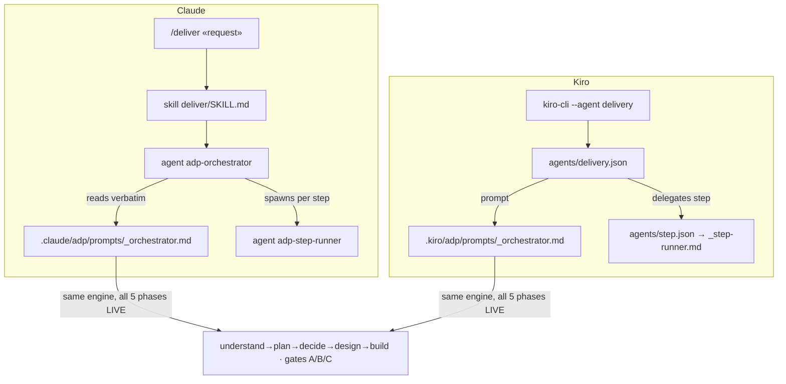

# Task P1 — Generic launcher trio (claude + kiro adapters)

> SELF-CONTAINED. Everything inline. HARD BLOCKER: this = system user's ONLY entrypoint. No shipment without it.

## Register (binds task + every file you write)
Terse caveman. Substance stays, fluff dies. [thing] [action] [reason]. Drop articles/filler/hedging. Literal/uncorrupted: JSON/YAML keys+values, identifiers, code syntax.

## Context — what system is
**Agentic Delivery Pipeline (ADP)** = library of executable AI prompts (`prompts/<phase>/<ROLE>.md`, 39 roles) driving a SW project rough-request→verified-software through 5 phases (understand→plan→decide→design→build). Ships as npm package; `npx adp init` lays runtime into user project + wires a LAUNCHER. End-user starts pipeline via that launcher. Today only SELF-HOST wiring exists (`/self-host` skill, `selfhost.json`) — NOT shipped. Generic launcher = MISSING = this task.

## Prereq from P0 (assume done)
P0 produced NEW generic siblings:
- `canon/CLAUDE.generic.md` — generic always-on rules.
- `prompts/_orchestrator.generic.md` — generic control loop, drives all 5 phases live, deliverable-target + workspace-root from launcher.
This task wires those into harness adapters.

## INVARIANT — self-host stays operational `[hard constraint]`
ADDITIVE ONLY. New `adapters/` tree. NEVER edit/delete existing self-host wiring: `.claude/skills/self-host/SKILL.md`, `.claude/agents/step-runner.md`, `.kiro/agents/{selfhost,step}.json`, `.kiro/steering/*.md`. Devs still launch from root via `/self-host`.

## Installed shape this wiring targets (why path refs look the way they do)
`init` lays ALL machinery under ONE harness dir (zero root pollution):
- **Claude:** payload → `.claude/adp/{prompts,code-canon,tools,docs}`; glue → `.claude/{rules,agents,skills,settings.json}`. Path refs MUST use `$CLAUDE_PROJECT_DIR/.claude/adp/...` (subdir-robust; bare relative breaks when operator launches from subdir). Agent/skill names get `adp-` prefix (no collision with operator's own `.claude/agents`). Claude Code does NOT auto-load `.claude/CLAUDE.md` but DOES load `.claude/rules/*.md` as memory → canon ships to `rules/`.
- **Kiro:** payload → `.kiro/adp/{prompts,...}`; glue → `.kiro/agents/*.json` (`prompt: file://.kiro/adp/prompts/...`) + `.kiro/steering/*.md` (Kiro auto-loads steering).

## Reference — existing self-host kiro agents (shape to mirror, generic-ized)
```json
// .kiro/agents/selfhost.json (self-host — DO NOT EDIT, mirror shape)
{ "name":"selfhost", "description":"...", "prompt":"file://./prompts/_orchestrator.md",
  "resources":["file://.kiro/steering/**/*.md"], "tools":["read","write"],
  "allowedTools":["read"], "model":"claude-sonnet-4" }
// .kiro/agents/step.json
{ "name":"step", "description":"Runs one pipeline step...", "prompt":"file://./prompts/_step-runner.md",
  "resources":["file://.kiro/steering/**/*.md"], "tools":["read","write"], "model":"claude-sonnet-4" }
```
`docs/generic-usage-guide.md` already references these target names: `.claude/agents/orchestrator.md`, `.claude/skills/deliver/SKILL.md`, `.kiro/agents/delivery.json` — author so those refs resolve.

## Scope

### P1.1 — Claude adapter (under NEW `adapters/claude/`)
- `agents/adp-orchestrator.md` — wraps P0.2 generic orchestrator (`prompts/_orchestrator.generic.md`, installed at `.claude/adp/prompts/_orchestrator.md`). `adp-` prefix. Spawns role agents. Path refs `$CLAUDE_PROJECT_DIR/.claude/adp/...`.
- `agents/adp-step-runner.md` — wraps `_step-runner` (clean-room executor; reads given role prompt, runs verbatim against project, writes outputs, fresh context per step). Source self-host copy = `.claude/agents/step-runner.md` (read for shape; do NOT edit it).
- `skills/deliver/SKILL.md` — `/deliver` entrypoint. Thin launcher; frontmatter `name: deliver`, `description: Run delivery pipeline on a request (aPRD → roadmap → ADR → HLD → build)`. Invokes adp-orchestrator.
- `settings.json` — permissions launcher needs: Read/Write/Edit (artifact management, no prompt), Agent (orchestrator spawns role agents), `acceptEdits` auto-approve writes (still ask before shell). 
- `rules/00-adp-canon.md` — = P0.1 generic canon (`canon/CLAUDE.generic.md` content), auto-loaded as memory. (Pack maps it here; you may reference P0.1 as source.)

### P1.2 — Kiro adapter (under NEW `adapters/kiro/`)
- `agents/delivery.json` — generic orchestrator. `prompt: file://.kiro/adp/prompts/_orchestrator.md`. `resources: ["file://.kiro/steering/**/*.md"]`. Lean context (steering only, role prompts lazy-loaded). Name `delivery`.
- `agents/step.json` — generic step runner. `prompt: file://.kiro/adp/prompts/_step-runner.md`. (Generic, NOT `selfhost`.)
- `steering/*.md` — = P0.1 canon + exclusivity steering (`00-exclusive.md`: "run delivery pipeline exclusively, Kiro built-in spec flow NOT used").

## Steps
1. Read P0.2 `prompts/_orchestrator.generic.md`, self-host `.claude/agents/step-runner.md`, `.claude/skills/self-host/SKILL.md`, `.kiro/agents/*.json`, `docs/generic-usage-guide.md` (for target names + step text).
2. Author `adapters/claude/` files (P1.1).
3. Author `adapters/kiro/` files (P1.2).
4. Lint prose files: `node tools/economy-lint/lint.mjs adapters/claude/**/*.md adapters/kiro/**/*.md`.
5. Validate JSON: `node -e 'for(f of process.argv.slice(1))JSON.parse(require("fs").readFileSync(f))' adapters/kiro/agents/*.json`.
6. `git status` → only NEW files; self-host wiring UNMODIFIED.

## Done-bar
- All `adapters/{claude,kiro}` files authored; JSON valid; prose lint clean.
- `docs/generic-usage-guide.md` refs (orchestrator/deliver SKILL/delivery.json) all resolve to real authored files.
- Manual launch in scratch repo: `/deliver` (claude) + `kiro-cli --agent delivery` (kiro) both boot orchestrator. (Full real-artifact dry-run = P5.)
- Self-host wiring untouched (`git status`).

## Deps
Needs P0 (refs generic canon + generic orchestrator). Parallel with P2. Feeds P3 (installer lays these) + P5 (dry-run boots them).

---

## STATUS — DONE

Launcher trio authored, additive only. Self-host wiring UNMODIFIED (`git status` = only new `adapters/`).

### Files (NEW `adapters/`)
```
adapters/
├── claude/
│   ├── agents/adp-orchestrator.md   # wraps .claude/adp/prompts/_orchestrator.md; spawns adp-step-runner; $CLAUDE_PROJECT_DIR/.claude/adp/... refs
│   ├── agents/adp-step-runner.md    # clean-room executor, fresh context/step, Sonnet/High
│   ├── skills/deliver/SKILL.md      # /deliver entry; name: deliver; invokes adp-orchestrator
│   ├── rules/00-adp-canon.md        # POINTER → canon/CLAUDE.generic.md (installer inlines; auto-loaded as memory)
│   └── settings.json                # allow Read/Write/Edit/Agent; acceptEdits; Bash NOT listed → shell still asks
└── kiro/
    ├── agents/delivery.json         # generic orchestrator; prompt file://.kiro/adp/prompts/_orchestrator.md; steering-only resources
    ├── agents/step.json             # generic step runner; prompt file://.kiro/adp/prompts/_step-runner.md
    ├── steering/00-exclusive.md     # run pipeline exclusively, Kiro spec flow NOT used
    └── steering/10-canon.md         # POINTER → canon/CLAUDE.generic.md (installer inlines; Kiro auto-loads steering)
```

### Boot flow


### Acceptance
- [x] All `adapters/{claude,kiro}` files authored.
- [x] JSON valid (`delivery.json`, `step.json` parse).
- [x] Prose lint clean (6/6 files `verdict: clean`).
- [x] Docs refs resolve: `deliver/SKILL.md` + `delivery.json` exact; orchestrator agent = `adp-orchestrator.md` (`adp-` prefix per installed-shape rule, supersedes doc's pre-prefix `orchestrator.md`).
- [x] Self-host UNTOUCHED — `git status` only new `adapters/`; `.claude/skills/self-host/`, `.claude/agents/step-runner.md`, `.kiro/agents/{selfhost,step}.json`, `.kiro/steering/*.md` unchanged.
- [~] Scratch-repo `/deliver` + `kiro-cli --agent delivery` boot = structural-ready (paths target installed `.claude/adp` / `.kiro/adp` locations); live boot = P3 installer + P5 dry-run.

### Notes
- DRY: canon NOT copied. `rules/00-adp-canon.md` + `steering/10-canon.md` = pointers to single home `canon/CLAUDE.generic.md`; installer (P3/P4) inlines content at install time (task permits "reference P0.1 as source").
- Engine unchanged: adapters wire harness params + paths only; never edit loop body.
