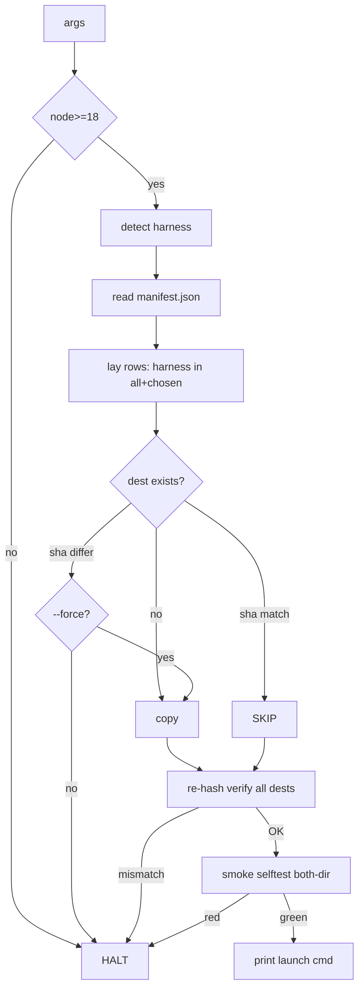

# Task P3 — Installer `bin/init.mjs` + `package.json`

> SELF-CONTAINED. Everything inline.

## Register (binds task + every file you write)
Terse caveman. Substance stays, fluff dies. [thing] [action] [reason]. Literal/uncorrupted: JSON keys+values, identifiers, code syntax.

## Context — what system is
**Agentic Delivery Pipeline (ADP)** ships as npm package `agentic-delivery-pipeline` (bin `adp`). End-user runs `npx adp init --harness=claude|kiro` → installer lays runtime payload into their project, wires launcher, smoke-checks. This task = the installer + package manifest.

## Prereq from P2 (assume done)
`manifest.json` exists = `{version, files:[{src,path,sha256,harness}], harness-matrix}`. ALLOWLIST: only payload files listed; path-mapped dests; `harness` ∈ {all,claude,kiro}. Installer is manifest-DRIVEN — reads it, lays listed files, re-hashes vs sha256.

## Installed shape (where files land — zero root pollution)
ALL machinery under ONE harness dir; only generated artifact trees touch root.
- **Claude:**
  - payload → `.claude/adp/{prompts,code-canon,tools,docs}`
  - `.claude/rules/00-adp-canon.md` (canon, auto-loaded as memory — Claude does NOT auto-load `.claude/CLAUDE.md` but DOES load `.claude/rules/*.md`)
  - `.claude/agents/{adp-orchestrator,adp-step-runner}.md`
  - `.claude/skills/deliver/SKILL.md`
  - `.claude/settings.json`
- **Kiro:**
  - payload → `.kiro/adp/{prompts,code-canon,tools,docs}`
  - `.kiro/agents/{delivery,step}.json`
  - `.kiro/steering/*.md`
- Root gains NO system files — only `.aprd .adr .hld .roadmap` + staging build that pipeline GENERATES at runtime (the wanted deliverable, operator commits to VCS; can `.gitignore .claude/adp/` machinery).

## Scope

### P3.1 — `package.json`
- `name`: `agentic-delivery-pipeline`
- `bin`: `{ "adp": "bin/init.mjs" }`
- `files`: payload dir + `manifest.json` + `bin/`
- NO runtime deps (node:fs/path/crypto only — match lint tool which is zero-dep).
- `engines.node`: `>=18`.

### P3.2 — `bin/init.mjs` flow
1. **Detect harness** — `--harness=claude|kiro` flag; else auto: `.claude/` exists→claude, `.kiro/` exists→kiro, else PROMPT user.
2. **Verify** node >= 18 (else HALT clear msg).
3. **Read** `manifest.json`.
4. **Lay** payload per harness (installed shape above), filtering manifest `harness` field (`all` + chosen harness).
5. **Re-hash** each laid file, compare vs manifest `sha256` → tamper/partial-download caught BEFORE first run (integrity). Mismatch → HALT, name file.
6. **Smoke** — `node <laid>/tools/economy-lint/selftest.mjs` BOTH-DIRECTIONS: clean golden PASSes + planted-defect copy FAILs. Both must hold.
7. **Green** → print launch cmd (`/deliver` for claude · `kiro-cli --agent delivery` for kiro). **Red** → HALT, report failing check, do NOT finish.

### P3.3 — idempotency + immutability
- Idempotent: re-run re-derives from disk, SKIP files present+valid (sha256 match), fill gaps only (mirrors pipeline resume contract).
- Immutability: REFUSE to overwrite an existing populated `prompts/` unless `--force` (never-overwrite-frozen mirror). `--force` re-install = treat as new version.

## Steps
1. Read `manifest.json` (P2 output) for schema + field names.
2. Author `package.json` (P3.1).
3. Author `bin/init.mjs` (P3.2 + P3.3). Zero-dep, node:fs/path/crypto.
4. Test: `init` into empty scratch dir → full tree under one harness dir, zero root pollution.
5. Re-run → no-op (all skipped).
6. Tamper a laid file → integrity catch on re-run/verify.
7. `--force` → re-install works.

## Done-bar
- `init` into empty scratch lays full tree under one harness dir; zero root pollution (except generated artifact trees).
- Re-run = no-op (idempotent).
- Tamper a file → integrity catch (sha256 mismatch HALT).
- `--force` re-install works.
- Smoke selftest runs both-directions; red → HALT not finish.

## Deps
Needs P2 (reads manifest) + P1 (lays launcher files). Feeds P4 (pack invokes/ships installer).

---

## DONE — 2026-06-09

**Built:**
- `package.json` — `name: agentic-delivery-pipeline`, `bin.adp=bin/init.mjs`, `type:module`, `engines.node>=18`, `files`=[bin, manifest.json, payload dirs]. Zero deps.
- `bin/init.mjs` — manifest-DRIVEN installer. Node builtins only (fs/path/crypto/readline/child_process/url); zero npm deps.

**Flow (P3.2):** args → node>=18 gate → detect harness → read manifest → lay (filter harness) → re-hash verify → smoke selftest → green/launch.

**Dest map (installed shape, zero root pollution):**
- `adapters/<h>/REST` → `.<h>/REST` (glue: agents/rules/skills/steering/settings).
- everything else (prompts/code-canon/tools/docs/canon) → `.<h>/adp/<path>`.
- ALL machinery under one harness dir; root untouched.

**Harness detect:** `--harness=` flag → else `.claude`/`.kiro` exists → else prompt (TTY) / HALT demand-flag (no TTY + ambiguous).

**Idempotency + immutability (P3.3):**
- present + sha-match → SKIP (re-derive from disk; resume contract).
- present + sha-DIFFER → refuse overwrite, HALT name file (never-overwrite-frozen mirror) unless `--force`.
- `--force` → overwrite = new version; populated prompts/ flagged.

**Integrity:** re-hash every laid/present dest vs manifest sha256 → tamper/partial-download HALT before first run.

**Smoke:** spawn `node .<h>/adp/tools/economy-lint/selftest.mjs`; selftest internally asserts BOTH-DIRECTIONS (golden PASS + planted-defect FAIL), exits non-zero if either breaks → RED HALTs before "ADP ready".

**Done-bar — all PASS (tested in scratch dirs):**
- init → full tree one harness dir, zero root pollution. ✓ (claude 56 files, kiro 55; root = only `.claude`/`.kiro`).
- re-run = no-op (laid=0 skipped=all). ✓
- tamper laid file → integrity HALT naming file. ✓
- `--force` reinstall works; re-run after = no-op again. ✓
- smoke both-directions; RED → HALT not finish (verified via fake-pkg: integrity PASS + selftest exit1 → HALT, no "ADP ready"). ✓

**Run:** `npx adp init [--harness=claude|kiro] [--dir=<path>] [--force]` (default dir=cwd).

