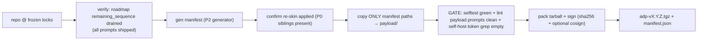

# Task P4 — Pack pipeline (`pack` script + `make pack` gate)

> SELF-CONTAINED. Everything inline.

## Register (binds task + every file you write)
Terse caveman. Substance stays, fluff dies. [thing] [action] [reason]. Literal/uncorrupted: JSON keys+values, identifiers, code syntax.

## Context — what system is
**Agentic Delivery Pipeline (ADP)** ships as npm tarball `adp-vX.Y.Z.tgz` + `manifest.json`. Pack = maintainer builds the shippable artifact. CORE PRINCIPLE: pack runs the system's OWN gate (lint + selftest) on its payload BEFORE tarball → system ships only what passes its own bar (verify-before-done).

## Prereqs (assume done)
- **P0:** `canon/CLAUDE.generic.md` + `prompts/_orchestrator.generic.md` (re-skinned siblings).
- **P1:** `adapters/{claude,kiro}/**` launcher wiring.
- **P2:** `manifest.json` (allowlist, `{src,path,sha256,harness}`, path-mapping) + generator.
- **P3:** `bin/init.mjs` + `package.json`.

## Pack flow

## Scope

### P4.1 — `pack` script (e.g. `tools/pack/pack.mjs`)
Zero-dep. Sequence:
1. **verify** — roadmap `remaining_sequence` drained (all prompts shipped). If unshipped prompts remain → HALT.
2. **gen manifest** — invoke P2 generator.
3. **copy** — ONLY manifest `path` entries → `payload/` (allowlist copy; path-mapping applied: `_orchestrator.generic.md`→`payload/prompts/_orchestrator.md`, `CLAUDE.generic.md`→canonical dest). NEVER edit originals (non-destructive).
4. **gate** (all must pass, else HALT):
   - `node tools/economy-lint/selftest.mjs` BOTH-DIRECTIONS (clean golden PASS + planted-defect FAIL).
   - lint payload prompts: `node tools/economy-lint/lint.mjs payload/prompts/**/*.md` clean.
   - self-host token grep on payload EMPTY: no `self-host|selfhost|agentic-delivery-pipeline\.md|\.aprd\.frozen` (re-skin-drift guard — one leaked line ships self-host design as user's).
5. **tarball** — pack `payload/` + `manifest.json` → `adp-vX.Y.Z.tgz`.
6. **sign** — emit tarball sha256 (P4.3).

### P4.2 — `make pack` target
Wraps P4.1. `Makefile` `pack:` target = net-new root file (none exists → no clobber). Gate = lint payload prompts + selftest both-directions (inside P4.1 step 4).

### P4.3 — signing
Tarball sha256 written beside artifact. Optional cosign hook (skip-if-absent).

## Steps
1. Read `manifest.json` + P2 generator + `tools/economy-lint/{lint,selftest}.mjs` for invocation.
2. Author `pack` script (P4.1).
3. Author `Makefile` `pack:` target (P4.2).
4. Run `make pack` on clean repo → emits `adp-vX.Y.Z.tgz` + `manifest.json`.
5. Plant a defect in a payload prompt (or break selftest golden) → confirm pack HALTs at gate (does NOT emit tarball).
6. Confirm tarball contains EXACTLY manifest files (extract + diff against manifest paths).

## Done-bar
- `make pack` emits `adp-vX.Y.Z.tgz` + `manifest.json`.
- Gate RED (planted defect in payload) → pack HALTs, no tarball.
- Gate GREEN → tarball contains exactly manifest files (no scaffold/self-host leak).
- Originals untouched (non-destructive copy).

## Deps
Needs P3 (+P2,P1,P0). Feeds P5 (P5 installs the REAL tarball).
