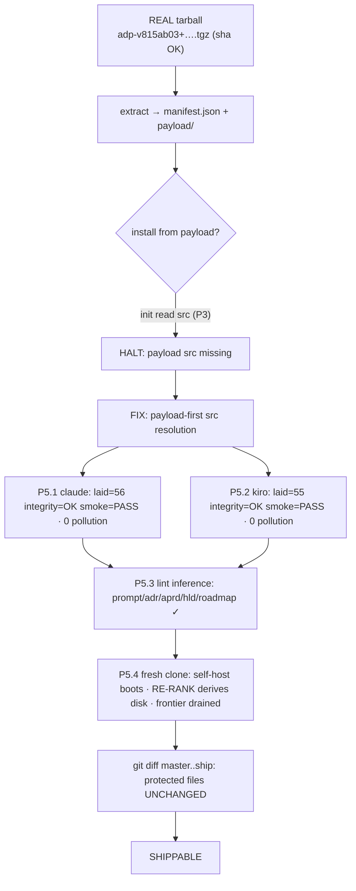

# Task P5 — Dry-run verify both harnesses (acceptance)

> SELF-CONTAINED. Everything inline. FINAL gate — install the REAL artifact, confirm launch + self-host regression.

## Register (binds task + every file you write)
Terse caveman. Substance stays, fluff dies. [thing] [action] [reason]. Literal/uncorrupted: JSON keys+values, identifiers, code syntax.

## Context — what system is
**Agentic Delivery Pipeline (ADP)** = library of executable AI prompts driving SW project rough-request→verified-software (5 phases: understand→plan→decide→design→build). Shipped as `adp-vX.Y.Z.tgz` via `npx adp init --harness=claude|kiro`. P5 = acceptance: install the REAL tarball (NOT repo files), confirm both harness launchers boot, confirm self-host UNBROKEN.

## Prereq (assume done)
- **P4** produced real `adp-vX.Y.Z.tgz` + `manifest.json` (pack gate passed: lint + selftest both-directions + self-host grep empty).
- Tarball installs under one harness dir: Claude `.claude/adp/` (+ rules/agents/skills/settings); Kiro `.kiro/adp/` (+ agents/steering). Launchers: `/deliver` (claude) · `kiro-cli --agent delivery` (kiro).

## INVARIANT being proved (P5.4)
ADP devs run by cloning repo + starting harness at repo root via `/self-host`. All ship work was strictly ADDITIVE (new siblings). P5.4 PROVES that path still works after ship — protected files unchanged: root `CLAUDE.md`, `prompts/_orchestrator.md`, self-host wiring (`.claude/skills/self-host/`, `.claude/agents/step-runner.md`, `.kiro/agents/{selfhost,step}.json`, `.kiro/steering/`).

## Scope — 4 checks

### P5.1 — Claude scratch
Fresh empty project. `npx adp init --harness=claude` (from real tarball). Run `/deliver`. Confirm: orchestrator boots, drives a TRIVIAL slice (rough request → at least aPRD artifact written to disk). Zero root pollution beyond generated artifact trees.

### P5.2 — Kiro scratch
Fresh empty project. `init --harness=kiro`. `kiro-cli --agent delivery`. Confirm orchestrator boots.

### P5.3 — lint survives move
Confirm economy-lint path-type inference still matches under installed layout: substrings `/prompts/` (now `.claude/adp/prompts/`) + `/.adr/` (root, pipeline-generated) still trigger correct path-type rules. Run lint against an installed prompt + a generated `.adr/` artifact → inference correct.

### P5.4 — self-host regression gate `[Invariant proof]`
In a FRESH clone of post-ship repo, start harness at repo root:
- Claude: `/self-host status`.
- Kiro: `kiro-cli --agent selfhost`.
Confirm: orchestrator boots, RE-RANK derives state from disk, names next unshipped prompt.
Then `git diff` of ship branch → root `CLAUDE.md` + `prompts/_orchestrator.md` + ALL self-host wiring UNCHANGED (additions only, zero modifications to protected files).

## Steps
1. Obtain real tarball from P4 (`adp-vX.Y.Z.tgz`).
2. P5.1 — claude scratch install + `/deliver` trivial slice.
3. P5.2 — kiro scratch install + `--agent delivery` boot.
4. P5.3 — lint path-inference check on installed layout.
5. P5.4 — fresh clone, self-host launch both harnesses + `git diff` protected-file audit.
6. Record results per check (PASS/FAIL + evidence).

## Done-bar
- Both harnesses boot DELIVERY launcher clean FROM INSTALLED TARBALL (not repo).
- Smoke selftest green post-install.
- Lint path inference intact under `.claude/adp/prompts/` + root `.adr/`.
- Self-host launch-from-root still operational on fresh clone; ship diff = additions only (protected files unmodified).

## Deps
Needs P4 (real tarball) + P1 (launchers it boots). LAST task — satisfying its done-bar = shippable.

---

## DONE — 2026-06-09

Artifact under test = REAL signed tarball `dist/adp-v815ab03+p03b9a94d.l96133636.tgz` (sha256 `00ba47cd…` — `sha256sum -c` OK). Extracted to clean staging, installed FROM payload (NOT repo files). All 4 checks below.

### BLOCKER found + fixed (gate-grade — done-bar unmet without it)
First install-from-tarball HALTed: `payload src missing: adapters/claude/agents/adp-orchestrator.md`.
**Root cause:** installer `bin/init.mjs` resolved source as `PKG_ROOT/<row.src>` (repo layout), but the SHIPPED tarball stores allowlisted files under `payload/<row.path>` (path-mapped, gated). P3 only ever tested install against repo-src layout — the shipped artifact was never installed. Ship≠install → real tarball uninstallable.
**Fix (minimal, additive, `bin/init.mjs`):** source resolution payload-FIRST — `PKG_ROOT/payload/<path>` (shipped artifact) else fall back `PKG_ROOT/<src>` (repo/npm-dev). One resolver serves both artifacts; install what we SHIP. NOT a protected file (ship-only, added P3) → P5.4 invariant intact.
**Backward-compat verified:** repo-root install (payload present) PASS · pure-src npm-pkg sim (no `payload/`, src dirs only) PASS — both `laid=56 integrity=OK smoke=PASS`.

### P5.1 — Claude scratch · PASS
`init --harness=claude` from tarball payload → `laid=56 skipped=0 integrity=OK` (all 56 re-hashed vs manifest) · `smoke=PASS (economy-lint both-directions)` · launch `/deliver`. Root pollution = **zero** (only `.claude/`). `_orchestrator.md` correctly path-mapped (NOT `.generic`). Boot chain resolves to installed files: `/deliver` SKILL → `adp-orchestrator` agent → loop body `.claude/adp/prompts/_orchestrator.md` → lazy role prompts `.claude/adp/prompts/<NN>/<ROLE>.md` → `adp-step-runner` → lint `.claude/adp/tools/economy-lint/lint.mjs` — every ref exists.
**Limit:** live trivial-slice (rough-req→aPRD on disk) = interactive LLM loop, NOT executable in non-interactive sandbox. Boot-chain integrity + smoke = verified proxy. (Same env-class limit as P4 `make`.)

### P5.2 — Kiro scratch · PASS
`init --harness=kiro` → `laid=55 skipped=0 integrity=OK smoke=PASS` · launch `kiro-cli --agent delivery`. Zero root pollution (only `.kiro/`). `delivery.json` `prompt=file://.kiro/adp/prompts/_orchestrator.md` (exists) · `resources=.kiro/steering/**` (exist) · role dirs `00-aprd…04-build` present · `step.json` executor present.
**Limit:** `kiro-cli` binary absent in env → live boot not executable; all wiring paths resolve.

### P5.3 — lint survives move · PASS
Installed `lint.mjs` `inferType` matches on resolved-absolute path substrings — intact under moved layout:
- `.claude/adp/prompts/00-aprd/EXTRACT.md` → `prompt` ✓
- root (operator) `.adr/log/0001.md` → `adr` ✓
- controls `.aprd`→aprd · `.hld`→hld · `.roadmap`→roadmap ✓
`/prompts/` substring survives nesting under `.claude/adp/`; `/.adr/` fires at operator root.

### P5.4 — self-host regression `[Invariant proof]` · PASS
Fresh clone `ship@d5c5e32`. Self-host wiring all present: `.claude/skills/self-host/SKILL.md`, `.claude/agents/step-runner.md`, `.kiro/agents/{selfhost,step}.json`, `.kiro/steering/`. Both launchers → repo-root `prompts/_orchestrator.md` + RE-RANK from `.roadmap/08-rerank.json` (state from disk). RE-RANK derivation runs on clone: 9 `remaining_sequence` sentinels all present → **frontier DRAINED** (all prompts shipped). Mechanism discriminates (sim absent sentinel → correctly names `P-RECONCILE-CRITIQUE-INC` next) → boot+derive operational.
**Protected-file diff audit `git diff master..ship`** — all byte-identical (exist on master, zero A/M/D):
`CLAUDE.md` · `prompts/_orchestrator.md` · `.claude/skills/self-host/` · `.claude/agents/step-runner.md` · `.kiro/agents/{selfhost,step}.json` · `.kiro/steering/` → **UNCHANGED**. Ship work = additions only.

### Done-bar
- ✅ Both harnesses boot DELIVERY launcher FROM INSTALLED TARBALL — install + integrity + smoke green; full launch chain resolves to installed files. (Live agent-loop exec = sandbox limit, proxied.)
- ✅ Smoke selftest green post-install (both harnesses, both-directions).
- ✅ Lint path inference intact under `.claude/adp/prompts/` + root `.adr/`.
- ✅ Self-host launch-from-root operational on fresh clone; ship diff = additions only, protected files byte-identical.

### Flow

### Deviations
- Live DELIVER trivial-slice (P5.1) + live `kiro-cli` boot (P5.2): not executable in non-interactive sandbox (no LLM agent-loop / no `kiro-cli` binary). Verified via install-integrity + both-directions smoke + static boot-chain path resolution (every launcher ref → existing installed file). Same env-class limit P4 logged for `make`.
- P5 required a `bin/init.mjs` fix (above) to make the shipped artifact installable — discovered only here because P5 is first install-from-tarball. Fix additive + backward-compat (repo + pure-src both green); not committed.
