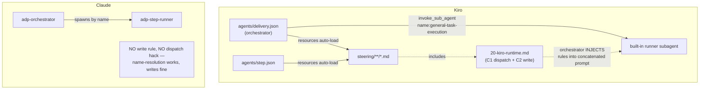

# Task P6 — Kiro runtime adaptation (subagent dispatch + large-file write)

> SELF-CONTAINED. Everything inline. POST-SHIP hardening: two Kiro-only runtime bugs found running ADP on Kiro. Resolve at ADAPTER edge — engine + neutral prompts stay clean.

## Register (binds task + every file you write)
Terse caveman. Substance stays, fluff dies. Pattern: [thing] [action] [reason]. Drop articles/filler/hedging. Applies to ALL prose: chat, artifact bodies, code comments. Literal/uncorrupted: JSON/YAML keys+values, identifiers, code syntax.

## Context — what system is
**Agentic Delivery Pipeline (ADP)** = library of executable AI prompts driving SW project rough-request→verified-software (5 phases: understand→plan→decide→design→build). Ships npm package; `npx adp init --harness=claude|kiro` lays runtime into user repo, wires launcher. P0–P5 already DONE + shippable. P6 = fix two Kiro-runtime defects surfaced after ship.

## The two concerns (both KIRO-ONLY)

### C1 — subagent dispatch name-resolution (clean-room harness bypassed)
Orchestrator dispatches each step to a clean-room runner (the `step-runner` executor). On Claude this resolves by agent name (`adp-step-runner`) — works. On Kiro, `invoke_sub_agent` resolves ONLY built-in agent types (`general-task-execution`, `spec-task-execution`, …); workspace `.kiro/agents/*.json` (e.g. `step`) are NOT dispatchable from inside another agent — they're user-only `@step` triggers. Calling `invoke_sub_agent name:"step"` silently falls back to a generic agent with NO step-runner contract.
**Symptom:** subagent runs role prompt without clean-room preamble → emits chat reply instead of writing file to disk → violates "deliverable = file on disk." Whole verify harness bypassed.

### C2 — large-file write failures
Kiro chokes writing big files in one call → frequent failures + delays. Workaround = chunked write:
```
When writing files longer than 50 lines, always use fsWrite for the first section (up to 50 lines),
then sequential fsAppend calls for remaining sections in chunks of no more than 200 lines each —
never pass the entire content of a large file in a single fsWrite call.
```
Must reach EVERY Kiro write context: delivery (orchestrator) agent, step agent, AND the dispatched runner subagent. ONLY for Kiro — Claude writes fine, MUST NOT carry this rule.

## DESIGN DECISION — fix at the Kiro adapter, NOT in neutral prompts `[CTO call]`
`prompts/` (incl `_orchestrator.generic.md`, `_step-runner.md`, 39 roles) = harness-NEUTRAL, shipped `harness: all`, also run self-host on Claude. Injecting Kiro mechanics (`invoke_sub_agent`, `fsWrite/fsAppend`) into them = pollutes Claude context + breaks one-home/neutral-engine discipline. WRONG fix.

**RIGHT fix:** Kiro-specific runtime rules live in Kiro STEERING. Both Kiro agents (`delivery`, `step`) already load `resources: ["file://.kiro/steering/**/*.md"]` → a NEW steering file auto-loads into both. For the dispatched built-in `general-task-execution` subagent (may NOT inherit workspace steering), the orchestrator INJECTS the rules into the concatenated prompt it builds. Engine + neutral prompts untouched; Claude adapter untouched. Matches P0/P1 additive invariant + P3 fix-at-edge principle.

## INVARIANT — self-host stays operational `[hard constraint]`
Strictly ADDITIVE. NEW files only. NEVER edit/delete protected self-host files: root `CLAUDE.md`, `prompts/_orchestrator.md`, `.kiro/agents/{selfhost,step}.json`, `.kiro/steering/{00-exclusive,10-self-host}.md`, `.claude/skills/self-host/`, `.claude/agents/step-runner.md`. P6.3 edits `prompts/_orchestrator.generic.md` = a P0 sibling (NOT protected) — self-host `_orchestrator.md` stays byte-identical.

## Placement map


## Scope

### P6.1 — Kiro dispatch steering `[NEW file: adapters/kiro/steering/20-kiro-runtime.md §dispatch]`
Author §dispatch carrying the canonical Kiro dispatch pattern, terse:
- Kiro `invoke_sub_agent` resolves ONLY built-in types. Use `name: "general-task-execution"` for EVERY step-runner dispatch — never a workspace agent name (won't resolve).
- Build `prompt` param = read `.kiro/adp/prompts/_step-runner.md` verbatim (clean-room preamble) + `\n\n---\n\n` + read target role prompt `.kiro/adp/prompts/<NN-phase>/<ROLE>.md` verbatim (the task).
- Supply `contextFiles` = all paths the role prompt names under its `inputs:` frontmatter (subagent has them without cold read).
- Verifier spawn = SAME pattern, SEPARATE call (runner never grades own output).
- Invariants preserved: step-runner preamble ALWAYS first · role prompt verbatim · NO orchestrator context leaked in (clean-room) · subagent reply ≠ deliverable, verify the file on disk.
- Canonical assembly (pseudocode block) for reuse.

### P6.2 — Kiro large-file write rule `[same file §write + dispatch injection]`
- §write in `20-kiro-runtime.md`: the C2 chunked-write rule verbatim (fsWrite ≤50 lines first, then fsAppend ≤200-line chunks, never whole big file in one fsWrite). Auto-loads into `delivery` + `step` agents.
- Dispatch injection: extend P6.1 assembly so orchestrator PREPENDS the C2 write rule into the concatenated runner prompt (right after step-runner preamble, before `---`) → reaches the built-in `general-task-execution` subagent that does the heavy writing (it may not inherit steering). One rule, two delivery paths (steering for agents that load it + injection for the dispatched subagent).
- KIRO-ONLY: do NOT add to `adapters/claude/**` or to any `harness: all` prompt.

### P6.3 — neutralize harness-baked refs in generic orchestrator `[edit P0 sibling — NOT protected]`
`prompts/_orchestrator.generic.md` hard-codes a Claude path + Claude-shaped spawn (latent bug on Kiro AND slightly wrong for shipped Claude adapter which uses `adp-step-runner`):
- L23 `Verify harness = clean-room runner sim (`.claude/agents/step-runner.md`, Sonnet/High)` → neutral: "clean-room `step-runner` executor registered for the active harness (harness dispatch mechanics in adapter steering)".
- L64 / L79 "spawn runner (step-runner, …)" → keep neutral role name `step-runner`; drop harness-specific path/mechanism. Mechanism = adapter's job.
- KEEP caveman + economy; ZERO new self-host tokens. Self-host `prompts/_orchestrator.md` (protected) UNTOUCHED.

### P6.4 — manifest + pack (ship the new steering)
- Generator `tools/pack/gen-manifest.mjs` globs `adapters/kiro/**` (`match: () => true`) → NEW `20-kiro-runtime.md` auto-listed (`harness: kiro`). NO generator code edit. P6.3 edit changes `_orchestrator.generic.md` sha256 → manifest MUST regen.
- Run `node tools/pack/gen-manifest.mjs` → confirm new steering row present + version moved.
- Repack (`node tools/pack/pack.mjs`) → confirm tarball contains `adapters/kiro/steering/20-kiro-runtime.md` (installs → `.kiro/steering/20-kiro-runtime.md`); self-host token grep gate still EMPTY; gate green.

### P6.5 — self-host-on-Kiro parity `[ADDITIVE new file]`
Self-host devs run ADP on Kiro too → hit SAME C1+C2 bugs. Add NEW `.kiro/steering/20-kiro-runtime.md` (same content as P6.1/P6.2 file). NEW file = additive, invariant-safe (does NOT modify protected `00-exclusive.md` / `10-self-host.md` / agents / `_orchestrator.md`). Self-host `delivery`-equiv (`selfhost.json`) + `step.json` already load `.kiro/steering/**` → auto-applies.

## Steps
1. Read concern docs (`_ship/kiro-dispatch-pattern.md`, `_ship/kiro-writer-workaround.md`), `prompts/_orchestrator.generic.md`, `adapters/kiro/agents/*.json`, `adapters/kiro/steering/*.md`.
2. Author `adapters/kiro/steering/20-kiro-runtime.md` (P6.1 §dispatch + P6.2 §write + injection rule).
3. Edit `prompts/_orchestrator.generic.md` L23/L64/L79 → harness-neutral (P6.3).
4. Copy/author `.kiro/steering/20-kiro-runtime.md` (P6.5, same content).
5. Lint: `node tools/economy-lint/lint.mjs adapters/kiro/steering/20-kiro-runtime.md prompts/_orchestrator.generic.md .kiro/steering/20-kiro-runtime.md` → clean.
6. Regen manifest: `node tools/pack/gen-manifest.mjs`; confirm new kiro steering row + `_orchestrator.md` sha changed.
7. Repack: `node tools/pack/pack.mjs`; confirm tarball lists new steering, self-host grep gate EMPTY, gate green.
8. `git status` → confirm protected files UNMODIFIED (root `CLAUDE.md`, `prompts/_orchestrator.md`, `.kiro/agents/*`, `.kiro/steering/{00-exclusive,10-self-host}.md`, self-host claude wiring). New = `adapters/kiro/steering/20-kiro-runtime.md`, `.kiro/steering/20-kiro-runtime.md`; modified = `prompts/_orchestrator.generic.md` (P0 sibling) + `manifest.json` (regen).

## Done-bar
- NEW `adapters/kiro/steering/20-kiro-runtime.md` carries §dispatch (C1) + §write (C2) + dispatch-injection rule; lint clean.
- Dispatch pattern: `invoke_sub_agent name:general-task-execution`, prompt = step-runner preamble + write-rule + role prompt verbatim, contextFiles = role inputs, clean-room invariants stated.
- C2 write rule reaches `delivery` + `step` agents (steering) AND dispatched runner (injection); ABSENT from Claude adapter + all `harness: all` prompts.
- `prompts/_orchestrator.generic.md` harness-neutral (no `.claude/agents/...` path); lint clean; zero self-host tokens.
- Manifest regen lists new kiro steering; pack ships it; self-host grep gate EMPTY; gate green.
- Self-host parity: `.kiro/steering/20-kiro-runtime.md` present (additive).
- Regression: protected files byte-identical (`git status` / `git diff`).

## Out of scope (decided)
- Claude adopting the concatenation dispatch (doc calls it runtime-neutral, COULD adopt) — Claude name-resolution works; no change. Revisit only if Claude shows the same bypass.
- Editing shared `canon/CLAUDE.generic.md` with a dispatch table — would push Kiro mechanics into Claude context (canon ships to both). Mechanics stay in adapter steering (one home, right consumer).

## Deps
Needs P0 (generic orchestrator sibling), P1 (kiro adapter), P2 (manifest generator), P4 (pack). Re-runs P4 pack to ship. Feeds a P5-style re-verify on Kiro (dispatch writes file to disk + big-file write succeeds).

---

## DONE — 2026-06-10

All AC met. Strictly additive; protected files byte-identical.

### What landed
- **P6.1+P6.2 — NEW `adapters/kiro/steering/20-kiro-runtime.md`** (`harness: kiro`, 46 ln / 709 tok, lint clean):
  - §dispatch (C1): `invoke_sub_agent name:general-task-execution` for every step-runner dispatch (workspace `.kiro/agents/*.json` won't resolve); `prompt` = `_step-runner.md` preamble + §write rule + `\n\n---\n\n` + role prompt verbatim; `contextFiles` = role `inputs:` paths; verifier = SAME assembly, SEPARATE call; clean-room invariants stated. Canonical pseudocode block for reuse.
  - §write (C2): chunked-write rule verbatim (fsWrite ≤50 first, fsAppend ≤200-line chunks, never whole big file). Auto-loads into `delivery` + `step` (steering); injected into dispatched runner (prepended after preamble, before `---`) — one rule, two paths.
- **P6.3 — `prompts/_orchestrator.generic.md` neutralized** (P0 sibling, NOT protected; self-host `_orchestrator.md` untouched):
  - L23: `.claude/agents/step-runner.md` path → "clean-room `step-runner` executor registered for active harness (dispatch mechanics in adapter steering)".
  - L64: "spawn runner (step-runner, Sonnet/High)" → "spawn `step-runner` executor". Mechanism = adapter's job.
  - L78 already-neutral role name + substantive model/effort note kept (no `.claude/` path, no harness mechanism). Lint clean, zero self-host tokens.
- **P6.5 — NEW `.kiro/steering/20-kiro-runtime.md`** (self-host parity, identical content). Additive — protected `00-exclusive.md`/`10-self-host.md`/agents/`_orchestrator.md` untouched. `selfhost.json` + `step.json` already load `.kiro/steering/**`.
- **P6.4 — manifest regen + repack**:
  - `gen-manifest.mjs` → 61 files, new kiro steering row present (`harness: kiro`), in kiro matrix only (absent from claude matrix), version moved `p03b9a94d` → `pafe4432e` (orchestrator sha changed). NO generator edit.
  - `pack.mjs` → gate GREEN (selftest both-directions green), tarball `adp-v956447a+pafe4432e.l96133636.tgz` ships `package/payload/adapters/kiro/steering/20-kiro-runtime.md` (installs → `.kiro/steering/20-kiro-runtime.md` via `destFor`).

### Verify
- KIRO-ONLY confirmed: C1/C2 content absent from `adapters/claude/**` + all `harness: all` prompts.
- Lint clean ×3 (new kiro steering, orchestrator generic, self-host steering).
- Regression: protected files (`CLAUDE.md`, `prompts/_orchestrator.md`, `.kiro/agents/*`, `.kiro/steering/{00-exclusive,10-self-host}.md`, claude self-host wiring) — git shows NO modification.
- Change set = NEW ×2 + modified `_orchestrator.generic.md` + regen `manifest.json`. Exactly as scoped.
