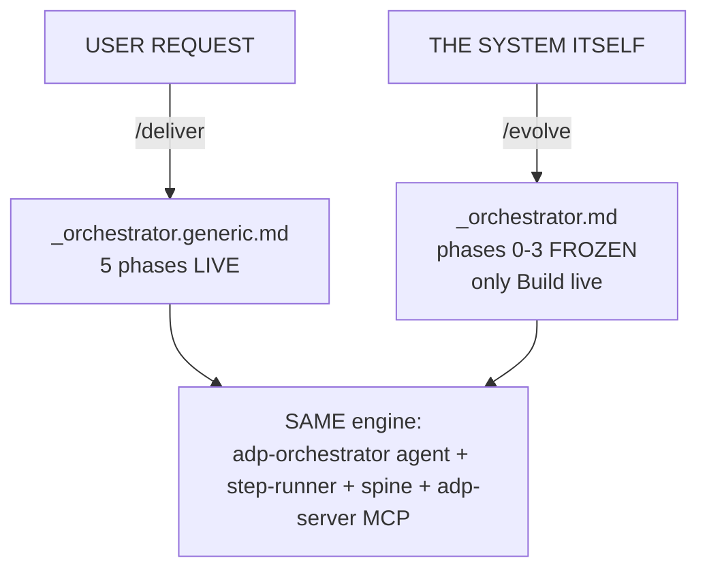
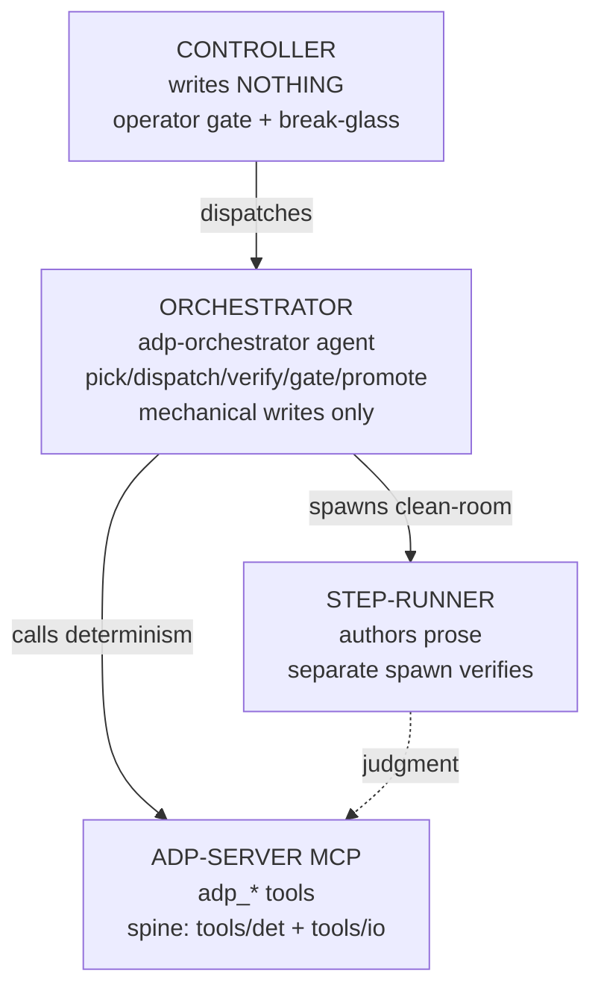
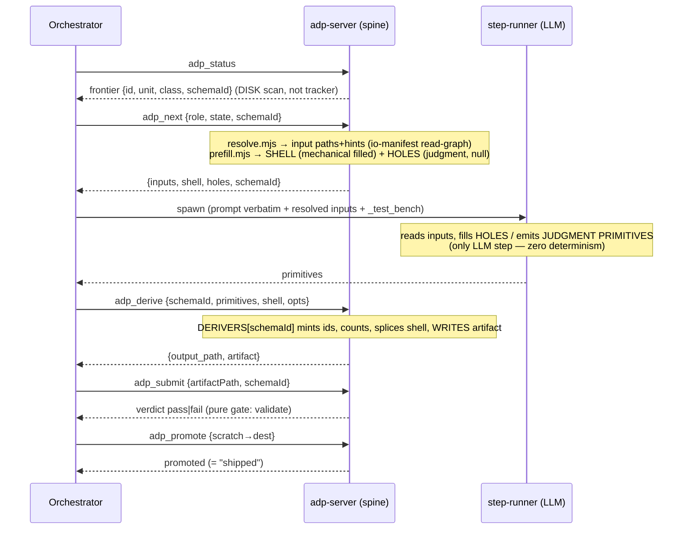
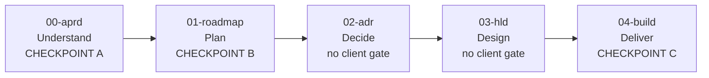
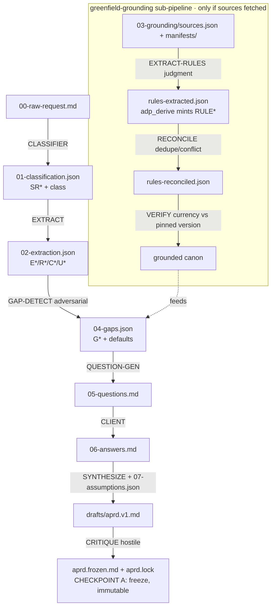
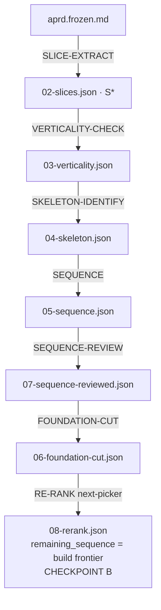
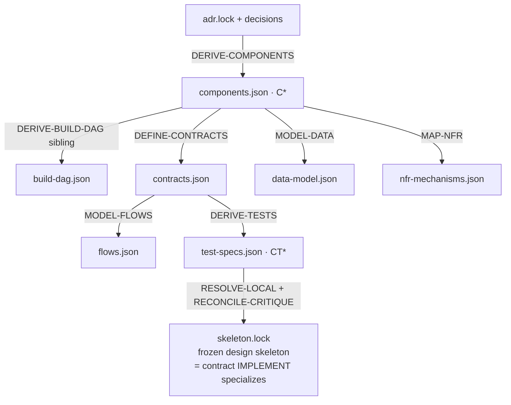
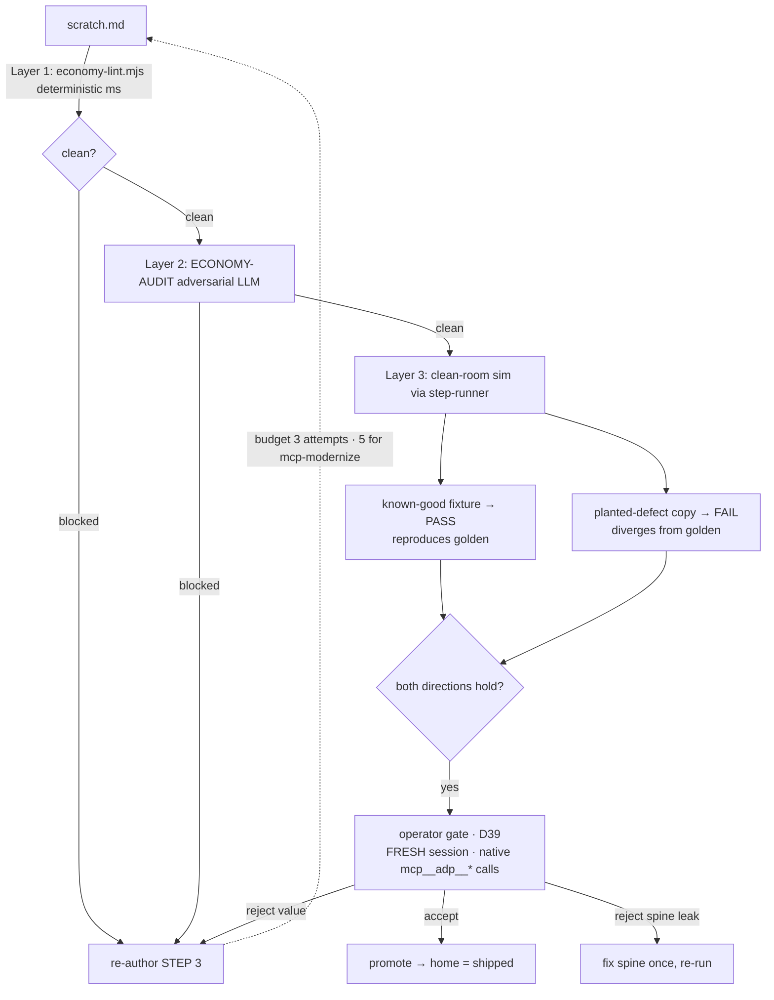

# ADP System Flow — stages, actors, artifact-flow, what calls what

> Complete map of the Agentic Delivery Pipeline as built now. Derived from disk (`prompts/`, `io/io-manifest.json`, `.hld/skeleton/*`, `adp-server/`, `tools/`). Register: caveman — substance stays, fluff dies. Structural data (ids, paths, schema keys) literal.

---

## 1. Two entry points, one engine

Two launchers bind the SAME engine. Difference = scope only.

- `/deliver` → `prompts/_orchestrator.generic.md` — all 5 phases LIVE against a user repo (end-user path).
- `/evolve` → `prompts/_orchestrator.md` — phases 0–3 FROZEN (committed root trees), only Build runs live; system authors its own next prompt.



---

## 2. Actor separation (D35 — who writes)

Judgment (LLM) and determinism (code) are separate actors. Controller never touches disk.

| Actor | Is | Writes |
|---|---|---|
| **Controller** | the Claude Code session that ran the launcher | NOTHING. Surface = operator gate + break-glass. |
| **Orchestrator** | adp-orchestrator agent (loop driver, Sonnet) | PERMITTED: git ops · spine shell-outs · lock/index · scratch→home promote. PROHIBITED: authoring prose/code/fixtures. |
| **Step-runner** | clean-room subagent | authors ALL artifact prose; SEPARATE spawn verifies (runner never grades own output). |
| **adp-server (MCP)** | thin wrappers over deterministic spine | `adp_*` tools; owns every deterministic decision. |



---

## 3. Per-step execution — the MCP/spine loop

Every role runs the same 5-call cycle (`adp-server/live-loop.mjs:160-181`). This is the only place schema + determinism live.



**The split** — server-owned vs runner-owned:

- **Server (`adp_derive`, `DERIVERS` registry):** shell + id-minting + counts + predicates + envelope + write. Registered derivers: `01-classification`, `02-extraction`, `04-gaps`, `08-critique`, `rules-extracted`.
- **Runner:** holes / judgment primitives only.

This determinism-relocation = what the `mcp-modernize` class moves role-by-role (roles go judgment-only; their deterministic prose exits to a `tools/det/<role>-derive.mjs` registered in `DERIVERS`).

---

## 4. The 5-phase pipeline

ID thread end-to-end: **`R → AC → S → ADR → C → CT → F → commit`**. Each phase consumes prior phase's frozen artifact (`build-dag.json`: linear 00→01→02→03→04).



### PHASE 00-aprd — Understand → `.aprd/` (CHECKPOINT A)



Brownfield/other-class variants in this phase:
- `BASELINE-MAP` (emitter-owned) — scans existing repo → `baseline-map.json`.
- `BUGFIX-LOCALIZE` — reproduce→localize→root-cause → `diagnosis.json`.
- `SYNTHESIZE-INCREMENT` — version-bump → `aprd.v<N+1>.frozen.md`.
- audit class: `LENS-DEFINE → AUDIT-RUN → AUDIT-REPORT → AUDIT-PROMOTE`.

### PHASE 01-roadmap — Plan → `.roadmap/` (CHECKPOINT B)



`feature-add` uses `SEQUENCE-FEATURE-ADD` instead of `SEQUENCE`. `RE-RANK` doubles as the self-host loop frontier picker.

### PHASE 02-adr — Decide → `.adr/` (no client gate)

```mermaid
flowchart TD
    FC[06-foundation-cut.json] -->|DECISION-EXTRACT| DP[01-decision-points.json · DP*]
    DP -->|TRIAGE local vs ADR-worthy| TR[02-triage.json]
    TR -->|OPTION-GEN + arch-canon.json| OP[03-options/DP*.json]
    OP -->|EVALUATE-DECIDE| DC[DP*.decision.json + decisions-index.json]
    DC -->|RECONCILE| CF[04-conflicts.json]
    CF -->|SYNTHESIZE-ADR| LOG[log/NNNN.md + adr-index.json]
    LOG -->|CRITIQUE hostile| LK[adr.lock · D*/ADR-* signed, immutable]
    TR -.local decisions.->|RESOLVE-LOCAL| DEF[deferred-decisions.json]
```

### PHASE 03-hld — Design → `.hld/` (no client gate)



`DERIVE-TESTS-BUGFIX` for bugfix class (one red→green reproduction test + scoped regression).

### PHASE 04-build — Deliver → `src/` + `.build/` (CHECKPOINT C)

Per slice on the `08-rerank` frontier, one step per turn:

```mermaid
flowchart TD
    BP[BUILD-PLAN emitter-owned<br/>DAG-filter → build_set] --> BPJ[build-plan.json]
    BPJ -->|IMPLEMENT generative step| SRC[src/** + build-record.json]
    SRC -->|INTEGRATE| IR[integration-record.json]
    IR -->|MATERIALIZE-ORACLE| OR[oracle/ tests<br/>contract/flow/acceptance]
    OR -->|VERIFY-OUTPUT emitter-owned aggregate| VO[verification.json]
    VO -->|CRITIQUE hostile| CR[critique.json]
    CR -->|DEMO-GEN| DMO[demo.json · CHECKPOINT C]
    VO -.on failure.->|DIAGNOSE| DG[build-diagnosis.json]
    DG -.routes back upstream.-> BPJ
```

Bugfix variants: `IMPLEMENT-BUGFIX` (minimal in-place edit), `MATERIALIZE-ORACLE-BUGFIX`, `VERIFY-OUTPUT-BUGFIX`.

---

## 5. The verify gate — wraps every authored unit

3 layers, cheapest-first, both directions. Oracle = `_fixtures/` goldens (read-only truth).



Routing keystone: any flaw routes to the **prompt**, never a hand-patch of the artifact (`fix ∈ {DELETE, REWRITE}`, never ADD).

---

## 6. Cross-cutting layer (binds every loop turn)

- **State = disk-derived (D20).** No tracker, no changelog. Frontier = first `remaining_sequence` entry whose `done_sentinel` is absent/invalid ON DISK. Resume re-derives. `status` field = advisory display only, never gates.
- **Branch/stream gate (STEP 0.0/0.1, D28/D29).** Enforce non-master · auto-reconcile from main · ledger-prune merged rows — all before any build work.
- **Immutability.** Frozen artifacts + `*.lock` never overwritten; a change = new version + downstream re-trigger. Generated-frozen (e.g. `contracts.json`) ⇒ amend the GENERATOR, not the frozen copy.
- **D39 verification authority.** Agent never runs the demo it presents — operator runs it, from a fresh Claude Code session via native `mcp__adp__*` calls. Agent-run output is build-time evidence, never the acceptance proof.

---

## 7. Component inventory (51 components, 5 phases)

| Phase | Roles |
|---|---|
| 00-aprd (15) | CLASSIFIER, EXTRACT, EXTRACT-RULES, RECONCILE, VERIFY, GAP-DETECT, QUESTION-GEN, SYNTHESIZE, SYNTHESIZE-INCREMENT, CRITIQUE, BASELINE-MAP*, BUGFIX-LOCALIZE, LENS-DEFINE, AUDIT-RUN, AUDIT-REPORT, AUDIT-PROMOTE |
| 01-roadmap (8) | SLICE-EXTRACT, VERTICALITY-CHECK, SKELETON-IDENTIFY, SEQUENCE, SEQUENCE-FEATURE-ADD, SEQUENCE-REVIEW, FOUNDATION-CUT, RE-RANK |
| 02-adr (7) | DECISION-EXTRACT, TRIAGE, OPTION-GEN, EVALUATE-DECIDE, RECONCILE, SYNTHESIZE-ADR, CRITIQUE, RESOLVE-LOCAL |
| 03-hld (10) | DERIVE-COMPONENTS, DERIVE-BUILD-DAG, DEFINE-CONTRACTS, MODEL-DATA, MAP-NFR, MODEL-FLOWS, DERIVE-TESTS, DERIVE-TESTS-BUGFIX, RESOLVE-LOCAL, RECONCILE-CRITIQUE |
| 04-build (11) | BUILD-PLAN*, IMPLEMENT, IMPLEMENT-BUGFIX, INTEGRATE, MATERIALIZE-ORACLE, MATERIALIZE-ORACLE-BUGFIX, VERIFY-OUTPUT*, VERIFY-OUTPUT-BUGFIX, CRITIQUE, DEMO-GEN, DIAGNOSE |

`*` = emitter-owned (Tier-1 whole-mechanical, no `.md` prompt; artifact owned end-to-end by `tools/det/emit/*.mjs`). Inline-orchestrator helpers (no prompt file): `STREAM-MANAGER` (STEP 0.0/0.1 git+brief), `LEDGER-PRUNE` (`tools/det/prune-ledger.mjs`).
