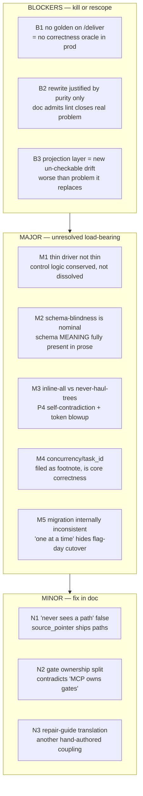
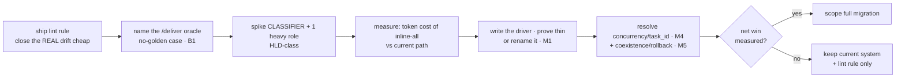

# ADP Target Architecture — Hostile Critique

> Reviewer: CTO, 10+ yr shipping AI/ML systems. Lens: would I fund this rewrite? What breaks in production? Where does the doc lie to itself? Register: caveman. Target under review: `adp-target-architecture.md` (the "schema-blind agent / MCP backbone" rewrite). Current state baseline: `adp-system-flow.md`.

---

## Verdict

**Do not fund as written.** Doc proposes large rewrite (~46 roles + 59 prompts + ≥4 new MCP modules + driver swap) justified by ONE principle — total schema-blindness — that the doc itself concedes buys no practical win the cheap path can't. Worse: the design relocates the drift risk it never even claimed to fix into a NEW, un-checkable, hand-authored layer (the projection). And the whole correctness story (§9) assumes a golden oracle that **does not exist on the primary product path** (`/deliver` against real user repo). That last one is a blocker, not a nit.

Three things must be answered before any code: (1) what does schema-blindness BUY in measurable terms, (2) where is the `/deliver` correctness oracle when there's no golden, (3) write the "thin" driver and prove it's actually thin. Until then this is purity theater on top of a working system.

Strengths exist (see §"What holds") — scratch/promote split, statelessness, honest capability table. But the load-bearing claims don't survive contact.

---

## Severity map

---

## Blockers

### B1 — No golden ⇒ no correctness oracle on `/deliver`
§9 names the semantic oracle precisely: **"value-divergence-from-GOLDEN."** Goldens live in `_fixtures/` (system-flow §5). That oracle exists only in self-host / fixture world.

`/deliver` runs all 5 phases LIVE against a **user repo** (system-flow §1). There is no golden artifact for a stranger's requirements. So:
- Shape gate (repair loop) → still works (schema-valid).
- Semantic gate (§9, the thing that catches "fabricated evidence, plausible-false rule") → **has nothing to diverge against.**

The doc presents the golden gate as THE correctness mechanism and never says it's absent on the product path. So the target design ships a verification model that works for evolving itself and silently degrades to shape-only for paying users. That inverts priorities. **Define the `/deliver` oracle (self-consistency? cross-role reconcile? operator-as-oracle?) before anything else** — and note this critique applies to the current system too; the rewrite just doubles down without naming it.

### B2 — Rewrite justified by purity, and the doc says so
§1, verbatim: *"prose drift between that home and prompts is closable by a lint rule alone. The rewrite earns its cost only against the principle — total schema-blindness."*

Translation: the real, nameable problem (schema prose drifting from `schemas/`) costs one lint rule. Everything beyond that lint rule is bought purely to satisfy an aesthetic invariant (P1). No defect-rate target, no token-cost target, no authoring-velocity target anywhere in 272 lines. As CTO I don't fund principles; I fund outcomes. **Ship the lint rule. Then prove schema-blindness pays for itself on two roles before committing 50.**

### B3 — Projection layer = drift, relocated and made un-checkable
The cited problem is drift between two representations of the schema. The fix:
- §7 "Projection coupling": slot↔schema-leaf mapping is **hand-authored** per template.
- Admitted: structural drift caught at validate-time, but **semantic mis-description "validation can't catch; reviewed when either side changes."**

So you traded a **lint-catchable** drift (prompt prose vs schema) for a **human-review-only** drift (slot instruction vs schema-leaf meaning). That is strictly worse on the exact axis used to motivate the work. You didn't remove coupling — you moved it somewhere the machine can no longer see it.

---

## Major

### M1 — The "thin driver" is not thin; control logic is conserved
§4 honestly kills the pure dream (no MCP sampling, no server-side spawn in Claude Code). Good. But then §5's loop carries: frontier-done branch, repair-budget loop (`while needs_revision and attempts < budget`), re-spawn-with-guidance, verifier spawn, gate sequencing, promote call. That is orchestration. Calling it "near-logic-free relay" / "zero control logic" is rebranding.

The thick orchestrator's control flow doesn't evaporate (§10 "dissolves into MCP tools"). It either (a) lives in the driver, contradicting "thin," or (b) gets encoded in MCP tool return values the driver branches on — which means the branching still lives driver-side. **Where does the budget loop and gate ordering physically live? Unspecified.** Complexity is conserved; the doc hides it in an adjective. Write the driver. If it's >50 lines of branching, retire the word "thin."

### M2 — Schema-blindness is nominal, not real
Agent fills slots like *"paste exact text that proves this rule exists,"* *"pick source from context block labels,"* *"verbatim config key+value or blank if prose."* To fill these the agent must understand what a *rule* is, its granularity, what counts as *evidence*, what a *source* is. The schema's **meaning** is fully present — transliterated into prose doctrine + slot instructions. Only the JSON surface is hidden.

So P1 buys: agent can't *name* a schema key. It does NOT buy: decoupling judgment from structure. The coupling is just now implicit (prose) instead of explicit (keys) — and implicit coupling is harder to verify, not easier. The deep claim ("pure judgment engine, schema-unaware") is false; it's a schema-aware engine reading the schema in English.

### M3 — "Inline all metadata" vs "never haul whole trees" — pick one
P4 in one breath: *"MCP inlines all ADP metadata"* AND *"MCP never hauls whole trees."* §8: *"forces all metadata through MCP-curated context blocks."* These conflict.

Operationally, late phases are heavy: HLD/build roles read frozen aprd + adr log bodies + components + contracts + test-specs. Eagerly inlining ALL of it into every packet =
- token cost up (you pay to stuff context every call),
- context-window pressure on big repos,
- loss of the agent's selective read (current system hands paths, agent reads what it needs — system-flow §3).

This is a **performance regression dressed as purity.** Either define the curation rule that makes "inline all" ≠ "haul trees" (then it's not "all"), or admit inlining is selective and reopen how the agent knows what it didn't get.

### M4 — Concurrency / `task_id` collision is load-bearing, filed as a footnote
§13 lists "multi-phase role binding under concurrency" as "not load-bearing for the thesis." False. CRITIQUE runs in phases 00, 02, 04 (system-flow §7); RECONCILE and RESOLVE-LOCAL repeat too. `task_id` encodes `{role, frontier-key}` and is re-derived from disk (P9). Same role, parallel branches, disk-derived key → collision / wrong-unit binding is a **correctness** failure, not UX polish. Statelessness + role-reuse + concurrency is the hard part of P9. Move it into the body and specify the disambiguator, or P9 is unproven.

### M5 — Migration plan contradicts itself
§11 says "port roles one at a time" to avoid partial migration. §10 says "thick orchestrator retired; thin driver replaces it." You cannot half-retire the orchestrator. During the months of one-at-a-time porting, what drives the un-ported roles? Two surfaces (current prompts + new task templates) must coexist behind a flag, OR there's a hidden flag-day where the driver takes over all 51 roles at once. The doc implies incremental but the driver swap is atomic. **No coexistence story, no rollback story, no "what runs in prod during migration" story.** That's how rewrites die at 60%.

---

## Minor / doc-honesty

- **N1 — "Agent never sees a file path" (§1, §6) is false.** `source_pointer = {path, why}` (§7) ships raw paths to the agent, which reads them itself (§8). The principle is already breached by the design's own brownfield escape hatch. Reword P1 to "blind to ADP metadata + schema keys; sees raw-source paths only." State the breach instead of asserting the absolute.
- **N2 — Gate ownership is split, contradicting "MCP owns gates."** Actor table: gates → MCP elicitation. But §9 chain is verify(driver-spawned) → operator gate → promote. The verify spawn is driver-side (server can't spawn, §4). So the driver sequences the gate ordering; MCP doesn't "own" it end-to-end. Reconcile P3/actor-table with §9.
- **N3 — Repair-guide (shape-error → plain-language fix) is yet another hand-authored, per-schema coupling.** §6/§9 assume MCP emits good plain-language fixes from shape violations. That translation is authored + maintained per schema, and its quality gates throughput (bad guidance → no convergence → HALT). Counts as new coupling surface the doc treats as free.

---

## Tensions table (claim vs reality)

| Claim | Where | Reality |
|---|---|---|
| Rewrite earns its cost | §1 | Doc concedes the real problem is lint-solvable; cost bought for principle only |
| One home per fact | P-canon, §12 | Doctrine in `instructions` + per-slot instructions + projection mapping = 3 representations w/ manual sync |
| Total schema-blindness | P1 | Schema *meaning* fully present in prose; only JSON surface hidden |
| Agent never sees a path | §1/§6 | `source_pointer.path` (§7) ships paths |
| MCP never hauls whole trees | P4 | Same P4 + §8: "inline all metadata through context blocks" |
| Thin driver, zero control logic | §5 | Budget loop + gate sequencing + spawn orchestration |
| MCP owns operator gates | P3/actors | §9 gate chain sequenced driver-side (verify spawn is host-only) |
| Correctness = divergence-from-golden | §9 | No golden on `/deliver`; oracle absent on product path |
| Concurrency not load-bearing | §13 | CRITIQUE/RECONCILE multi-phase; task_id collision = correctness bug |

---

## What holds (credit where due)

- **Scratch-write, verify-before-promote, no-self-promote** (P8, §9) — sound, already an invariant, keep it.
- **Statelessness / disk-as-truth** (P9, D20) — correct and already built; rewrite doesn't threaten it (except M4).
- **Capability-constraint table** (§4) — honest engineering. Killing the pure-sampling dream up front is the doc's best moment.
- **Schema home unchanged** (`schemas/` locked, §10) — right call; don't touch the one thing that works.
- **Adversarial gate stays external to repair loop** (§9 reasoning) — the argument that good repair-guidance could walk a defective fill to validity is genuinely sharp. Keep that separation.

---

## What I'd require before funding

1. **Ship the lint rule first.** It closes the only nameable problem. If drift stops hurting, the rewrite's premise is gone — find out cheaply.
2. **Answer B1 in the body.** What is the correctness oracle on `/deliver` where no golden exists? If the answer is "operator," say so and design the elicitation for it; if "self-consistency/cross-reconcile," design that gate. No artifact ships without an oracle.
3. **Spike, don't commit.** Build `adp_task`/`adp_answer` + projection for CLASSIFIER **and one heavy late-phase role** (not just the easy ported one). Measure token cost of inline-all vs today. Prove the projection's semantic-drift risk (B3) is manageable on a role with deep upstream.
4. **Write the driver.** If thin, great. If it carries the budget loop + gate ordering, drop the word and own the complexity (M1).
5. **Promote §13 open items into the body.** Concurrency/task_id (M4) and source_pointer failure modes are correctness, not "open items."
6. **Migration coexistence + rollback** (M5) before role #2.

---

## One-line summary

Working system; proposed rewrite trades a machine-checkable drift for a human-only one, hides conserved orchestration behind the word "thin," eagerly inlines trees it promised not to haul, and bets correctness on a golden oracle that's missing on the product path — all to satisfy a purity principle the doc itself admits a lint rule would satisfy. **Ship the lint rule. Spike two roles with metrics. Re-decide.**
