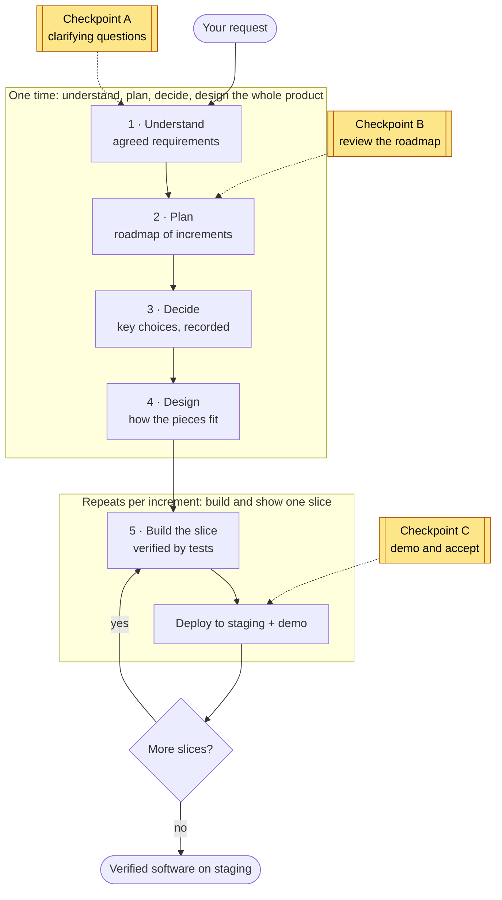
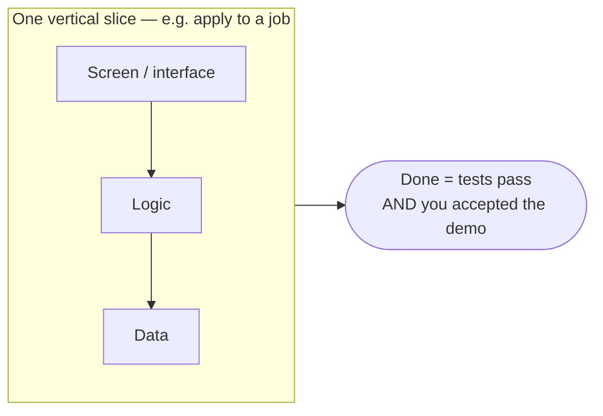
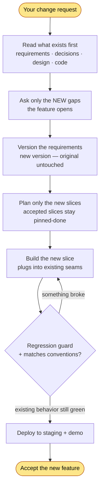

# Working With the System — End-User Guide

> Take software idea from rough request to verified working software — via delivery system.
> Audience: person who wants thing built (client/product owner). No engineering background assumed.

---

## 1. What system does

You describe what you want. System designs it, builds it, tests it, shows working software running on staging — delivered in small reviewable increments, not one big drop at end.

Team of AI agents as pipeline. Each stage has job, hands result to next, checks work along way. **Nothing "done" until verified to work** — every increment ships with tests proving it does what asked.

**What you get:** verified demoable app on staging, plus clean paper trail — what agreed (requirements), why each major technical choice made (decision records), how structured (design), proof it works (passing tests).

**What it builds:** any software product — web/mobile app, backend service, infrastructure (e.g. cloud/Terraform), data pipeline, more. Technology chosen for your project, not fixed in advance.

---

## 2. Before you start — what to bring

No polished spec needed. Bring whatever you have:

- **Your request, plain language.** "Marketplace where clients post jobs, freelancers apply." Rough fine — refining it = system's first job.
- **Anything that constrains solution**, if known: budget, deadline, required technology, regions/compliance, scale expectations, existing systems it must work with.
- **Existing materials**, if any: current code, designs, documents, brand/style guide. (For changes to existing product, system reads code first.)

Missing some? Expected — system asks.

---

## 3. Journey at a glance

Work moves through five phases. You involved at **three checkpoints**; rest runs on own.

**Two rhythms.** First system builds thin **end-to-end skeleton** of whole product once (shape real + connected early). Then fills product **one slice at a time** — each slice small working demoable piece going all way through (design → build → test → demo).

**You won't be pestered.** System stops to involve you only at three checkpoints below. Everywhere else works autonomously, reads from what already agreed.

---

## 4. Your three checkpoints (part you do)

### Checkpoint A — Clarifying questions (early)
After reading request (and any existing code/materials), system finds **genuine gaps** — things it can't safely assume — asks short prioritized question set.

- Asks **only what matters**, highest-impact first (e.g. "Single region or global? Changes architecture").
- Will **not** guess silently on anything affecting structure, cost, scope.
- Answer plain language. Unsure? Say so — system records as explicit assumption you can revisit.

**Result:** agreed statement of *what* gets built (requirements + what "done" means each). Then frozen — stable reference everyone builds against.

### Checkpoint B — Review roadmap
System slices work into sequence of small increments, shows plan: what comes first, what builds on what, where foundational pieces sit.

- **Confirm** sequence or **reorder** (within technically possible — some pieces must precede others).
- Here you steer priorities: "Need payments flow demoable before admin tools."

**Result:** agreed roadmap driving rest of delivery.

### Checkpoint C — Demo & accept (repeats, once per increment)
Heartbeat of delivery. Each increment, system builds it, verifies it, deploys to staging, **shows working demo**.

- You see real thing running, not status report.
- You **accept** (done, counts as delivered) or give feedback feeding next round.
- Then next increment begins. Progress visible + continuous.

**Result (cumulative):** growing working product on staging — each piece proven before next starts.

---

## 5. What happens between checkpoints (so you trust it)

Don't manage these, but here's what runs on own:

- **Understand:** turns rough request into precise requirements, fills gaps from cheapest reliable source (existing code, established best practices) before asking you, runs adversarial review catching ambiguity + missing acceptance criteria.
- **Decide:** makes significant technical choices — including **technology stack** — weighs options, **records each as short decision + rationale** so nothing important decided silently or forgotten.
- **Design:** lays out components, how they talk (contracts), data, cross-cutting concerns (security, performance), then derives tests each piece must pass.
- **Build:** writes code against agreed design, separate step authors tests (builder can't grade own homework), runs full test ladder, anti-cheat pass flags fake/hollow implementations.

Throughout, thread of identifiers links every requirement to design, code, tests proving it — any piece traceable back to reason it exists.

---

## 6. What you receive

| Deliverable | What it is | Why useful to you |
|---|---|---|
| **Agreed requirements** | Frozen statement of what's built + acceptance criteria | Contract everyone works to; what "done" means |
| **Roadmap** | Increment sequence | See where work goes; reprioritize |
| **Decision records** | Each major choice + rationale | Understand *why* built this way; onboard others |
| **Design** | How system structured | Map for future change |
| **Verified software on staging** | Running product, increment by increment | Actual value — plus proof (passing tests) it works |

---

## 7. Slice rhythm — why increments, what "done" means

Product delivered as series of **vertical slices**. Slice = thin complete piece of functionality running end-to-end (e.g. "freelancer applies to job" — touching screen, logic, data, all working together).

Each slice cuts top-to-bottom through whole product, so what you accept genuinely works — not screen with nothing behind it, nor backend code you can't see.

Each slice, **"done" means two things at once:**
1. acceptance criteria pass (tests prove it behaves as agreed), **and**
2. you've seen it demoed + accepted it.

Why this way: working software early + often, problems surface in small pieces (not at end), change direction between slices at low cost.

---

## 8. Scope & boundaries

- **Finish line = accepted demo on staging.** That verified staging build = final deliverable.
- **Production release, deployment to your own environment, post-launch ops out of scope** — deliberate boundary. System delivers proven software ready for that step; doesn't perform live release itself.
- **For changes to existing products**, system reads + conforms to current code + conventions, guards against breaking what works (regression checks). Adding a feature to a product *this system delivered* runs the dedicated **feature-add** path — see **§12**.

---

## 9. Works with any technology

Technology = **decision made for your project** (at "Decide" phase), based on requirements + constraints — not fixed default. Same process delivers TypeScript web app, Python service, cloud infrastructure, data pipeline. Required stack? Say up front (Checkpoint A) → becomes constraint design must honor.

---

## 10. Getting best results

- **Concrete about outcomes, flexible about implementation.** Tell system *what success looks like*; let it choose *how*. ("Users check out in under 3 steps" beats "use library X.")
- **Surface real constraints early** (deadline, budget, must-use tech, compliance). They shape architecture; late constraints cause rework.
- **Decisive at checkpoints.** Clear answers + confirmed roadmap keep delivery moving. Unsure? Say "assume X for now" — recorded + revisitable.
- **Review demos actively.** Demo = your steering wheel. Concrete feedback ("filter should default to open jobs") shapes next slice precisely.
- **Reprioritize between slices, not mid-slice.** Let slice finish; redirect at next roadmap touch. Cheaper + cleaner.

---

## 11. Common situations

- **"My request is several things at once"** (e.g. "fix upload bug, make it faster, add PDF support"). System detects this, splits into atomic pieces, classifies each (bug fix / performance / feature), confirms breakdown with you before proceeding.
- **"Changed my mind about a requirement."** Raise at next checkpoint. Change updates agreed requirements + re-plans affected slices — paper trail keeps everything consistent.
- **"How do I know it works, isn't faked?"** Every slice ships with tests authored by role separate from builder, run against live build, plus anti-cheat review flagging hollow/hard-coded implementations. "Done" requires passing, not claiming.
- **"This is change to existing system, not new build."** Supported. System reads codebase first, conforms to conventions, adds regression guards so existing behavior stays green. For adding a feature to a product this system already delivered, the **feature-add** path is detailed in **§12**.
- **"Don't know answer to clarifying question."** Say so. Becomes explicit recorded assumption you can change later — never silent guess.

---

## 12. Adding a feature to an already-delivered product (feature-add)

When you bring a **change to a product this system already delivered** — not a fresh build — it runs a **feature-add** path: re-enter the same project, add **one** feature end-to-end, leave everything already accepted intact. You don't restart; you submit the change as a request and the system recognizes it as new behavior into an existing codebase.

**What's different from a fresh build:**
- **Reads existing first, asks less.** Requirements, decisions, design, and code are read *before* you're asked anything — so questions cover only genuinely new gaps, never what's already settled.
- **Original requirements never change.** The feature lands as a *new version* of the agreed requirements; the frozen original stays byte-for-byte identical. Every new requirement gets a fresh identifier above the existing ones — no reuse, no renumbering.
- **Only the new feature is planned + built.** Already-accepted increments stay done (pinned); the roadmap shows just the new slice(s).
- **Existing behavior is guarded.** The new slice plugs into existing components at defined seams (existing internals untouched), new code matches the project's established conventions, and a **regression guard** re-runs the existing acceptance tests the feature touches — the slice can't be "done" if anything previously green goes red.
- **Same demo gate.** You accept the new feature on staging exactly as for any other slice.

**Boundary:** one atomic feature per change request. Several asks at once → system splits + confirms the breakdown first (§11). Bringing this to the harness: see `generic-usage-guide.md` **PART D**; a complete worked example lives in `_fixtures/brownfield-feature/`.

---

## 13. Glossary (light)

- **Requirements (frozen):** agreed stable statement of what's built + what "done" means.
- **Slice:** small complete demoable piece of functionality delivered end-to-end.
- **Skeleton (walking skeleton):** thin version of whole product wired together early, shape real before details filled in.
- **Decision record:** short note capturing significant technical choice + why made.
- **Design:** structure — components, how they connect, data, cross-cutting concerns.
- **Staging:** production-like environment where you see + accept working software; delivery finish line.
- **Acceptance criteria:** concrete testable conditions defining "done" for requirement or slice.
- **Feature-add:** adding one new feature to a product the system already delivered — reads existing artifacts first, versions the requirements (original untouched), builds only the new slice(s). See §12.
- **Regression guard:** the check on a feature-add slice that re-runs the existing acceptance tests the feature touches, so a new feature can't break already-accepted behavior.

---

*In short: describe what you want, answer few sharp questions, confirm plan, then watch working software arrive in reviewable increments — each one proven before next begins.*
