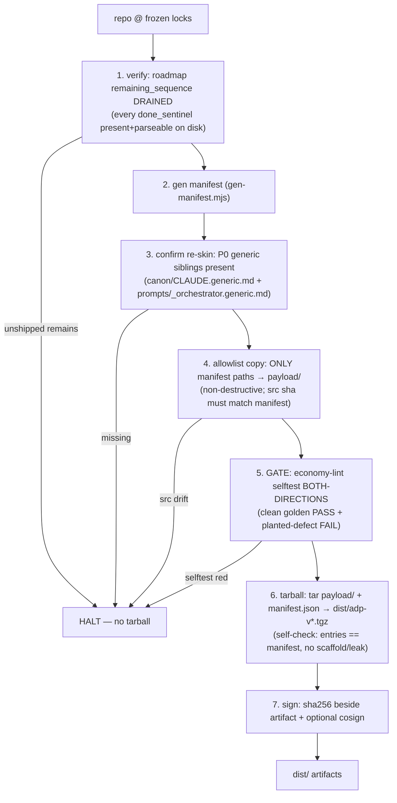

# Packing the ADP Deliverable

> MAINTAINER doc (repo-only, NOT shipped). How to build shippable ADP artifact from frozen repo. End-user install = [generic-usage-guide.md](generic-usage-guide.md); this = how the thing they install gets BUILT.
> Register: terse. Substance stays, fluff dies. Literal/uncorrupted: JSON keys+values, ids, code syntax.

## What gets built

`make pack` → three artifacts in `dist/`:
- `adp-v<version>.tgz` — the deliverable, **npm-installable**: contents nested under `package/` = installer wrapper (`package.json` + `bin/init.mjs`) + `manifest.json` + gated `payload/` tree. So `npx --package=./adp-v<version>.tgz adp init` (or `npm i -g <tgz>`) runs the bin offline — no registry. (Plain `manifest.json`+`payload/` with no `package.json`/`bin` is NOT a package: npm install errors, npx can't resolve `adp`.)
- `adp-v<version>.tgz.sha256` — integrity digest beside artifact.
- `adp-v<version>.tgz.sig` — cosign signature (only if `cosign` present; skip-if-absent).

Plus `manifest.json` regenerated at repo root (single source of truth for pack + install).

CORE PRINCIPLE: pack runs system's OWN gate (selftest) on payload BEFORE tarball → ship only what passes own bar (verify-before-done). HALT on any failed step emits NO tarball.

## Pipeline

`make pack` → `node tools/pack/pack.mjs` (zero-dep: node builtins + system `git`/`tar`/`cosign` only).



### Step detail

1. **verify drained** — read `.roadmap/08-rerank.json`; each `remaining_sequence` entry's `done_sentinel` must exist on disk (+ parse if `.json`). Any absent/invalid → unshipped frontier → HALT. Never pack a half-built lib.
2. **gen manifest** — invoke `gen-manifest.mjs` (writes `manifest.json` at root). See Manifest below.
3. **confirm re-skin** — P0 generic siblings present. Absence = un-re-skinned build (would ship ADP's own self-host design as user's). HALT.
4. **allowlist copy** — for each manifest row, read `src`, verify `sha256(src) == row.sha256` (copy must match what manifest signed), write to `payload/<path>`. Path-mapping applied here (generic sibling → canonical name). NON-DESTRUCTIVE: originals NEVER edited; only `payload/` + `dist/` written.
5. **GATE** — `economy-lint/selftest.mjs` both-directions: linter must discriminate (clean golden PASSes, planted-defect FAILs). exit≠0 → HALT. Two further substeps DISABLED (see below).
6. **tarball** — stage npm pkg root `package/{package.json, bin/init.mjs, manifest.json, payload/**}`, `tar -czf dist/adp-v<ver>.tgz -C dist/.pkgstage package`. Installer wrapper (`package.json`+`bin/init.mjs`) ships verbatim from repo so the artifact is npm-installable; payload = gated allowlist copy. Self-verifies: extracted entry list == `package/package.json`+`package/bin/init.mjs`+`package/manifest.json`+every `package/payload/<path>` (no extra scaffold, no missing). Mismatch → HALT.
7. **sign** — sha256 written to `<tgz>.sha256`. If `cosign` on PATH, also `sign-blob` → `<tgz>.sig`. Absent → skip (optional hook).

## Manifest (allowlist)

`manifest.json` = SINGLE SOURCE OF TRUTH, ALLOWLIST not blacklist — only listed files ship. Build scaffolding + self-host content CANNOT leak. Schema: [tools/pack/manifest.schema.md](../tools/pack/manifest.schema.md).

Row = `{src, path, sha256, harness}`:
- `src` — repo source path. `path` — payload dest path. `src ≠ path` enables path-map (generic sibling ships under canonical name without renaming self-host original): `prompts/_orchestrator.generic.md` → `prompts/_orchestrator.md`.
- `sha256` — hash of `src` bytes; installer re-hashes payload → integrity.
- `harness` ∈ {`all`, `claude`, `kiro`}. `all` = both adapter sets. `harness-matrix[h]` = sorted dest paths harness `h` installs (`harness ∈ {all, h}`).

Generator `tools/pack/gen-manifest.mjs` (zero-dep, deterministic — sorted by `path`, fixed key order → byte-identical on clean tree). ALLOWLIST rules (mirror SHIP task table), not walk-all-then-blacklist:
- 39 role prompts `prompts/0N-phase/ROLE.md` (`src==path`) + `_step-runner.md` + `_economy-audit.md` + generic orchestrator (path-mapped).
- `code-canon/*.md` EXCEPT `agentic-delivery-pipeline.md` (self-host stack — excluded).
- economy-lint tool (`lint.mjs`, `selftest.mjs`, READMEs, fixture) + economy-audit README.
- `docs/generic-usage-guide.md` + `docs/generic-workflow.md` (ONLY these two docs; this packing doc + self-host docs NOT listed → repo-only).
- `canon/CLAUDE.generic.md`.
- adapter subtrees `adapters/claude/**` (harness=claude) + `adapters/kiro/**` (harness=kiro).

### Version derive

`version = git-describe ⊕ p<prompts8> ⊕ l<locks8>`:
- `git describe --tags --always` (NO `--dirty` — untracked `manifest.json` must not perturb).
- `prompts8` — sha256 over sorted `(path, sha256)` of shipped `prompts/*` → deliverable identity (changes iff prompt content changes).
- `locks8` — sha256 over sorted root `*.lock` (`.aprd .adr .hld .roadmap`) → pins frozen-artifact generation that produced build (audit trail).

Ex: `815ab03+p03b9a94d.l96133636`.

## DISABLED gate substeps (maintainer decision — ADP remediation out of pack scope)

`pack.mjs` step 5 substeps 4b + 4c are commented (re-enable instructions inline). They trip ONLY on un-remediated ADP content, not pack mechanics:
- **4b lint payload prompts** — 5 shipped prompts carry block-grade economy violations (CRITIQUE/DEMO-GEN C3 format-clause field-lists; DEFINE-CONTRACTS/DERIVE-COMPONENTS/_step-runner C3/C4/C9).
- **4c self-host token grep EMPTY** — re-skin-drift guard (`self-host|selfhost|agentic-delivery-pipeline\.md|\.aprd\.frozen`). Trips on 3 lines (`_step-runner.md` canon ref; `typescript.md` ×2).

Active gate = `selftest` both-directions (passes; discriminates). RE-ENABLE both once prompt remediation + re-skin cleanup land (separate prompt-builds).

## Install side (how deliverable is consumed)

Tarball ships its own installer `bin/init.mjs` (under `package/bin/`) → `npx --package=./adp-v<ver>.tgz adp init --harness=claude|kiro` (or `npm i -g <tgz>` then `adp init`). Manifest drives install:
1. detect harness → read `manifest.json` → lay rows where `harness ∈ {all, chosen}`.
2. re-hash each laid file vs `sha256` → tamper/partial-download HALT before first run.
3. smoke = run laid `economy-lint/selftest.mjs` both-directions → RED HALTs.

**Source resolution (payload-first):** installer resolves each row's source as `PKG_ROOT/payload/<path>` (SHIPPED tarball layout) → else `PKG_ROOT/<src>` (repo/npm-dev layout). One resolver, both artifacts — installs what we SHIP, falls back to repo src for in-tree dev. (Discovered in P5: shipped tarball stores files under `payload/<path>`, not `<src>`; pre-fix installer read `<src>` only → real tarball uninstallable.)

**Dest mapping** (`destFor`, zero root pollution — all machinery under one harness dir):

| payload path | claude dest | kiro dest |
|---|---|---|
| `adapters/<h>/REST` (glue) | `.claude/REST` | `.kiro/REST` |
| everything else (prompts/code-canon/tools/docs/canon) | `.claude/adp/<path>` | `.kiro/adp/<path>` |

Root gains NO system files — only pipeline-GENERATED trees (`.aprd .adr .hld .roadmap` + staging build) at runtime.

## Run it

```bash
make pack                    # = node tools/pack/pack.mjs
node tools/pack/pack.mjs     # direct (if make absent)
```

Outputs land in `dist/` (gitignored: `payload/ dist/ *.tgz*`). Clean tree + drained roadmap required, else HALT names blocker. Re-run is deterministic on clean tree (byte-identical manifest).

## Invariants

- **Allowlist, never blacklist** — only enumerated rows ship; new repo file does NOT auto-leak.
- **Non-destructive** — pack reads originals, writes `payload/`+`dist/` only. Never edits source.
- **Verify-before-done** — gate runs before tarball; HALT emits nothing.
- **Immutability** — never overwrite frozen; manifest `sha256` signs every byte shipped; install re-hashes to catch drift/tamper.
- **Ship == install** — payload-first install resolution makes the SIGNED artifact the thing installed (not raw repo src).
