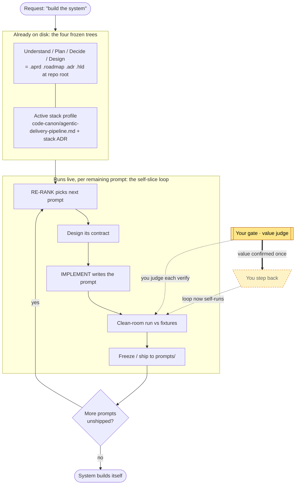

# The Self-Host Workflow — Making the System Build Itself

> How the delivery system is pointed at its own project — "build the agentic delivery system" — so that the pipeline authors the rest of the pipeline.
> Audience: the operator running the self-host (the CTO / system owner). Assumes you've read the end-user [generic-workflow.md](generic-workflow.md); this is its reflexive special case.
> Companion to **`self-host-usage-guide.md`** (which explains *how you set it up and run it*). This doc is the *workflow narrative* — how the run flows.

---

## 1. What this workflow is

The generic workflow takes *your* request and delivers *your* product. This workflow does the same thing with one substitution: **the request is "build the agentic delivery system," and the product is the system itself.**

Nothing about the engine changes. The same five-phase spine — Understand → Plan → Decide → Design → Build — runs, the same checkpoints exist, the same "nothing is done until verified" law holds. What makes this run special is only **what flows through it**:

- The **request** is the system's own mission.
- The **deliverable** the Build phase emits is **prompt `.md` files** (the system's own parts), not application code. `prompts/` plays the `src/` role.
- The **product owner** at the checkpoints is **you, the operator**.

This is dogfooding at the deepest level: the pipeline that delivers client software is turned on the project that *is* the pipeline. When it works, the delivery system is authoring the delivery system, through the very same engine that delivers anything else.

This repo *is* a canonical Agentic Delivery Pipeline project — the engine reads its frozen artifact trees directly at the repo root. Self-host is not a special mode; it is the ordinary pipeline run on this repo.

---

## 2. The mental shift — two product levels

The one idea that makes this workflow click is that **there are two products stacked on top of each other**, and the upper one is judged through the lower one.

- **Level A — the delivered product.** A fixture app (the freelancer marketplace in `_fixtures/greenfield-clean`). Its value: the app works — it passes its acceptance criteria.
- **Level B — the system itself.** The prompt library. Its value: its prompts *correctly deliver Level-A products*.

```mermaid
flowchart TD
    subgraph B [Level B — the system &#40;what this workflow builds&#41;]
        PROMPT[A prompt the system<br/>writes for itself]
    end
    subgraph A [Level A — a fixture product &#40;the proving ground&#41;]
        APP[The freelancer app<br/>delivered end-to-end]
    end
    PROMPT -->|"is run clean-room to help deliver"| APP
    APP -->|"delivers correct value ⇒"| VERDICT([The prompt is good])

    classDef good fill:#bbf7d0,stroke:#15803d,color:#000;
    class VERDICT good;
```

**Level B is validated through Level A.** You never invent a separate "is this prompt any good?" judge. A self-authored prompt earns the label *correct* if, and only if, running it against the fixture products yields the correct value. **The fixture-product run is the oracle** — the same test model the system has always used, applied one level up.

This is why the workflow doesn't get caught in an infinite regress: the recursion bottoms out at real, runnable product value.

---

## 3. The journey at a glance

The same five phases as the generic workflow — but here, **four of the five are already settled.** The system's upstream phases already exist as frozen artifacts — the canonical trees at the repo root — instead of being produced live by this run:

| Phase | Generic workflow produces… | Self-host: already frozen at the repo root as… |
|---|---|---|
| 1 · Understand | agreed requirements | `.aprd/` (`aprd.frozen.md` + `aprd.lock`) |
| 2 · Plan | roadmap of increments | `.roadmap/` (`roadmap.md` + `08-rerank.json`) |
| 3 · Decide | decision records (incl. stack) | `.adr/` (`log/<NNNN>.md` + `adr-index.json` + `adr.lock`) |
| 4 · Design | how the pieces fit | `.hld/` (`skeleton.frozen.md` + `skeleton/*`) |
| 5 · Build | verified software | `prompts/*` shipped + `_fixtures/` goldens |

So this workflow is **not build-from-zero.** The four upstream phases are already frozen on disk; only the fifth (Build) runs live, authoring the remaining prompts.

**Two rhythms, same as always.** The frozen trees play the role of the "walking skeleton" — except here the skeleton was settled long ago and already lives in the tree the prompts read. Then the system fills itself in **one prompt at a time** — each remaining prompt a small, complete unit that is designed, authored, verified, and shipped before the next begins.

---

## 4. The upstream phases are already frozen

Understand / Plan / Decide / Design are already settled for the self-project, so **re-running them buys nothing and risks churn.** They are not regenerated — they already exist as the frozen canonical trees the engine reads directly at the repo root:

- `.aprd/` — the frozen requirements (`aprd.frozen.md` + `aprd.lock`).
- `.adr/` — the decision records (`log/<NNNN>.md` + `adr-index.json` index + `adr.lock`), **including the stack decision** that pins the deliverable to "prompt library" (the analog of pinning Python in the fixture).
- `.hld/` — the design skeleton (`skeleton.frozen.md` + `skeleton/*` — the prompt scaffold, AB1–AB6, PR1–PR4).
- `.roadmap/` — the roadmap (`roadmap.md` + `08-rerank.json`) whose remaining sequence is **the unshipped prompts**.
- `prompts/*` already shipped → the built skeleton; `_fixtures/*` → the oracle baseline.

These trees are frozen artifacts: signed, immutable, never overwritten. A change is a new version + change request, never a hand-edit of a frozen body.

The one part the Build phase leans on is the **agentic-delivery-pipeline coding-canon profile** (`code-canon/agentic-delivery-pipeline.md`) — selected by the stack ADR (the analog of the ADR that pins Python in the fixture). It tells the Build phase how to scaffold, write, and *verify* a prompt, the same way a future Terraform or TypeScript canon profile will. It lives in the `code-canon/` store the spec already defines (scaffolds/idioms per stack), **not a new registry**. The verify mechanism it registers already exists and is proven: the clean-room runner simulation. The profile doesn't invent it — it *names an existing procedure* as this deliverable's verify method.

---

## 5. The self-slice loop — how each prompt gets built

The system fills itself in. Each remaining prompt is one "slice," and it travels the loop end-to-end:

1. **RE-RANK picks the next prompt** — reading the roadmap's remaining sequence and the on-disk state (the first slice whose output is absent), replacing any hand-read "you are here" pointer.
2. **Design the contract** — the per-role spec section + the design skeleton + the relevant decisions define what this prompt must do.
3. **IMPLEMENT writes the prompt** — the one genuinely *generative* step: synthesize the prompt `.md` from its contract.
4. **Verify by running it** — a fresh clean-room runner gets the new prompt verbatim and must produce a schema-valid, ID-threaded artifact against the fixtures. A *separate* verifier (not the author) checks it.
5. **Freeze / ship** — passing prompts are promoted into `prompts/`; "shipped" is the freeze on disk plus git, not a narrative changelog.

**State is derived, never tracked.** There is no progress file to maintain. "What's done" is computed by scanning the artifact tree on demand; "what's next" is RE-RANK over the roadmap. State derived from disk has no duplicate to drift.

---

## 6. How a prompt is judged "good" — the oracle

This is the heart of the workflow and the answer to "but how do you grade a prompt?"

**A prompt is good iff it produces correct value when run.** Concretely: take the freshly authored prompt, drop it into a clean-room runner that has never seen the rest of the conversation, point it at the fixture product, and check the artifact it emits:

- Is it **schema-valid** (the right shape for that role's output)?
- Is it **ID-threaded** (every requirement traceable through design → code → tests)?
- Does it **satisfy acceptance** — does the fixture product still come out correct?

Both directions are tested: a known-good prompt must PASS, and a *planted-defect* copy of it must FAIL. If the verifier can't tell them apart, the verifier is broken.

The deliverable is "just text," so it has no compiler — its correctness is **behavioral**, observed by running it, exactly the way the system tests any other deliverable. This is also why the workflow is deliverable-agnostic in the same breath: a Python app, a Terraform module, and a prompt library are all judged identically — *deliver a fixture product in that technology and check the value.*

---

## 7. Your role — judge value first, then step back

In the generic workflow you have three checkpoints (clarify, review roadmap, accept demos). In the self-host workflow your involvement is concentrated into a single, shifting role: **the external judge that guards against the system grading its own grading.**

- **While the loop is unproven (through the first closed loop):** *you* are the judge. When a self-authored prompt comes out of verify, you confirm its value — that it delivers correct fixture value. The orchestrator (Opus) sits in this seat with you. The system does not yet grade its own grading.
- **The first prompt is the proof:** the first self-built prompt — the RECONCILE/CRITIQUE increment — must, run clean-room, deliver correct value against the fixtures. Confirming this once is the proof the loop works.
- **After that:** you **step back.** The loop drains the remaining prompts on its own, each success hardening it. Your role narrows to spot-checks and to feeding any defect you find back into the decisions/rules — the system editing its own design.

You are never asked to grade prompts in the abstract. You are asked: *did the product it built come out right?*

---

## 8. Why self-reference doesn't bite

The obvious objection: "to run the pipeline on itself, the pipeline must be finished — but it isn't (the Build-phase slice prompts are exactly what's unwritten)."

It dissolves because **self-hosting the authoring loop needs only three things**, and all three are available now:

1. a **controller** to pick the next prompt (RE-RANK — already shipped),
2. an **oracle** to judge a prompt (the clean-room sim — already running today),
3. a **synthesizer** to write the prompt (IMPLEMENT under the agentic-delivery-pipeline target).

It does **not** need the finished generic Build phase, because the agentic-delivery-pipeline deliverable profile brings its *own* build-and-verify mechanism, independent of any other. So the loop can run immediately — and once running, it authors the very Build-phase prompts that were missing. The system pulls itself up by writing its own remaining rungs.

---

## 9. What "done" looks like

Self-host is achieved when:

1. the next prompt to build is chosen by **RE-RANK**, not by a human reading a tracker;
2. at least one remaining prompt was **authored by the pipeline and shipped without hand-authoring**, because it delivered correct value against the fixture product (the oracle gate, cleared); and
3. the loop then **drains the rest** of the unshipped prompts the same way.

It is **fully** validated one step further: a **second, different deliverable profile** — say Terraform or TypeScript — also runs through the *unchanged* engine and passes its own verify. That proves the system is genuinely deliverable-agnostic, not secretly agentic-delivery-pipeline-special. At that point the loop also begins feeding its own build failures back into its decisions and rules — the reflexive, two-loop improvement applied to itself.

When all of this holds, the delivery pipeline is authoring the delivery pipeline through the same engine that delivers any other product. The system builds itself.

---

## 10. Resilience — interrupting and resuming a self-build

The self-build runs on the same crash-safe guarantees as any delivery (decision **D20**). Because state is derived from disk and never cached, you can lose connection or kill a running agent mid-prompt and lose nothing committed:

- The **disk tree is the single source of truth.** Artifacts are written atomically (temp then rename), so you never resume onto a half-written file.
- **Frozen artifacts are immutable**; steps only add.
- **Resume re-derives the frontier from disk** — it scans the tree, validates the latest outputs, and continues at the first prompt whose output is absent or invalid. Re-running a step that already finished is harmless.

So an interrupted self-build is resumed exactly the way a fresh one is started: point the orchestrator at the repo and say *continue.* It reads where it is from what's on disk and picks up.

---

## 11. Glossary (self-host specifics)

- **Frozen tree:** an already-decided upstream phase (Understand/Plan/Decide/Design) living on disk as the canonical artifact the prompts read, instead of being re-run live. The four trees are `.aprd/ .roadmap/ .adr/ .hld/` at the repo root.
- **Level A / Level B:** the delivered fixture product (A) and the system that delivers it (B); B is validated *through* A.
- **Deliverable target (stack target):** the pluggable adapter for one kind of deliverable, realized as a **stack ADR** (pins which deliverable/stack) + a **coding-canon profile** (scaffold, conventions, build idiom, and **verify mechanism**) in the `code-canon/` store. "Prompt library" (`code-canon/agentic-delivery-pipeline.md`) is the active one; Python, Terraform, TypeScript are others.
- **Clean-room run:** giving a freshly authored prompt to a fresh runner with no prior context, and judging it by the artifact it produces against the fixtures.
- **Oracle gate:** the proof — the first self-authored prompt must deliver correct value against the fixtures, both directions (known-good PASS, planted-defect FAIL).
- **Derived state:** progress is computed from the artifact tree on demand, never stored in a hand-maintained file.
- **Self-slice loop:** RE-RANK → design contract → write prompt → clean-room verify → freeze, repeated per unshipped prompt.

---

*In short: the four phases the system already settled live as frozen trees at the repo root; hand it the one adapter it needs (the agentic-delivery-pipeline canon profile), then let it write its own remaining prompts — each one proven by delivering a real fixture product correctly, until the pipeline is building the pipeline.*
