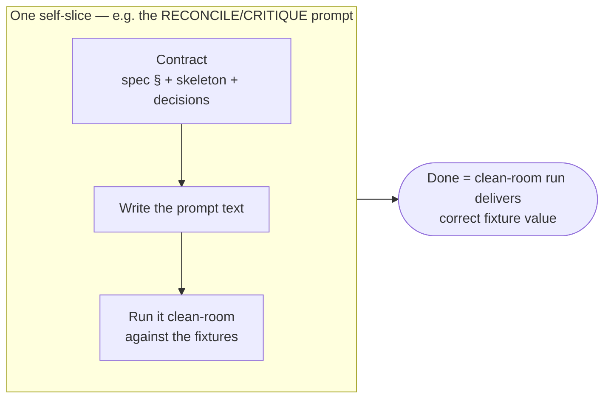

# The Self-Host Workflow — Making the System Build Itself

> Delivery system pointed at own project — "build the agentic delivery system" — so pipeline authors rest of pipeline.
> Audience: operator running self-host (CTO / system owner). Assumes you read end-user [generic-workflow.md](generic-workflow.md); this = its reflexive special case.
> Companion to **`self-host-usage-guide.md`** (explains *how you set up + run it*). This doc = *workflow narrative* — how run flows.

---

## 1. What this workflow is

Generic workflow takes *your* request, delivers *your* product. This workflow does same with one substitution: **request = "build the agentic delivery system," product = system itself.**

Engine unchanged. Same five-phase spine — Understand → Plan → Decide → Design → Build — runs, same checkpoints exist, same "nothing done until verified" law holds. Special only in **what flows through it**:

- **Request** = system's own mission.
- **Deliverable** Build phase emits = **prompt `.md` files** (system's own parts), not application code. `prompts/` plays `src/` role.
- **Product owner** at checkpoints = you, operator.

This repo *is* canonical Agentic Delivery Pipeline project — engine reads its frozen artifact trees directly at repo root. Self-host not special mode; = ordinary pipeline run on this repo.

---

## 2. Mental shift — two product levels

One idea makes workflow click: **two products stacked on top of each other**, upper judged through lower.

- **Level A — delivered product.** Fixture app (freelancer marketplace in `_fixtures/greenfield-clean`). Value: app works — passes acceptance criteria.
- **Level B — system itself.** Prompt library. Value: prompts *correctly deliver Level-A products*.

**Level B validated through Level A.** Never invent separate "is this prompt good?" judge. Self-authored prompt earns *correct* iff running it against fixture products yields correct value. **Fixture-product run = oracle** — same test model system always used, applied one level up. Recursion bottoms out at real runnable product value (§8).

---

## 3. Journey at a glance

Same five phases as generic workflow — but here **four of five already settled.** Upstream phases exist as frozen artifacts — canonical trees at repo root — instead of produced live by this run:

| Phase | Generic workflow produces… | Self-host: already frozen at repo root as… |
|---|---|---|
| 1 · Understand | agreed requirements | `.aprd/` (`aprd.frozen.md` + `aprd.lock`) |
| 2 · Plan | roadmap of increments | `.roadmap/` (`roadmap.md` + `08-rerank.json`) |
| 3 · Decide | decision records (incl. stack) | `.adr/` (`log/<NNNN>.md` + `adr-index.json` + `adr.lock`) |
| 4 · Design | how the pieces fit | `.hld/` (`skeleton.frozen.md` + `skeleton/*`) |
| 5 · Build | verified software | `prompts/*` shipped + `_fixtures/` goldens |

So workflow **not build-from-zero.** Four upstream phases already frozen on disk; only fifth (Build) runs live, authoring remaining prompts.

**Two rhythms, same as always.** Frozen trees play "walking skeleton" role — except here skeleton settled long ago, already lives in tree prompts read. Then system fills itself in **one prompt at a time** — each remaining prompt small complete unit designed, authored, verified, shipped before next begins.

---

## 4. Upstream phases already frozen

Understand / Plan / Decide / Design already settled for self-project, so **re-running them buys nothing + risks churn.** Not regenerated — already exist as frozen canonical trees engine reads directly at repo root:

- `.aprd/` — frozen requirements (`aprd.frozen.md` + `aprd.lock`).
- `.adr/` — decision records (`log/<NNNN>.md` + `adr-index.json` index + `adr.lock`), **including stack decision** pinning deliverable to "prompt library" (analog of pinning Python in fixture).
- `.hld/` — design skeleton (`skeleton.frozen.md` + `skeleton/*` — prompt scaffold, AB1–AB6, PR1–PR4).
- `.roadmap/` — roadmap (`roadmap.md` + `08-rerank.json`) whose remaining sequence = **unshipped prompts**.
- `prompts/*` already shipped → built skeleton; `_fixtures/*` → oracle baseline.

These trees = frozen artifacts: signed, immutable, never overwritten. Change = new version + change request, never hand-edit of frozen body.

One part Build phase leans on = **agentic-delivery-pipeline coding-canon profile** (`code-canon/agentic-delivery-pipeline.md`) — selected by stack ADR (analog of ADR pinning Python in fixture). Tells Build phase how to scaffold, write, *verify* a prompt, same way future Terraform or TypeScript canon profile will. Lives in `code-canon/` store spec already defines (scaffolds/idioms per stack), **not new registry**. Verify mechanism it registers already exists + proven: clean-room runner simulation. Profile doesn't invent it — *names existing procedure* as this deliverable's verify method.

---

## 5. Self-slice loop — how each prompt gets built

System fills itself in. Each remaining prompt = one "slice," travels loop end-to-end:

1. **RE-RANK picks next prompt** — reads roadmap's remaining sequence + on-disk state (first slice whose output absent), replacing any hand-read "you are here" pointer.
2. **Design contract** — per-role spec section + design skeleton + relevant decisions define what prompt must do.
3. **IMPLEMENT writes prompt** — one genuinely *generative* step: synthesize prompt `.md` from contract.
4. **Verify by running it** — fresh clean-room runner gets new prompt verbatim, must produce schema-valid ID-threaded artifact against fixtures. *Separate* verifier (not author) checks it.
5. **Freeze / ship** — passing prompts promoted into `prompts/`; "shipped" = freeze on disk plus git, not narrative changelog.

**State derived, never tracked.** No progress file to maintain. "What's done" computed by scanning artifact tree on demand; "what's next" = RE-RANK over roadmap. State derived from disk has no duplicate to drift.

---

## 6. How a prompt judged "good" — the oracle

Heart of workflow + answer to "how do you grade a prompt?"

**Prompt good iff produces correct value when run.** Concretely: take freshly authored prompt, drop into clean-room runner that never saw rest of conversation, point at fixture product, check artifact it emits:

- **Schema-valid** (right shape for that role's output)?
- **ID-threaded** (every requirement traceable through design → code → tests)?
- **Satisfies acceptance** — does fixture product still come out correct?

Both directions tested: known-good prompt must PASS, *planted-defect* copy must FAIL. Verifier can't tell them apart → verifier broken.

Deliverable = text alone, so no compiler — correctness **behavioral**, observed by running it, exactly way system tests any other deliverable. Also why workflow deliverable-agnostic in same breath: Python app, Terraform module, prompt library all judged identically — *deliver fixture product in that technology, check value.*

---

## 7. Your role — judge value first, then step back

Generic workflow: three checkpoints (clarify, review roadmap, accept demos). Self-host workflow: involvement concentrated into single shifting role: **external judge guarding against system grading own grading.**

- **While loop unproven (through first closed loop):** *you* = judge. When self-authored prompt comes out of verify, you confirm value — delivers correct fixture value. Orchestrator (Opus) sits in this seat with you. System doesn't yet grade own grading.
- **First prompt = proof:** first self-built prompt — RECONCILE/CRITIQUE increment — must, run clean-room, deliver correct value against fixtures. Confirming this once = proof loop works.
- **After that:** you **step back.** Loop drains remaining prompts on own, each success hardening it. Role narrows to spot-checks + feeding any defect you find back into decisions/rules — system editing own design.

Never asked to grade prompts in abstract. Asked: *did product it built come out right?*

---

## 8. Why self-reference doesn't bite

Obvious objection: "to run pipeline on itself, pipeline must be finished — but it isn't (Build-phase slice prompts = exactly what's unwritten)."

Dissolves because **self-hosting authoring loop needs only three things**, all available now:

1. **controller** to pick next prompt (RE-RANK — already shipped),
2. **oracle** to judge prompt (clean-room sim — already running today),
3. **synthesizer** to write prompt (IMPLEMENT under agentic-delivery-pipeline target).

Does **not** need finished generic Build phase, because agentic-delivery-pipeline deliverable profile brings *own* build-and-verify mechanism, independent of any other. So loop runs immediately — and once running, authors the very Build-phase prompts that were missing. System pulls itself up by writing own remaining rungs.

---

## 9. What "done" looks like

Self-host achieved when:

1. next prompt to build chosen by **RE-RANK**, not human reading tracker;
2. at least one remaining prompt **authored by pipeline + shipped without hand-authoring**, because delivered correct value against fixture product (oracle gate cleared); and
3. loop then **drains rest** of unshipped prompts same way.

**Fully** validated one step further: **second different deliverable profile** — say Terraform or TypeScript — also runs through *unchanged* engine + passes own verify. Proves system genuinely deliverable-agnostic, not secretly agentic-delivery-pipeline-special. At that point loop also begins feeding own build failures back into decisions + rules — reflexive two-loop improvement applied to itself.

When all holds, delivery pipeline authors delivery pipeline through same engine that delivers any other product. System builds itself.

---

## 10. Resilience — interrupting + resuming a self-build

Self-build runs on same crash-safe guarantees as any delivery (decision **D20**). Because state derived from disk + never cached, you can lose connection or kill running agent mid-prompt + lose nothing committed:

- **Disk tree = single source of truth.** Artifacts written atomically (temp then rename), so never resume onto half-written file.
- **Frozen artifacts immutable**; steps only add.
- **Resume re-derives frontier from disk** — scans tree, validates latest outputs, continues at first prompt whose output absent or invalid. Re-running finished step harmless.

So interrupted self-build resumed exactly way fresh one started: point orchestrator at repo, say *continue.* Reads where it is from what's on disk, picks up.

---

## 11. Glossary (self-host specifics)

- **Frozen tree:** already-decided upstream phase (Understand/Plan/Decide/Design) living on disk as canonical artifact prompts read, instead of re-run live. Four trees = `.aprd/ .roadmap/ .adr/ .hld/` at repo root.
- **Level A / Level B:** delivered fixture product (A) + system that delivers it (B); B validated *through* A.
- **Deliverable target (stack target):** pluggable adapter for one kind of deliverable, realized as **stack ADR** (pins which deliverable/stack) + **coding-canon profile** (scaffold, conventions, build idiom, **verify mechanism**) in `code-canon/` store. "Prompt library" (`code-canon/agentic-delivery-pipeline.md`) = active one; Python, Terraform, TypeScript = others.
- **Clean-room run:** giving freshly authored prompt to fresh runner with no prior context, judging it by artifact it produces against fixtures.
- **Oracle gate:** the proof — first self-authored prompt must deliver correct value against fixtures, both directions (known-good PASS, planted-defect FAIL).
- **Derived state:** progress computed from artifact tree on demand, never stored in hand-maintained file.
- **Self-slice loop:** RE-RANK → design contract → write prompt → clean-room verify → freeze, repeated per unshipped prompt.

---

*In short: four phases system already settled live as frozen trees at repo root; hand it one adapter it needs (agentic-delivery-pipeline canon profile), then let it write own remaining prompts — each one proven by delivering real fixture product correctly, until pipeline builds pipeline.*
